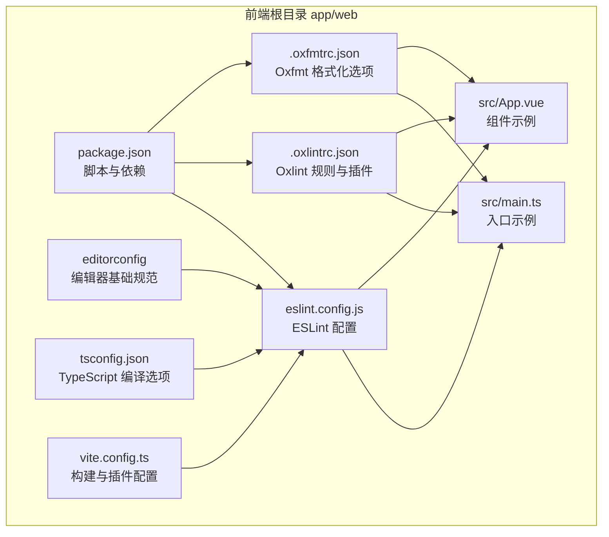
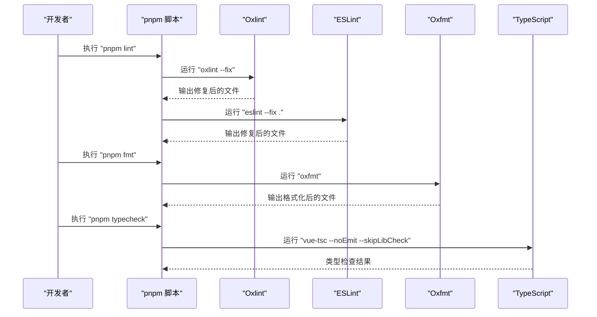
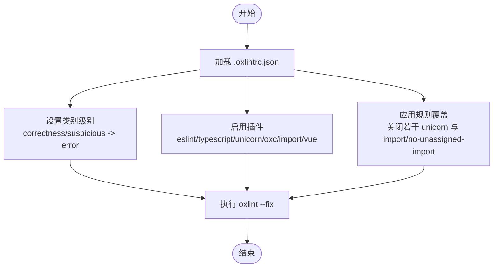
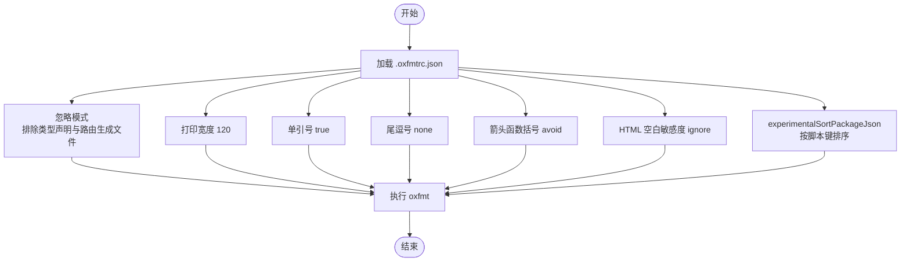
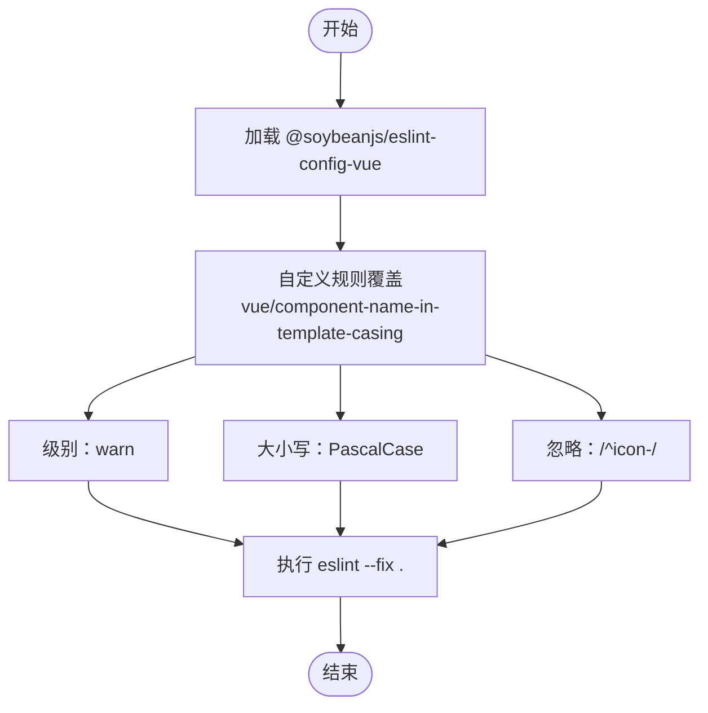
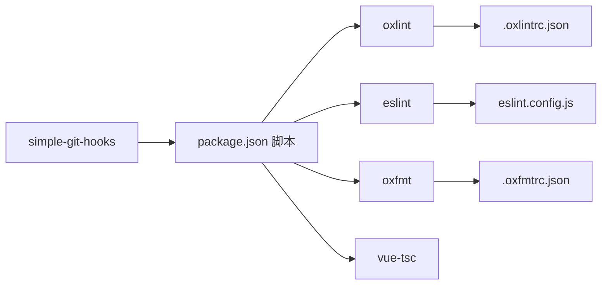

# 代码格式化工具

<cite>
**本文引用的文件**
- [.oxlintrc.json](file://app/web/.oxlintrc.json)
- [.oxfmtrc.json](file://app/web/.oxfmtrc.json)
- [eslint.config.js](file://app/web/eslint.config.js)
- [package.json](file://app/web/package.json)
- [.editorconfig](file://app/web/.editorconfig)
- [tsconfig.json](file://app/web/tsconfig.json)
- [vite.config.ts](file://app/web/vite.config.ts)
- [main.ts](file://app/web/src/main.ts)
- [App.vue](file://app/web/src/App.vue)
- [项目开发文档](file://docs/project-development.md)
</cite>

## 目录
1. [简介](#简介)
2. [项目结构](#项目结构)
3. [核心组件](#核心组件)
4. [架构总览](#架构总览)
5. [详细组件分析](#详细组件分析)
6. [依赖关系分析](#依赖关系分析)
7. [性能考量](#性能考量)
8. [故障排查指南](#故障排查指南)
9. [结论](#结论)
10. [附录](#附录)

## 简介
本指南面向 boread 项目的前端工程，系统讲解代码格式化工具链的配置与使用，涵盖：
- Oxlint 与 Oxfmt 的配置与命令
- ESLint 配置文件结构与自定义规则（JavaScript/TypeScript/Vue）
- Prettier 与 ESLint 的协同方式
- 代码风格规范、命名约定、缩进规则等最佳实践
- 常见格式化问题的解决方案与调试技巧

## 项目结构
前端位于 app/web 目录，格式化相关的关键文件如下：
- 配置文件：.oxlintrc.json、.oxfmtrc.json、eslint.config.js、.editorconfig、tsconfig.json、vite.config.ts
- 包管理与脚本：package.json
- 示例源码：src/main.ts、src/App.vue

图表来源
- [package.json:1-108](file://app/web/package.json#L1-L108)
- [.oxlintrc.json:1-15](file://app/web/.oxlintrc.json#L1-L15)
- [.oxfmtrc.json:1-12](file://app/web/.oxfmtrc.json#L1-L12)
- [eslint.config.js:1-13](file://app/web/eslint.config.js#L1-L13)
- [.editorconfig:1-12](file://app/web/.editorconfig#L1-L12)
- [tsconfig.json:1-26](file://app/web/tsconfig.json#L1-L26)
- [vite.config.ts:1-52](file://app/web/vite.config.ts#L1-L52)
- [main.ts:1-37](file://app/web/src/main.ts#L1-L37)
- [App.vue:1-59](file://app/web/src/App.vue#L1-L59)

章节来源
- [package.json:1-108](file://app/web/package.json#L1-L108)
- [.oxlintrc.json:1-15](file://app/web/.oxlintrc.json#L1-L15)
- [.oxfmtrc.json:1-12](file://app/web/.oxfmtrc.json#L1-L12)
- [eslint.config.js:1-13](file://app/web/eslint.config.js#L1-L13)
- [.editorconfig:1-12](file://app/web/.editorconfig#L1-L12)
- [tsconfig.json:1-26](file://app/web/tsconfig.json#L1-L26)
- [vite.config.ts:1-52](file://app/web/vite.config.ts#L1-L52)
- [main.ts:1-37](file://app/web/src/main.ts#L1-L37)
- [App.vue:1-59](file://app/web/src/App.vue#L1-L59)

## 核心组件
- Oxlint（静态检查）：通过 .oxlintrc.json 配置类别、插件与规则，结合 package.json 的 lint 脚本统一执行。
- Oxfmt（自动格式化）：通过 .oxfmtrc.json 配置打印宽度、引号策略、忽略模式等；配合 package.json 的 fmt 脚本一键格式化。
- ESLint：基于 @soybeanjs/eslint-config-vue 的共享配置，eslint.config.js 进行局部增强（如 Vue 组件命名大小写）。
- EditorConfig：统一编码风格（缩进、换行、尾随空白等）。
- TypeScript：tsconfig.json 控制编译严格性与路径别名，影响 ESLint/TS 类型检查一致性。
- Vite：vite.config.ts 提供构建与代理，间接影响开发体验与格式化链路。

章节来源
- [package.json:29-44](file://app/web/package.json#L29-L44)
- [.oxlintrc.json:1-15](file://app/web/.oxlintrc.json#L1-L15)
- [.oxfmtrc.json:1-12](file://app/web/.oxfmtrc.json#L1-L12)
- [eslint.config.js:1-13](file://app/web/eslint.config.js#L1-L13)
- [.editorconfig:1-12](file://app/web/.editorconfig#L1-L12)
- [tsconfig.json:1-26](file://app/web/tsconfig.json#L1-L26)
- [vite.config.ts:1-52](file://app/web/vite.config.ts#L1-L52)

## 架构总览
整体格式化工作流由脚本驱动，先进行静态检查修复，再进行代码格式化，最后进行类型检查与预览。

图表来源
- [package.json:39-44](file://app/web/package.json#L39-L44)

章节来源
- [package.json:39-44](file://app/web/package.json#L39-L44)

## 详细组件分析

### Oxlint 配置与使用
- 配置文件：.oxlintrc.json
  - 类别：correctness、suspicious 设置为 error，确保关键问题必改。
  - 插件：eslint、typescript、unicorn、oxc、import、vue，覆盖 JS/TS/Vue/ESLint 规则生态。
  - 规则：对部分 unicorn 规则与 import/no-unassigned-import 进行关闭，以适配项目现状。
- 使用方式：
  - 命令：直接运行 oxlint（已内置在脚本中）。
  - 脚本：package.json 的 lint 脚本会先执行 oxlint --fix，再执行 eslint --fix .。
- 规则优先级：.oxlintrc.json 的规则与 ESLint 共存，建议优先通过 oxlint 修复结构性问题，再由 ESLint 修正风格类问题。

图表来源
- [.oxlintrc.json:1-15](file://app/web/.oxlintrc.json#L1-L15)
- [package.json:39](file://app/web/package.json#L39)

章节来源
- [.oxlintrc.json:1-15](file://app/web/.oxlintrc.json#L1-L15)
- [package.json:39](file://app/web/package.json#L39)

### Oxfmt 配置与使用
- 配置文件：.oxfmtrc.json
  - 忽略模式：排除特定类型声明与自动生成的路由文件，避免误伤。
  - 打印宽度：120，适合宽屏与长链式调用。
  - 单引号：true，统一字符串风格。
  - 尾逗号：none，减少合并冲突。
  - 箭头函数括号：avoid，提升可读性。
  - HTML 空白敏感度：ignore，避免模板空格导致差异。
  - 包管理排序：experimentalSortPackageJson 开启，按脚本键排序。
- 使用方式：
  - 命令：直接运行 oxfmt（已内置在脚本中）。
  - 脚本：package.json 的 fmt 脚本执行 oxfmt，用于一键格式化。
- 与 ESLint 协同：Oxfmt 专注于格式化，ESLint 负责风格与潜在问题，两者互补。

图表来源
- [.oxfmtrc.json:1-12](file://app/web/.oxfmtrc.json#L1-L12)
- [package.json:37](file://app/web/package.json#L37)

章节来源
- [.oxfmtrc.json:1-12](file://app/web/.oxfmtrc.json#L1-L12)
- [package.json:37](file://app/web/package.json#L37)

### ESLint 配置与自定义规则
- 基础配置：基于 @soybeanjs/eslint-config-vue 的共享配置，统一 Vue/TS 规则。
- 自定义增强：eslint.config.js 对 vue/component-name-in-template-casing 进行警告与忽略前缀规则，确保组件命名一致且不强制约束 icon-* 前缀组件。
- 与 Oxlint 协同：两者共同构成“结构修复 + 风格统一”的双层保障。

图表来源
- [eslint.config.js:1-13](file://app/web/eslint.config.js#L1-L13)

章节来源
- [eslint.config.js:1-13](file://app/web/eslint.config.js#L1-L13)

### EditorConfig 与 TypeScript 配置
- EditorConfig：统一字符集、缩进风格、换行符、尾随空白与最终换行。
- TypeScript：开启严格模式、严格空值检查、路径别名、类型声明等，保证类型安全与一致的导入路径。

章节来源
- [.editorconfig:1-12](file://app/web/.editorconfig#L1-L12)
- [tsconfig.json:1-26](file://app/web/tsconfig.json#L1-L26)

### Vite 与构建链路
- Vite 提供开发服务器、代理与插件体系，与格式化工具链无直接耦合，但良好的格式化能提升开发体验与构建稳定性。

章节来源
- [vite.config.ts:1-52](file://app/web/vite.config.ts#L1-L52)

## 依赖关系分析
- 脚本依赖：lint 脚本依赖 oxlint 与 eslint；fmt 脚本依赖 oxfmt；typecheck 依赖 vue-tsc。
- 配置依赖：eslint.config.js 依赖 @soybeanjs/eslint-config-vue；.oxlintrc.json 与 .oxfmtrc.json 为独立工具配置。
- 工具绑定：package.json 的 simple-git-hooks 在 pre-commit 中串联 typecheck、lint、fmt，形成提交前质量门禁。

图表来源
- [package.json:29-44](file://app/web/package.json#L29-L44)
- [package.json:98-101](file://app/web/package.json#L98-L101)
- [eslint.config.js:1-13](file://app/web/eslint.config.js#L1-L13)
- [.oxlintrc.json:1-15](file://app/web/.oxlintrc.json#L1-L15)
- [.oxfmtrc.json:1-12](file://app/web/.oxfmtrc.json#L1-L12)

章节来源
- [package.json:29-44](file://app/web/package.json#L29-L44)
- [package.json:98-101](file://app/web/package.json#L98-L101)

## 性能考量
- 并行化：Oxfmt 与 ESLint 均支持多文件并行处理，建议在大型仓库中保持默认并发策略。
- 忽略模式：合理配置 .oxfmtrc.json 的 ignorePatterns，避免对大体积生成文件或类型声明进行格式化，减少 IO 开销。
- 类型检查：仅在必要时运行 typecheck，避免在频繁保存时触发全量检查。
- 缓存与增量：ESLint 支持缓存与增量检查，建议在 CI 中开启相应选项以缩短耗时。

## 故障排查指南
- 提交被阻断
  - 现象：pre-commit 钩子失败。
  - 排查：检查 simple-git-hooks 的 pre-commit 脚本顺序与依赖安装状态；依次运行 pnpm typecheck、pnpm lint、pnpm fmt，定位最先失败的步骤。
  - 参考：package.json 的 simple-git-hooks 与脚本定义。
- ESLint 报错
  - 现象：规则冲突或风格不一致。
  - 排查：查看 eslint.config.js 的自定义规则覆盖；确认是否需要调整 vue/component-name-in-template-casing 的级别或忽略列表。
- Oxlint 报错
  - 现象：结构性规则报错（如 correctness/suspicious）。
  - 排查：根据 .oxlintrc.json 的类别级别，优先修复 error 级别问题；若确需放宽，可在本地临时关闭对应规则，但需在团队内达成共识。
- Oxfmt 未生效
  - 现象：某些文件未被格式化。
  - 排查：检查 .oxfmtrc.json 的 ignorePatterns 是否误伤目标文件；确认 oxfmt 的实验性配置是否与项目需求一致。
- EditorConfig 未生效
  - 现象：不同编辑器缩进/换行不一致。
  - 排查：确认编辑器已启用 EditorConfig 插件；检查 .editorconfig 的根路径与作用域。

章节来源
- [package.json:98-101](file://app/web/package.json#L98-L101)
- [eslint.config.js:1-13](file://app/web/eslint.config.js#L1-L13)
- [.oxlintrc.json:1-15](file://app/web/.oxlintrc.json#L1-L15)
- [.oxfmtrc.json:1-12](file://app/web/.oxfmtrc.json#L1-L12)
- [.editorconfig:1-12](file://app/web/.editorconfig#L1-L12)

## 结论
boread 前端采用“Oxlint + ESLint + Oxfmt”的组合拳，既保证结构性问题及时发现与修复，又确保风格统一与可读性。通过合理的配置与脚本编排，能够在开发与提交阶段持续产出高质量代码。建议团队遵循本文档的最佳实践，结合 EditorConfig 与 TypeScript 严格模式，进一步提升代码一致性与可维护性。

## 附录

### 代码风格规范与最佳实践
- 命名约定
  - Vue 组件：PascalCase；图标组件可使用前缀命名并在 ESLint 中忽略。
  - 变量与函数：camelCase；常量：SCREAMING_SNAKE_CASE。
  - 文件：小写短横线命名（如 utils/request.ts）。
- 缩进与空格
  - 统一使用空格缩进，大小为 2；EditorConfig 已设定。
- 字符串与引号
  - 优先使用单引号；Oxfmt 已启用 singleQuote。
- 尾逗号与括号
  - 表达式与对象末尾不加尾逗号；箭头函数括号按需保留。
- 模板与 HTML
  - HTML 空白敏感度按项目策略忽略，避免因空格导致差异。
- 路径与别名
  - 使用 tsconfig.json 中的路径别名，保持导入一致性。

章节来源
- [.editorconfig:5-11](file://app/web/.editorconfig#L5-L11)
- [.oxfmtrc.json:3-6](file://app/web/.oxfmtrc.json#L3-L6)
- [eslint.config.js:4-11](file://app/web/eslint.config.js#L4-L11)
- [tsconfig.json:9-12](file://app/web/tsconfig.json#L9-L12)

### IDE 集成建议
- VS Code
  - 安装 ESLint、Vue Language Features、EditorConfig for VS Code 等扩展。
  - 在工作区设置中启用“ESLint: Run on Save”，并配置 editor.formatOnSave 与 editor.codeActionsOnSave。
- WebStorm/IntelliJ
  - 启用 ESLint 插件与 Prettier 集成（若使用 Prettier），或直接使用 Oxfmt。
- 通用
  - 确保 EditorConfig 插件启用，使编辑器遵循 .editorconfig 的基础规范。

### 常见问题与解决方案清单
- 提交失败：先运行 pnpm typecheck、pnpm lint、pnpm fmt，逐项修复后再提交。
- 规则冲突：在 eslint.config.js 中调整级别或忽略列表；在 .oxlintrc.json 中调整类别或具体规则。
- 格式化范围过大：在 .oxfmtrc.json 中增加 ignorePatterns，排除生成文件与类型声明。
- 编辑器不识别 EditorConfig：检查插件安装与工作区根路径。

章节来源
- [package.json:39-44](file://app/web/package.json#L39-L44)
- [eslint.config.js:1-13](file://app/web/eslint.config.js#L1-L13)
- [.oxfmtrc.json:1-12](file://app/web/.oxfmtrc.json#L1-L12)
- [.editorconfig:1-12](file://app/web/.editorconfig#L1-L12)