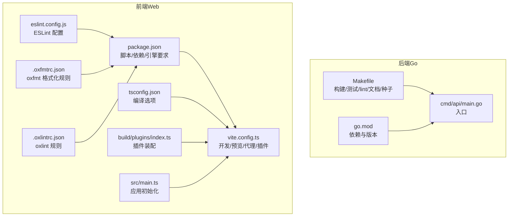
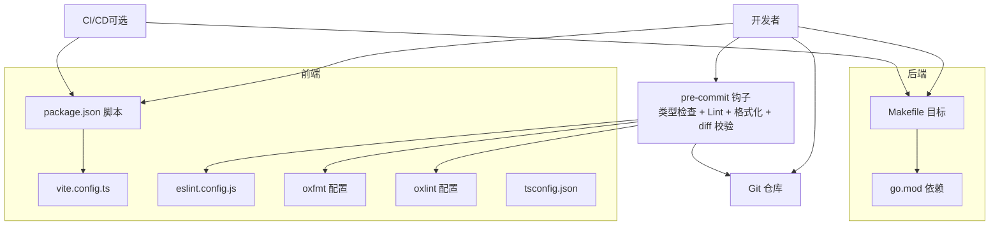
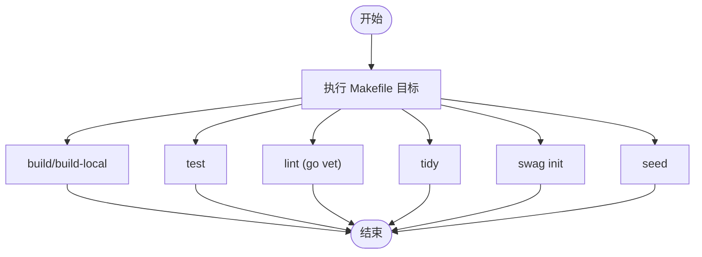
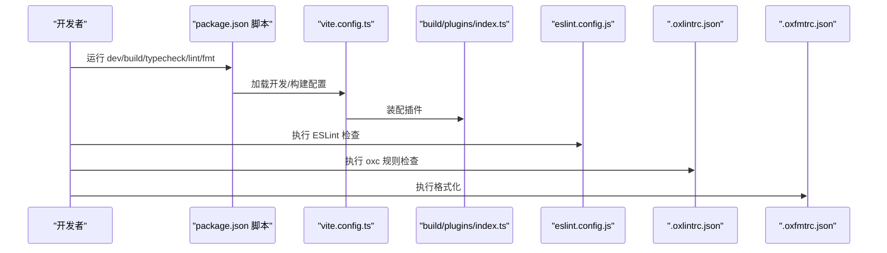
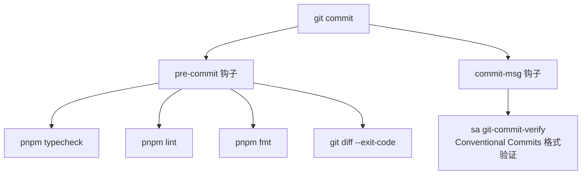
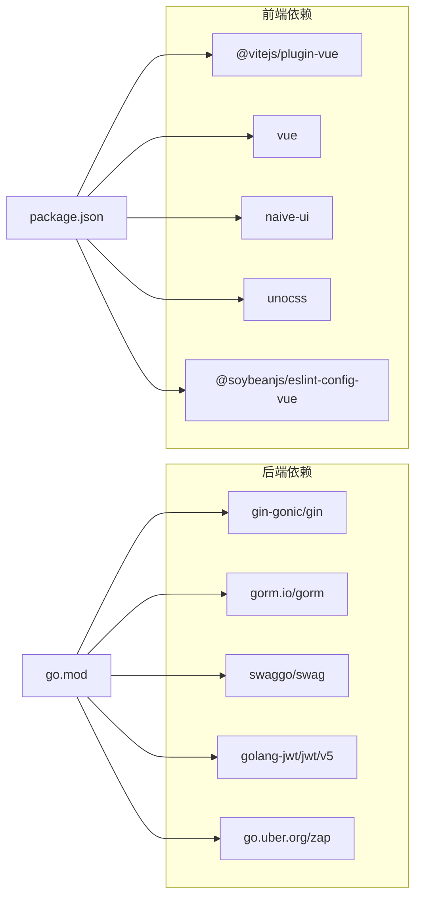

# 开发工具

<cite>
**本文引用的文件**
- [app/server/go.mod](file://app/server/go.mod)
- [app/server/Makefile](file://app/server/Makefile)
- [app/web/package.json](file://app/web/package.json)
- [app/web/vite.config.ts](file://app/web/vite.config.ts)
- [app/web/eslint.config.js](file://app/web/eslint.config.js)
- [app/web/tsconfig.json](file://app/web/tsconfig.json)
- [app/web/.oxfmtrc.json](file://app/web/.oxfmtrc.json)
- [app/web/.oxlintrc.json](file://app/web/.oxlintrc.json)
- [app/web/.editorconfig](file://app/web/.editorconfig)
- [app/web/.gitignore](file://app/web/.gitignore)
- [app/web/.npmrc](file://app/web/.npmrc)
- [app/web/pnpm-workspace.yaml](file://app/web/pnpm-workspace.yaml)
- [app/web/build/plugins/index.ts](file://app/web/build/plugins/index.ts)
- [app/web/src/main.ts](file://app/web/src/main.ts)
- [app/web/packages/scripts/src/commands/git-commit.ts](file://app/web/packages/scripts/src/commands/git-commit.ts)
- [docs/project-development.md](file://docs/project-development.md)
- [README.md](file://README.md)
</cite>

## 更新摘要
**所做更改**
- 删除了关于 .trae/rules/git-commit-message.md 的引用和相关内容
- 更新了提交前检查与 Git 钩子部分，反映删除的提交消息规则文件
- 修正了开发环境统一化与 IDE 推荐部分的相关描述

## 目录
1. [简介](#简介)
2. [项目结构](#项目结构)
3. [核心组件](#核心组件)
4. [架构总览](#架构总览)
5. [详细组件分析](#详细组件分析)
6. [依赖分析](#依赖分析)
7. [性能考虑](#性能考虑)
8. [故障排查指南](#故障排查指南)
9. [结论](#结论)
10. [附录](#附录)

## 简介
本指南面向 boread 项目的开发与协作，覆盖开发工具链（代码格式化、代码检查、构建、测试）、团队协作流程（Git 工作流、PR 规范、Issue 管理）、代码质量保障（SonarQube、CodeClimate 等）、开发环境统一化与 IDE 插件推荐、调试技巧、工具链升级与最佳实践、问题排查方法等内容。文档以仓库内现有配置为依据，结合项目开发文档进行说明，帮助开发者快速上手并保持一致的工程实践。

## 项目结构
项目采用前后端分离架构：
- 后端：Go 语言，使用 Gin 框架、GORM ORM、MySQL 数据库，提供 REST API 与 Swagger 文档。
- 前端：Vue 3 + Vite 8 + TypeScript + NaiveUI + UnoCSS，采用 Elegant Router 自动生成路由，统一的构建与插件体系。
- 文档与开发流程：项目开发文档集中于 docs/project-development.md，提供技术栈、开发模式、阶段规划、质量检查清单等。

**图表来源**
- [app/server/Makefile:1-43](file://app/server/Makefile#L1-L43)
- [app/server/go.mod:1-66](file://app/server/go.mod#L1-L66)
- [app/web/package.json:1-108](file://app/web/package.json#L1-L108)
- [app/web/vite.config.ts:1-52](file://app/web/vite.config.ts#L1-L52)
- [app/web/tsconfig.json:1-26](file://app/web/tsconfig.json#L1-L26)
- [app/web/eslint.config.js:1-13](file://app/web/eslint.config.js#L1-L13)
- [app/web/.oxfmtrc.json:1-12](file://app/web/.oxfmtrc.json#L1-L12)
- [app/web/.oxlintrc.json:1-15](file://app/web/.oxlintrc.json#L1-L15)
- [app/web/build/plugins/index.ts:1-27](file://app/web/build/plugins/index.ts#L1-L27)
- [app/web/src/main.ts:1-37](file://app/web/src/main.ts#L1-L37)

**章节来源**
- [docs/project-development.md:31-69](file://docs/project-development.md#L31-L69)
- [README.md:1-11](file://README.md#L1-L11)

## 核心组件
- 后端构建与质量工具
  - 构建：Makefile 提供 run/build/build-local/test/lint/tidy/clean/swag/seed 等目标。
  - 依赖：go.mod 指定 Go 版本与第三方库。
  - 文档：swag 用于生成 Swagger 文档。
- 前端构建与质量工具
  - 包管理与脚本：package.json 定义开发/构建/类型检查/格式化/提交钩子等脚本。
  - 构建配置：vite.config.ts 定义别名、代理、插件、构建参数等。
  - 类型与检查：tsconfig.json、eslint.config.js、oxlint/oxfmt 配置。
  - 工作区：pnpm-workspace.yaml 管理多包与 hoist。
- 开发流程与质量清单
  - 项目开发文档提供开发模式、阶段规划、质量检查清单与快速启动步骤。

**章节来源**
- [app/server/Makefile:1-43](file://app/server/Makefile#L1-L43)
- [app/server/go.mod:1-66](file://app/server/go.mod#L1-L66)
- [app/web/package.json:1-108](file://app/web/package.json#L1-L108)
- [app/web/vite.config.ts:1-52](file://app/web/vite.config.ts#L1-L52)
- [app/web/tsconfig.json:1-26](file://app/web/tsconfig.json#L1-L26)
- [app/web/eslint.config.js:1-13](file://app/web/eslint.config.js#L1-L13)
- [app/web/.oxlintrc.json:1-15](file://app/web/.oxlintrc.json#L1-L15)
- [app/web/.oxfmtrc.json:1-12](file://app/web/.oxfmtrc.json#L1-L12)
- [app/web/pnpm-workspace.yaml:1-11](file://app/web/pnpm-workspace.yaml#L1-L11)
- [docs/project-development.md:469-519](file://docs/project-development.md#L469-L519)

## 架构总览
下图展示开发工具链在本地开发与提交前检查中的交互关系，以及与后端构建、前端构建的衔接。

**图表来源**
- [app/web/package.json:39-101](file://app/web/package.json#L39-L101)
- [app/web/eslint.config.js:1-13](file://app/web/eslint.config.js#L1-L13)
- [app/web/.oxlintrc.json:1-15](file://app/web/.oxlintrc.json#L1-L15)
- [app/web/.oxfmtrc.json:1-12](file://app/web/.oxfmtrc.json#L1-L12)
- [app/web/tsconfig.json:1-26](file://app/web/tsconfig.json#L1-L26)
- [app/web/vite.config.ts:1-52](file://app/web/vite.config.ts#L1-L52)
- [app/server/Makefile:1-43](file://app/server/Makefile#L1-L43)
- [app/server/go.mod:1-66](file://app/server/go.mod#L1-L66)

## 详细组件分析

### 后端工具链（Go）
- 构建与运行
  - 使用 Makefile 提供 run、build、build-local、test、lint、tidy、clean、swag、seed 等目标，便于一键构建与文档生成。
- 依赖管理
  - go.mod 指定 Go 版本与依赖，建议配合 tidy 保持一致性。
- 文档生成
  - swag init 基于注释生成 Swagger 文档，便于 API 文档维护。
- 质量与测试
  - go vet 用于静态分析；go test 支持单元测试；建议在 CI 中集成覆盖率与安全扫描。

**图表来源**
- [app/server/Makefile:1-43](file://app/server/Makefile#L1-L43)

**章节来源**
- [app/server/Makefile:1-43](file://app/server/Makefile#L1-L43)
- [app/server/go.mod:1-66](file://app/server/go.mod#L1-L66)

### 前端工具链（Vite + TypeScript + ESLint + oxc）
- 包管理与脚本
  - package.json 定义 dev/build/typecheck/lint/fmt/commit 等脚本，统一开发体验。
  - simple-git-hooks 通过 pre-commit 钩子强制执行类型检查、Lint、格式化与 diff 校验。
- 构建与开发
  - vite.config.ts 配置别名、代理、插件、构建参数与预览端口，满足开发与生产需求。
  - build/plugins/index.ts 统一装配插件（Vue、JSX、UnoCSS、Elegant Router、Devtools 等）。
- 类型与规范
  - tsconfig.json 设置严格模式与路径别名，提升类型安全。
  - eslint.config.js 基于 @soybeanjs/eslint-config-vue，自定义组件命名等规则。
  - .oxlintrc.json 与 .oxfmtrc.json 提供 oxc/oxfmt 的规则与格式化策略。
- 工作区与镜像
  - pnpm-workspace.yaml 管理多包与 hoist，提升安装效率。
  - .npmrc 指定国内镜像源，加速依赖下载。

**图表来源**
- [app/web/package.json:29-44](file://app/web/package.json#L29-L44)
- [app/web/vite.config.ts:1-52](file://app/web/vite.config.ts#L1-L52)
- [app/web/build/plugins/index.ts:1-27](file://app/web/build/plugins/index.ts#L1-L27)
- [app/web/eslint.config.js:1-13](file://app/web/eslint.config.js#L1-L13)
- [app/web/.oxlintrc.json:1-15](file://app/web/.oxlintrc.json#L1-L15)
- [app/web/.oxfmtrc.json:1-12](file://app/web/.oxfmtrc.json#L1-L12)

**章节来源**
- [app/web/package.json:1-108](file://app/web/package.json#L1-L108)
- [app/web/vite.config.ts:1-52](file://app/web/vite.config.ts#L1-L52)
- [app/web/build/plugins/index.ts:1-27](file://app/web/build/plugins/index.ts#L1-L27)
- [app/web/tsconfig.json:1-26](file://app/web/tsconfig.json#L1-L26)
- [app/web/eslint.config.js:1-13](file://app/web/eslint.config.js#L1-L13)
- [app/web/.oxlintrc.json:1-15](file://app/web/.oxlintrc.json#L1-L15)
- [app/web/.oxfmtrc.json:1-12](file://app/web/.oxfmtrc.json#L1-L12)
- [app/web/pnpm-workspace.yaml:1-11](file://app/web/pnpm-workspace.yaml#L1-L11)
- [app/web/.npmrc:1-2](file://app/web/.npmrc#L1-L2)

### 提交前检查与 Git 钩子
- pre-commit 钩子
  - 通过 simple-git-hooks 在提交前自动执行类型检查、Lint、格式化与 diff 校验，避免不合规代码进入仓库。
- commit-msg 钩子
  - 通过 sa git-commit-verify 校验提交信息格式，保证历史记录可读性与可追溯性。

**更新** 删除了 .trae/rules/git-commit-message.md 文件，但项目仍保留了基于 Conventional Commits 标准的提交消息验证机制。

**图表来源**
- [app/web/package.json:98-101](file://app/web/package.json#L98-L101)
- [app/web/packages/scripts/src/commands/git-commit.ts:67-84](file://app/web/packages/scripts/src/commands/git-commit.ts#L67-L84)

**章节来源**
- [app/web/package.json:98-101](file://app/web/package.json#L98-L101)
- [app/web/packages/scripts/src/commands/git-commit.ts:14-84](file://app/web/packages/scripts/src/commands/git-commit.ts#L14-L84)

### 代码质量保障（SonarQube、CodeClimate）
- SonarQube
  - 建议在 CI 中集成 SonarQube 扫描，针对 Go 与前端分别配置质量阈值与规则集，关注重复代码、复杂度、覆盖率与安全漏洞。
- CodeClimate
  - 可在 CI 中引入 CodeClimate 扫描，结合项目规则对 Go 与前端代码进行持续质量评估。
- 本地质量检查
  - 后端：使用 go vet、go test、swag 生成文档。
  - 前端：使用 pnpm typecheck、pnpm lint、pnpm fmt。

**章节来源**
- [app/server/Makefile:27-40](file://app/server/Makefile#L27-L40)
- [app/web/package.json:39-44](file://app/web/package.json#L39-L44)

### 开发环境统一化与 IDE 推荐
- 统一工具链
  - 后端：Go 1.26+，Makefile 一键构建与测试。
  - 前端：Node >= 20.19.0，pnpm >= 10.5.0，Vite 8 + TypeScript + ESLint + oxc。
- IDE 插件建议
  - VS Code：ESLint、oxlint、oxfmt、EditorConfig、UnoCSS、Vue Language Features、Go、Database Client 等。
- 本地开发
  - 前端：pnpm dev（9527 端口），支持代理与热更新。
  - 后端：make run（8080 端口），swagger 文档可通过 /docs/swagger/index.html 访问。

**章节来源**
- [app/web/package.json:102-105](file://app/web/package.json#L102-L105)
- [app/web/vite.config.ts:34-42](file://app/web/vite.config.ts#L34-L42)
- [docs/project-development.md:469-492](file://docs/project-development.md#L469-L492)

### 调试技巧
- 前端调试
  - 使用 Vite Devtools 插件与 Vue Devtools，结合 vite.config.ts 的代理与别名，快速定位问题。
  - 在 src/main.ts 初始化顺序中逐步排查插件与路由挂载问题。
- 后端调试
  - 使用 go run ./cmd/api/ 结合断点调试；swagger 文档辅助接口验证。
  - Makefile 提供 swag 与 seed 目标，便于快速生成文档与初始化数据。

**章节来源**
- [app/web/src/main.ts:1-37](file://app/web/src/main.ts#L1-L37)
- [app/web/vite.config.ts:1-52](file://app/web/vite.config.ts#L1-L52)
- [app/server/Makefile:13-43](file://app/server/Makefile#L13-L43)

### 工具链升级指南
- Go 与依赖
  - 更新 go.mod 中的 go 版本与依赖版本后，执行 go mod tidy 并运行 go test、go vet 确保兼容性。
- 前端工具
  - 升级 Vite、TypeScript、ESLint、oxlint/oxfmt 时，先在本地验证 tsconfig.json、eslint.config.js、.oxlintrc.json、.oxfmtrc.json 的兼容性，再在 CI 中验证。
- 工作区与镜像
  - pnpm-workspace.yaml 与 .npmrc 变更需同步至团队成员，确保依赖安装一致性。

**章节来源**
- [app/server/go.mod:1-66](file://app/server/go.mod#L1-L66)
- [app/web/package.json:1-108](file://app/web/package.json#L1-L108)
- [app/web/pnpm-workspace.yaml:1-11](file://app/web/pnpm-workspace.yaml#L1-L11)
- [app/web/.npmrc:1-2](file://app/web/.npmrc#L1-L2)

### 最佳实践
- 提交前检查清单（摘自项目开发文档）
  - 后端：go vet 通过、Swagger 注释完整、写操作加权限中间件、分页返回统一结构、数据权限接入。
  - 前端：类型检查无误、Lint 无误、新增页面路由四文件更新、i18n 同步、request<T> 泛型调用、组件名 PascalCase、visible 使用 defineModel。
- 质量门槛
  - 在 CI 中强制执行上述检查，确保主分支稳定。

**章节来源**
- [docs/project-development.md:496-519](file://docs/project-development.md#L496-L519)

## 依赖分析
- 后端依赖
  - Gin、GORM、Swaggo、JWT、Zap、MySQL 驱动等，版本在 go.mod 中明确。
- 前端依赖
  - Vue 3、Vite 8、TypeScript、NaiveUI、UnoCSS、Elegant Router、Axios 等，版本在 package.json 中明确。
- 工作区与镜像
  - pnpm-workspace.yaml 与 .npmrc 保证多包与镜像一致性。

**图表来源**
- [app/server/go.mod:5-16](file://app/server/go.mod#L5-L16)
- [app/web/package.json:46-97](file://app/web/package.json#L46-L97)

**章节来源**
- [app/server/go.mod:1-66](file://app/server/go.mod#L1-L66)
- [app/web/package.json:1-108](file://app/web/package.json#L1-L108)

## 性能考虑
- 前端构建
  - 生产构建开启 sourcemap 控制与压缩报告，合理配置 commonjsOptions 与打包策略。
- 后端构建
  - 使用 -s -w 链接标志减小二进制体积，按需启用 CGO。
- 依赖管理
  - pnpm hoist 与工作区减少磁盘占用与安装时间；镜像源加速依赖下载。

**章节来源**
- [app/web/vite.config.ts:43-49](file://app/web/vite.config.ts#L43-L49)
- [app/server/Makefile:7-11](file://app/server/Makefile#L7-L11)
- [app/web/pnpm-workspace.yaml:8-8](file://app/web/pnpm-workspace.yaml#L8-L8)
- [app/web/.npmrc:1-2](file://app/web/.npmrc#L1-L2)

## 故障排查指南
- 前端常见问题
  - 类型检查失败：执行 pnpm typecheck，核对 tsconfig.json 与类型声明。
  - Lint 报错：执行 pnpm lint，根据规则调整代码风格或配置。
  - 格式化冲突：执行 pnpm fmt，确保 .oxfmtrc.json 与 .oxlintrc.json 规则一致。
  - 代理无效：检查 vite.config.ts 的 proxy 配置与后端端口（默认 8080）。
- 后端常见问题
  - 构建失败：检查 GOOS/GOARCH/CGO_ENABLED 与链接标志，必要时使用 build-local。
  - 文档未更新：执行 make swag，确保注释与 swagger 配置正确。
  - 依赖异常：执行 make tidy，清理 vendor 或缓存后重试。
- 提交被拒绝
  - pre-commit 失败：确保类型检查、Lint、格式化均通过，且 git diff 无未预期变更。
  - commit-msg 格式错误：使用 sa git-commit 生成符合 Conventional Commits 规范的提交信息。

**章节来源**
- [app/web/package.json:39-44](file://app/web/package.json#L39-L44)
- [app/web/vite.config.ts:34-42](file://app/web/vite.config.ts#L34-L42)
- [app/server/Makefile:13-43](file://app/server/Makefile#L13-L43)
- [app/web/package.json:98-101](file://app/web/package.json#L98-L101)

## 结论
本指南基于 boread 项目现有配置，系统梳理了开发工具链、协作流程、质量保障与环境统一化方案。建议团队在日常开发中严格遵循提交前检查清单与 Git 钩子约束，结合 CI 对关键质量指标进行持续监控，确保代码质量与交付效率。

## 附录
- 快速启动与常用命令
  - 后端：cp configs/config.example.yaml configs/config.yaml；make run；make swag；首次执行 go run ./cmd/api/ -seed。
  - 前端：pnpm install；pnpm dev；pnpm gen-route；pnpm typecheck。
- 质量检查清单（摘自项目开发文档）
  - 后端：go vet 通过、Swagger 注释、权限中间件、分页结构、数据权限。
  - 前端：类型检查、Lint、路由四文件、i18n、request<T>、组件命名、visible 模型。

**章节来源**
- [docs/project-development.md:469-519](file://docs/project-development.md#L469-L519)