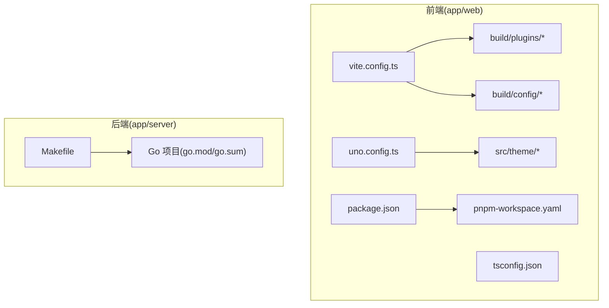
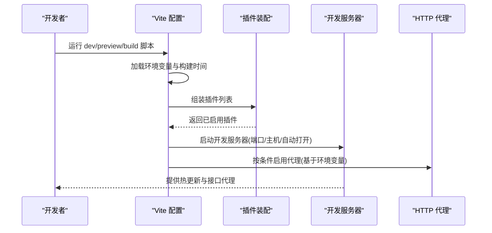
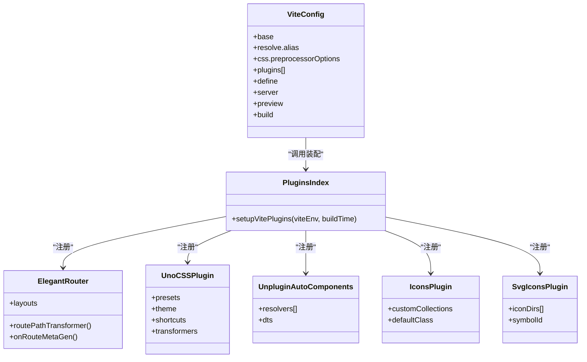
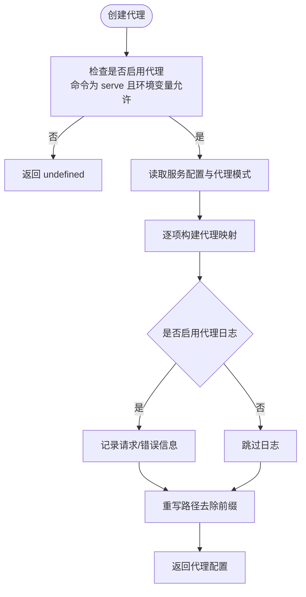
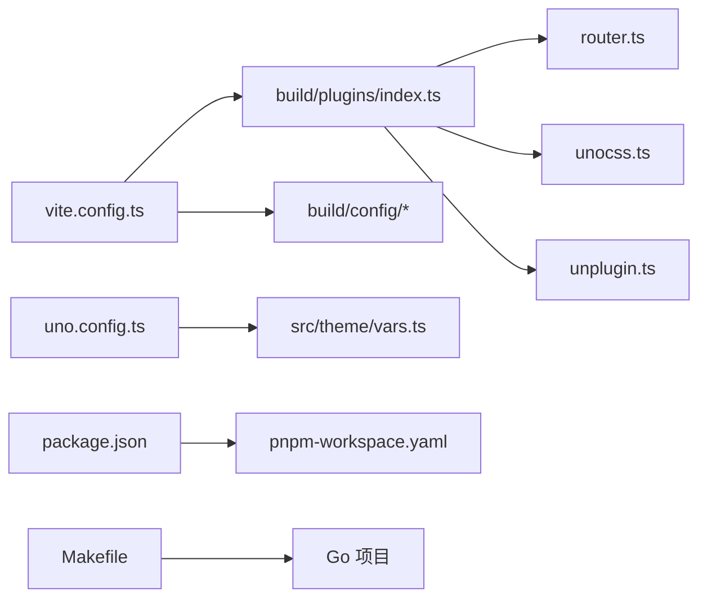

# 构建工具

<cite>
**本文引用的文件**
- [vite.config.ts](file://app/web/vite.config.ts)
- [tsconfig.json](file://app/web/tsconfig.json)
- [uno.config.ts](file://app/web/uno.config.ts)
- [package.json](file://app/web/package.json)
- [pnpm-workspace.yaml](file://app/web/pnpm-workspace.yaml)
- [build/config/index.ts](file://app/web/build/config/index.ts)
- [build/config/proxy.ts](file://app/web/build/config/proxy.ts)
- [build/config/time.ts](file://app/web/build/config/time.ts)
- [build/plugins/index.ts](file://app/web/build/plugins/index.ts)
- [build/plugins/router.ts](file://app/web/build/plugins/router.ts)
- [build/plugins/unocss.ts](file://app/web/build/plugins/unocss.ts)
- [build/plugins/unplugin.ts](file://app/web/build/plugins/unplugin.ts)
- [src/theme/vars.ts](file://app/web/src/theme/vars.ts)
- [src/theme/settings.ts](file://app/web/src/theme/settings.ts)
- [Makefile](file://app/server/Makefile)
</cite>

## 目录
1. [简介](#简介)
2. [项目结构](#项目结构)
3. [核心组件](#核心组件)
4. [架构总览](#架构总览)
5. [详细组件分析](#详细组件分析)
6. [依赖关系分析](#依赖关系分析)
7. [性能考量](#性能考量)
8. [故障排查指南](#故障排查指南)
9. [结论](#结论)
10. [附录](#附录)

## 简介
本指南面向boread项目的前端与后端构建工具链，系统讲解以下内容：
- 前端Vite构建配置：开发服务器、代理、构建优化、插件体系、环境变量处理
- UnoCSS原子化CSS框架：主题定制、预设、本地图标集成、响应式设计
- TypeScript编译与类型检查
- 包管理工具pnpm：工作区、依赖与脚本
- 后端Go项目Makefile：构建、测试、清理、Swagger生成、数据种子
- 性能优化建议与常见问题排查

## 项目结构
前端位于 app/web，采用Vite+Vue3+TypeScript+UnoCSS技术栈；后端位于 app/server，使用Go语言与Makefile进行构建与运维。

图示来源
- [vite.config.ts:1-52](file://app/web/vite.config.ts#L1-L52)
- [tsconfig.json:1-26](file://app/web/tsconfig.json#L1-L26)
- [uno.config.ts:1-27](file://app/web/uno.config.ts#L1-L27)
- [package.json:1-108](file://app/web/package.json#L1-L108)
- [pnpm-workspace.yaml:1-11](file://app/web/pnpm-workspace.yaml#L1-L11)
- [build/config/index.ts:1-3](file://app/web/build/config/index.ts#L1-L3)
- [build/plugins/index.ts:1-27](file://app/web/build/plugins/index.ts#L1-L27)
- [src/theme/vars.ts:1-36](file://app/web/src/theme/vars.ts#L1-L36)
- [Makefile:1-43](file://app/server/Makefile#L1-L43)

章节来源
- [vite.config.ts:1-52](file://app/web/vite.config.ts#L1-L52)
- [package.json:1-108](file://app/web/package.json#L1-L108)
- [pnpm-workspace.yaml:1-11](file://app/web/pnpm-workspace.yaml#L1-L11)
- [Makefile:1-43](file://app/server/Makefile#L1-L43)

## 核心组件
- Vite构建配置：统一在入口导出配置对象，包含路径别名、CSS预处理器、插件装配、开发服务器、预览端口、构建参数等。
- UnoCSS配置：定义内容扫描排除、主题变量合并、字体尺寸扩展、快捷类、转换器与预设。
- TypeScript配置：严格模式、模块解析策略、路径映射、类型声明、编译目标与输出。
- pnpm工作区：多包共享、提升安装、忽略特定包构建、链接工作区包。
- Go Makefile：统一运行、构建、测试、清理、代码规范、Swagger生成、种子数据。

章节来源
- [vite.config.ts:7-51](file://app/web/vite.config.ts#L7-L51)
- [uno.config.ts:5-26](file://app/web/uno.config.ts#L5-L26)
- [tsconfig.json:2-25](file://app/web/tsconfig.json#L2-L25)
- [pnpm-workspace.yaml:1-11](file://app/web/pnpm-workspace.yaml#L1-L11)
- [Makefile:1-43](file://app/server/Makefile#L1-L43)

## 架构总览
前端构建从Vite入口开始，加载环境变量，装配插件（路由、UnoCSS、组件自动注册、图标、进度条、HTML注入、Vue DevTools），配置开发服务器与代理，最终产出静态资源。后端通过Makefile统一管理构建、测试与文档生成。

图示来源
- [vite.config.ts:7-51](file://app/web/vite.config.ts#L7-L51)
- [build/plugins/index.ts:12-26](file://app/web/build/plugins/index.ts#L12-L26)
- [build/config/proxy.ts:12-28](file://app/web/build/config/proxy.ts#L12-L28)

## 详细组件分析

### Vite 构建配置
- 开发服务器
  - 主机与端口、自动打开浏览器、预览端口独立配置
  - 代理开关受命令模式与环境变量控制
- 路径别名
  - 使用URL构造函数计算绝对路径，提供“~”和“@”别名
- CSS预处理
  - SCSS现代编译API、全局样式注入
- 插件体系
  - Vue/Vue JSX、Elegant路由、UnoCSS、组件自动注册、图标、进度条、HTML注入、Vue过渡根校验、Vue DevTools
- 构建参数
  - 关闭压缩体积报告、按环境变量决定SourceMap、CommonJS选项
- 全局常量
  - 注入构建时间字符串

章节来源
- [vite.config.ts:14-51](file://app/web/vite.config.ts#L14-L51)
- [build/plugins/index.ts:12-26](file://app/web/build/plugins/index.ts#L12-L26)

### UnoCSS 原子化CSS
- 内容扫描
  - 排除node_modules与dist目录，避免无意义扫描
- 主题定制
  - 合并主题变量（颜色、阴影等）
  - 扩展字体尺寸以适配图标尺寸
- 快捷类
  - 定义常用组合类，如卡片容器
- 变换器
  - 指令与变体分组支持
- 预设
  - Wind3默认预设与项目自定义预设
- 本地图标集成
  - 基于环境变量前缀与本地SVG目录动态注册图标集合

章节来源
- [uno.config.ts:5-26](file://app/web/uno.config.ts#L5-L26)
- [src/theme/vars.ts:21-35](file://app/web/src/theme/vars.ts#L21-L35)
- [build/plugins/unocss.ts:7-32](file://app/web/build/plugins/unocss.ts#L7-L32)

### TypeScript 编译与类型检查
- 编译目标与模块
  - ESNext目标、ESNext模块解析、Bundler解析策略
- 路径映射
  - 与Vite一致的“@/*”和“~/*”
- 类型声明
  - Vite、Node、图标、NaiveUI等类型
- 严格性
  - 严格模式、空值检查、未使用变量策略、隔离模块
- 类型检查脚本
  - 使用vue-tsc进行类型检查，跳过库文件与输出

章节来源
- [tsconfig.json:2-25](file://app/web/tsconfig.json#L2-L25)
- [package.json:43](file://app/web/package.json#L43)

### pnpm 工作区与脚本
- 工作区
  - packages匹配规则、禁止特定包构建、提升安装、链接工作区包
- 脚本命令
  - 开发、预览、构建（含测试/生产模式）、类型检查、代码格式化、Git钩子、路由生成、发布等
- Git钩子
  - 自动执行类型检查、Lint、格式化与diff校验

章节来源
- [pnpm-workspace.yaml:1-11](file://app/web/pnpm-workspace.yaml#L1-L11)
- [package.json:29-44](file://app/web/package.json#L29-L44)
- [package.json:98-101](file://app/web/package.json#L98-L101)

### 后端 Go 项目 Makefile
- 目标
  - run、build、build-local、test、lint、tidy、clean、swag、seed
- 平台与编译
  - 默认Linux/amd64，CGO可配置，链接器标志最小化
- Swagger
  - 基于主程序入口生成文档，解析依赖与内部包
- 数据种子
  - 通过命令行参数触发种子数据生成

章节来源
- [Makefile:1-43](file://app/server/Makefile#L1-L43)

### 插件体系与构建流程（代码级）

图示来源
- [vite.config.ts:14-51](file://app/web/vite.config.ts#L14-L51)
- [build/plugins/index.ts:12-26](file://app/web/build/plugins/index.ts#L12-L26)
- [build/plugins/router.ts:5-41](file://app/web/build/plugins/router.ts#L5-L41)
- [build/plugins/unocss.ts:7-32](file://app/web/build/plugins/unocss.ts#L7-L32)
- [build/plugins/unplugin.ts:11-47](file://app/web/build/plugins/unplugin.ts#L11-L47)

### 代理与服务配置（流程图）

图示来源
- [build/config/proxy.ts:12-28](file://app/web/build/config/proxy.ts#L12-L28)
- [build/config/proxy.ts:30-55](file://app/web/build/config/proxy.ts#L30-L55)

## 依赖关系分析
- 前端
  - Vite配置依赖插件装配与构建配置模块
  - UnoCSS依赖主题变量与本地图标集合
  - TypeScript配置影响类型检查与IDE体验
  - pnpm工作区影响包解析与版本对齐
- 后端
  - Makefile统一编译、测试、文档与种子流程

图示来源
- [vite.config.ts:3-5](file://app/web/vite.config.ts#L3-L5)
- [build/plugins/index.ts:1-11](file://app/web/build/plugins/index.ts#L1-L11)
- [uno.config.ts:1-3](file://app/web/uno.config.ts#L1-L3)
- [src/theme/vars.ts:1-1](file://app/web/src/theme/vars.ts#L1-L1)
- [package.json:1-108](file://app/web/package.json#L1-L108)
- [pnpm-workspace.yaml:1-11](file://app/web/pnpm-workspace.yaml#L1-L11)
- [Makefile:1-43](file://app/server/Makefile#L1-L43)

## 性能考量
- 构建体积与SourceMap
  - 关闭压缩体积报告，按需开启SourceMap以平衡调试与体积
- 代理日志
  - 在开发阶段可开启代理日志辅助定位跨域与转发问题，生产关闭以减少IO
- 图标与组件自动注册
  - 仅注册必要解析器，避免过多解析器导致扫描开销
- UnoCSS内容扫描
  - 明确排除node_modules与dist，减少扫描范围
- 路由与组件
  - 使用Elegant路由生成静态路由元信息，减少运行时计算
- Go构建
  - 默认最小化链接器标志，按需启用CGO，避免不必要的C依赖

章节来源
- [vite.config.ts:43-49](file://app/web/vite.config.ts#L43-L49)
- [build/config/proxy.ts:17](file://app/web/build/config/proxy.ts#L17)
- [uno.config.ts:6-10](file://app/web/uno.config.ts#L6-L10)
- [build/plugins/unplugin.ts:33-36](file://app/web/build/plugins/unplugin.ts#L33-L36)
- [Makefile:7-11](file://app/server/Makefile#L7-L11)

## 故障排查指南
- 开发服务器无法访问或端口冲突
  - 检查服务器主机与端口配置，确认防火墙与占用情况
- 代理不生效
  - 确认命令模式为开发且环境变量允许代理；检查代理日志与服务配置
- UnoCSS样式未生效
  - 确认内容扫描排除规则、主题变量合并、字体尺寸扩展与预设顺序
- 图标显示异常
  - 检查本地图标集合名称与前缀、图标加载器路径与SVG尺寸
- 类型检查失败
  - 清理缓存后重新执行类型检查脚本，核对TS配置与类型声明
- Go构建失败
  - 检查平台与CGO设置、依赖完整性与链接器标志；使用tidy修复模块

章节来源
- [vite.config.ts:34-42](file://app/web/vite.config.ts#L34-L42)
- [build/config/proxy.ts:12-28](file://app/web/build/config/proxy.ts#L12-L28)
- [uno.config.ts:5-26](file://app/web/uno.config.ts#L5-L26)
- [build/plugins/unocss.ts:7-32](file://app/web/build/plugins/unocss.ts#L7-L32)
- [build/plugins/unplugin.ts:11-47](file://app/web/build/plugins/unplugin.ts#L11-L47)
- [tsconfig.json:2-25](file://app/web/tsconfig.json#L2-L25)
- [Makefile:33-34](file://app/server/Makefile#L33-L34)

## 结论
本指南梳理了boread项目的前端构建（Vite+UnoCSS+TypeScript）与后端构建（Go+Makefile）的关键配置与最佳实践。通过合理配置代理、插件与主题变量，结合pnpm工作区与严格的TS配置，可在保证开发体验的同时获得稳定的构建质量。建议在团队内统一脚本与Git钩子，持续优化扫描范围与构建参数以提升性能。

## 附录
- 常用脚本
  - 开发：dev/dev:prod/preview
  - 构建：build/build:test
  - 质量：lint/typecheck/fmt
  - 工具：gen-route/release/cleanup
- 环境变量要点
  - 基础路径、代理开关、代理日志、图标前缀与本地前缀、SourceMap开关
- Go构建参数
  - 平台、架构、CGO启用、链接器标志、构建输出目录

章节来源
- [package.json:29-44](file://app/web/package.json#L29-L44)
- [vite.config.ts:15-16](file://app/web/vite.config.ts#L15-L16)
- [build/config/proxy.ts:12-17](file://app/web/build/config/proxy.ts#L12-L17)
- [build/plugins/unocss.ts:8](file://app/web/build/plugins/unocss.ts#L8)
- [build/plugins/unplugin.ts:12](file://app/web/build/plugins/unplugin.ts#L12)
- [vite.config.ts:45](file://app/web/vite.config.ts#L45)
- [Makefile:3-20](file://app/server/Makefile#L3-L20)