# 构建系统增强

<cite>
**本文档引用的文件**
- [vite.config.ts](file://app/web/vite.config.ts)
- [package.json](file://app/web/package.json)
- [Makefile](file://Makefile)
- [go.mod](file://app/server/go.mod)
- [main.go](file://app/server/cmd/api/main.go)
- [index.ts](file://app/web/build/plugins/index.ts)
- [router.ts](file://app/web/build/plugins/router.ts)
- [unocss.ts](file://app/web/build/plugins/unocss.ts)
- [html.ts](file://app/web/build/plugins/html.ts)
- [proxy.ts](file://app/web/build/config/proxy.ts)
- [time.ts](file://app/web/build/config/time.ts)
- [tsconfig.json](file://app/web/tsconfig.json)
</cite>

## 目录
1. [简介](#简介)
2. [项目结构](#项目结构)
3. [核心组件](#核心组件)
4. [架构概览](#架构概览)
5. [详细组件分析](#详细组件分析)
6. [依赖分析](#依赖分析)
7. [性能考虑](#性能考虑)
8. [故障排除指南](#故障排除指南)
9. [结论](#结论)

## 简介

本项目是一个基于 Vue 3 + Gin 的小说阅读平台，采用现代化的构建系统和开发工具链。构建系统经过全面增强，集成了 Vite 8、TypeScript、UnoCSS、Elegant Router 等先进技术，提供了完整的前端构建、后端编译和打包流程。

## 项目结构

项目采用前后端分离的架构设计，通过 Makefile 统一管理构建流程：

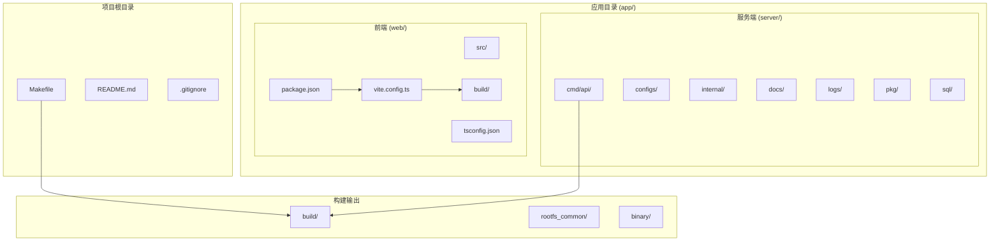

**图表来源**
- [Makefile:1-139](file://Makefile#L1-L139)
- [vite.config.ts:1-52](file://app/web/vite.config.ts#L1-L52)

**章节来源**
- [Makefile:1-139](file://Makefile#L1-L139)
- [package.json:1-110](file://app/web/package.json#L1-L110)

## 核心组件

### 构建系统架构

构建系统采用多层架构设计，每个层级都有明确的职责分工：

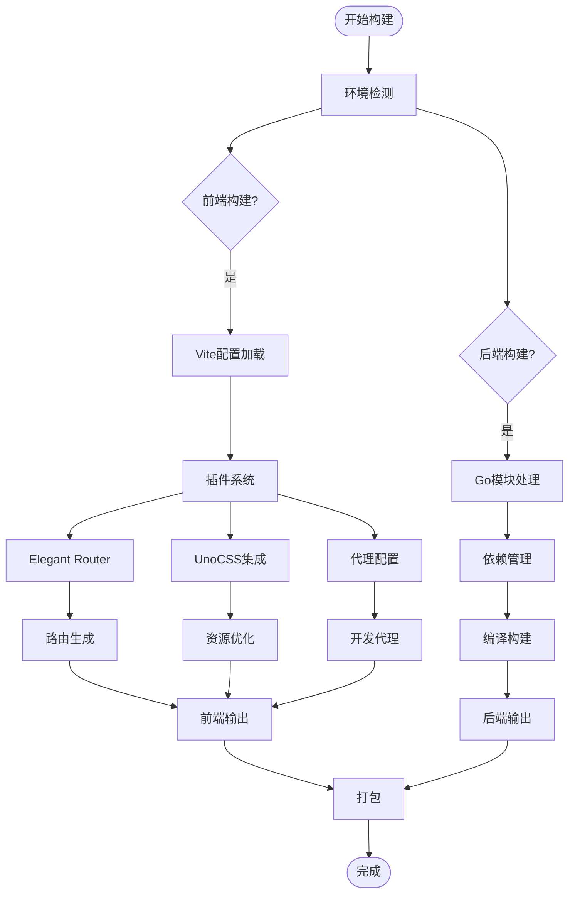

**图表来源**
- [index.ts:13-37](file://app/web/build/plugins/index.ts#L13-L37)
- [vite.config.ts:30-50](file://app/web/vite.config.ts#L30-L50)

### 开发工具链

项目集成了多种现代化开发工具：

| 工具 | 版本 | 功能 |
|------|------|------|
| Vite | 8.0.12 | 前端构建工具 |
| TypeScript | 6.0.3 | 类型安全 |
| Vue | 3.5.34 | 前端框架 |
| Gin | 1.12.0 | Go Web框架 |
| GORM | 1.31.1 | ORM框架 |
| UnoCSS | 66.6.8 | CSS原子化工具 |

**章节来源**
- [package.json:46-99](file://app/web/package.json#L46-L99)
- [go.mod:5-18](file://app/server/go.mod#L5-L18)

## 架构概览

### 整体架构设计

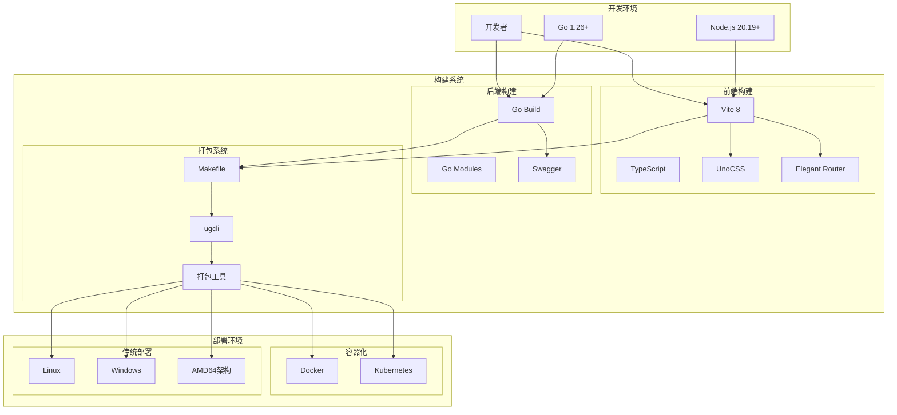

**图表来源**
- [Makefile:25-86](file://Makefile#L25-L86)
- [vite.config.ts:7-51](file://app/web/vite.config.ts#L7-L51)

## 详细组件分析

### Vite 构建配置分析

Vite 配置经过精心设计，支持多种构建场景：

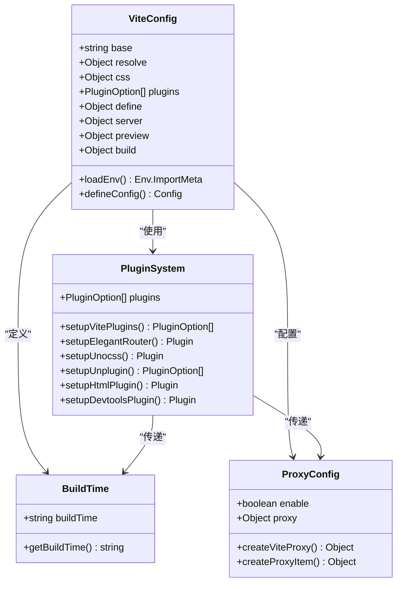

**图表来源**
- [vite.config.ts:7-51](file://app/web/vite.config.ts#L7-L51)
- [index.ts:13-37](file://app/web/build/plugins/index.ts#L13-L37)
- [time.ts:5-12](file://app/web/build/config/time.ts#L5-L12)
- [proxy.ts:12-28](file://app/web/build/config/proxy.ts#L12-L28)

#### 插件系统架构

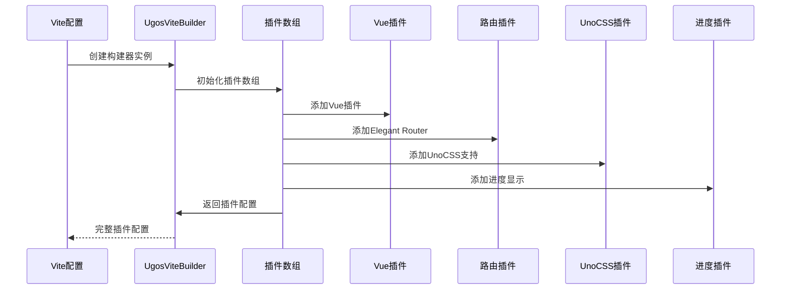

**图表来源**
- [index.ts:13-37](file://app/web/build/plugins/index.ts#L13-L37)

**章节来源**
- [vite.config.ts:14-50](file://app/web/vite.config.ts#L14-L50)
- [index.ts:13-37](file://app/web/build/plugins/index.ts#L13-L37)

### 路由系统增强

Elegant Router 提供了强大的路由生成能力：

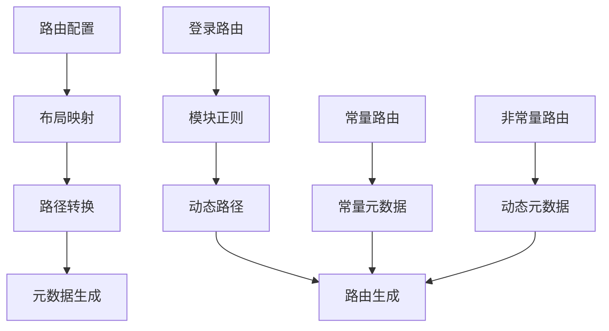

**图表来源**
- [router.ts:5-42](file://app/web/build/plugins/router.ts#L5-L42)

**章节来源**
- [router.ts:11-39](file://app/web/build/plugins/router.ts#L11-L39)

### UnoCSS 集成

UnoCSS 提供了原子化 CSS 解决方案：

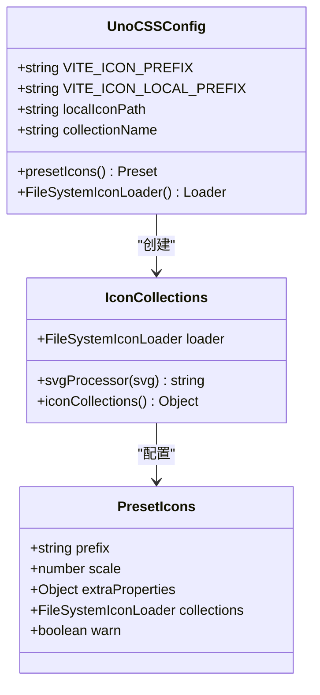

**图表来源**
- [unocss.ts:7-32](file://app/web/build/plugins/unocss.ts#L7-L32)

**章节来源**
- [unocss.ts:15-31](file://app/web/build/plugins/unocss.ts#L15-L31)

### HTML 构建增强

HTML 插件为构建产物添加了构建时间信息：

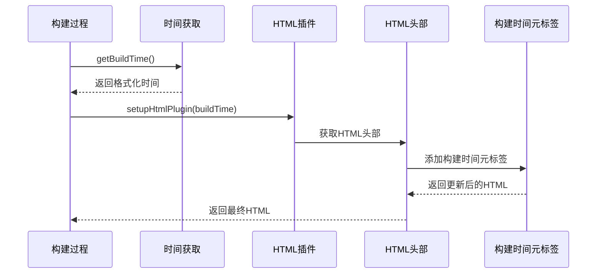

**图表来源**
- [html.ts:3-13](file://app/web/build/plugins/html.ts#L3-L13)
- [time.ts:5-12](file://app/web/build/config/time.ts#L5-L12)

**章节来源**
- [html.ts:7-8](file://app/web/build/plugins/html.ts#L7-L8)

### 开发代理系统

代理系统提供了灵活的开发环境配置：

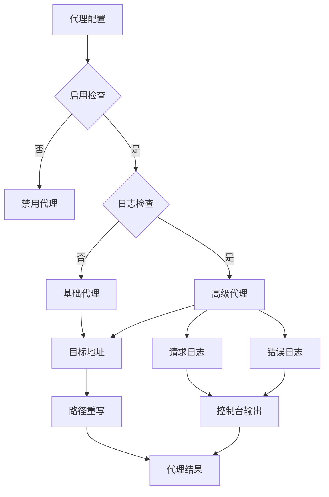

**图表来源**
- [proxy.ts:12-28](file://app/web/build/config/proxy.ts#L12-L28)
- [proxy.ts:30-55](file://app/web/build/config/proxy.ts#L30-L55)

**章节来源**
- [proxy.ts:33-52](file://app/web/build/config/proxy.ts#L33-L52)

## 依赖分析

### 前端依赖关系

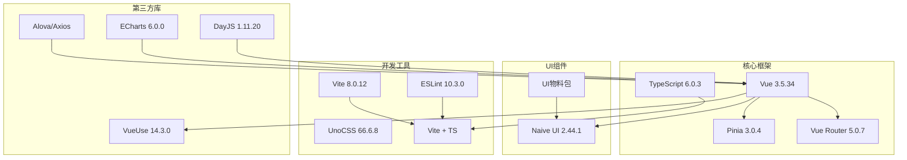

**图表来源**
- [package.json:46-99](file://app/web/package.json#L46-L99)

### 后端依赖关系

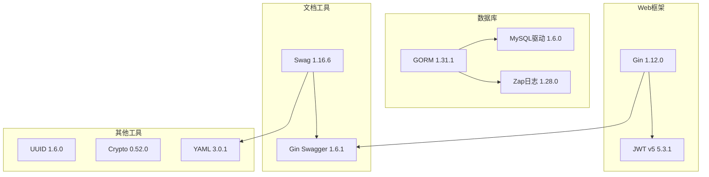

**图表来源**
- [go.mod:5-18](file://app/server/go.mod#L5-L18)

**章节来源**
- [go.mod:20-66](file://app/server/go.mod#L20-L66)

## 性能考虑

### 构建性能优化

构建系统采用了多项性能优化策略：

1. **并行构建**: Makefile 支持并行任务执行
2. **增量编译**: Vite 提供快速热重载
3. **代码分割**: 自动代码分割和懒加载
4. **资源压缩**: 生产环境自动压缩资源
5. **缓存机制**: 智能缓存策略减少重复构建

### 内存管理

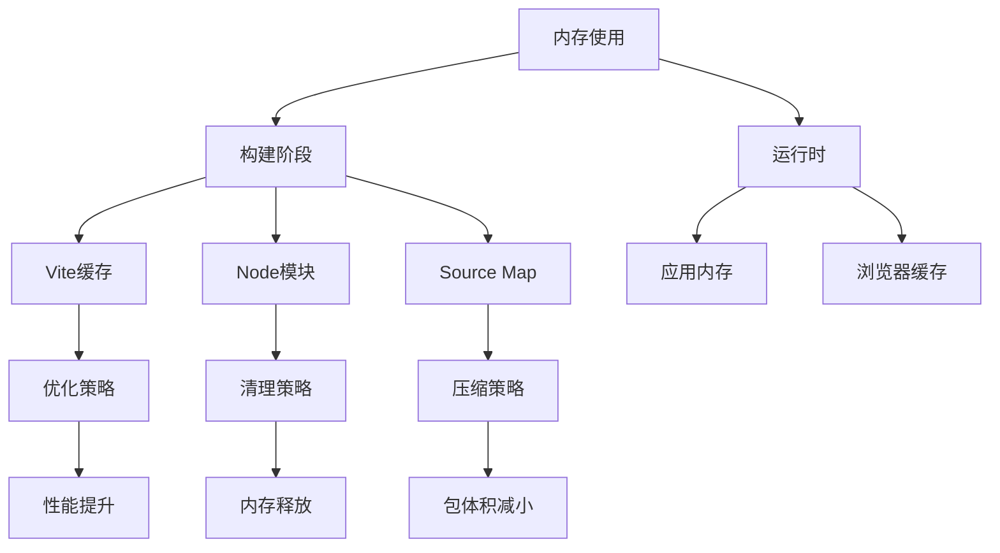

### 编译优化

| 优化项 | 实现方式 | 效果 |
|--------|----------|------|
| 并行编译 | Makefile 多任务并行 | 减少总构建时间 |
| 智能缓存 | Vite 缓存机制 | 加速二次构建 |
| 代码压缩 | 生产环境自动压缩 | 减小包体积 |
| 资源优化 | UnoCSS 原子化 | 提升样式性能 |
| 懒加载 | 路由懒加载 | 改善首屏速度 |

## 故障排除指南

### 常见构建问题

#### 环境变量配置问题

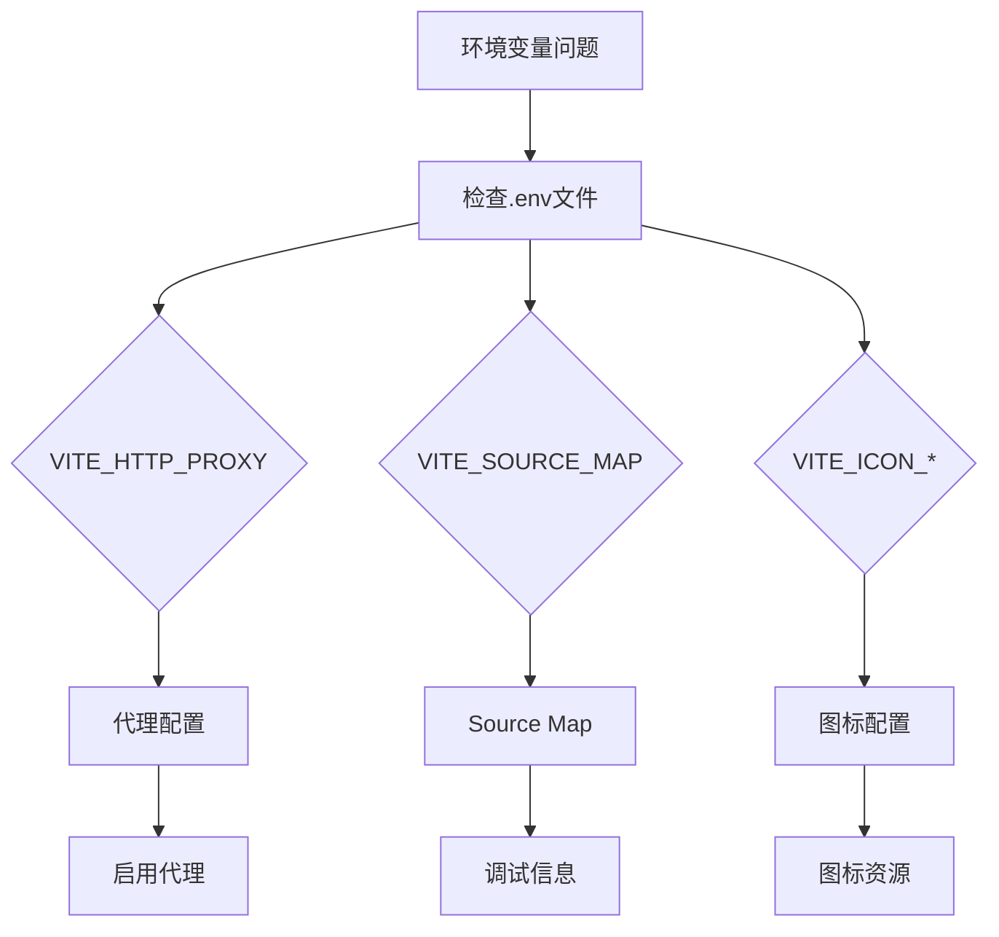

**章节来源**
- [proxy.ts:12-28](file://app/web/build/config/proxy.ts#L12-L28)

#### 依赖安装问题

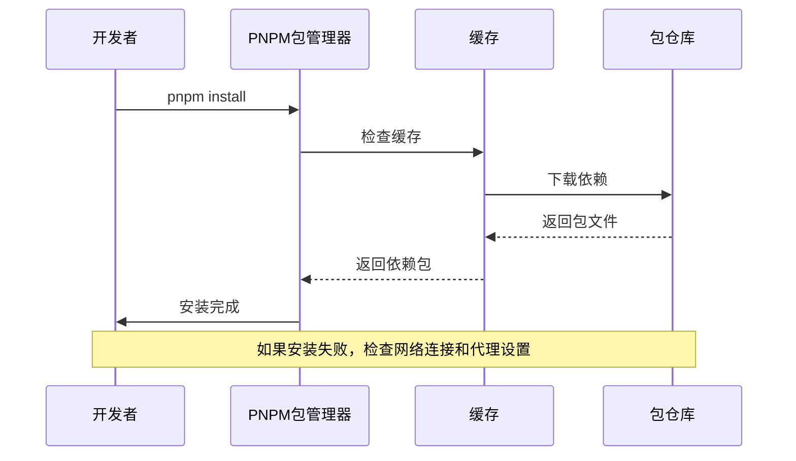

#### 构建失败排查

1. **检查 Node.js 版本**: 确保使用 20.19.0 或更高版本
2. **验证 Go 版本**: 确保使用 1.26.3 或更高版本
3. **检查磁盘空间**: 确保有足够的磁盘空间进行构建
4. **清理缓存**: 运行 `pnpm clean` 清理缓存后重试

**章节来源**
- [package.json:104-107](file://app/web/package.json#L104-L107)
- [Makefile:105-116](file://Makefile#L105-L116)

### 开发服务器问题

#### 端口冲突解决

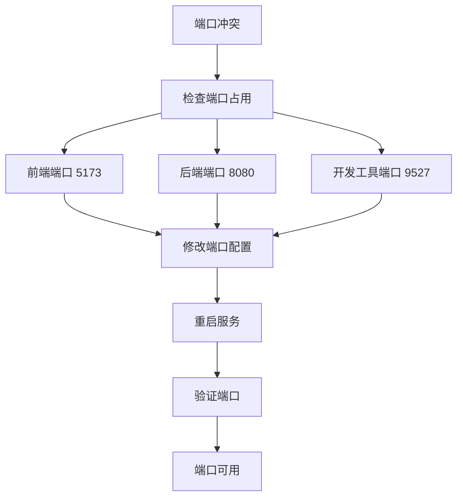

**章节来源**
- [vite.config.ts:34-42](file://app/web/vite.config.ts#L34-L42)
- [main.go:138-144](file://app/server/cmd/api/main.go#L138-L144)

## 结论

本构建系统经过全面增强，具备以下特点：

1. **现代化技术栈**: 集成了 Vite 8、TypeScript、UnoCSS 等最新技术
2. **高效构建流程**: 通过 Makefile 统一管理前后端构建
3. **灵活配置系统**: 支持多种环境和部署场景
4. **完善的开发体验**: 提供热重载、代理、调试等开发功能
5. **性能优化**: 采用多种优化策略提升构建和运行性能

系统架构清晰，组件职责明确，为项目的长期发展奠定了坚实基础。通过合理的配置和优化，能够满足从开发到生产的全生命周期需求。