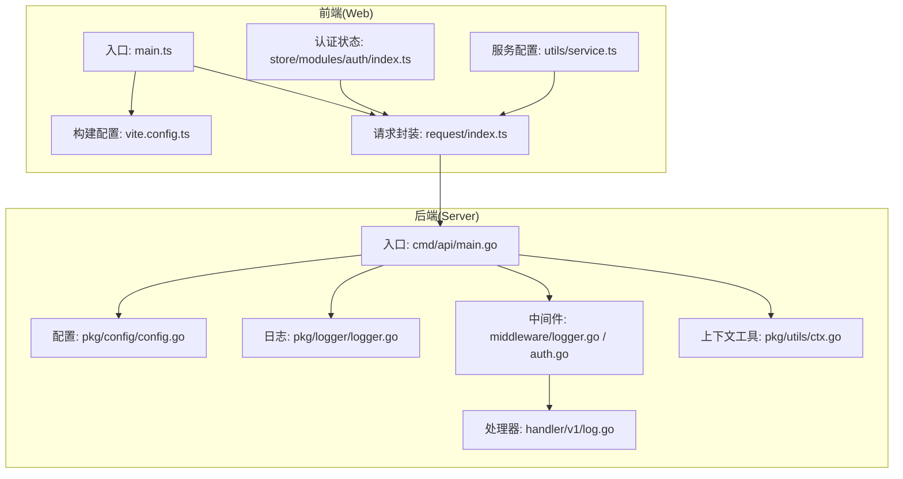
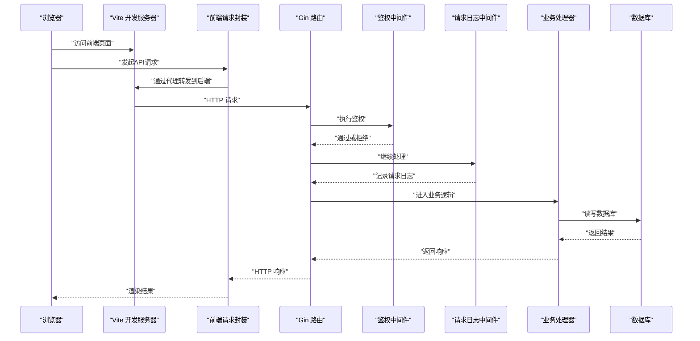
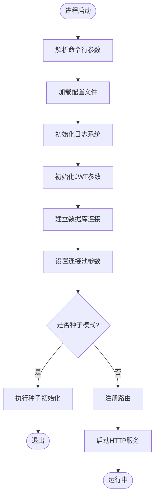
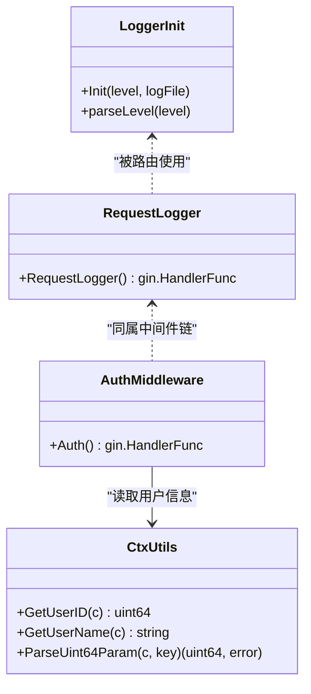
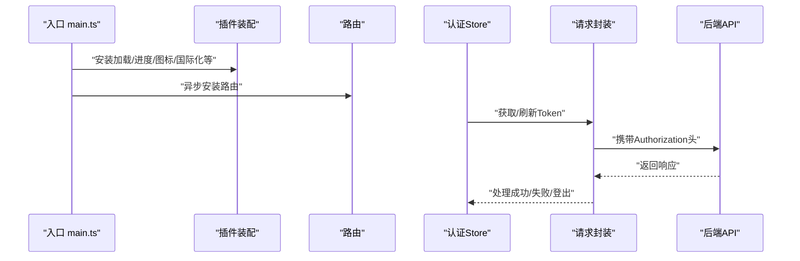
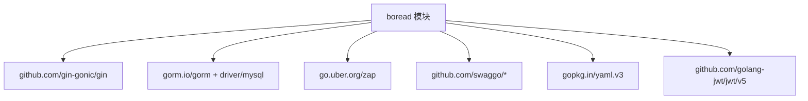

# 调试工具

<cite>
**本文引用的文件**   
- [main.go](file://app/server/cmd/api/main.go)
- [logger.go](file://app/server/pkg/logger/logger.go)
- [config.go](file://app/server/pkg/config/config.go)
- [config.example.yaml](file://app/server/configs/config.example.yaml)
- [logger.go（中间件）](file://app/server/internal/middleware/logger.go)
- [auth.go（中间件）](file://app/server/internal/middleware/auth.go)
- [ctx.go](file://app/server/pkg/utils/ctx.go)
- [log.go（处理器）](file://app/server/internal/handler/v1/log.go)
- [main.ts](file://app/web/src/main.ts)
- [vite.config.ts](file://app/web/vite.config.ts)
- [index.ts（请求封装）](file://app/web/src/service/request/index.ts)
- [index.ts（认证状态）](file://app/web/src/store/modules/auth/index.ts)
- [service.ts](file://app/web/src/utils/service.ts)
- [go.mod](file://app/server/go.mod)
</cite>

## 目录
1. [引言](#引言)
2. [项目结构](#项目结构)
3. [核心组件](#核心组件)
4. [架构总览](#架构总览)
5. [详细组件分析](#详细组件分析)
6. [依赖分析](#依赖分析)
7. [性能考虑](#性能考虑)
8. [故障排查指南](#故障排查指南)
9. [结论](#结论)
10. [附录](#附录)

## 引言
本指南面向boread项目的前后端开发者与运维人员，系统性介绍调试工具与技巧，覆盖浏览器开发者工具与Vue DevTools、网络监控与性能分析；后端Go应用的日志系统配置与调试方法（结构化日志、错误追踪、性能监控）；开发环境断点调试、条件断点与变量监视；API调试工具Postman的使用与接口测试最佳实践；以及Docker容器调试、数据库查询调试、缓存调试等特殊场景的处理思路。文档中的所有技术细节均基于仓库现有代码与配置进行提炼与总结。

## 项目结构
boread采用前后端分离架构：前端位于app/web，后端位于app/server。前端通过Vite开发服务器提供本地调试能力，并可配置代理转发到后端；后端以Gin框架提供REST API，使用GORM连接MySQL，日志由Zap统一输出，配置来自YAML文件。

图表来源
- [main.ts:1-37](file://app/web/src/main.ts#L1-L37)
- [vite.config.ts:1-52](file://app/web/vite.config.ts#L1-L52)
- [index.ts（请求封装）:1-171](file://app/web/src/service/request/index.ts#L1-L171)
- [index.ts（认证状态）:1-185](file://app/web/src/store/modules/auth/index.ts#L1-L185)
- [service.ts:1-76](file://app/web/src/utils/service.ts#L1-L76)
- [main.go:1-85](file://app/server/cmd/api/main.go#L1-L85)
- [config.go:1-66](file://app/server/pkg/config/config.go#L1-L66)
- [logger.go:1-53](file://app/server/pkg/logger/logger.go#L1-L53)
- [logger.go（中间件）:1-29](file://app/server/internal/middleware/logger.go#L1-L29)
- [auth.go（中间件）:1-41](file://app/server/internal/middleware/auth.go#L1-L41)
- [log.go（处理器）:1-64](file://app/server/internal/handler/v1/log.go#L1-L64)
- [ctx.go:1-48](file://app/server/pkg/utils/ctx.go#L1-L48)

章节来源
- [main.go:1-85](file://app/server/cmd/api/main.go#L1-L85)
- [config.go:1-66](file://app/server/pkg/config/config.go#L1-L66)
- [logger.go:1-53](file://app/server/pkg/logger/logger.go#L1-L53)
- [logger.go（中间件）:1-29](file://app/server/internal/middleware/logger.go#L1-L29)
- [auth.go（中间件）:1-41](file://app/server/internal/middleware/auth.go#L1-L41)
- [ctx.go:1-48](file://app/server/pkg/utils/ctx.go#L1-L48)
- [log.go（处理器）:1-64](file://app/server/internal/handler/v1/log.go#L1-L64)
- [main.ts:1-37](file://app/web/src/main.ts#L1-L37)
- [vite.config.ts:1-52](file://app/web/vite.config.ts#L1-L52)
- [index.ts（请求封装）:1-171](file://app/web/src/service/request/index.ts#L1-L171)
- [index.ts（认证状态）:1-185](file://app/web/src/store/modules/auth/index.ts#L1-L185)
- [service.ts:1-76](file://app/web/src/utils/service.ts#L1-L76)

## 核心组件
- 后端入口与启动流程：负责加载配置、初始化日志、建立数据库连接、设置GORM日志级别、路由注册与服务启动。
- 配置系统：集中管理服务端口、数据库连接、JWT密钥与过期时间、日志级别与输出文件等。
- 日志系统：支持控制台与文件双通道输出，结构化编码，带调用者信息，便于定位问题。
- 中间件链：请求日志中间件打印状态码、耗时、方法与路径；鉴权中间件解析Authorization头并校验JWT。
- 前端入口与开发服务器：Vite提供热更新与代理能力，便于联调后端；请求封装统一处理响应码、错误提示与Token刷新。
- 认证状态管理：Pinia Store维护Token、用户信息与登录态，配合请求拦截器自动注入Authorization头。

章节来源
- [main.go:30-84](file://app/server/cmd/api/main.go#L30-L84)
- [config.go:9-66](file://app/server/pkg/config/config.go#L9-L66)
- [logger.go:13-53](file://app/server/pkg/logger/logger.go#L13-L53)
- [logger.go（中间件）:10-28](file://app/server/internal/middleware/logger.go#L10-L28)
- [auth.go（中间件）:13-39](file://app/server/internal/middleware/auth.go#L13-L39)
- [ctx.go:11-30](file://app/server/pkg/utils/ctx.go#L11-L30)
- [main.ts:10-36](file://app/web/src/main.ts#L10-L36)
- [vite.config.ts:34-42](file://app/web/vite.config.ts#L34-L42)
- [index.ts（请求封装）:13-128](file://app/web/src/service/request/index.ts#L13-L128)
- [index.ts（认证状态）:99-182](file://app/web/src/store/modules/auth/index.ts#L99-L182)

## 架构总览
下图展示了从浏览器到后端的关键交互路径，以及日志与鉴权在中间件层的处理位置。

图表来源
- [main.ts:1-37](file://app/web/src/main.ts#L1-L37)
- [vite.config.ts:34-42](file://app/web/vite.config.ts#L34-L42)
- [index.ts（请求封装）:28-38](file://app/web/src/service/request/index.ts#L28-L38)
- [main.go:76-83](file://app/server/cmd/api/main.go#L76-L83)
- [logger.go（中间件）:10-28](file://app/server/internal/middleware/logger.go#L10-L28)
- [auth.go（中间件）:13-39](file://app/server/internal/middleware/auth.go#L13-L39)
- [log.go（处理器）:28-40](file://app/server/internal/handler/v1/log.go#L28-L40)

## 详细组件分析

### 后端入口与配置加载
- 入口程序负责解析命令行参数（如种子初始化开关）、加载YAML配置、初始化日志、设置JWT参数、建立数据库连接并调整连接池参数、根据种子标志执行初始化后退出、否则注册路由并启动HTTP服务。
- 配置模型包含服务、数据库、JWT、日志与元数据提取规则等字段，配置文件示例提供了默认值与注释，便于快速上手。

图表来源
- [main.go:30-84](file://app/server/cmd/api/main.go#L30-L84)
- [config.go:58-66](file://app/server/pkg/config/config.go#L58-L66)
- [config.example.yaml:1-21](file://app/server/configs/config.example.yaml#L1-L21)

章节来源
- [main.go:30-84](file://app/server/cmd/api/main.go#L30-L84)
- [config.go:9-66](file://app/server/pkg/config/config.go#L9-L66)
- [config.example.yaml:1-21](file://app/server/configs/config.example.yaml#L1-L21)

### 日志系统与中间件
- 结构化日志：Zap生产者编码器，时间键、级别编码与ISO8601时间格式；同时支持控制台与文件双通道输出，文件输出采用JSON编码，便于日志收集与检索。
- 请求日志中间件：在请求完成后打印状态码、耗时、方法与路径，便于快速定位慢请求与异常端点。
- 鉴权中间件：从Authorization头解析Bearer Token，校验失败时直接返回错误并终止后续处理。

图表来源
- [logger.go:13-53](file://app/server/pkg/logger/logger.go#L13-L53)
- [logger.go（中间件）:10-28](file://app/server/internal/middleware/logger.go#L10-L28)
- [auth.go（中间件）:13-39](file://app/server/internal/middleware/auth.go#L13-L39)
- [ctx.go:11-47](file://app/server/pkg/utils/ctx.go#L11-L47)

章节来源
- [logger.go:13-53](file://app/server/pkg/logger/logger.go#L13-L53)
- [logger.go（中间件）:10-28](file://app/server/internal/middleware/logger.go#L10-L28)
- [auth.go（中间件）:13-39](file://app/server/internal/middleware/auth.go#L13-L39)
- [ctx.go:11-47](file://app/server/pkg/utils/ctx.go#L11-L47)

### 前端开发与调试
- 入口与插件：应用在入口处按序安装加载动画、进度条、图标离线包、国际化、版本通知等插件，随后挂载根组件。
- 开发服务器：Vite默认监听9527端口，开启自动打开浏览器与代理功能；可通过环境变量切换代理模式。
- 请求封装：统一处理响应码判断、错误提示、登出策略、Token过期刷新与重试；支持多BaseURL与代理前缀。
- 认证状态：Pinia Store维护登录态、用户信息与路由跳转，登录成功后持久化Token并在后续请求中自动注入。

图表来源
- [main.ts:10-36](file://app/web/src/main.ts#L10-L36)
- [vite.config.ts:34-42](file://app/web/vite.config.ts#L34-L42)
- [index.ts（请求封装）:28-128](file://app/web/src/service/request/index.ts#L28-L128)
- [index.ts（认证状态）:99-182](file://app/web/src/store/modules/auth/index.ts#L99-L182)

章节来源
- [main.ts:10-36](file://app/web/src/main.ts#L10-L36)
- [vite.config.ts:34-42](file://app/web/vite.config.ts#L34-L42)
- [index.ts（请求封装）:13-128](file://app/web/src/service/request/index.ts#L13-L128)
- [index.ts（认证状态）:99-182](file://app/web/src/store/modules/auth/index.ts#L99-L182)

### API处理器与日志查询
- 登录日志与操作日志分页接口：接收JSON参数，绑定到DTO结构体，调用服务层分页查询，返回统一响应格式。
- 该处理器体现了后端对输入参数的显式校验与错误处理，便于前端定位参数问题。

章节来源
- [log.go（处理器）:28-40](file://app/server/internal/handler/v1/log.go#L28-L40)
- [log.go（处理器）:51-63](file://app/server/internal/handler/v1/log.go#L51-L63)

## 依赖分析
后端模块依赖清晰，主要外部库包括Gin Web框架、GORM ORM、Zap日志、Swag Swagger文档生成、MySQL驱动与JWT库。

图表来源
- [go.mod:5-16](file://app/server/go.mod#L5-L16)

章节来源
- [go.mod:1-66](file://app/server/go.mod#L1-L66)

## 性能考虑
- 数据库连接池：通过最大空闲与最大打开连接数限制，避免连接泄漏与资源争用。
- GORM日志级别：默认设置为Warn，减少不必要的SQL日志噪声，生产环境建议结合结构化日志与采样策略。
- 前端代理与缓存：开发阶段启用代理减少跨域问题；合理配置静态资源缓存与SourceMap，平衡调试体验与性能。
- 中间件开销：请求日志中间件成本较低，但应避免在高频端点输出过多字段；鉴权中间件需确保Token解析高效。

章节来源
- [main.go:63-64](file://app/server/cmd/api/main.go#L63-L64)
- [main.go:52-54](file://app/server/cmd/api/main.go#L52-L54)
- [vite.config.ts:45-49](file://app/web/vite.config.ts#L45-L49)

## 故障排查指南

### 浏览器与前端调试
- 使用浏览器开发者工具的Elements、Console、Network、Performance面板定位样式、脚本错误与网络异常。
- Vue DevTools用于查看组件树、状态与事件流，结合断点与条件断点定位复杂逻辑。
- 网络监控：关注请求头Authorization是否正确注入，响应码与消息体结构是否符合约定；利用拦截器日志定位Token过期与登出流程。
- 性能分析：使用Performance面板录制交互过程，识别长任务与重绘热点。

章节来源
- [main.ts:10-36](file://app/web/src/main.ts#L10-L36)
- [index.ts（请求封装）:28-38](file://app/web/src/service/request/index.ts#L28-L38)
- [index.ts（认证状态）:131-146](file://app/web/src/store/modules/auth/index.ts#L131-L146)

### 后端日志与错误追踪
- 结构化日志：检查日志级别与输出文件路径，确认时间戳、级别与调用者信息完整；结合业务关键节点打点，便于回溯。
- 错误追踪：关注GORM SQL日志（在Warn及以上级别），定位慢查询与异常SQL；结合请求日志中间件输出的状态码与耗时，快速定位异常端点。
- 配置验证：核对配置文件中的数据库连接串、JWT密钥与过期时间、日志文件路径是否存在权限问题。

章节来源
- [logger.go:13-38](file://app/server/pkg/logger/logger.go#L13-L38)
- [logger.go（中间件）:10-28](file://app/server/internal/middleware/logger.go#L10-L28)
- [config.example.yaml:1-21](file://app/server/configs/config.example.yaml#L1-L21)

### 开发环境断点调试
- Go后端：在入口、中间件与处理器关键位置设置断点，观察上下文、请求参数与响应结构；结合数据库连接池参数与GORM日志级别，逐步缩小问题范围。
- 前端：在请求封装的onRequest、onBackendFail与onError分支设置断点，观察Token刷新与登出逻辑；在认证Store的login与getUserInfo处设置断点，验证状态同步。

章节来源
- [main.go:30-84](file://app/server/cmd/api/main.go#L30-L84)
- [auth.go（中间件）:13-39](file://app/server/internal/middleware/auth.go#L13-L39)
- [index.ts（请求封装）:39-126](file://app/web/src/service/request/index.ts#L39-L126)
- [index.ts（认证状态）:99-182](file://app/web/src/store/modules/auth/index.ts#L99-L182)

### API调试与最佳实践（Postman）
- 环境变量：设置基础URL、Token与常用参数，复用集合提高效率。
- 认证：在请求头添加Authorization: Bearer <token>，或使用Postman的Bearer Token授权。
- 响应校验：依据后端约定的code字段判断成功与否，结合错误消息定位问题；对需要刷新Token的场景，先刷新再重试。
- 场景化测试：构造边界数据（空值、超长字符串、非法格式）与并发场景，验证后端健壮性。

章节来源
- [index.ts（请求封装）:34-126](file://app/web/src/service/request/index.ts#L34-L126)
- [auth.go（中间件）:15-34](file://app/server/internal/middleware/auth.go#L15-L34)

### Docker容器调试
- 容器内日志：确保后端日志输出到标准输出与文件，结合容器日志采集系统统一收集；检查容器网络与端口映射。
- 连接外部服务：确认容器DNS与网络策略允许访问数据库与外部API；必要时使用docker-compose的networks与links。
- 调试会话：在容器内执行临时调试命令（如curl、mysql客户端）验证连通性与可用性。

### 数据库查询调试
- 慢查询定位：结合GORM日志与数据库慢查询日志，识别高耗时SQL；优化索引与查询条件。
- 连接池问题：检查最大空闲与打开连接数配置，避免连接泄漏与排队等待。
- 数据一致性：在事务中执行批量操作，确保原子性与一致性。

章节来源
- [main.go:59-65](file://app/server/cmd/api/main.go#L59-L65)
- [main.go:52-54](file://app/server/cmd/api/main.go#L52-L54)

### 缓存调试（通用思路）
- 前端缓存：检查本地存储与会话存储的键值，确认Token与用户信息是否正确持久化与清理。
- 后端缓存：若引入Redis等缓存，关注键空间、过期策略与序列化格式；通过日志与指标观测命中率与延迟。
- 一致性：缓存失效策略与数据写入顺序需保证最终一致。

章节来源
- [index.ts（认证状态）:131-146](file://app/web/src/store/modules/auth/index.ts#L131-L146)
- [index.ts（请求封装）:89-96](file://app/web/src/service/request/index.ts#L89-L96)

## 结论
本指南围绕boread项目的实际代码与配置，给出了从前端到后端、从开发到生产的全链路调试方法。通过结构化日志、中间件链、统一请求封装与配置化管理，能够显著提升问题定位效率与系统可观测性。建议在团队内形成标准化的调试流程与文档，持续沉淀经验。

## 附录
- 常见问题清单
  - 前端无法访问后端接口：检查Vite代理配置与后端端口；确认浏览器Network面板显示的请求是否被代理转发。
  - 登录后无Token：检查认证Store是否持久化Token，请求封装是否正确注入Authorization头。
  - 后端日志不输出：核对日志级别与文件路径权限；确认初始化顺序与defer Sync调用。
  - 数据库连接失败：核对配置文件中的主机、端口、用户名与密码；检查防火墙与网络策略。
  - Token过期导致频繁刷新：确认JWT过期时间与刷新逻辑，避免死循环；在请求封装中避免重复刷新。