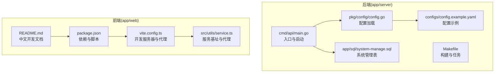
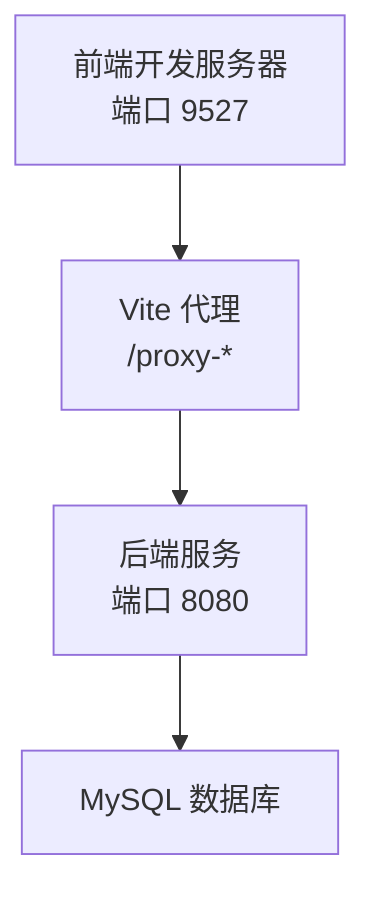
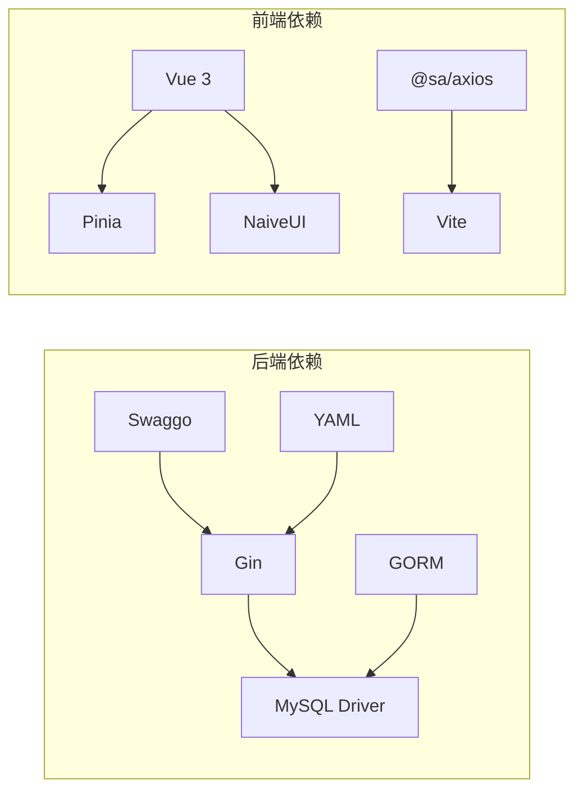

# 快速开始

<cite>
**本文引用的文件**
- [README.md](file://README.md)
- [项目开发文档.md](file://docs/project-development.md)
- [后端入口 main.go](file://app/server/cmd/api/main.go)
- [后端配置 config.go](file://app/server/pkg/config/config.go)
- [后端配置示例 config.example.yaml](file://app/server/configs/config.example.yaml)
- [后端 Makefile](file://app/server/Makefile)
- [后端 go.mod](file://app/server/go.mod)
- [前端 package.json](file://app/web/package.json)
- [前端 vite.config.ts](file://app/web/vite.config.ts)
- [前端服务配置 service.ts](file://app/web/src/utils/service.ts)
- [前端环境类型 vite-env.d.ts](file://app/web/src/typings/vite-env.d.ts)
- [系统管理建表 system-manage.sql](file://app/sql/system-manage.sql)
- [前端 README.md](file://app/web/README.md)
</cite>

## 更新摘要
**所做更改**
- 更新了项目结构描述，反映 app/web 目录的实际存在状态
- 删除了关于英文 README 的引用，因为该文件已被删除
- 更新了前端开发文档的引用，指向实际存在的中文 README
- 修正了快速开始指南中关于国际开发者访问的相关表述

## 目录
1. [简介](#简介)
2. [项目结构](#项目结构)
3. [核心组件](#核心组件)
4. [架构概览](#架构概览)
5. [详细组件分析](#详细组件分析)
6. [依赖分析](#依赖分析)
7. [性能考虑](#性能考虑)
8. [故障排查指南](#故障排查指南)
9. [结论](#结论)
10. [附录](#附录)

## 简介
本指南旨在帮助新开发者在约 30 分钟内完成 boread 项目的本地部署与首次运行验证。项目采用"Go 后端 + Vue3 前端 + MySQL"的技术栈，后端基于 Gin 框架与 GORM，前端基于 SoybeanAdmin 模板，数据库使用 MySQL 8.0.13+ 并提供完善的建表脚本。

**重要更新**：项目包含完整的中文开发文档，国际开发者可通过中文文档快速了解项目结构和开发流程。

## 项目结构
项目采用前后端分离的双工程结构：
- app/server：Go 后端，包含路由、处理器、服务层、仓储层、模型、配置与构建脚本
- app/web：Vue3 前端，包含页面组件、API 调用、状态管理、国际化与构建配置
- app/sql：数据库建表与种子数据脚本
- docs：项目开发文档与阶段性说明

**图表来源**
- [后端入口 main.go:1-85](file://app/server/cmd/api/main.go#L1-L85)
- [后端配置 config.go:1-66](file://app/server/pkg/config/config.go#L1-L66)
- [后端配置示例 config.example.yaml:1-21](file://app/server/configs/config.example.yaml#L1-L21)
- [后端 Makefile:1-43](file://app/server/Makefile#L1-L43)
- [前端 package.json:1-108](file://app/web/package.json#L1-L108)
- [前端 vite.config.ts:1-52](file://app/web/vite.config.ts#L1-L52)
- [前端服务配置 service.ts:1-75](file://app/web/src/utils/service.ts#L1-L75)
- [系统管理建表 system-manage.sql:1-351](file://app/sql/system-manage.sql#L1-L351)
- [前端 README.md:1-275](file://app/web/README.md#L1-L275)

**章节来源**
- [README.md:1-11](file://README.md#L1-L11)
- [项目开发文档.md:31-69](file://docs/project-development.md#L31-L69)

## 核心组件
- 后端启动与配置
  - 启动入口：读取配置、初始化日志、JWT、数据库连接，注册路由并启动服务
  - 配置加载：从 YAML 文件加载 server、database、jwt、log 等配置
  - 数据库：通过 DSN 连接 MySQL，设置最大空闲/活动连接数
  - 种子模式：支持一次性初始化种子数据后退出
- 前端开发与代理
  - 开发服务器：默认端口 9527，自动打开浏览器
  - 代理配置：通过 Vite 代理将 API 请求转发至后端
  - 服务基址：支持主服务与多服务基址配置，开发时可启用代理
  - 开发文档：提供完整的中文开发指南和使用说明

**章节来源**
- [后端入口 main.go:30-84](file://app/server/cmd/api/main.go#L30-L84)
- [后端配置 config.go:58-66](file://app/server/pkg/config/config.go#L58-L66)
- [后端配置示例 config.example.yaml:1-21](file://app/server/configs/config.example.yaml#L1-L21)
- [前端 vite.config.ts:34-42](file://app/web/vite.config.ts#L34-L42)
- [前端服务配置 service.ts:49-62](file://app/web/src/utils/service.ts#L49-L62)
- [前端 README.md:66-83](file://app/web/README.md#L66-L83)

## 架构概览
后端通过 Gin 提供 REST API，前端通过 Vite 开发服务器提供页面与资源，二者通过代理进行跨域通信。数据库使用 MySQL，后端通过 GORM 进行数据持久化。

**图表来源**
- [前端 vite.config.ts:34-42](file://app/web/vite.config.ts#L34-L42)
- [后端入口 main.go:76-83](file://app/server/cmd/api/main.go#L76-L83)

## 详细组件分析

### 环境准备与版本要求
- Go
  - 版本：1.26+
  - 依赖：Gin、GORM、Swaggo、MySQL 驱动等
- Node.js
  - 版本：>= 20.19.0
  - 包管理：pnpm >= 10.5.0
- MySQL
  - 版本：8.0.13+（使用函数索引）
  - 字符集：utf8mb4
- 其他
  - Make（用于构建与任务）

**章节来源**
- [项目开发文档.md:14-30](file://docs/project-development.md#L14-L30)
- [后端 go.mod:3-16](file://app/server/go.mod#L3-L16)
- [前端 package.json:102-106](file://app/web/package.json#L102-L106)

### 数据库初始化
- 创建数据库
  - 建议使用 UTF8MB4 字符集与排序规则
- 执行建表脚本
  - 系统管理表：system-manage.sql（已完成）
  - 业务表：business.sql（按阶段执行）
- 种子数据
  - 后端提供种子模式，初始化完成后输出默认管理员账号信息

**章节来源**
- [系统管理建表 system-manage.sql:20-24](file://app/sql/system-manage.sql#L20-L24)
- [后端入口 main.go:67-74](file://app/server/cmd/api/main.go#L67-L74)

### 环境变量与配置
- 后端配置
  - server.port：服务监听端口（默认 8080）
  - server.mode：运行模式（如 debug）
  - database.*：主机、端口、用户名、密码、库名、连接池参数
  - jwt.secret：JWT 密钥（需随机化）
  - jwt.expire：过期时间（秒）
  - log.level、log.file：日志级别与文件路径
- 前端配置
  - VITE_SERVICE_BASE_URL：后端服务基址
  - VITE_OTHER_SERVICE_BASE_URL：多服务基址（JSON5 字符串）
  - VITE_HTTP_PROXY：是否启用代理（开发环境）
  - VITE_AUTH_ROUTE_MODE：路由模式（static/dynamic）
  - VITE_ROUTE_HOME：首页路由键（静态路由模式）

**章节来源**
- [后端配置示例 config.example.yaml:1-21](file://app/server/configs/config.example.yaml#L1-L21)
- [后端配置 config.go:9-54](file://app/server/pkg/config/config.go#L9-L54)
- [前端环境类型 vite-env.d.ts:61-89](file://app/web/src/typings/vite-env.d.ts#L61-L89)

### 安装与部署步骤
- 后端
  - 复制配置示例为正式配置文件
  - 编辑配置：数据库连接、JWT 密钥、日志路径
  - 启动后端：开发模式或构建后运行
  - 生成 API 文档：使用 swag 工具
  - 初始化种子数据：使用种子模式
- 前端
  - 安装依赖：pnpm install
  - 启动开发：pnpm dev
  - 生成路由：新增页面后执行生成脚本
  - 类型检查：pnpm typecheck
  - 开发文档：参考中文 README 获取详细使用说明
- 数据库
  - 创建数据库与执行建表脚本
  - 分阶段执行业务表脚本

**章节来源**
- [项目开发文档.md:469-492](file://docs/project-development.md#L469-L492)
- [前端 README.md:154-197](file://app/web/README.md#L154-L197)

### 本地开发环境搭建命令
- 后端
  - 复制配置：复制配置示例为正式配置文件
  - 启动：make run
  - 文档：make swag
  - 种子：make seed 或 go run ./cmd/api/ -seed
- 前端
  - 安装：pnpm install
  - 启动：pnpm dev
  - 路由：pnpm gen-route
  - 类型：pnpm typecheck
  - 文档：参考 app/web/README.md 获取详细开发指南
- 数据库
  - 创建库：执行数据库创建语句
  - 执行脚本：先执行系统管理表，再按阶段执行业务表

**章节来源**
- [后端 Makefile:13-43](file://app/server/Makefile#L13-L43)
- [项目开发文档.md:469-492](file://docs/project-development.md#L469-L492)
- [前端 README.md:154-197](file://app/web/README.md#L154-L197)

### 首次运行后的基本验证
- 后端
  - 访问健康检查端点（如 /health），确认服务正常
  - 查看日志输出，确认数据库连接成功
  - 使用种子模式初始化后，记录默认管理员账号信息
- 前端
  - 访问前端开发地址，确认页面可加载
  - 登录后端接口，确认代理与鉴权正常
  - 参考中文开发文档了解页面功能和使用方法
- 数据库
  - 确认系统管理表与业务表存在
  - 确认种子数据已插入

**章节来源**
- [后端入口 main.go:76-83](file://app/server/cmd/api/main.go#L76-L83)
- [系统管理建表 system-manage.sql:337-351](file://app/sql/system-manage.sql#L337-L351)
- [前端 README.md:66-83](file://app/web/README.md#L66-L83)

## 依赖分析
后端与前端的关键依赖关系如下：

**图表来源**
- [后端 go.mod:5-16](file://app/server/go.mod#L5-L16)
- [前端 package.json:46-67](file://app/web/package.json#L46-L67)

**章节来源**
- [后端 go.mod:1-66](file://app/server/go.mod#L1-L66)
- [前端 package.json:1-108](file://app/web/package.json#L1-L108)

## 性能考虑
- 数据库连接池
  - 合理设置最大空闲与最大活动连接数，避免连接争用
- 日志级别
  - 生产环境建议调整为 info 或 warn，减少 IO 压力
- 前端构建
  - 生产构建开启压缩与 sourcemap 控制，平衡调试与体积
- 代理与网络
  - 开发环境启用代理简化跨域，生产环境通过反向代理统一入口

## 故障排查指南
- 后端无法连接数据库
  - 检查配置文件中的主机、端口、用户名、密码与库名
  - 确认 MySQL 版本满足 8.0.13+ 要求
- 前端无法访问后端接口
  - 检查 VITE_SERVICE_BASE_URL 与代理配置
  - 确认开发服务器端口 9527 可用且未被占用
- JWT 鉴权失败
  - 检查 jwt.secret 是否正确配置且足够随机
  - 确认前端携带正确的 Authorization 头
- 种子数据未生效
  - 确认执行了种子模式命令或初始化脚本
  - 检查数据库中是否存在系统管理表与种子数据
- 国际开发者访问问题
  - 项目提供完整的中文开发文档，可通过中文 README 了解项目详情
  - 如需英文文档，可在中文文档基础上进行翻译参考

**章节来源**
- [后端配置示例 config.example.yaml:5-21](file://app/server/configs/config.example.yaml#L5-L21)
- [前端服务配置 service.ts:49-62](file://app/web/src/utils/service.ts#L49-L62)
- [后端入口 main.go:67-74](file://app/server/cmd/api/main.go#L67-L74)
- [前端 README.md:4-5](file://app/web/README.md#L4-L5)

## 结论
按照本指南完成环境准备、数据库初始化、配置与构建后，即可在本地快速启动 boread 项目。项目提供完整的中文开发文档，国际开发者可通过中文文档快速了解项目结构和开发流程。建议在首次运行后立即进行基本验证，并根据实际需求调整配置与部署策略。

## 附录

### 常用命令速查
- 后端
  - 开发启动：make run
  - 生成文档：make swag
  - 初始化种子：make seed 或 go run ./cmd/api/ -seed
  - 清理构建：make clean
- 前端
  - 安装依赖：pnpm install
  - 开发启动：pnpm dev
  - 生成路由：pnpm gen-route
  - 类型检查：pnpm typecheck
  - 构建产物：pnpm build
  - 开发文档：参考 app/web/README.md
- 数据库
  - 创建库：执行数据库创建语句
  - 执行脚本：先执行系统管理表，再按阶段执行业务表

**章节来源**
- [后端 Makefile:13-43](file://app/server/Makefile#L13-L43)
- [项目开发文档.md:469-492](file://docs/project-development.md#L469-L492)
- [前端 README.md:154-197](file://app/web/README.md#L154-L197)