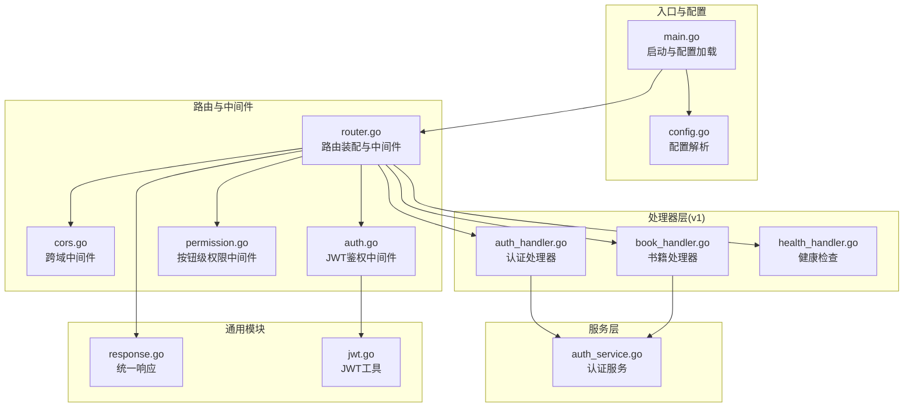
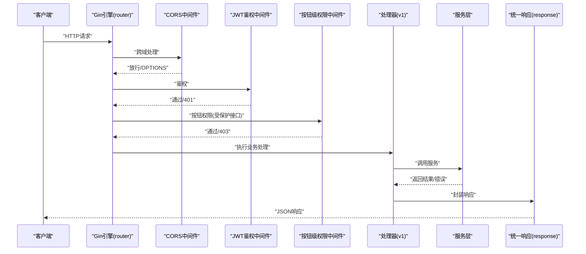
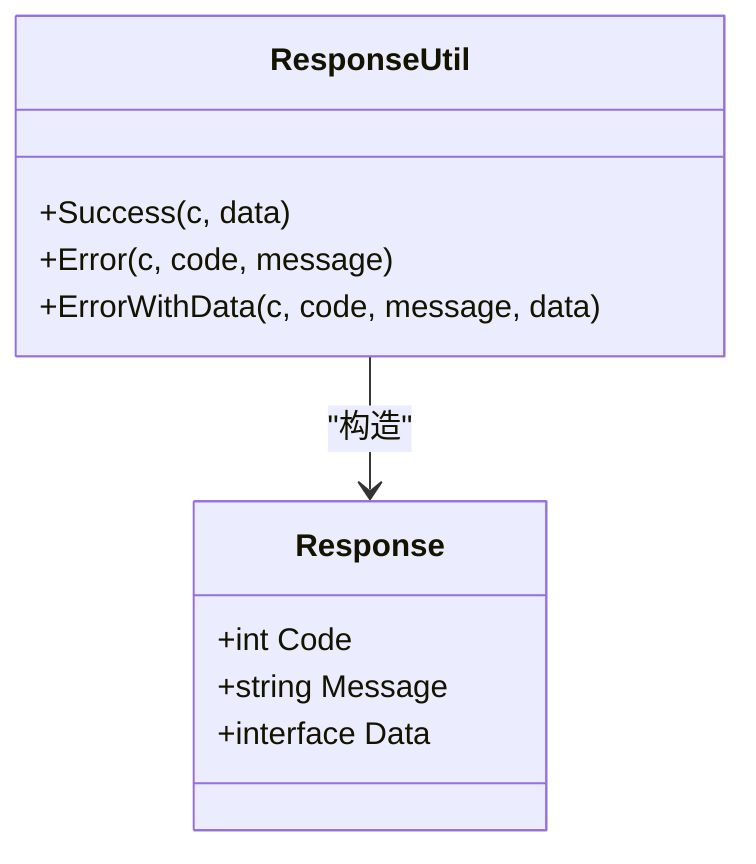
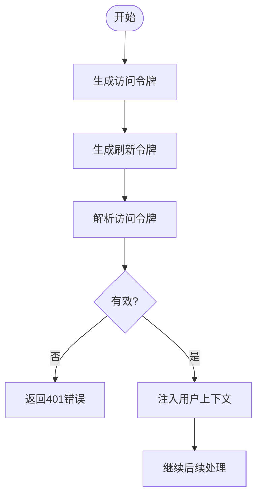
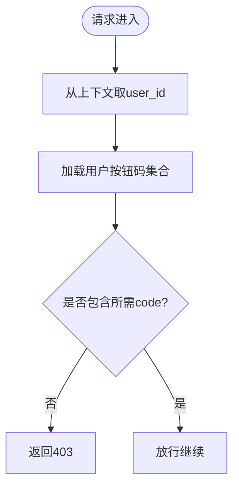
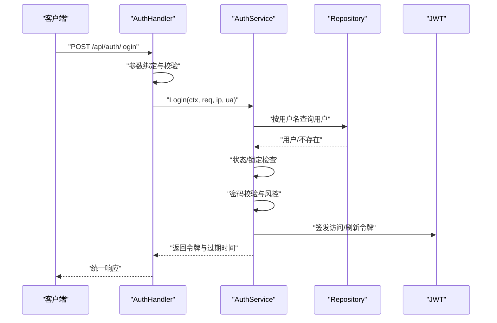
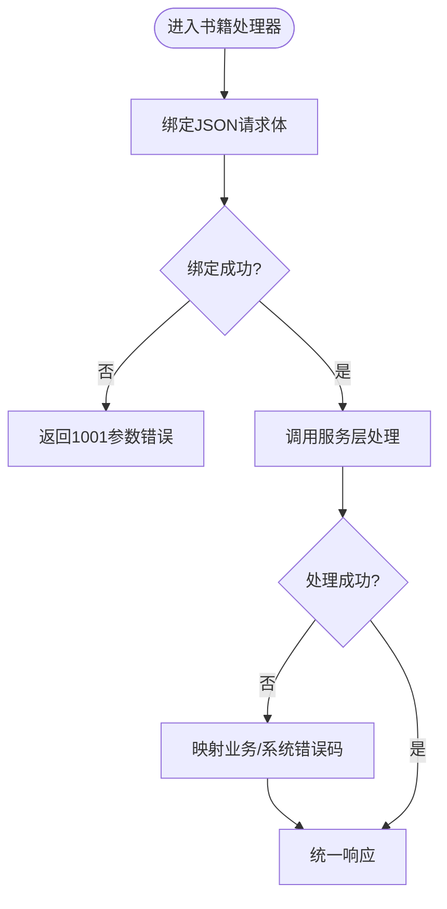
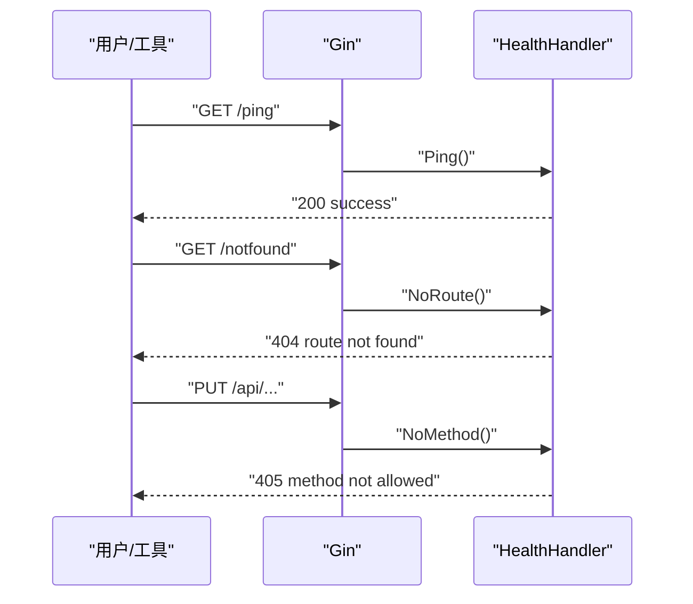
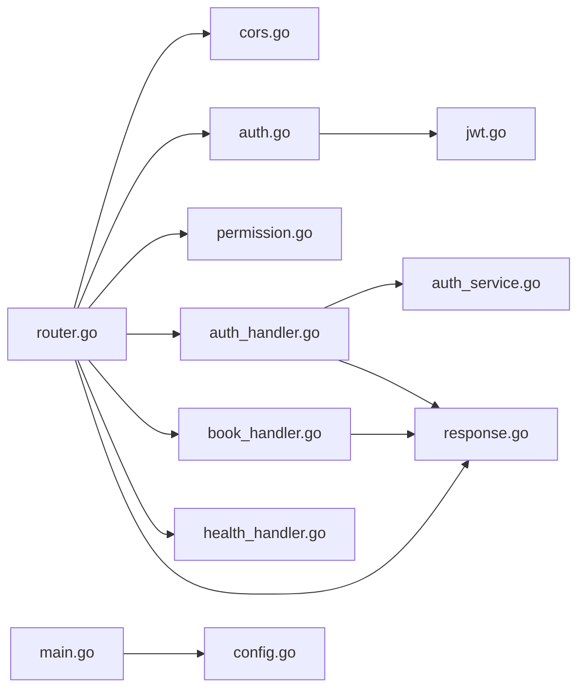

# API接口问题

<cite>
**本文引用的文件**
- [main.go](file://app/server/cmd/api/main.go)
- [router.go](file://app/server/internal/router/router.go)
- [response.go](file://app/server/pkg/response/response.go)
- [jwt.go](file://app/server/pkg/jwt/jwt.go)
- [auth.go](file://app/server/internal/middleware/auth.go)
- [cors.go](file://app/server/internal/middleware/cors.go)
- [permission.go](file://app/server/internal/middleware/permission.go)
- [auth_handler.go](file://app/server/internal/handler/v1/auth.go)
- [book_handler.go](file://app/server/internal/handler/v1/book.go)
- [auth_service.go](file://app/server/internal/service/auth.go)
- [config.go](file://app/server/pkg/config/config.go)
- [auth_dto.go](file://app/server/internal/dto/auth.go)
- [common_dto.go](file://app/server/internal/dto/common.go)
- [health_handler.go](file://app/server/internal/handler/v1/health.go)
</cite>

## 目录
1. [简介](#简介)
2. [项目结构](#项目结构)
3. [核心组件](#核心组件)
4. [架构总览](#架构总览)
5. [详细组件分析](#详细组件分析)
6. [依赖分析](#依赖分析)
7. [性能考虑](#性能考虑)
8. [故障排除指南](#故障排除指南)
9. [结论](#结论)
10. [附录](#附录)

## 简介
本指南聚焦于boread项目的API接口问题排查与调试，覆盖以下主题：
- HTTP状态码异常：404未找到、500服务器错误、401认证失败、403权限拒绝
- 请求参数错误：参数类型不符、必填字段缺失、格式验证失败
- 响应数据异常：数据格式错误、业务逻辑异常、空数据返回
- API调试工具使用、请求响应抓包分析、接口测试最佳实践
- 跨域问题解决、JWT令牌处理、接口限流配置
- API版本管理与向后兼容性策略

## 项目结构
后端基于Go + Gin框架，采用分层架构：路由层、中间件层、处理器层、服务层、仓储层、模型层；统一响应封装；Swagger文档集成；JWT鉴权与按钮级权限控制。

图表来源
- [main.go:30-84](file://app/server/cmd/api/main.go#L30-L84)
- [router.go:20-205](file://app/server/internal/router/router.go#L20-L205)
- [cors.go:9-23](file://app/server/internal/middleware/cors.go#L9-L23)
- [auth.go:13-40](file://app/server/internal/middleware/auth.go#L13-L40)
- [permission.go:20-52](file://app/server/internal/middleware/permission.go#L20-L52)
- [auth_handler.go:31-56](file://app/server/internal/handler/v1/auth.go#L31-L56)
- [book_handler.go:31-43](file://app/server/internal/handler/v1/book.go#L31-L43)
- [health_handler.go:23-33](file://app/server/internal/handler/v1/health.go#L23-L33)
- [auth_service.go:42-95](file://app/server/internal/service/auth.go#L42-L95)
- [response.go:15-37](file://app/server/pkg/response/response.go#L15-L37)
- [jwt.go:24-38](file://app/server/pkg/jwt/jwt.go#L24-L38)

章节来源
- [main.go:30-84](file://app/server/cmd/api/main.go#L30-L84)
- [router.go:20-205](file://app/server/internal/router/router.go#L20-L205)

## 核心组件
- 统一响应封装：统一的响应结构与错误码映射，便于前端一致处理。
- JWT鉴权：解析Authorization头中的Bearer Token，校验有效性并注入用户上下文。
- 按钮级权限：基于用户角色聚合的按钮码集合进行细粒度授权。
- 跨域支持：允许指定头部与方法，简化前后端联调。
- 健康检查与路由兜底：提供/ping与404/405兜底处理。

章节来源
- [response.go:9-37](file://app/server/pkg/response/response.go#L9-L37)
- [jwt.go:10-71](file://app/server/pkg/jwt/jwt.go#L10-L71)
- [auth.go:13-40](file://app/server/internal/middleware/auth.go#L13-L40)
- [permission.go:20-52](file://app/server/internal/middleware/permission.go#L20-L52)
- [cors.go:9-23](file://app/server/internal/middleware/cors.go#L9-L23)
- [health_handler.go:23-33](file://app/server/internal/handler/v1/health.go#L23-L33)

## 架构总览
下图展示从客户端到数据库的关键调用链路与错误处理位置。

图表来源
- [router.go:20-205](file://app/server/internal/router/router.go#L20-L205)
- [cors.go:9-23](file://app/server/internal/middleware/cors.go#L9-L23)
- [auth.go:13-40](file://app/server/internal/middleware/auth.go#L13-L40)
- [permission.go:20-52](file://app/server/internal/middleware/permission.go#L20-L52)
- [response.go:15-37](file://app/server/pkg/response/response.go#L15-L37)

## 详细组件分析

### 统一响应与错误码
- 成功响应：固定结构包含code/message/data，code为0表示成功。
- 错误响应：统一返回code/message，部分场景携带data用于辅助定位。
- 错误码设计：业务错误与系统错误分离，便于前端分类处理。

图表来源
- [response.go:9-37](file://app/server/pkg/response/response.go#L9-L37)

章节来源
- [response.go:9-37](file://app/server/pkg/response/response.go#L9-L37)

### JWT令牌处理
- 令牌签发：基于用户ID与用户名，设置签发时间与过期时间。
- 刷新令牌：过期时间是普通令牌的两倍，便于无感续期。
- 令牌解析：校验签名与有效期，失败时返回401类错误。

图表来源
- [jwt.go:24-55](file://app/server/pkg/jwt/jwt.go#L24-L55)
- [auth.go:29-34](file://app/server/internal/middleware/auth.go#L29-L34)

章节来源
- [jwt.go:10-71](file://app/server/pkg/jwt/jwt.go#L10-L71)
- [auth.go:13-40](file://app/server/internal/middleware/auth.go#L13-L40)

### 按钮级权限控制
- 权限来源：根据用户角色聚合按钮码集合。
- 校验流程：请求进入受保护路由后，从上下文取出user_id，查询按钮码集合，匹配目标code。
- 性能提示：当前为每次请求查库，建议在高并发场景引入缓存。

图表来源
- [permission.go:20-52](file://app/server/internal/middleware/permission.go#L20-L52)
- [auth_service.go:127-134](file://app/server/internal/service/auth.go#L127-L134)

章节来源
- [permission.go:20-52](file://app/server/internal/middleware/permission.go#L20-L52)
- [auth_service.go:127-134](file://app/server/internal/service/auth.go#L127-L134)

### 认证与登录流程
- 登录参数校验：用户名、密码长度与必填约束。
- 登录风控：失败次数累计与临时锁定。
- 登录日志：记录成功/失败原因，便于审计与排障。

图表来源
- [auth_handler.go:31-56](file://app/server/internal/handler/v1/auth.go#L31-L56)
- [auth_service.go:42-95](file://app/server/internal/service/auth.go#L42-L95)
- [auth_dto.go:4-7](file://app/server/internal/dto/auth.go#L4-L7)

章节来源
- [auth_handler.go:31-56](file://app/server/internal/handler/v1/auth.go#L31-L56)
- [auth_service.go:42-95](file://app/server/internal/service/auth.go#L42-L95)
- [auth_dto.go:4-7](file://app/server/internal/dto/auth.go#L4-L7)

### 书籍接口与参数校验
- 参数绑定：使用ShouldBindJSON进行结构化校验，失败返回1001类错误。
- 路径参数：使用工具函数解析并校验ID类型。
- 业务错误映射：将服务层特定错误映射为业务错误码，便于前端识别。

图表来源
- [book_handler.go:54-66](file://app/server/internal/handler/v1/book.go#L54-L66)
- [book_handler.go:169-179](file://app/server/internal/handler/v1/book.go#L169-L179)

章节来源
- [book_handler.go:31-43](file://app/server/internal/handler/v1/book.go#L31-L43)
- [book_handler.go:54-66](file://app/server/internal/handler/v1/book.go#L54-L66)
- [book_handler.go:118-139](file://app/server/internal/handler/v1/book.go#L118-L139)
- [book_handler.go:169-179](file://app/server/internal/handler/v1/book.go#L169-L179)

### 路由与健康检查
- 健康检查：/ping返回“ok”，未命中路由返回404，不支持的方法返回405。
- Swagger：/swagger/*any提供在线文档。

图表来源
- [health_handler.go:23-33](file://app/server/internal/handler/v1/health.go#L23-L33)
- [router.go:26-33](file://app/server/internal/router/router.go#L26-L33)

章节来源
- [health_handler.go:23-33](file://app/server/internal/handler/v1/health.go#L23-L33)
- [router.go:26-33](file://app/server/internal/router/router.go#L26-L33)

## 依赖分析
- 路由装配：集中注册公开、登录态、受保护管理接口，并串联中间件。
- 中间件耦合：鉴权中间件依赖JWT解析；按钮级权限依赖AuthService加载按钮码。
- DTO约束：请求DTO定义了必填与长度约束，处理器侧直接使用Gin的绑定器进行校验。
- 配置驱动：服务器端口、JWT密钥与过期时间、日志级别与文件路径均来自配置文件。

图表来源
- [router.go:20-205](file://app/server/internal/router/router.go#L20-L205)
- [auth.go:13-40](file://app/server/internal/middleware/auth.go#L13-L40)
- [permission.go:20-52](file://app/server/internal/middleware/permission.go#L20-L52)
- [auth_handler.go:31-56](file://app/server/internal/handler/v1/auth.go#L31-L56)
- [book_handler.go:31-43](file://app/server/internal/handler/v1/book.go#L31-L43)
- [health_handler.go:23-33](file://app/server/internal/handler/v1/health.go#L23-L33)
- [auth_service.go:42-95](file://app/server/internal/service/auth.go#L42-L95)
- [jwt.go:24-38](file://app/server/pkg/jwt/jwt.go#L24-L38)
- [response.go:15-37](file://app/server/pkg/response/response.go#L15-L37)
- [main.go:34-42](file://app/server/cmd/api/main.go#L34-L42)
- [config.go:58-66](file://app/server/pkg/config/config.go#L58-L66)

章节来源
- [router.go:20-205](file://app/server/internal/router/router.go#L20-L205)
- [main.go:34-42](file://app/server/cmd/api/main.go#L34-L42)
- [config.go:58-66](file://app/server/pkg/config/config.go#L58-L66)

## 性能考虑
- 按钮级权限：当前每次请求查询数据库，建议引入缓存（如sync.Map或Redis）降低DB压力。
- 日志与数据库连接池：合理设置最大空闲/活跃连接数，避免连接抖动。
- JWT过期策略：短令牌+刷新令牌组合，减少长期持有风险并提升安全性。

## 故障排除指南

### HTTP状态码异常
- 404未找到
  - 现象：访问不存在的路由返回404。
  - 排查：确认路由是否正确注册；检查Swagger路径与实际路由一致性。
  - 参考
    - [health_handler.go:27-29](file://app/server/internal/handler/v1/health.go#L27-L29)
    - [router.go:26-33](file://app/server/internal/router/router.go#L26-L33)
- 500服务器错误
  - 现象：内部错误或服务不可用。
  - 排查：查看服务启动日志；检查数据库连接与配置；确认中间件链路是否中断。
  - 参考
    - [main.go:78-83](file://app/server/cmd/api/main.go#L78-L83)
    - [router.go:20-24](file://app/server/internal/router/router.go#L20-L24)
- 401认证失败
  - 现象：缺少或无效的Authorization头；令牌过期或签名不合法。
  - 排查：确认请求头格式为“Bearer {token}”；核对JWT密钥与过期时间；检查令牌是否被篡改。
  - 参考
    - [auth.go:15-27](file://app/server/internal/middleware/auth.go#L15-L27)
    - [auth.go:29-34](file://app/server/internal/middleware/auth.go#L29-L34)
    - [jwt.go:57-71](file://app/server/pkg/jwt/jwt.go#L57-L71)
- 403权限拒绝
  - 现象：用户具备登录态但缺乏按钮级权限。
  - 排查：确认用户角色与按钮码集合；检查RequireButton中间件是否正确注入user_id；核对所需code是否在集合中。
  - 参考
    - [permission.go:20-52](file://app/server/internal/middleware/permission.go#L20-L52)
    - [auth_service.go:127-134](file://app/server/internal/service/auth.go#L127-L134)

章节来源
- [health_handler.go:27-29](file://app/server/internal/handler/v1/health.go#L27-L29)
- [router.go:20-24](file://app/server/internal/router/router.go#L20-L24)
- [auth.go:15-27](file://app/server/internal/middleware/auth.go#L15-L27)
- [auth.go:29-34](file://app/server/internal/middleware/auth.go#L29-L34)
- [jwt.go:57-71](file://app/server/pkg/jwt/jwt.go#L57-L71)
- [permission.go:20-52](file://app/server/internal/middleware/permission.go#L20-L52)
- [auth_service.go:127-134](file://app/server/internal/service/auth.go#L127-L134)

### 请求参数错误
- 参数类型不符
  - 现象：路径参数或JSON字段类型不匹配。
  - 排查：检查处理器中参数解析逻辑；确认DTO字段类型与前端传参一致。
  - 参考
    - [book_handler.go:32](file://app/server/internal/handler/v1/book.go#L32)
    - [book_handler.go:79](file://app/server/internal/handler/v1/book.go#L79)
- 必填字段缺失
  - 现象：绑定失败返回1001错误。
  - 排查：核对DTO的binding标签；确保必填字段均存在且满足长度限制。
  - 参考
    - [auth_dto.go:4-7](file://app/server/internal/dto/auth.go#L4-L7)
    - [book_handler.go:56](file://app/server/internal/handler/v1/book.go#L56)
- 格式验证失败
  - 现象：字段格式不符合约束（如邮箱、手机号等）。
  - 排查：扩展DTO绑定规则；在处理器侧补充自定义校验。
  - 参考
    - [auth_dto.go:4-7](file://app/server/internal/dto/auth.go#L4-L7)
    - [common_dto.go:4-8](file://app/server/internal/dto/common.go#L4-L8)

章节来源
- [book_handler.go:32](file://app/server/internal/handler/v1/book.go#L32)
- [book_handler.go:56](file://app/server/internal/handler/v1/book.go#L56)
- [auth_dto.go:4-7](file://app/server/internal/dto/auth.go#L4-L7)
- [common_dto.go:4-8](file://app/server/internal/dto/common.go#L4-L8)

### 响应数据异常
- 数据格式错误
  - 现象：统一响应结构不匹配或字段缺失。
  - 排查：确认response封装是否正确；核对DTO与前端约定的数据结构。
  - 参考
    - [response.go:15-37](file://app/server/pkg/response/response.go#L15-L37)
    - [auth_dto.go:9-23](file://app/server/internal/dto/auth.go#L9-L23)
- 业务逻辑异常
  - 现象：业务错误码映射不当导致前端无法识别。
  - 排查：检查处理器中的错误映射函数；确保业务错误与系统错误区分明确。
  - 参考
    - [book_handler.go:169-179](file://app/server/internal/handler/v1/book.go#L169-L179)
- 空数据返回
  - 现象：查询结果为空或服务层返回nil。
  - 排查：确认分页/查询条件；在处理器侧对空结果进行显式处理与提示。

章节来源
- [response.go:15-37](file://app/server/pkg/response/response.go#L15-L37)
- [auth_dto.go:9-23](file://app/server/internal/dto/auth.go#L9-L23)
- [book_handler.go:169-179](file://app/server/internal/handler/v1/book.go#L169-L179)

### API调试工具与抓包分析
- Swagger在线文档：访问/swagger/*any查看接口定义与示例。
- 抓包工具：使用浏览器开发者工具或Postman，观察请求头Authorization格式、响应体结构与状态码。
- 关键字段核对：确保Content-Type为application/json；Authorization为Bearer {token}。

章节来源
- [router.go:32-33](file://app/server/internal/router/router.go#L32-L33)

### 接口测试最佳实践
- 登录与鉴权：先登录获取令牌，再携带令牌访问受保护接口。
- 参数校验：覆盖必填、类型、边界值与非法格式场景。
- 权限测试：使用不同角色用户验证按钮级权限。
- 异常分支：模拟网络异常、数据库异常、令牌过期等场景。

### 跨域问题解决
- 现象：前端请求报跨域错误。
- 排查：确认CORS中间件已启用；核对允许的Origin/Headers/Methods；预检请求OPTIONS是否返回204。
- 参考
  - [cors.go:9-23](file://app/server/internal/middleware/cors.go#L9-L23)
  - [router.go:22](file://app/server/internal/router/router.go#L22)

章节来源
- [cors.go:9-23](file://app/server/internal/middleware/cors.go#L9-L23)
- [router.go:22](file://app/server/internal/router/router.go#L22)

### JWT令牌处理
- 令牌签发与刷新：检查密钥与过期时间配置；确认刷新令牌过期时间是访问令牌的两倍。
- 令牌解析：核对签名算法与密钥；确保未过期且格式正确。
- 参考
  - [jwt.go:19-22](file://app/server/pkg/jwt/jwt.go#L19-L22)
  - [jwt.go:24-55](file://app/server/pkg/jwt/jwt.go#L24-L55)
  - [auth.go:29-34](file://app/server/internal/middleware/auth.go#L29-L34)

章节来源
- [jwt.go:19-22](file://app/server/pkg/jwt/jwt.go#L19-L22)
- [jwt.go:24-55](file://app/server/pkg/jwt/jwt.go#L24-L55)
- [auth.go:29-34](file://app/server/internal/middleware/auth.go#L29-L34)

### 接口限流配置
- 当前实现：未发现内置限流中间件。
- 建议方案：在路由层或网关层增加限流策略（如基于IP或用户ID），防止恶意刷接口。

### API版本管理与向后兼容
- 版本命名：当前路由以/v1命名空间隔离，便于后续演进。
- 兼容策略：新增接口优先在新版本暴露；旧接口保持语义不变，必要时添加新字段并保持默认值。
- 迁移路径：逐步引导前端切换至新版本，保留过渡期的双版本支持。

章节来源
- [router.go:78-201](file://app/server/internal/router/router.go#L78-L201)

## 结论
本指南从架构、组件与错误处理三个维度梳理了boread的API问题排查路径。建议在生产环境中完善按钮级权限缓存、接入限流与监控告警，并持续优化JWT与跨域策略，确保接口稳定、安全与易维护。

## 附录
- 配置文件加载：确认配置项server.port、jwt.secret、jwt.expire、log.level、log.file完整且有效。
- 数据库连接：检查连接字符串与连接池参数，避免连接泄漏或抖动。

章节来源
- [config.go:58-66](file://app/server/pkg/config/config.go#L58-L66)
- [main.go:44-65](file://app/server/cmd/api/main.go#L44-L65)