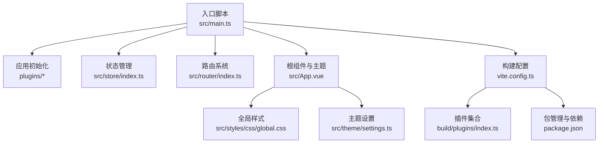
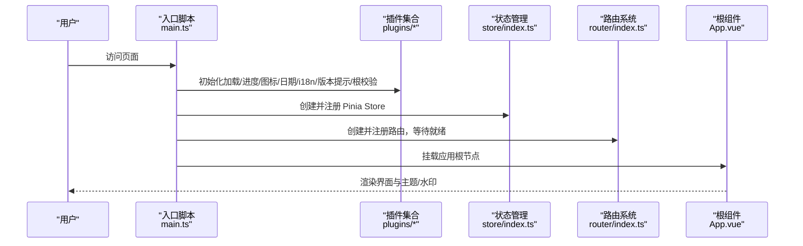
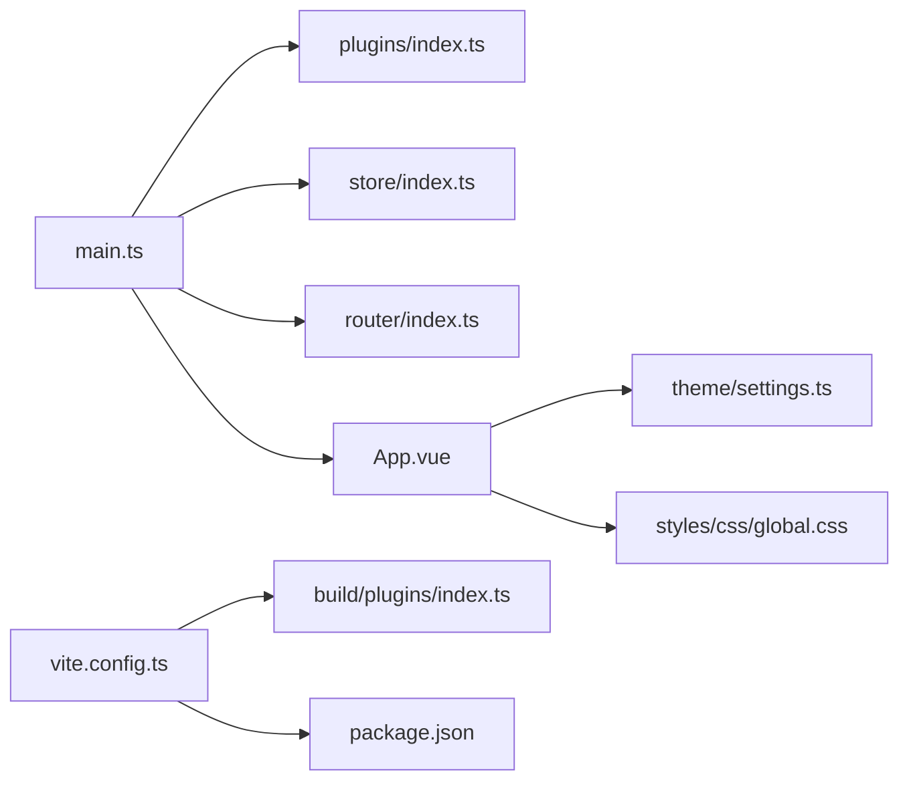

# 前端问题

<cite>
**本文引用的文件**
- [vite.config.ts](file://app/web/vite.config.ts)
- [package.json](file://app/web/package.json)
- [main.ts](file://app/web/src/main.ts)
- [router/index.ts](file://app/web/src/router/index.ts)
- [store/index.ts](file://app/web/src/store/index.ts)
- [App.vue](file://app/web/src/App.vue)
- [plugins/index.ts](file://app/web/src/plugins/index.ts)
- [styles/css/global.css](file://app/web/src/styles/css/global.css)
- [theme/settings.ts](file://app/web/src/theme/settings.ts)
- [build/plugins/index.ts](file://app/web/build/plugins/index.ts)
- [utils/common.ts](file://app/web/src/utils/common.ts)
- [constants/app.ts](file://app/web/src/constants/app.ts)
- [plugins/app.ts](file://app/web/src/plugins/app.ts)
- [router/elegant/transform.ts](file://app/web/src/router/elegant/transform.ts)
</cite>

## 目录
1. [简介](#简介)
2. [项目结构](#项目结构)
3. [核心组件](#核心组件)
4. [架构总览](#架构总览)
5. [详细组件分析](#详细组件分析)
6. [依赖关系分析](#依赖关系分析)
7. [性能考虑](#性能考虑)
8. [故障排除指南](#故障排除指南)
9. [结论](#结论)
10. [附录](#附录)

## 简介
本指南聚焦于 boread 项目前端常见问题的系统化排查与解决，覆盖页面加载失败、样式显示异常、交互功能异常、打包构建问题、性能优化以及跨浏览器与移动端适配等场景。文档以仓库中的实际源码为依据，结合开发工具与调试方法，帮助开发者快速定位并解决问题。

## 项目结构
前端位于 app/web 目录，采用 Vite + Vue3 + TypeScript + Pinia + NaiveUI 技术栈，通过插件体系集成 UnoCSS、路由转换、图标离线、进度条、开发工具等能力；主题与全局样式通过统一入口管理；国际化、水印、暗色模式等在应用根组件集中配置。

图表来源
- [main.ts:1-37](file://app/web/src/main.ts#L1-L37)
- [store/index.ts:1-13](file://app/web/src/store/index.ts#L1-L13)
- [router/index.ts:1-31](file://app/web/src/router/index.ts#L1-L31)
- [App.vue:1-59](file://app/web/src/App.vue#L1-L59)
- [styles/css/global.css:1-16](file://app/web/src/styles/css/global.css#L1-L16)
- [theme/settings.ts:1-97](file://app/web/src/theme/settings.ts#L1-L97)
- [vite.config.ts:1-52](file://app/web/vite.config.ts#L1-L52)
- [build/plugins/index.ts:1-27](file://app/web/build/plugins/index.ts#L1-L27)
- [package.json:1-108](file://app/web/package.json#L1-L108)

章节来源
- [main.ts:1-37](file://app/web/src/main.ts#L1-L37)
- [vite.config.ts:1-52](file://app/web/vite.config.ts#L1-L52)
- [package.json:1-108](file://app/web/package.json#L1-L108)

## 核心组件
- 应用启动流程：在入口脚本中按序注册加载项（加载动画、进度条、离线图标、日期库、i18n、版本提示、根组件校验），随后挂载应用。
- 路由系统：根据环境变量选择历史模式（hash/history/memory），并注入内置路由与守卫。
- 状态管理：使用 Pinia 创建 Store，并注册重置插件。
- 根组件：统一 NaiveUI 的主题、语言、水印等配置，作为全局容器。
- 构建与插件：Vite 插件链包括 Vue、JSX、Elegant Router、UnoCSS、Unplugin、进度条、HTML 注入、根组件校验等。

章节来源
- [main.ts:10-34](file://app/web/src/main.ts#L10-L34)
- [router/index.ts:12-30](file://app/web/src/router/index.ts#L12-L30)
- [store/index.ts:5-12](file://app/web/src/store/index.ts#L5-L12)
- [App.vue:13-40](file://app/web/src/App.vue#L13-L40)
- [build/plugins/index.ts:12-26](file://app/web/build/plugins/index.ts#L12-L26)

## 架构总览
下图展示从启动到运行的关键调用链与模块关系：

图表来源
- [main.ts:10-34](file://app/web/src/main.ts#L10-L34)
- [store/index.ts:5-12](file://app/web/src/store/index.ts#L5-L12)
- [router/index.ts:25-30](file://app/web/src/router/index.ts#L25-L30)
- [App.vue:43-56](file://app/web/src/App.vue#L43-L56)

## 详细组件分析

### 页面加载失败排查
常见症状：白屏、资源 404、路由不跳转、组件未渲染。
- 资源文件缺失
  - 检查构建别名与基础路径：确认别名与基础路径是否正确，避免静态资源与 HTML 引用路径不一致。
  - 参考：[vite.config.ts:14-21](file://app/web/vite.config.ts#L14-L21)，[vite.config.ts:15](file://app/web/vite.config.ts#L15)
- 路由配置错误
  - 检查路由历史模式与基础路径：确保环境变量与部署路径匹配。
  - 参考：[router/index.ts:12-23](file://app/web/src/router/index.ts#L12-L23)
  - 路由转换阶段的组件查找：若布局或视图组件名称错误会抛出异常。
  - 参考：[router/elegant/transform.ts:47](file://app/web/src/router/elegant/transform.ts#L47)，[router/elegant/transform.ts:61](file://app/web/src/router/elegant/transform.ts#L61)
- 组件渲染异常
  - 根组件集中配置主题、语言、水印，若某一项计算属性异常会导致渲染失败。
  - 参考：[App.vue:16-40](file://app/web/src/App.vue#L16-L40)

章节来源
- [vite.config.ts:14-21](file://app/web/vite.config.ts#L14-L21)
- [router/index.ts:12-23](file://app/web/src/router/index.ts#L12-L23)
- [router/elegant/transform.ts:47](file://app/web/src/router/elegant/transform.ts#L47)
- [router/elegant/transform.ts:61](file://app/web/src/router/elegant/transform.ts#L61)
- [App.vue:16-40](file://app/web/src/App.vue#L16-L40)

### 样式显示问题排查
常见症状：CSS 冲突、主题切换无效、响应式布局异常。
- CSS 冲突
  - 全局样式引入顺序与作用域：检查全局样式与组件 scoped 的优先级。
  - 参考：[styles/css/global.css:1-3](file://app/web/src/styles/css/global.css#L1-L3)
- 主题切换异常
  - 主题设置与暗色类名：确认主题开关与暗色类名同步，以及 NaiveUI 主题覆盖生效。
  - 参考：[constants/app.ts:61](file://app/web/src/constants/app.ts#L61)，[App.vue:16](file://app/web/src/App.vue#L16)
  - 主题默认值与覆盖：检查主题设置与覆盖对象。
  - 参考：[theme/settings.ts:1-97](file://app/web/src/theme/settings.ts#L1-L97)
- 响应式布局失效
  - UnoCSS 预处理器与全局 SCSS：确认现代编译 API 与全局 SCSS 注入。
  - 参考：[vite.config.ts:22-28](file://app/web/vite.config.ts#L22-L28)

章节来源
- [styles/css/global.css:1-3](file://app/web/src/styles/css/global.css#L1-L3)
- [constants/app.ts:61](file://app/web/src/constants/app.ts#L61)
- [App.vue:16](file://app/web/src/App.vue#L16)
- [theme/settings.ts:1-97](file://app/web/src/theme/settings.ts#L1-L97)
- [vite.config.ts:22-28](file://app/web/vite.config.ts#L22-L28)

### 交互功能异常排查
常见症状：事件绑定错误、状态管理问题、数据绑定失效。
- 事件绑定错误
  - 使用工具函数切换 HTML 类名时需确保元素存在，避免 DOM 操作异常。
  - 参考：[utils/common.ts:45-58](file://app/web/src/utils/common.ts#L45-L58)
- 状态管理问题
  - Pinia Store 初始化与重置插件：确认 Store 已注册且无循环依赖。
  - 参考：[store/index.ts:5-12](file://app/web/src/store/index.ts#L5-L12)
- 数据绑定失效
  - i18n 选项转换与翻译：确保选项键与翻译键一致。
  - 参考：[utils/common.ts:21-38](file://app/web/src/utils/common.ts#L21-L38)

章节来源
- [utils/common.ts:45-58](file://app/web/src/utils/common.ts#L45-L58)
- [store/index.ts:5-12](file://app/web/src/store/index.ts#L5-L12)
- [utils/common.ts:21-38](file://app/web/src/utils/common.ts#L21-L38)

### 打包构建问题排查
常见症状：依赖冲突、代码分割异常、静态资源处理失败。
- 依赖冲突
  - 核对依赖版本与引擎要求，确保 Node/PNPM 版本满足要求。
  - 参考：[package.json:102-105](file://app/web/package.json#L102-L105)
- 代码分割异常
  - 构建配置中的 sourcemap 与压缩报告：按需开启 sourcemap 便于定位。
  - 参考：[vite.config.ts:43-49](file://app/web/vite.config.ts#L43-L49)
- 静态资源处理
  - 别名与基础路径：确保资源引用与部署路径一致。
  - 参考：[vite.config.ts:14-21](file://app/web/vite.config.ts#L14-L21)，[vite.config.ts:15](file://app/web/vite.config.ts#L15)

章节来源
- [package.json:102-105](file://app/web/package.json#L102-L105)
- [vite.config.ts:43-49](file://app/web/vite.config.ts#L43-L49)
- [vite.config.ts:14-21](file://app/web/vite.config.ts#L14-L21)
- [vite.config.ts:15](file://app/web/vite.config.ts#L15)

### 性能优化问题排查
常见症状：首屏加载慢、内存泄漏、重绘重排。
- 首屏加载慢
  - 关闭压缩体积报告，启用必要时的 sourcemap，减少不必要的插件开销。
  - 参考：[vite.config.ts:44](file://app/web/vite.config.ts#L44)，[vite.config.ts:45](file://app/web/vite.config.ts#L45)
- 内存泄漏
  - 在插件层捕获异常并记录，避免未处理异常导致的内存占用。
  - 参考：[plugins/app.ts:8](file://app/web/src/plugins/app.ts#L8)，[plugins/app.ts:103-104](file://app/web/src/plugins/app.ts#L103-L104)
- 重绘重排
  - 合理使用主题与水印，避免频繁大尺寸水印导致的重绘压力。
  - 参考：[App.vue:26-40](file://app/web/src/App.vue#L26-L40)

章节来源
- [vite.config.ts:44](file://app/web/vite.config.ts#L44)
- [vite.config.ts:45](file://app/web/vite.config.ts#L45)
- [plugins/app.ts:8](file://app/web/src/plugins/app.ts#L8)
- [plugins/app.ts:103-104](file://app/web/src/plugins/app.ts#L103-L104)
- [App.vue:26-40](file://app/web/src/App.vue#L26-L40)

### 浏览器兼容性与移动端适配
- 浏览器兼容性
  - 确保目标浏览器支持 ES 模块与现代语法，关注依赖库的浏览器支持范围。
  - 参考：[package.json:69-96](file://app/web/package.json#L69-L96)
- 移动端适配
  - UnoCSS 与全局样式：通过原子化样式与全局样式适配移动端断点与交互。
  - 参考：[vite.config.ts:22-28](file://app/web/vite.config.ts#L22-L28)，[styles/css/global.css:5-16](file://app/web/src/styles/css/global.css#L5-L16)

章节来源
- [package.json:69-96](file://app/web/package.json#L69-L96)
- [vite.config.ts:22-28](file://app/web/vite.config.ts#L22-L28)
- [styles/css/global.css:5-16](file://app/web/src/styles/css/global.css#L5-L16)

## 依赖关系分析
- 入口脚本依赖插件集合、状态管理、路由系统与根组件。
- 构建配置依赖插件集合与包管理信息。
- 路由系统依赖环境变量与内置路由生成。
- 根组件依赖主题设置与全局样式。

图表来源
- [main.ts:1-37](file://app/web/src/main.ts#L1-L37)
- [plugins/index.ts:1-6](file://app/web/src/plugins/index.ts#L1-L6)
- [store/index.ts:1-13](file://app/web/src/store/index.ts#L1-L13)
- [router/index.ts:1-31](file://app/web/src/router/index.ts#L1-L31)
- [App.vue:1-59](file://app/web/src/App.vue#L1-L59)
- [theme/settings.ts:1-97](file://app/web/src/theme/settings.ts#L1-L97)
- [styles/css/global.css:1-16](file://app/web/src/styles/css/global.css#L1-L16)
- [vite.config.ts:1-52](file://app/web/vite.config.ts#L1-L52)
- [build/plugins/index.ts:1-27](file://app/web/build/plugins/index.ts#L1-L27)
- [package.json:1-108](file://app/web/package.json#L1-L108)

章节来源
- [main.ts:1-37](file://app/web/src/main.ts#L1-L37)
- [vite.config.ts:1-52](file://app/web/vite.config.ts#L1-L52)
- [package.json:1-108](file://app/web/package.json#L1-L108)

## 性能考虑
- 构建期优化
  - 按需开启 sourcemap 以便调试，关闭压缩体积报告以提升构建速度。
  - 参考：[vite.config.ts:44-45](file://app/web/vite.config.ts#L44-L45)
- 运行期优化
  - 合理使用水印与主题切换，避免频繁大尺寸渲染。
  - 参考：[App.vue:26-40](file://app/web/src/App.vue#L26-L40)
- 依赖与插件
  - 控制插件数量与体积，避免重复或冗余插件影响性能。
  - 参考：[build/plugins/index.ts:12-26](file://app/web/build/plugins/index.ts#L12-L26)

章节来源
- [vite.config.ts:44-45](file://app/web/vite.config.ts#L44-L45)
- [App.vue:26-40](file://app/web/src/App.vue#L26-L40)
- [build/plugins/index.ts:12-26](file://app/web/build/plugins/index.ts#L12-L26)

## 故障排除指南

### 浏览器开发者工具使用技巧
- 网络面板
  - 检查静态资源请求状态与路径，确认基础路径与别名配置一致。
  - 参考：[vite.config.ts:14-21](file://app/web/vite.config.ts#L14-L21)，[vite.config.ts:15](file://app/web/vite.config.ts#L15)
- 控制台
  - 查看路由转换异常与应用级错误日志，定位组件缺失或配置错误。
  - 参考：[router/elegant/transform.ts:47](file://app/web/src/router/elegant/transform.ts#L47)，[router/elegant/transform.ts:61](file://app/web/src/router/elegant/transform.ts#L61)，[plugins/app.ts:8](file://app/web/src/plugins/app.ts#L8)
- 性能面板
  - 分析首屏时间与重绘重排，评估水印与主题切换对性能的影响。
  - 参考：[App.vue:26-40](file://app/web/src/App.vue#L26-L40)

章节来源
- [vite.config.ts:14-21](file://app/web/vite.config.ts#L14-L21)
- [vite.config.ts:15](file://app/web/vite.config.ts#L15)
- [router/elegant/transform.ts:47](file://app/web/src/router/elegant/transform.ts#L47)
- [router/elegant/transform.ts:61](file://app/web/src/router/elegant/transform.ts#L61)
- [plugins/app.ts:8](file://app/web/src/plugins/app.ts#L8)
- [App.vue:26-40](file://app/web/src/App.vue#L26-L40)

### Vue 组件调试方法
- 根组件调试
  - 检查主题、语言与水印计算属性，确认 NaiveUI 主题覆盖生效。
  - 参考：[App.vue:16-40](file://app/web/src/App.vue#L16-L40)
- 插件调试
  - 在插件层增加日志与异常捕获，定位初始化阶段的问题。
  - 参考：[plugins/app.ts:8](file://app/web/src/plugins/app.ts#L8)，[plugins/app.ts:103-104](file://app/web/src/plugins/app.ts#L103-L104)

章节来源
- [App.vue:16-40](file://app/web/src/App.vue#L16-L40)
- [plugins/app.ts:8](file://app/web/src/plugins/app.ts#L8)
- [plugins/app.ts:103-104](file://app/web/src/plugins/app.ts#L103-L104)

### 状态管理追踪技术
- Store 初始化
  - 确认 Pinia 已正确注册并可访问各模块状态。
  - 参考：[store/index.ts:5-12](file://app/web/src/store/index.ts#L5-L12)
- 插件与重置
  - 若出现状态异常，检查重置插件是否触发。
  - 参考：[store/index.ts:9](file://app/web/src/store/index.ts#L9)

章节来源
- [store/index.ts:5-12](file://app/web/src/store/index.ts#L5-L12)
- [store/index.ts:9](file://app/web/src/store/index.ts#L9)

### 路由与导航问题
- 历史模式与基础路径
  - 确保环境变量与部署路径一致，避免路由跳转异常。
  - 参考：[router/index.ts:12-23](file://app/web/src/router/index.ts#L12-L23)
- 组件查找异常
  - 若布局或视图组件名称错误，转换阶段会抛出异常。
  - 参考：[router/elegant/transform.ts:47](file://app/web/src/router/elegant/transform.ts#L47)，[router/elegant/transform.ts:61](file://app/web/src/router/elegant/transform.ts#L61)

章节来源
- [router/index.ts:12-23](file://app/web/src/router/index.ts#L12-L23)
- [router/elegant/transform.ts:47](file://app/web/src/router/elegant/transform.ts#L47)
- [router/elegant/transform.ts:61](file://app/web/src/router/elegant/transform.ts#L61)

### 样式与主题问题
- CSS 冲突
  - 检查全局样式引入顺序与组件作用域，避免覆盖冲突。
  - 参考：[styles/css/global.css:1-3](file://app/web/src/styles/css/global.css#L1-L3)
- 主题切换
  - 确认暗色类名与主题设置同步，NaiveUI 主题覆盖生效。
  - 参考：[constants/app.ts:61](file://app/web/src/constants/app.ts#L61)，[App.vue:16](file://app/web/src/App.vue#L16)，[theme/settings.ts:1-97](file://app/web/src/theme/settings.ts#L1-L97)

章节来源
- [styles/css/global.css:1-3](file://app/web/src/styles/css/global.css#L1-L3)
- [constants/app.ts:61](file://app/web/src/constants/app.ts#L61)
- [App.vue:16](file://app/web/src/App.vue#L16)
- [theme/settings.ts:1-97](file://app/web/src/theme/settings.ts#L1-L97)

### 交互与数据绑定问题
- 事件绑定
  - 使用工具函数切换 HTML 类名时，确保元素存在，避免 DOM 操作异常。
  - 参考：[utils/common.ts:45-58](file://app/web/src/utils/common.ts#L45-L58)
- 数据绑定
  - 确保选项键与翻译键一致，避免显示异常。
  - 参考：[utils/common.ts:21-38](file://app/web/src/utils/common.ts#L21-L38)

章节来源
- [utils/common.ts:45-58](file://app/web/src/utils/common.ts#L45-L58)
- [utils/common.ts:21-38](file://app/web/src/utils/common.ts#L21-L38)

### 打包与构建问题
- 依赖与引擎
  - 确保 Node/PNPM 版本满足要求，避免构建失败。
  - 参考：[package.json:102-105](file://app/web/package.json#L102-L105)
- 构建配置
  - 按需开启 sourcemap，检查压缩报告与 CommonJS 选项。
  - 参考：[vite.config.ts:43-49](file://app/web/vite.config.ts#L43-L49)
- 资源路径
  - 确认别名与基础路径，避免静态资源引用错误。
  - 参考：[vite.config.ts:14-21](file://app/web/vite.config.ts#L14-L21)，[vite.config.ts:15](file://app/web/vite.config.ts#L15)

章节来源
- [package.json:102-105](file://app/web/package.json#L102-L105)
- [vite.config.ts:43-49](file://app/web/vite.config.ts#L43-L49)
- [vite.config.ts:14-21](file://app/web/vite.config.ts#L14-L21)
- [vite.config.ts:15](file://app/web/vite.config.ts#L15)

### 性能与兼容性问题
- 首屏与重绘
  - 关注水印与主题切换对性能的影响，必要时降低水印密度或禁用。
  - 参考：[App.vue:26-40](file://app/web/src/App.vue#L26-L40)
- 兼容性
  - 确保依赖库与浏览器兼容，关注引擎要求。
  - 参考：[package.json:69-96](file://app/web/package.json#L69-L96)，[package.json:102-105](file://app/web/package.json#L102-L105)

章节来源
- [App.vue:26-40](file://app/web/src/App.vue#L26-L40)
- [package.json:69-96](file://app/web/package.json#L69-L96)
- [package.json:102-105](file://app/web/package.json#L102-L105)

## 结论
本指南基于 boread 项目的实际源码，提供了从前端启动流程、路由与状态管理、样式与主题、到构建与性能优化的系统化故障排除方法。建议在开发与运维过程中结合浏览器开发者工具与日志输出，快速定位问题根因并实施针对性修复。

## 附录
- 快速检查清单
  - 资源路径与基础路径一致
  - 路由历史模式与部署路径匹配
  - 主题类名与暗色模式同步
  - 插件初始化无异常
  - 构建引擎版本满足要求
  - 水印与主题切换对性能影响可控