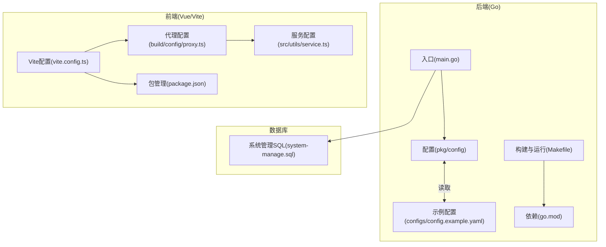
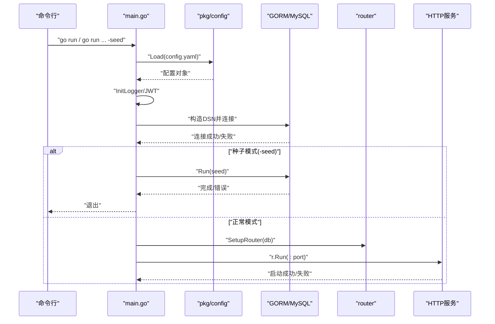
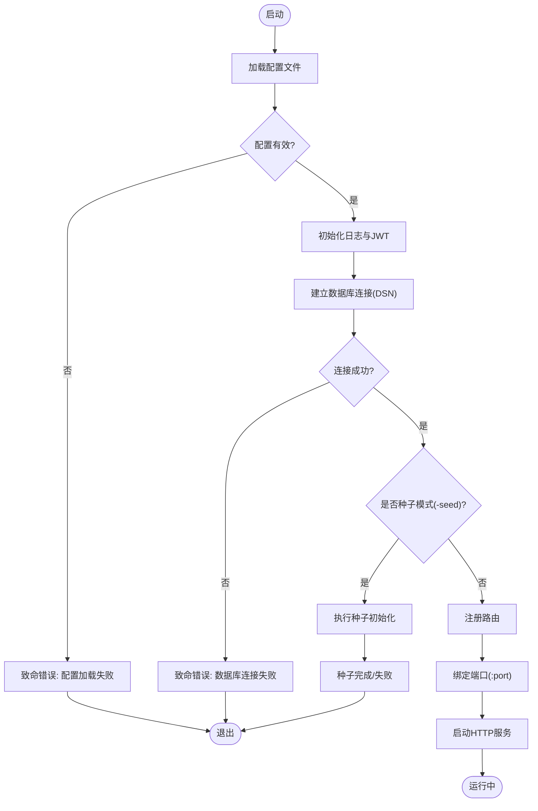
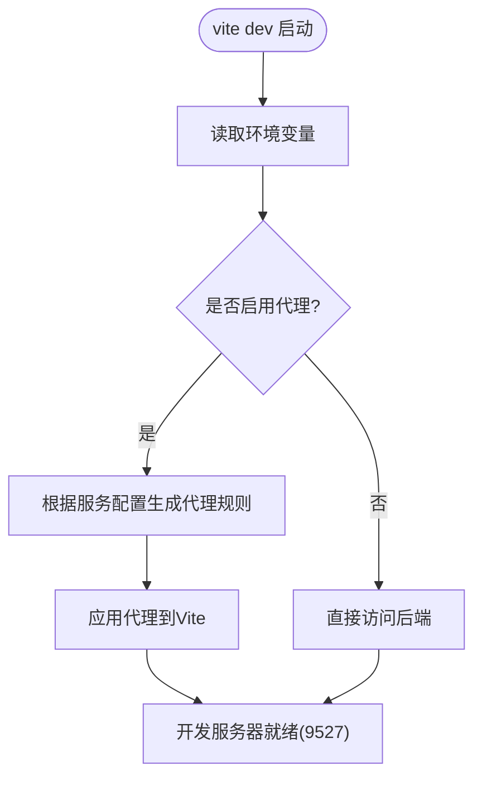
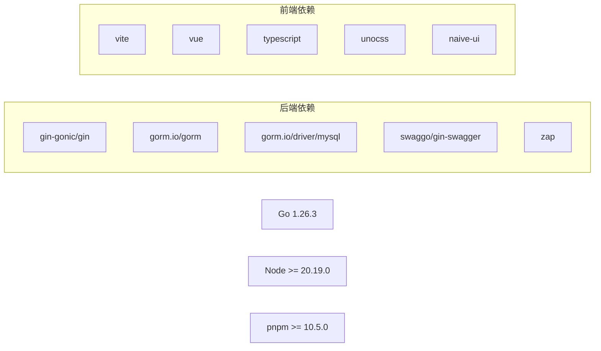

# 启动问题

<cite>
**本文引用的文件**
- [app\server\cmd\api\main.go](file://app/server/cmd/api/main.go)
- [app\server\pkg\config\config.go](file://app/server/pkg/config/config.go)
- [app\server\configs\config.example.yaml](file://app/server/configs/config.example.yaml)
- [app\server\Makefile](file://app/server/Makefile)
- [app\server\go.mod](file://app/server/go.mod)
- [app\web\vite.config.ts](file://app/web/vite.config.ts)
- [app\web\package.json](file://app/web/package.json)
- [app\web\build\config\proxy.ts](file://app/web/build/config/proxy.ts)
- [app\web\src\utils\service.ts](file://app/web/src/utils/service.ts)
- [app\sql\system-manage.sql](file://app/sql/system-manage.sql)
- [README.md](file://README.md)
</cite>

## 目录
1. [简介](#简介)
2. [项目结构](#项目结构)
3. [核心组件](#核心组件)
4. [架构总览](#架构总览)
5. [详细组件分析](#详细组件分析)
6. [依赖分析](#依赖分析)
7. [性能考虑](#性能考虑)
8. [故障排除指南](#故障排除指南)
9. [结论](#结论)
10. [附录](#附录)

## 简介
本指南聚焦于boread项目的启动问题排查，覆盖后端服务（Go）与前端开发服务器（Vite）的常见启动失败场景，包括但不限于端口占用、配置错误、依赖缺失、数据库连接失败、代理配置不当、环境变量不匹配等问题。文档提供可执行的检查清单、日志分析要点、错误信息识别方法，并给出针对不同操作系统的差异化处理建议。

## 项目结构
- 后端（Go）位于 app/server，采用模块化分层：入口程序、配置加载、路由、服务、中间件、模型与仓库等。
- 前端（Vue3 + Vite）位于 app/web，使用 Vite 开发服务器，默认监听 9527 端口；生产构建产物由后端提供静态资源或通过代理转发。
- 数据库初始化脚本位于 app/sql，包含系统管理与日志相关的表结构。

**图表来源**
- [app\server\cmd\api\main.go:1-85](file://app/server/cmd/api/main.go#L1-L85)
- [app\server\pkg\config\config.go:1-66](file://app/server/pkg/config/config.go#L1-L66)
- [app\server\configs\config.example.yaml:1-21](file://app/server/configs/config.example.yaml#L1-L21)
- [app\server\Makefile:1-43](file://app/server/Makefile#L1-L43)
- [app\server\go.mod:1-66](file://app/server/go.mod#L1-L66)
- [app\web\vite.config.ts:1-52](file://app/web/vite.config.ts#L1-L52)
- [app\web\package.json:1-108](file://app/web/package.json#L1-L108)
- [app\web\build\config\proxy.ts:1-56](file://app/web/build/config/proxy.ts#L1-L56)
- [app\web\src\utils\service.ts](file://app/web/src/utils/service.ts)

**章节来源**
- [README.md:1-11](file://README.md#L1-L11)
- [app\server\cmd\api\main.go:1-85](file://app/server/cmd/api/main.go#L1-L85)
- [app\web\vite.config.ts:1-52](file://app/web/vite.config.ts#L1-L52)

## 核心组件
- 后端入口与启动流程
  - 加载配置、初始化日志、JWT、数据库连接、种子模式、路由注册与HTTP服务启动。
- 配置系统
  - YAML配置文件映射到结构体，支持 server、database、jwt、log 等字段。
- 前端开发服务器
  - Vite 默认监听 9527 端口，支持代理、预览端口、路径别名与插件体系。
- 代理与服务配置
  - 通过环境变量控制是否启用代理及日志输出，代理规则从服务配置动态生成。

**章节来源**
- [app\server\cmd\api\main.go:30-84](file://app/server/cmd/api/main.go#L30-L84)
- [app\server\pkg\config\config.go:58-66](file://app/server/pkg/config/config.go#L58-L66)
- [app\server\configs\config.example.yaml:1-21](file://app/server/configs/config.example.yaml#L1-L21)
- [app\web\vite.config.ts:34-42](file://app/web/vite.config.ts#L34-L42)
- [app\web\build\config\proxy.ts:12-28](file://app/web/build/config/proxy.ts#L12-L28)

## 架构总览
后端启动顺序与关键决策点如下：

**图表来源**
- [app\server\cmd\api\main.go:30-84](file://app/server/cmd/api/main.go#L30-L84)
- [app\server\pkg\config\config.go:58-66](file://app/server/pkg/config/config.go#L58-L66)

## 详细组件分析

### 后端启动组件分析
- 配置加载与校验
  - 读取 YAML 并反序列化为结构体；若文件不存在或格式错误，直接致命退出。
- 数据库连接
  - 使用 DSN 拼接用户名、主机、端口、数据库名；设置最大空闲/打开连接数。
- 路由与服务
  - 注册路由后绑定端口启动；端口来自配置。
- 种子模式
  - 命令行传入 -seed 时仅初始化数据并退出，便于首次部署快速就绪。

**图表来源**
- [app\server\cmd\api\main.go:34-84](file://app/server/cmd/api/main.go#L34-L84)
- [app\server\pkg\config\config.go:58-66](file://app/server/pkg/config/config.go#L58-L66)

**章节来源**
- [app\server\cmd\api\main.go:30-84](file://app/server/cmd/api/main.go#L30-L84)
- [app\server\pkg\config\config.go:58-66](file://app/server/pkg/config/config.go#L58-L66)

### 前端开发服务器组件分析
- 开发服务器默认端口与主机
  - 监听 0.0.0.0:9527，可通过环境变量或Vite配置调整。
- 代理机制
  - 受环境变量控制，代理目标与路径规则由服务配置动态生成。
- 预览端口
  - 预览模式使用独立端口，避免与开发端口冲突。

**图表来源**
- [app\web\vite.config.ts:34-39](file://app/web/vite.config.ts#L34-L39)
- [app\web\build\config\proxy.ts:12-28](file://app/web/build/config/proxy.ts#L12-L28)

**章节来源**
- [app\web\vite.config.ts:34-42](file://app/web/vite.config.ts#L34-L42)
- [app\web\build\config\proxy.ts:12-28](file://app/web/build/config/proxy.ts#L12-L28)

## 依赖分析
- 后端依赖
  - Web框架、Swagger、GORM、MySQL驱动、日志等；Go版本要求见模块声明。
- 前端依赖
  - Vite、Vue3、TypeScript、UnoCSS、NaiveUI等；Node与pnpm版本要求见引擎声明。

**图表来源**
- [app\server\go.mod:3-16](file://app/server/go.mod#L3-L16)
- [app\web\package.json:102-105](file://app/web/package.json#L102-L105)

**章节来源**
- [app\server\go.mod:1-66](file://app/server/go.mod#L1-L66)
- [app\web\package.json:1-108](file://app/web/package.json#L1-L108)

## 性能考虑
- 数据库连接池
  - 合理设置最大空闲/打开连接数，避免连接过多导致资源紧张或过少导致排队。
- 日志级别
  - 生产环境建议提升日志级别，减少IO开销。
- 前端构建
  - 关闭不必要的SourceMap与压缩报告，缩短构建时间；按需开启代理日志以定位问题。

[本节为通用指导，无需特定文件引用]

## 故障排除指南

### 一、后端服务启动失败

#### 1. 端口占用
- 现象
  - 启动时报错无法绑定端口，常见为 8080 或容器/进程占用。
- 排查步骤
  - Windows：netstat -ano | findstr :8080，确认PID并结束进程或修改配置端口。
  - Linux/macOS：lsof -i :8080 或 kill -9 PID。
  - 修改配置文件中的 server.port 字段，确保与实际监听一致。
- 预防措施
  - 在启动前检查常用端口占用情况；使用非特权端口（>1024）降低权限需求。

**章节来源**
- [app\server\cmd\api\main.go:78-83](file://app/server/cmd/api/main.go#L78-L83)
- [app\server\configs\config.example.yaml:1-21](file://app/server/configs/config.example.yaml#L1-L21)

#### 2. 配置错误
- 现象
  - 配置文件不存在、格式错误、字段缺失或类型不匹配，导致启动即退出。
- 排查步骤
  - 确认配置文件路径与名称正确；使用YAML校验工具检查语法。
  - 对照示例配置逐项核对 server、database、jwt、log 字段。
- 预防措施
  - 提供最小可用配置模板；在CI中加入YAML语法检查。

**章节来源**
- [app\server\pkg\config\config.go:58-66](file://app/server/pkg/config/config.go#L58-L66)
- [app\server\configs\config.example.yaml:1-21](file://app/server/configs/config.example.yaml#L1-L21)

#### 3. 依赖缺失/版本不兼容
- 现象
  - 缺少必要二进制或依赖未安装，导致编译/运行失败。
- 排查步骤
  - 后端：go mod tidy 拉取依赖；确认 Go 版本满足模块要求。
  - 前端：安装 Node 与 pnpm；执行依赖安装后重试。
- 预防措施
  - 固定 Node 与 pnpm 版本；在CI中缓存依赖以加速构建。

**章节来源**
- [app\server\go.mod:3-3](file://app/server/go.mod#L3-L3)
- [app\web\package.json:102-105](file://app/web/package.json#L102-L105)

#### 4. 数据库连接失败
- 现象
  - 连接超时、认证失败、数据库不存在、网络不通。
- 排查步骤
  - 核对 database.host、port、username、password、dbname。
  - 使用命令行客户端或图形化工具验证连通性与权限。
  - 查看后端日志中数据库连接错误堆栈。
- 预防措施
  - 在启动前执行数据库连通性测试；准备初始化SQL脚本。

**章节来源**
- [app\server\cmd\api\main.go:44-57](file://app/server/cmd/api/main.go#L44-L57)
- [app\sql\system-manage.sql:243-263](file://app/sql/system-manage.sql#L243-L263)

#### 5. 种子模式问题
- 现象
  - 执行 -seed 后立即退出，但数据未导入或报错。
- 排查步骤
  - 确认数据库已初始化且具备相应权限；查看种子执行日志。
  - 如需重新初始化，清理数据库后再次运行。
- 预防措施
  - 将种子逻辑纳入部署脚本，记录默认账号密码以便后续登录。

**章节来源**
- [app\server\cmd\api\main.go:67-74](file://app/server/cmd/api/main.go#L67-L74)

#### 6. Swagger文档与路由
- 现象
  - 访问文档接口失败或路由未生效。
- 排查步骤
  - 确保已生成并打包文档；检查路由注册与中间件链路。
- 预防措施
  - CI中集成文档生成任务；在本地开发时自动刷新。

**章节来源**
- [app\server\cmd\api\main.go:13-13](file://app/server/cmd/api/main.go#L13-L13)

### 二、前端开发服务器启动异常

#### 1. 端口冲突
- 现象
  - 启动时报端口被占用，通常为 9527。
- 排查步骤
  - 使用 netstat/lsof 定位占用进程并释放；或在Vite配置中修改 server.port。
- 预防措施
  - 在团队内约定开发端口；使用脚本检查端口可用性。

**章节来源**
- [app\web\vite.config.ts:34-39](file://app/web/vite.config.ts#L34-L39)

#### 2. 依赖安装问题
- 现象
  - 安装依赖失败、版本冲突、缓存损坏。
- 排查步骤
  - 清理 node_modules 与锁文件，重新安装；检查网络代理与registry。
- 预防措施
  - 使用 pnpm 并固定版本；在CI中缓存依赖。

**章节来源**
- [app\web\package.json:1-108](file://app/web/package.json#L1-L108)

#### 3. 环境变量与代理配置
- 现象
  - 请求转发异常、跨域失败、接口404。
- 排查步骤
  - 检查环境变量是否启用代理与日志；核对代理目标地址与路径规则。
  - 查看代理日志输出，确认请求被正确rewrite。
- 预防措施
  - 提供 .env.* 示例；在开发脚本中自动注入必要变量。

**章节来源**
- [app\web\build\config\proxy.ts:12-28](file://app/web/build/config/proxy.ts#L12-L28)
- [app\web\src\utils\service.ts](file://app/web/src/utils/service.ts)

#### 4. 预览端口冲突
- 现象
  - 预览模式启动失败，端口冲突。
- 排查步骤
  - 修改 preview.port 或释放占用端口。
- 预防措施
  - 为预览与开发分别指定不同端口。

**章节来源**
- [app\web\vite.config.ts:40-42](file://app/web/vite.config.ts#L40-L42)

### 三、数据库服务启动问题

- 现象
  - 数据库不可达、权限不足、字符集或时区配置不匹配。
- 排查步骤
  - 使用数据库客户端验证连通性；检查字符集与时区设置。
  - 确认初始化SQL已执行，表结构完整。
- 预防措施
  - 在部署脚本中包含数据库初始化步骤；提供迁移工具。

**章节来源**
- [app\sql\system-manage.sql:243-263](file://app/sql/system-manage.sql#L243-L263)

### 四、启动前系统要求验证清单

- 后端
  - Go 版本满足模块要求；已执行 go mod tidy。
  - 配置文件存在且语法正确；数据库可达且具备权限。
  - 已生成Swagger文档（如需要）。
- 前端
  - Node 与 pnpm 版本满足引擎要求；依赖安装成功。
  - Vite 开发端口未被占用；代理配置正确。
  - 预览端口未被占用。

**章节来源**
- [app\server\go.mod:3-3](file://app/server/go.mod#L3-L3)
- [app\web\package.json:102-105](file://app/web/package.json#L102-L105)
- [app\web\vite.config.ts:34-42](file://app/web/vite.config.ts#L34-L42)

### 五、不同操作系统下的差异与特殊处理

- Windows
  - 端口占用排查使用 netstat -ano | findstr :端口号；必要时以管理员权限运行。
  - 文件路径大小写不敏感，但注意配置文件大小写与路径分隔符。
- Linux/macOS
  - 使用 lsof -i :端口 或 fuser -k 9527/tcp 释放端口。
  - Shell脚本中注意导出环境变量；使用 systemd 或 Docker 管理服务。
- Docker
  - 映射宿主机端口时避免冲突；挂载配置文件与日志目录；设置时区与字符集。

[本节为通用指导，无需特定文件引用]

### 六、日志分析技巧

- 后端
  - 关注配置加载、数据库连接、路由注册与HTTP启动阶段的日志。
  - 设置合适的日志级别，生产环境避免过量I/O。
- 前端
  - 启用代理日志以观察请求与响应；定位跨域与路径rewrite问题。

**章节来源**
- [app\server\cmd\api\main.go:39-40](file://app/server/cmd/api/main.go#L39-L40)
- [app\web\build\config\proxy.ts:36-50](file://app/web/build/config/proxy.ts#L36-L50)

## 结论
启动问题多源于配置、端口、依赖与数据库四类因素。遵循本文提供的检查清单与排障流程，结合日志分析与环境验证，可高效定位并解决问题。建议在团队内标准化启动流程与环境配置，将关键步骤纳入CI/CD，降低人为失误带来的风险。

## 附录

### A. 常见错误信息识别
- 后端
  - “Failed to load config” → 配置文件缺失或格式错误
  - “Failed to connect database” → 数据库连通性或凭据问题
  - “Failed to start server” → 端口占用或路由注册异常
- 前端
  - “Address already in use: 9527” → 端口占用
  - “GET http://... 404” → 代理未启用或路径rewrite错误

**章节来源**
- [app\server\cmd\api\main.go:34-36](file://app/server/cmd/api/main.go#L34-L36)
- [app\server\cmd\api\main.go:55-57](file://app/server/cmd/api/main.go#L55-L57)
- [app\server\cmd\api\main.go:81-83](file://app/server/cmd/api/main.go#L81-L83)
- [app\web\vite.config.ts:34-39](file://app/web/vite.config.ts#L34-L39)

### B. 配置文件语法验证
- 使用在线YAML校验工具或编辑器插件进行语法检查。
- 对照示例配置逐项比对字段与默认值。

**章节来源**
- [app\server\configs\config.example.yaml:1-21](file://app/server/configs/config.example.yaml#L1-L21)

### C. 一键启动与构建
- 后端
  - 开发运行：使用 Makefile 的 run 目标；或 go run ./cmd/api。
  - 构建：make build 或 make build-local。
  - 生成文档：make swag。
  - 种子模式：make seed。
- 前端
  - 开发：pnpm dev；生产构建：pnpm build。
  - 预览：pnpm preview。

**章节来源**
- [app\server\Makefile:13-20](file://app/server/Makefile#L13-L20)
- [app\server\Makefile:39-43](file://app/server/Makefile#L39-L43)
- [app\web\package.json:29-44](file://app/web/package.json#L29-L44)