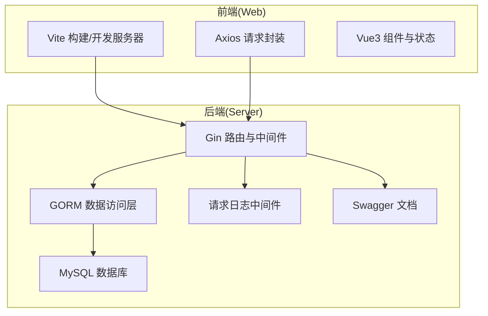
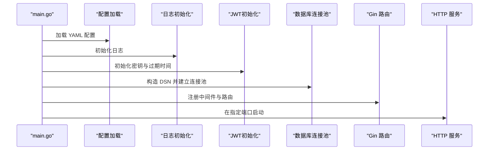
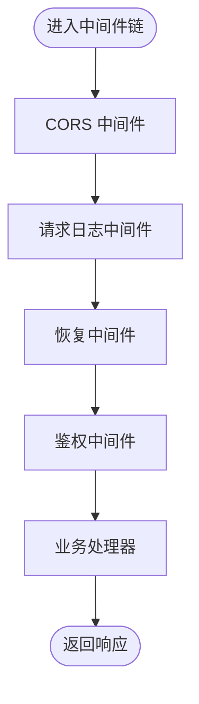
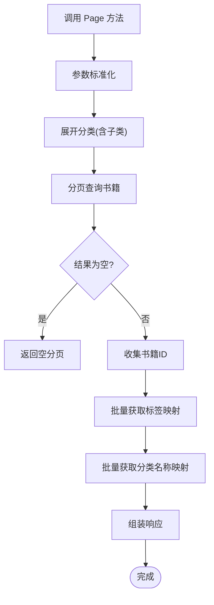
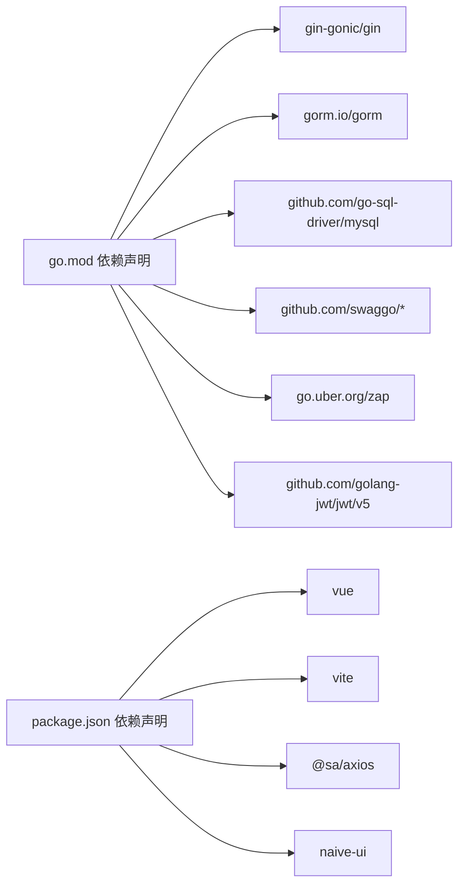
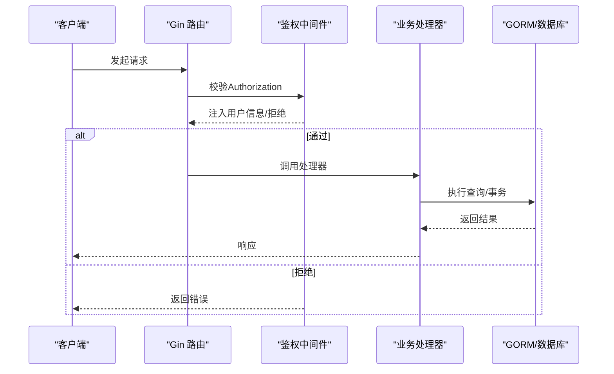

# 性能问题

<cite>
**本文引用的文件**
- [app/server/cmd/api/main.go](file://app/server/cmd/api/main.go)
- [app/server/go.mod](file://app/server/go.mod)
- [app/server/configs/config.example.yaml](file://app/server/configs/config.example.yaml)
- [app/server/internal/router/router.go](file://app/server/internal/router/router.go)
- [app/server/internal/middleware/logger.go](file://app/server/internal/middleware/logger.go)
- [app/server/internal/middleware/auth.go](file://app/server/internal/middleware/auth.go)
- [app/server/pkg/config/config.go](file://app/server/pkg/config/config.go)
- [app/server/internal/service/book.go](file://app/server/internal/service/book.go)
- [app/web/vite.config.ts](file://app/web/vite.config.ts)
- [app/web/package.json](file://app/web/package.json)
- [app/web/src/service/request/index.ts](file://app/web/src/service/request/index.ts)
</cite>

## 目录
1. [简介](#简介)
2. [项目结构](#项目结构)
3. [核心组件](#核心组件)
4. [架构总览](#架构总览)
5. [详细组件分析](#详细组件分析)
6. [依赖分析](#依赖分析)
7. [性能考虑](#性能考虑)
8. [故障排除指南](#故障排除指南)
9. [结论](#结论)
10. [附录](#附录)

## 简介
本指南聚焦于boread项目的性能问题系统化排查与优化，覆盖以下方面：
- 系统性能瓶颈识别：CPU使用率过高、内存泄漏、磁盘IO异常
- 应用响应缓慢：接口超时、页面渲染卡顿、数据库查询慢
- 并发处理问题：请求堆积、线程阻塞、资源竞争
- 性能监控指标解读、性能分析工具使用、内存泄漏检测方法
- 缓存策略优化、数据库查询优化、前端资源优化
- 负载均衡配置、水平扩展策略、性能基准测试方法
- 性能问题的预防措施与最佳实践

## 项目结构
boread采用前后端分离架构：
- 后端：Go + Gin + GORM，提供REST API、Swagger文档、JWT鉴权、日志中间件
- 前端：Vue3 + Vite + TypeScript + NaiveUI，通过Axios封装统一请求与错误处理
- 配置：后端通过YAML配置数据库连接池、JWT、日志级别；前端通过Vite环境变量控制代理与构建行为

图表来源
- [app/server/cmd/api/main.go:30-84](file://app/server/cmd/api/main.go#L30-L84)
- [app/server/internal/router/router.go:20-205](file://app/server/internal/router/router.go#L20-L205)
- [app/web/vite.config.ts:14-50](file://app/web/vite.config.ts#L14-L50)

章节来源
- [app/server/cmd/api/main.go:30-84](file://app/server/cmd/api/main.go#L30-L84)
- [app/server/internal/router/router.go:20-205](file://app/server/internal/router/router.go#L20-L205)
- [app/web/vite.config.ts:14-50](file://app/web/vite.config.ts#L14-L50)

## 核心组件
- 后端入口与数据库连接池：负责加载配置、初始化日志、JWT、数据库连接池参数，并启动HTTP服务
- 路由与中间件：装配路由、注册CORS、请求日志、恢复、Swagger、鉴权等中间件
- 业务服务层：以书籍管理为例，展示事务、批量查询、标签关联更新等典型性能点
- 前端请求封装：统一设置Authorization头、后端成功码判断、过期令牌刷新与错误提示

章节来源
- [app/server/cmd/api/main.go:34-84](file://app/server/cmd/api/main.go#L34-L84)
- [app/server/internal/router/router.go:20-205](file://app/server/internal/router/router.go#L20-L205)
- [app/server/internal/service/book.go:45-306](file://app/server/internal/service/book.go#L45-L306)
- [app/web/src/service/request/index.ts:13-128](file://app/web/src/service/request/index.ts#L13-L128)

## 架构总览
后端服务启动流程与关键依赖注入如下：

图表来源
- [app/server/cmd/api/main.go:34-84](file://app/server/cmd/api/main.go#L34-L84)
- [app/server/pkg/config/config.go:58-66](file://app/server/pkg/config/config.go#L58-L66)
- [app/server/configs/config.example.yaml:1-21](file://app/server/configs/config.example.yaml#L1-L21)

## 详细组件分析

### 后端入口与数据库连接池
- 配置加载：从YAML读取server/port、database/max_idle_conns/max_open_conns、jwt、log等
- 连接池设置：通过sql.DB设置最大空闲/打开连接数，避免连接过多导致资源争用
- 日志与JWT：统一日志输出格式，便于性能观测与定位
- 服务启动：在配置端口上监听HTTP请求

章节来源
- [app/server/cmd/api/main.go:34-84](file://app/server/cmd/api/main.go#L34-L84)
- [app/server/pkg/config/config.go:58-66](file://app/server/pkg/config/config.go#L58-L66)
- [app/server/configs/config.example.yaml:1-21](file://app/server/configs/config.example.yaml#L1-L21)

### 路由与中间件
- 中间件链：CORS、请求日志、恢复、鉴权、权限校验
- 鉴权中间件：解析Authorization头，校验Bearer Token有效性
- 请求日志中间件：记录状态码、耗时、方法、路径，便于识别慢请求

图表来源
- [app/server/internal/router/router.go:20-29](file://app/server/internal/router/router.go#L20-L29)
- [app/server/internal/middleware/auth.go:13-40](file://app/server/internal/middleware/auth.go#L13-L40)
- [app/server/internal/middleware/logger.go:10-28](file://app/server/internal/middleware/logger.go#L10-L28)

章节来源
- [app/server/internal/router/router.go:20-205](file://app/server/internal/router/router.go#L20-L205)
- [app/server/internal/middleware/auth.go:13-40](file://app/server/internal/middleware/auth.go#L13-L40)
- [app/server/internal/middleware/logger.go:10-28](file://app/server/internal/middleware/logger.go#L10-L28)

### 业务服务层（书籍管理）
- 事务一致性：创建/更新书籍时使用事务，保证标签关联与计数更新原子性
- 批量查询与映射：分页查询时收集主键，批量获取标签与分类映射，减少多次往返
- 关联变更：计算新增/删除的标签集合，分别执行删除与新增，避免全量替换

图表来源
- [app/server/internal/service/book.go:258-306](file://app/server/internal/service/book.go#L258-L306)

章节来源
- [app/server/internal/service/book.go:45-306](file://app/server/internal/service/book.go#L45-L306)

### 前端请求封装
- 统一基础URL与Headers，自动注入Authorization
- 成功码判断：根据环境变量配置后端成功码
- 过期令牌处理：拦截过期令牌错误，触发刷新并重试
- 错误提示：区分模态弹窗登出与普通错误提示

章节来源
- [app/web/src/service/request/index.ts:13-128](file://app/web/src/service/request/index.ts#L13-L128)

## 依赖分析
- 后端依赖
  - Web框架：Gin
  - ORM：GORM + MySQL驱动
  - 文档：Swaggo + Gin-Swagger
  - 日志：zap
  - JWT：golang-jwt
  - YAML：gopkg.in/yaml.v3
- 前端依赖
  - Vue3、Vite、TypeScript、NaiveUI
  - Axios封装、国际化、路由等生态

图表来源
- [app/server/go.mod:5-16](file://app/server/go.mod#L5-L16)
- [app/web/package.json:46-96](file://app/web/package.json#L46-L96)

章节来源
- [app/server/go.mod:5-16](file://app/server/go.mod#L5-L16)
- [app/web/package.json:46-96](file://app/web/package.json#L46-L96)

## 性能考虑
- 数据库连接池
  - 合理设置最大空闲/打开连接数，避免连接泄漏与过度竞争
  - 使用GORM日志级别控制SQL输出，生产环境建议降低到Warn或更高
- 中间件与日志
  - 请求日志中间件会带来额外开销，建议在高并发场景下按需开启或采样
  - 统一日志格式，便于聚合分析与慢请求定位
- 业务层优化
  - 分页查询时批量获取关联数据，减少N+1查询
  - 事务内尽量减少跨表写入次数，必要时合并更新
- 前端构建与请求
  - 生产构建关闭sourcemap可显著减小体积
  - 请求封装中对过期令牌的处理应避免重复刷新与死循环
- 缓存策略
  - 高频只读接口可引入Redis缓存热点数据
  - 前端可利用浏览器缓存与组件级缓存减少重复渲染
- 负载均衡与扩展
  - 多实例部署，结合反向代理实现健康检查与流量分发
  - 数据库读写分离与索引优化，缓解热点查询压力

[本节为通用指导，不直接分析具体文件]

## 故障排除指南

### 一、系统性能瓶颈识别
- CPU使用率过高
  - 检查是否存在长时间阻塞的数据库事务或未释放的锁
  - 审核业务逻辑中的大对象遍历与重复计算
  - 使用pprof采集CPU与堆栈信息，定位热点函数
- 内存泄漏
  - 关注长生命周期对象是否被意外持有
  - 前端组件销毁时清理定时器、事件监听与订阅
  - 后端避免在请求上下文中累积大量临时数据
- 磁盘IO异常
  - 检查日志文件大小与滚动策略
  - 评估数据库慢查询日志与binlog对IO的影响

[本节为通用指导，不直接分析具体文件]

### 二、应用响应缓慢
- 接口超时
  - 查看请求日志中间件输出的耗时，识别慢接口
  - 结合数据库慢查询日志与索引使用情况，优化SQL
- 页面渲染卡顿
  - 前端拆分组件、启用虚拟滚动与懒加载
  - 控制不必要的响应式数据与深层嵌套
- 数据库查询慢
  - 使用EXPLAIN分析执行计划，补充缺失索引
  - 避免SELECT *，仅取必要字段
  - 分页查询使用覆盖索引与延迟关联

章节来源
- [app/server/internal/middleware/logger.go:10-28](file://app/server/internal/middleware/logger.go#L10-L28)
- [app/server/internal/service/book.go:258-306](file://app/server/internal/service/book.go#L258-L306)

### 三、并发处理问题
- 请求堆积
  - 检查连接池上限与数据库实例容量
  - 识别长事务与阻塞锁，缩短事务范围
- 线程阻塞
  - 避免在Gin中间件或处理器中进行阻塞I/O
  - 异步化非关键路径任务（如日志、通知）
- 资源竞争
  - 事务内避免跨表频繁写入，合并为一次提交
  - 使用幂等设计，防止重复导入导致的数据竞争

章节来源
- [app/server/cmd/api/main.go:63-64](file://app/server/cmd/api/main.go#L63-L64)
- [app/server/internal/service/book.go:87-111](file://app/server/internal/service/book.go#L87-L111)

### 四、性能监控指标与工具
- 指标建议
  - 后端：QPS、P95/P99延迟、连接池活跃数、错误率、GC暂停时间
  - 前端：首屏时间、交互延迟、网络请求耗时、内存占用
- 工具推荐
  - 后端：pprof、Prometheus+Grafana、APM（如Jaeger链路追踪）
  - 前端：Chrome DevTools、Lighthouse、WebPageTest
- 日志与追踪
  - 统一日志格式，支持结构化日志与TraceID
  - 在关键路径埋点，记录入参、耗时、结果

[本节为通用指导，不直接分析具体文件]

### 五、内存泄漏检测方法
- 后端
  - 使用pprof heap profile对比不同时间点的内存快照
  - 关注goroutine数量与阻塞队列长度
- 前端
  - 使用DevTools Memory面板捕获堆快照
  - 检查组件卸载后的闭包与全局事件监听是否清理

[本节为通用指导，不直接分析具体文件]

### 六、性能优化方案
- 缓存策略
  - Redis缓存高频只读数据（如字典项、热门分类）
  - 前端本地存储与组件缓存，减少重复请求
- 数据库优化
  - 补充缺失索引，优化复杂查询
  - 使用连接池参数与事务批处理
- 前端资源优化
  - 生产构建关闭sourcemap，启用压缩与Tree-shaking
  - 图片与静态资源CDN加速，合理设置缓存头

章节来源
- [app/server/configs/config.example.yaml:12-13](file://app/server/configs/config.example.yaml#L12-L13)
- [app/web/vite.config.ts:44-49](file://app/web/vite.config.ts#L44-L49)

### 七、负载均衡与水平扩展
- 负载均衡
  - Nginx/HAProxy健康检查与轮询/加权轮询
  - 会话粘性或无状态设计（配合外部会话存储）
- 水平扩展
  - 多实例部署，共享数据库与缓存
  - 读写分离与分库分表（按业务维度）
- 性能基准测试
  - 使用wrk/JMeter模拟并发压测
  - 关注RPS、延迟分布、错误率与资源使用

[本节为通用指导，不直接分析具体文件]

### 八、预防措施与最佳实践
- 开发阶段
  - 代码审查关注性能回归点（循环、递归、IO）
  - 单元测试与集成测试覆盖关键路径
- 运维阶段
  - 设置告警阈值与根因分析流程
  - 定期复盘热点接口与慢查询
- 规范建议
  - 事务短小精悍，避免跨模块长事务
  - 前端组件职责单一，避免深层依赖
  - 后端接口幂等与限流降级

[本节为通用指导，不直接分析具体文件]

## 结论
boread的性能优化应围绕“连接池与事务”“批量查询与映射”“中间件与日志”“前端构建与缓存”四个关键点展开。通过合理的监控与基准测试，持续迭代索引与缓存策略，结合负载均衡与水平扩展，可有效提升系统的吞吐与稳定性。

[本节为总结性内容，不直接分析具体文件]

## 附录

### A. 关键流程图：鉴权与请求处理

图表来源
- [app/server/internal/router/router.go:84-91](file://app/server/internal/router/router.go#L84-L91)
- [app/server/internal/middleware/auth.go:13-40](file://app/server/internal/middleware/auth.go#L13-L40)
- [app/server/internal/middleware/logger.go:10-28](file://app/server/internal/middleware/logger.go#L10-L28)