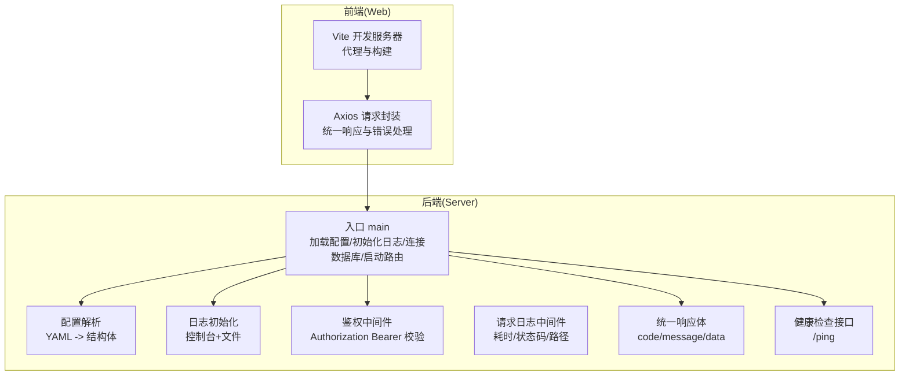
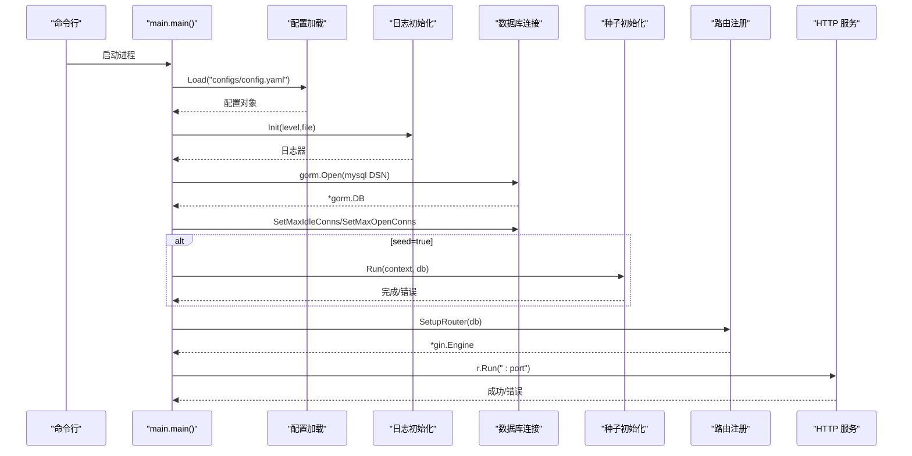
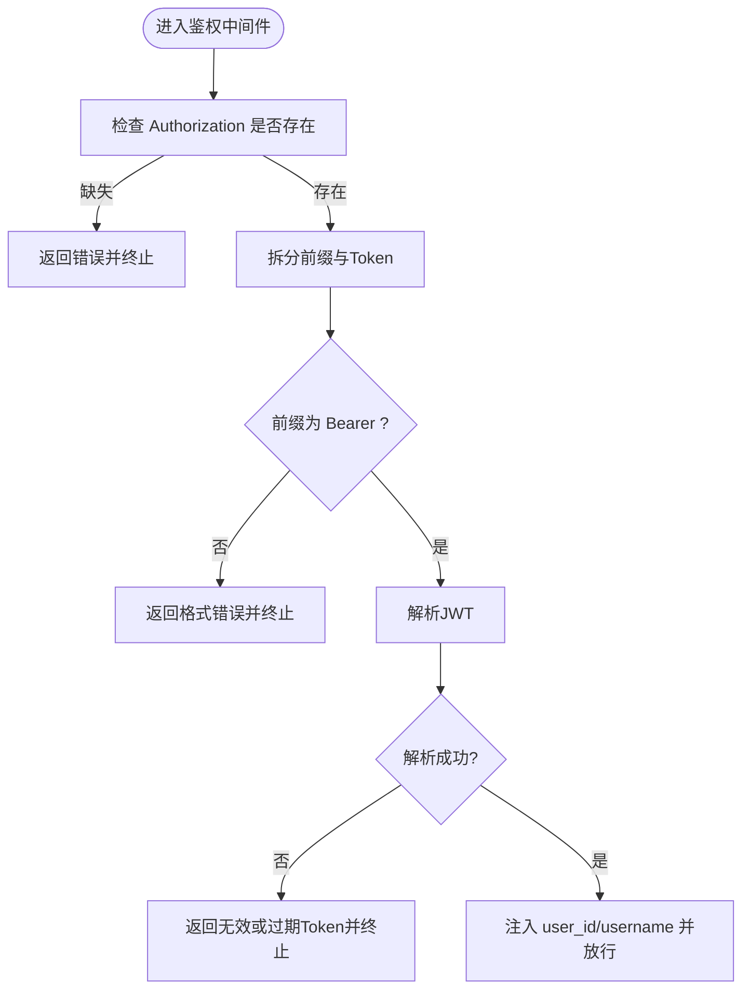
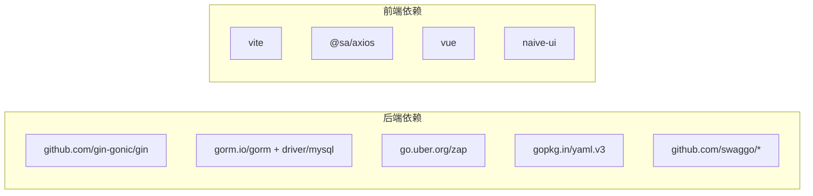

# 故障排除

<cite>
**本文引用的文件**
- [app/server/cmd/api/main.go](file://app/server/cmd/api/main.go)
- [app/server/pkg/config/config.go](file://app/server/pkg/config/config.go)
- [app/server/configs/config.example.yaml](file://app/server/configs/config.example.yaml)
- [app/server/pkg/logger/logger.go](file://app/server/pkg/logger/logger.go)
- [app/server/internal/middleware/auth.go](file://app/server/internal/middleware/auth.go)
- [app/server/internal/middleware/logger.go](file://app/server/internal/middleware/logger.go)
- [app/server/internal/handler/v1/health.go](file://app/server/internal/handler/v1/health.go)
- [app/server/pkg/response/response.go](file://app/server/pkg/response/response.go)
- [app/web/src/service/request/index.ts](file://app/web/src/service/request/index.ts)
- [app/web/src/utils/service.ts](file://app/web/src/utils/service.ts)
- [app/web/vite.config.ts](file://app/web/vite.config.ts)
- [app/server/go.mod](file://app/server/go.mod)
- [app/web/package.json](file://app/web/package.json)
</cite>

## 目录
1. [简介](#简介)
2. [项目结构](#项目结构)
3. [核心组件](#核心组件)
4. [架构总览](#架构总览)
5. [详细组件分析](#详细组件分析)
6. [依赖分析](#依赖分析)
7. [性能考虑](#性能考虑)
8. [故障排除指南](#故障排除指南)
9. [结论](#结论)
10. [附录](#附录)

## 简介
本指南面向运维与开发人员，系统化梳理 boread 项目的故障排除与问题诊断方法。内容覆盖启动失败、数据库连接问题、API 调用错误、前端页面异常等常见问题；提供日志分析、网络抓包、性能分析等实用手段；解释监控指标与异常判断标准；总结问题定位思维与排查流程，并给出预防措施与最佳实践。

## 项目结构
boread 采用前后端分离架构：后端为 Go 语言实现的 Web 服务（Gin + GORM），前端为 Vue3 + Vite 的单页应用。后端负责业务逻辑与数据持久化，前端通过 HTTP 客户端封装与后端交互。

图表来源
- [app/server/cmd/api/main.go:30-84](file://app/server/cmd/api/main.go#L30-L84)
- [app/server/pkg/config/config.go:58-66](file://app/server/pkg/config/config.go#L58-L66)
- [app/server/pkg/logger/logger.go:13-38](file://app/server/pkg/logger/logger.go#L13-L38)
- [app/server/internal/middleware/auth.go:13-40](file://app/server/internal/middleware/auth.go#L13-L40)
- [app/server/internal/middleware/logger.go:10-28](file://app/server/internal/middleware/logger.go#L10-L28)
- [app/server/pkg/response/response.go:9-37](file://app/server/pkg/response/response.go#L9-L37)
- [app/server/internal/handler/v1/health.go:17-33](file://app/server/internal/handler/v1/health.go#L17-L33)

章节来源
- [app/server/cmd/api/main.go:30-84](file://app/server/cmd/api/main.go#L30-L84)
- [app/server/pkg/config/config.go:9-54](file://app/server/pkg/config/config.go#L9-L54)
- [app/server/pkg/logger/logger.go:13-38](file://app/server/pkg/logger/logger.go#L13-L38)
- [app/server/internal/middleware/auth.go:13-40](file://app/server/internal/middleware/auth.go#L13-L40)
- [app/server/internal/middleware/logger.go:10-28](file://app/server/internal/middleware/logger.go#L10-L28)
- [app/server/pkg/response/response.go:9-37](file://app/server/pkg/response/response.go#L9-L37)
- [app/server/internal/handler/v1/health.go:17-33](file://app/server/internal/handler/v1/health.go#L17-L33)

## 核心组件
- 配置系统：从 YAML 文件加载 server、database、jwt、log、meta 等配置项，支持运行时读取。
- 日志系统：同时输出到控制台与文件，支持级别切换。
- 中间件：鉴权中间件校验 Bearer Token；请求日志中间件记录耗时与状态码。
- 统一响应：后端返回统一结构 code/message/data；前端按 code 判定成功与否并做登出/过期处理。
- 健康检查：提供 /ping 接口用于存活探测。
- 前端请求封装：Axios 层统一注入 Authorization，按后端约定判定成功/失败，处理过期令牌与登出场景。

章节来源
- [app/server/pkg/config/config.go:9-54](file://app/server/pkg/config/config.go#L9-L54)
- [app/server/pkg/logger/logger.go:13-38](file://app/server/pkg/logger/logger.go#L13-L38)
- [app/server/internal/middleware/auth.go:13-40](file://app/server/internal/middleware/auth.go#L13-L40)
- [app/server/internal/middleware/logger.go:10-28](file://app/server/internal/middleware/logger.go#L10-L28)
- [app/server/pkg/response/response.go:9-37](file://app/server/pkg/response/response.go#L9-L37)
- [app/server/internal/handler/v1/health.go:17-33](file://app/server/internal/handler/v1/health.go#L17-L33)
- [app/web/src/service/request/index.ts:13-128](file://app/web/src/service/request/index.ts#L13-L128)

## 架构总览
后端启动流程：命令行参数解析 -> 加载配置 -> 初始化日志 -> 连接数据库（设置连接池）-> 可选种子初始化 -> 设置路由 -> 启动 HTTP 服务。前端通过 Vite 开发服务器代理请求到后端，生产环境由静态资源服务器提供。

图表来源
- [app/server/cmd/api/main.go:34-83](file://app/server/cmd/api/main.go#L34-L83)
- [app/server/pkg/config/config.go:58-66](file://app/server/pkg/config/config.go#L58-L66)
- [app/server/pkg/logger/logger.go:13-38](file://app/server/pkg/logger/logger.go#L13-L38)

章节来源
- [app/server/cmd/api/main.go:34-83](file://app/server/cmd/api/main.go#L34-L83)

## 详细组件分析

### 后端启动与配置加载
- 配置文件路径与默认值：通过命令行 flag 支持种子模式；配置文件路径硬编码在入口处。
- 数据库连接：使用 DSN 拼接用户名、密码、主机、端口、库名；设置 GORM 日志级别为 Warn；设置连接池最大空闲/打开连接数。
- 日志初始化：控制台与文件双通道，支持级别解析；建议生产环境开启文件输出。
- 路由与服务：根据配置端口启动 HTTP 服务；如启动失败需检查端口占用与权限。

章节来源
- [app/server/cmd/api/main.go:34-83](file://app/server/cmd/api/main.go#L34-L83)
- [app/server/pkg/config/config.go:58-66](file://app/server/pkg/config/config.go#L58-L66)
- [app/server/pkg/logger/logger.go:13-38](file://app/server/pkg/logger/logger.go#L13-L38)
- [app/server/configs/config.example.yaml:1-21](file://app/server/configs/config.example.yaml#L1-L21)

### 鉴权中间件与统一响应
- 鉴权中间件：要求 Authorization 头且格式为 Bearer；解析失败直接返回错误并中断后续处理。
- 统一响应：后端返回 code/message/data；前端以 code 判定成功与否，支持登出码、弹窗登出码、过期令牌码三类分支处理。

图表来源
- [app/server/internal/middleware/auth.go:13-40](file://app/server/internal/middleware/auth.go#L13-L40)
- [app/server/pkg/response/response.go:15-37](file://app/server/pkg/response/response.go#L15-L37)

章节来源
- [app/server/internal/middleware/auth.go:13-40](file://app/server/internal/middleware/auth.go#L13-L40)
- [app/server/pkg/response/response.go:15-37](file://app/server/pkg/response/response.go#L15-L37)

### 健康检查与错误处理
- 健康检查：提供 /ping 接口，便于容器编排与负载均衡探活。
- 错误处理：后端返回统一结构；前端根据 code 分支处理登出、弹窗提示、刷新令牌重试等。

章节来源
- [app/server/internal/handler/v1/health.go:17-33](file://app/server/internal/handler/v1/health.go#L17-L33)
- [app/web/src/service/request/index.ts:34-126](file://app/web/src/service/request/index.ts#L34-L126)

### 前端请求封装与代理
- 基础地址与代理：根据环境变量动态选择 baseURL 或代理路径；支持多服务其他基地址。
- 请求拦截：自动注入 Authorization；按后端约定判定成功/失败；对登出码、弹窗登出码、过期令牌码分别处理。
- Vite 代理：开发模式下可启用代理转发到后端，避免跨域问题。

章节来源
- [app/web/src/utils/service.ts:49-61](file://app/web/src/utils/service.ts#L49-L61)
- [app/web/src/service/request/index.ts:13-128](file://app/web/src/service/request/index.ts#L13-L128)
- [app/web/vite.config.ts:34-39](file://app/web/vite.config.ts#L34-L39)

## 依赖分析
- 后端依赖：Gin（Web 框架）、GORM（ORM/数据库）、MySQL 驱动、Zap（日志）、Swag（Swagger 文档）、YAML（配置解析）。
- 前端依赖：Vite（构建/开发服务器）、Axios（HTTP 客户端）、Vue3 生态、NaiveUI、UnoCSS 等。

图表来源
- [app/server/go.mod:5-16](file://app/server/go.mod#L5-L16)
- [app/web/package.json:46-67](file://app/web/package.json#L46-L67)

章节来源
- [app/server/go.mod:5-16](file://app/server/go.mod#L5-L16)
- [app/web/package.json:46-67](file://app/web/package.json#L46-L67)

## 性能考虑
- 数据库连接池：合理设置最大空闲与最大打开连接数，避免连接不足或过多导致性能抖动。
- GORM 日志：生产环境建议保持 Warn 或更高级别，避免大量 SQL 日志影响吞吐。
- 中间件顺序：鉴权与日志中间件应尽量靠前，减少后续处理成本。
- 前端请求缓存与并发：避免重复请求与过度并发，结合后端限流策略优化整体性能。

## 故障排除指南

### 启动失败
- 症状：进程启动即退出或报错。
- 排查步骤：
  1) 检查配置文件是否存在且可读，确认路径与权限。
  2) 检查 server.port 是否被占用或权限不足。
  3) 检查数据库连接参数是否正确（主机、端口、账号、密码、库名）。
  4) 查看日志输出（控制台与文件），定位具体错误。
  5) 如需初始化种子数据，使用种子标志运行并观察输出。
- 相关文件路径：
  - [app/server/cmd/api/main.go:34-83](file://app/server/cmd/api/main.go#L34-L83)
  - [app/server/configs/config.example.yaml:1-21](file://app/server/configs/config.example.yaml#L1-L21)
  - [app/server/pkg/logger/logger.go:13-38](file://app/server/pkg/logger/logger.go#L13-L38)

章节来源
- [app/server/cmd/api/main.go:34-83](file://app/server/cmd/api/main.go#L34-L83)
- [app/server/configs/config.example.yaml:1-21](file://app/server/configs/config.example.yaml#L1-L21)
- [app/server/pkg/logger/logger.go:13-38](file://app/server/pkg/logger/logger.go#L13-L38)

### 数据库连接问题
- 症状：启动时报数据库连接失败或连接池异常。
- 排查步骤：
  1) 使用最小化 DSN 在本地验证连通性（主机、端口、账号、密码、库名）。
  2) 检查数据库服务状态与防火墙策略。
  3) 调整连接池参数（最大空闲/打开连接数）以匹配实际负载。
  4) 观察 GORM 日志级别，必要时临时提升以便定位慢查询或异常 SQL。
- 相关文件路径：
  - [app/server/cmd/api/main.go:44-65](file://app/server/cmd/api/main.go#L44-L65)
  - [app/server/pkg/config/config.go:35-44](file://app/server/pkg/config/config.go#L35-L44)

章节来源
- [app/server/cmd/api/main.go:44-65](file://app/server/cmd/api/main.go#L44-L65)
- [app/server/pkg/config/config.go:35-44](file://app/server/pkg/config/config.go#L35-L44)

### API 调用错误
- 症状：接口返回非预期结果或 4xx/5xx。
- 排查步骤：
  1) 使用健康检查接口 /ping 验证服务存活。
  2) 检查 Authorization 头是否正确（Bearer + Token），确保未过期。
  3) 关注后端统一响应中的 code 字段，区分业务错误与系统错误。
  4) 前端根据 code 分支处理：登出码触发登出，弹窗登出码弹出提示，过期令牌码触发刷新并重试。
  5) 打开后端请求日志中间件，查看耗时与状态码，辅助定位慢接口。
- 相关文件路径：
  - [app/server/internal/handler/v1/health.go:17-33](file://app/server/internal/handler/v1/health.go#L17-L33)
  - [app/server/internal/middleware/auth.go:13-40](file://app/server/internal/middleware/auth.go#L13-L40)
  - [app/server/pkg/response/response.go:15-37](file://app/server/pkg/response/response.go#L15-L37)
  - [app/web/src/service/request/index.ts:34-126](file://app/web/src/service/request/index.ts#L34-L126)
  - [app/server/internal/middleware/logger.go:10-28](file://app/server/internal/middleware/logger.go#L10-L28)

章节来源
- [app/server/internal/handler/v1/health.go:17-33](file://app/server/internal/handler/v1/health.go#L17-L33)
- [app/server/internal/middleware/auth.go:13-40](file://app/server/internal/middleware/auth.go#L13-L40)
- [app/server/pkg/response/response.go:15-37](file://app/server/pkg/response/response.go#L15-L37)
- [app/web/src/service/request/index.ts:34-126](file://app/web/src/service/request/index.ts#L34-L126)
- [app/server/internal/middleware/logger.go:10-28](file://app/server/internal/middleware/logger.go#L10-L28)

### 前端页面异常
- 症状：页面空白、接口无法访问、跨域错误。
- 排查步骤：
  1) 确认 Vite 开发服务器端口与代理配置正常。
  2) 检查环境变量与服务基础地址，确认 baseURL 与代理路径正确。
  3) 若启用代理，确认代理规则与后端端口一致。
  4) 检查浏览器 Network 面板，确认请求头 Authorization 是否正确注入。
  5) 查看控制台错误与网络错误，结合后端日志定位问题。
- 相关文件路径：
  - [app/web/vite.config.ts:34-39](file://app/web/vite.config.ts#L34-L39)
  - [app/web/src/utils/service.ts:49-61](file://app/web/src/utils/service.ts#L49-L61)
  - [app/web/src/service/request/index.ts:13-33](file://app/web/src/service/request/index.ts#L13-L33)

章节来源
- [app/web/vite.config.ts:34-39](file://app/web/vite.config.ts#L34-L39)
- [app/web/src/utils/service.ts:49-61](file://app/web/src/utils/service.ts#L49-L61)
- [app/web/src/service/request/index.ts:13-33](file://app/web/src/service/request/index.ts#L13-L33)

### 日志分析
- 后端日志：控制台输出与文件输出双通道，级别可配置；建议生产环境开启文件输出并设置合适级别。
- 请求日志：中间件输出每次请求的状态码、耗时、方法与路径，便于快速定位慢接口与异常路径。
- 建议：将关键业务操作打点到日志，结合时间戳与请求 ID 进行关联分析。

章节来源
- [app/server/pkg/logger/logger.go:13-38](file://app/server/pkg/logger/logger.go#L13-L38)
- [app/server/internal/middleware/logger.go:10-28](file://app/server/internal/middleware/logger.go#L10-L28)

### 网络抓包与性能分析
- 抓包工具：使用 tcpdump、Wireshark 或浏览器开发者工具 Network 面板，捕获请求/响应与 TLS 握手信息。
- 性能分析：结合后端请求日志中间件统计的耗时分布，定位热点接口；前端侧关注首屏渲染与资源加载耗时。
- 建议：在测试环境复现问题，逐步缩小范围至特定接口或路由。

### 监控指标与异常判断
- 系统资源：CPU、内存、磁盘 IO、网络带宽；异常表现为持续高占用或突发飙升。
- 应用性能：接口 P95/P99 延迟、错误率、超时率；异常表现为延迟突增或错误率上升。
- 业务指标：登录成功率、搜索命中率、文件上传成功率；异常表现为业务关键指标下降。
- 建议：建立阈值告警与趋势分析，结合日志与链路追踪进行根因定位。

### 问题定位思维与排查流程
- 快速验证：健康检查 /ping、数据库连通性、鉴权头有效性。
- 分层定位：前端（代理/跨域/鉴权）、后端（配置/日志/中间件/数据库）、基础设施（网络/存储/安全）。
- 逐步回退：变更最小化，逐一撤销可疑改动；保留现场日志与抓包。
- 应急方案：降级非关键功能、回滚最近变更、临时扩容资源。

### 预防措施与最佳实践
- 配置管理：敏感信息（数据库密码、JWT 密钥）使用环境变量或密钥管理；定期轮换密钥。
- 日志规范：统一字段、分级输出、保留周期与归档策略；避免敏感信息落盘。
- 安全加固：强制 HTTPS、限制 CORS、输入校验与参数化查询、最小权限原则。
- 监控告警：建立多维指标与自动化告警；定期演练故障恢复。
- 版本与依赖：锁定依赖版本，定期扫描漏洞；发布前进行集成测试与压测。

## 结论
通过系统化的配置检查、日志分析、网络抓包与性能分析，结合清晰的问题定位流程与预防措施，可以高效地发现并解决 boread 项目中的各类故障。建议团队在日常运维中固化这些流程与工具，持续优化监控与告警体系，提升系统的稳定性与可维护性。

## 附录

### 常见错误码与处理策略（前端）
- 登出码：触发登出并跳转登录页。
- 弹窗登出码：弹出错误对话框，阻止刷新，清理状态后登出。
- 过期令牌码：尝试刷新令牌，成功则重试原请求，失败则登出。
- 其他错误：展示通用错误消息，避免重复弹窗。

章节来源
- [app/web/src/service/request/index.ts:54-97](file://app/web/src/service/request/index.ts#L54-L97)