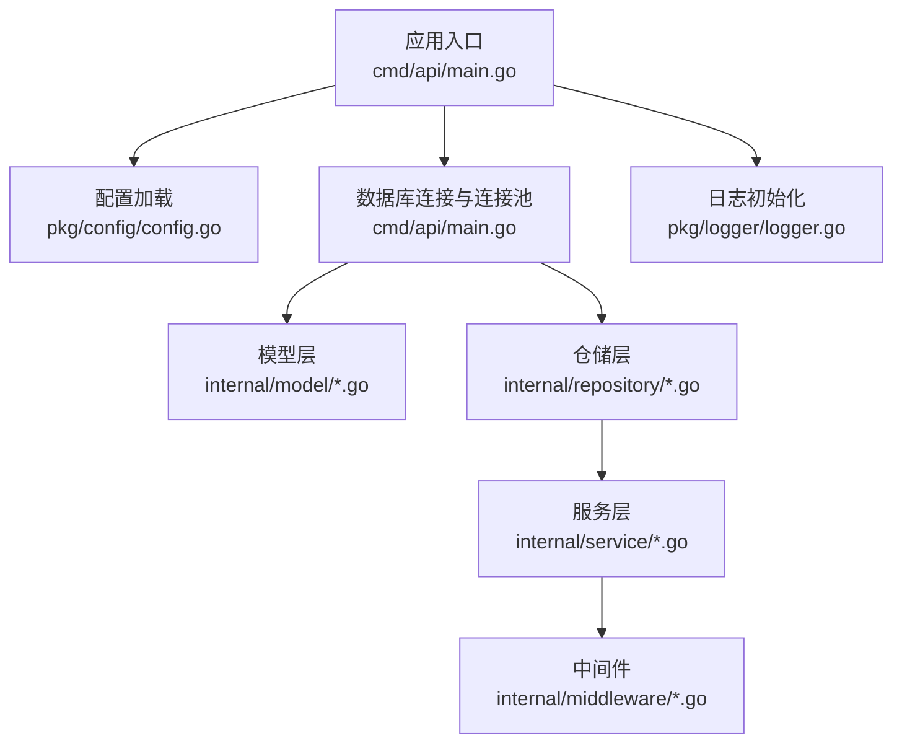
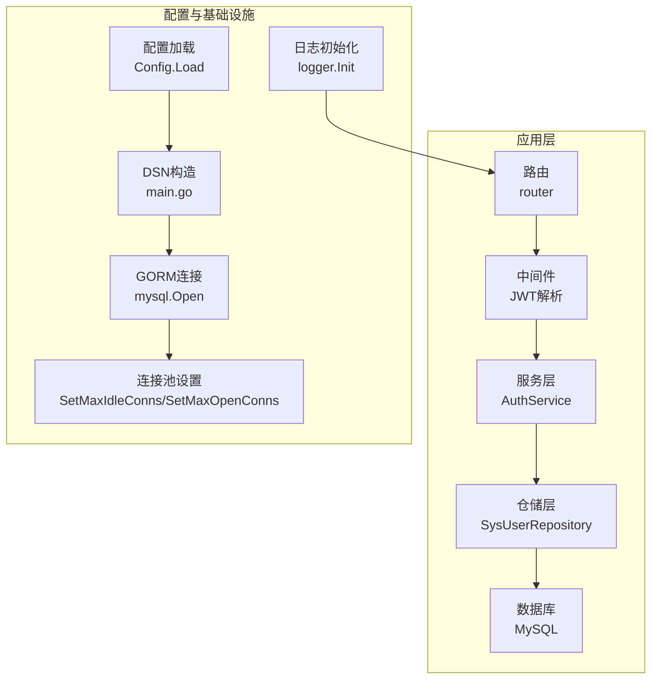
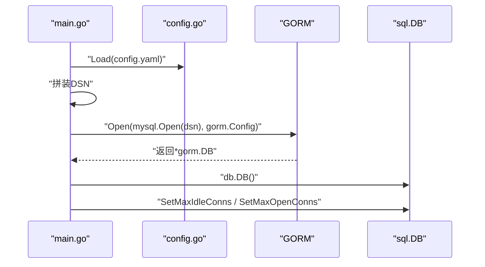
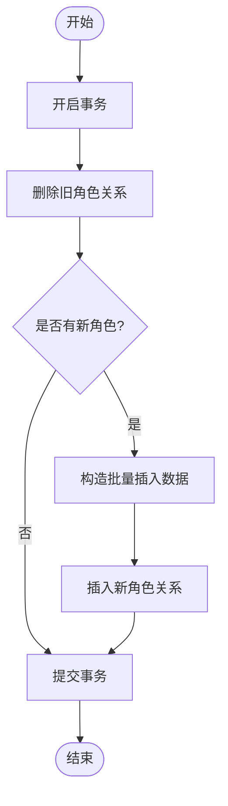
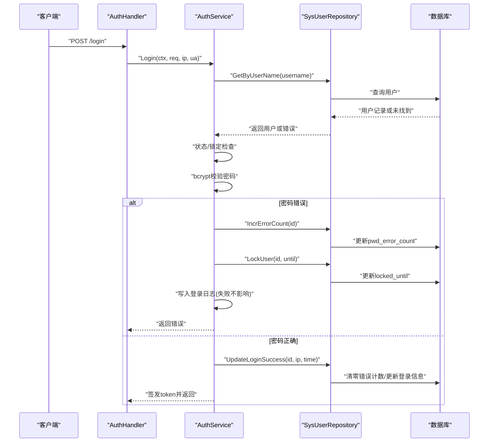
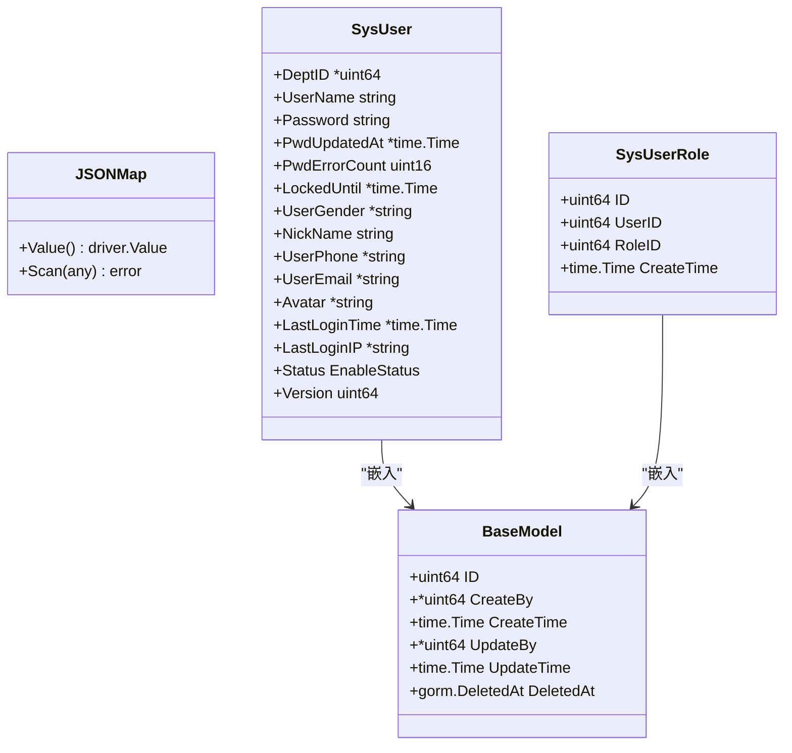
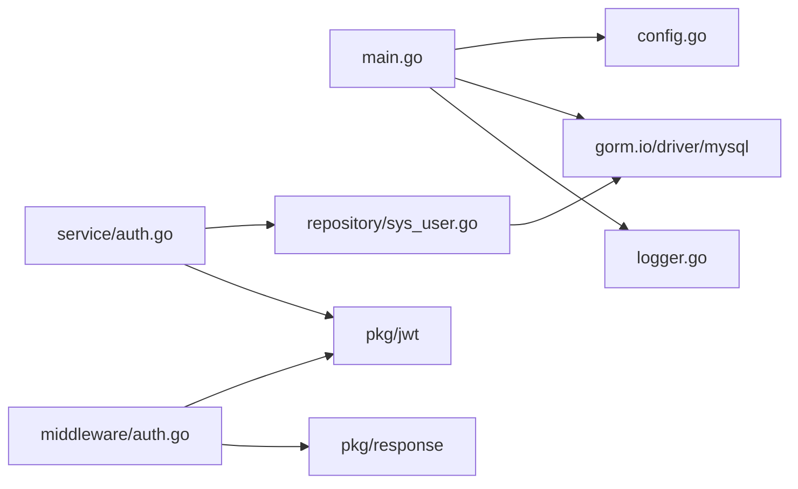

# 数据库问题

<cite>
**本文引用的文件**
- [main.go](file://app/server/cmd/api/main.go)
- [config.go](file://app/server/pkg/config/config.go)
- [config.example.yaml](file://app/server/configs/config.example.yaml)
- [config.yaml](file://app/server/configs/config.yaml)
- [base.go](file://app/server/internal/model/base.go)
- [sys_user.go](file://app/server/internal/model/sys_user.go)
- [sys_user.go](file://app/server/internal/repository/sys_user.go)
- [auth.go](file://app/server/internal/service/auth.go)
- [auth.go](file://app/server/internal/middleware/auth.go)
- [logger.go](file://app/server/pkg/logger/logger.go)
</cite>

## 目录
1. [简介](#简介)
2. [项目结构](#项目结构)
3. [核心组件](#核心组件)
4. [架构总览](#架构总览)
5. [详细组件分析](#详细组件分析)
6. [依赖分析](#依赖分析)
7. [性能考虑](#性能考虑)
8. [故障排除指南](#故障排除指南)
9. [结论](#结论)
10. [附录](#附录)

## 简介
本指南聚焦于boread项目中的数据库相关问题与排障实践，覆盖数据库连接失败、SQL执行错误、数据迁移问题、连接池配置优化、慢查询分析、事务管理最佳实践、备份恢复策略、主从同步排查、索引优化建议，以及针对MySQL的特有问题与解决方案。文档以代码为依据，结合实际文件路径，帮助开发者快速定位与解决问题。

## 项目结构
- 应用入口负责加载配置、建立数据库连接、设置连接池参数、启动HTTP服务。
- 配置模块定义了服务器、数据库、JWT、日志等配置结构体及加载逻辑。
- 模型层定义了基础字段与JSON字段映射，以及系统用户与关联表结构。
- 仓储层封装了数据库访问方法，包含事务与复杂查询。
- 服务层实现认证与权限相关业务逻辑，涉及数据库写入与查询。
- 中间件负责JWT解析与注入上下文。
- 日志模块统一输出日志，便于问题追踪。

**图示来源**
- [main.go:30-84](file://app/server/cmd/api/main.go#L30-L84)
- [config.go:58-66](file://app/server/pkg/config/config.go#L58-L66)
- [logger.go:13-38](file://app/server/pkg/logger/logger.go#L13-L38)

**章节来源**
- [main.go:30-84](file://app/server/cmd/api/main.go#L30-L84)
- [config.go:9-54](file://app/server/pkg/config/config.go#L9-L54)
- [config.example.yaml:1-21](file://app/server/configs/config.example.yaml#L1-L21)
- [config.yaml:1-21](file://app/server/configs/config.yaml#L1-L21)
- [logger.go:13-38](file://app/server/pkg/logger/logger.go#L13-L38)

## 核心组件
- 应用入口负责：
  - 加载配置文件
  - 构造DSN并使用GORM连接MySQL
  - 设置连接池最大空闲连接数与最大打开连接数
  - 初始化JWT与日志
  - 启动HTTP路由
- 配置模块负责：
  - 定义Config结构体，包含Server、Database、JWT、Log、Meta等字段
  - 提供Load函数从YAML文件读取配置
- 模型层：
  - BaseModel提供通用字段与软删除索引
  - JSONMap实现JSON字段的Value/Scan
  - 系统用户模型与用户-角色关联模型
- 仓储层：
  - SysUserRepository封装用户查询、更新、分页、角色替换等操作
  - 使用事务保证用户角色替换的一致性
- 服务层：
  - AuthService实现登录校验、风控、签发令牌、用户信息获取
  - 写入登录日志（失败不影响主流程）
- 中间件：
  - JWT解析中间件，校验Authorization头并注入用户信息
- 日志：
  - 支持控制台与文件输出，级别可配置

**章节来源**
- [main.go:34-65](file://app/server/cmd/api/main.go#L34-L65)
- [config.go:9-54](file://app/server/pkg/config/config.go#L9-L54)
- [base.go:12-51](file://app/server/internal/model/base.go#L12-L51)
- [sys_user.go:5-35](file://app/server/internal/model/sys_user.go#L5-L35)
- [sys_user.go:12-197](file://app/server/internal/repository/sys_user.go#L12-L197)
- [auth.go:31-248](file://app/server/internal/service/auth.go#L31-L248)
- [auth.go:12-40](file://app/server/internal/middleware/auth.go#L12-L40)
- [logger.go:13-38](file://app/server/pkg/logger/logger.go#L13-L38)

## 架构总览
应用通过GORM连接MySQL，使用连接池参数控制并发；服务层在登录时进行密码校验、风控处理与事务性角色替换；中间件负责鉴权；日志模块统一记录运行信息。

**图示来源**
- [main.go:44-65](file://app/server/cmd/api/main.go#L44-L65)
- [config.go:58-66](file://app/server/pkg/config/config.go#L58-L66)
- [auth.go:12-40](file://app/server/internal/middleware/auth.go#L12-L40)
- [auth.go:31-95](file://app/server/internal/service/auth.go#L31-L95)
- [sys_user.go:182-196](file://app/server/internal/repository/sys_user.go#L182-L196)
- [logger.go:13-38](file://app/server/pkg/logger/logger.go#L13-L38)

## 详细组件分析

### 组件A：数据库连接与连接池
- 连接字符串由配置拼装，驱动为MySQL，包含字符集、时间解析与时区设置。
- 连接成功后获取底层sql.DB并设置最大空闲与最大打开连接数。
- GORM日志级别设置为警告级别，便于生产环境降低噪声。

**图示来源**
- [main.go:44-65](file://app/server/cmd/api/main.go#L44-L65)
- [config.go:58-66](file://app/server/pkg/config/config.go#L58-L66)

**章节来源**
- [main.go:44-65](file://app/server/cmd/api/main.go#L44-L65)
- [config.go:35-44](file://app/server/pkg/config/config.go#L35-L44)
- [config.yaml:5-13](file://app/server/configs/config.yaml#L5-L13)

### 组件B：事务管理与并发安全
- 用户角色替换采用事务，先删除旧关系再批量插入新关系，确保一致性。
- 密码错误计数使用表达式更新，避免并发竞态导致计数不准。

**图示来源**
- [sys_user.go:182-196](file://app/server/internal/repository/sys_user.go#L182-L196)

**章节来源**
- [sys_user.go:51-57](file://app/server/internal/repository/sys_user.go#L51-L57)
- [sys_user.go:182-196](file://app/server/internal/repository/sys_user.go#L182-L196)

### 组件C：认证流程与数据库交互
- 登录流程包含用户查找、状态检查、锁定检查、密码校验、错误计数与锁定、登录成功更新、签发令牌、写入登录日志。
- 登录日志写入失败不影响主流程。

**图示来源**
- [auth.go:42-95](file://app/server/internal/service/auth.go#L42-L95)
- [sys_user.go:21-64](file://app/server/internal/repository/sys_user.go#L21-L64)

**章节来源**
- [auth.go:42-95](file://app/server/internal/service/auth.go#L42-L95)
- [sys_user.go:21-64](file://app/server/internal/repository/sys_user.go#L21-L64)

### 组件D：模型与JSON字段映射
- BaseModel提供通用字段与软删除索引，便于审计与清理。
- JSONMap实现map[string]any与数据库JSON字段之间的双向映射，支持空值处理与类型校验。

**图示来源**
- [base.go:12-51](file://app/server/internal/model/base.go#L12-L51)
- [sys_user.go:5-35](file://app/server/internal/model/sys_user.go#L5-L35)

**章节来源**
- [base.go:12-51](file://app/server/internal/model/base.go#L12-L51)
- [sys_user.go:5-35](file://app/server/internal/model/sys_user.go#L5-L35)

## 依赖分析
- 应用入口依赖配置模块与GORM驱动，负责连接数据库并设置连接池。
- 服务层依赖仓储层与JWT包，实现业务逻辑。
- 仓储层依赖GORM，封装数据库操作。
- 中间件依赖JWT包与响应模块，完成鉴权。
- 日志模块被入口与服务层调用，统一输出。

**图示来源**
- [main.go:3-18](file://app/server/cmd/api/main.go#L3-L18)
- [auth.go:3-10](file://app/server/internal/middleware/auth.go#L3-L10)
- [auth.go:3-17](file://app/server/internal/service/auth.go#L3-L17)

**章节来源**
- [main.go:3-18](file://app/server/cmd/api/main.go#L3-L18)
- [auth.go:3-10](file://app/server/internal/middleware/auth.go#L3-L10)
- [auth.go:3-17](file://app/server/internal/service/auth.go#L3-L17)

## 性能考虑
- 连接池参数
  - 最大空闲连接数与最大打开连接数应根据并发请求与数据库承载能力调整，避免连接争用或资源浪费。
  - 参考配置项：max_idle_conns、max_open_conns。
- GORM日志级别
  - 生产环境建议使用警告级别，减少日志开销。
- 查询优化
  - 使用索引字段进行过滤与排序，避免全表扫描。
  - 复杂联表查询注意连接顺序与条件选择性。
- 事务边界
  - 将相关写操作放入单个事务，减少锁竞争与回滚成本。
- 缓存与降级
  - 对热点数据与只读查询引入缓存，降低数据库压力。

[本节为通用指导，不直接分析具体文件]

## 故障排除指南

### 一、数据库连接失败
- 常见原因
  - 连接字符串错误：主机、端口、用户名、密码、数据库名不匹配。
  - 网络问题：防火墙阻断、内网不可达、DNS解析异常。
  - 认证失败：密码错误、用户不存在、权限不足。
- 排查步骤
  - 检查配置文件与环境变量是否正确加载。
  - 使用命令行工具验证连通性与认证。
  - 查看应用日志中连接失败的具体错误信息。
- 关联文件
  - 配置加载与DSN拼装：[main.go:34-50](file://app/server/cmd/api/main.go#L34-L50)
  - 配置结构与加载：[config.go:58-66](file://app/server/pkg/config/config.go#L58-L66)
  - 示例配置模板：[config.example.yaml:5-13](file://app/server/configs/config.example.yaml#L5-L13)
  - 实际配置示例：[config.yaml:5-13](file://app/server/configs/config.yaml#L5-L13)
  - 日志初始化：[logger.go:13-38](file://app/server/pkg/logger/logger.go#L13-L38)

**章节来源**
- [main.go:34-50](file://app/server/cmd/api/main.go#L34-L50)
- [config.go:58-66](file://app/server/pkg/config/config.go#L58-L66)
- [config.example.yaml:5-13](file://app/server/configs/config.example.yaml#L5-L13)
- [config.yaml:5-13](file://app/server/configs/config.yaml#L5-L13)
- [logger.go:13-38](file://app/server/pkg/logger/logger.go#L13-L38)

### 二、SQL执行错误
- 常见原因
  - 语法错误：列名不匹配、表名错误、关键字拼写错误。
  - 权限不足：用户缺少SELECT/INSERT/UPDATE/DELETE权限。
  - 死锁问题：并发事务相互等待资源。
- 排查步骤
  - 在GORM日志中定位SQL与参数，确认列名与表名一致。
  - 检查用户权限与角色授权。
  - 观察事务范围与锁粒度，避免长事务与不必要的共享锁。
- 关联文件
  - 登录与角色查询：[sys_user.go:66-120](file://app/server/internal/repository/sys_user.go#L66-L120)
  - 分页查询与条件组装：[sys_user.go:150-179](file://app/server/internal/repository/sys_user.go#L150-L179)
  - 事务性角色替换：[sys_user.go:182-196](file://app/server/internal/repository/sys_user.go#L182-L196)

**章节来源**
- [sys_user.go:66-120](file://app/server/internal/repository/sys_user.go#L66-L120)
- [sys_user.go:150-179](file://app/server/internal/repository/sys_user.go#L150-L179)
- [sys_user.go:182-196](file://app/server/internal/repository/sys_user.go#L182-L196)

### 三、数据迁移问题
- 常见原因
  - 版本不匹配：当前应用期望的表结构与数据库实际不一致。
  - 迁移脚本错误：DDL语法错误、索引冲突、外键约束。
- 排查步骤
  - 对照应用期望的表结构与索引，核对数据库实际状态。
  - 分步执行迁移脚本，观察错误点并修复。
  - 使用备份回滚至稳定版本，再逐步升级。
- 建议
  - 在测试环境先行验证迁移脚本。
  - 对关键变更增加回滚方案与校验步骤。

[本节为通用指导，不直接分析具体文件]

### 四、连接池配置优化
- 参数说明
  - 最大空闲连接数：控制空闲连接上限，避免过多空闲连接占用资源。
  - 最大打开连接数：限制同时使用的连接数，防止数据库过载。
- 优化建议
  - 根据QPS与数据库最大连接数上限合理设置。
  - 结合慢查询与锁等待监控，动态调整。
- 关联文件
  - 连接池设置位置：[main.go:63-64](file://app/server/cmd/api/main.go#L63-L64)
  - 配置结构定义：[config.go:35-44](file://app/server/pkg/config/config.go#L35-L44)

**章节来源**
- [main.go:63-64](file://app/server/cmd/api/main.go#L63-L64)
- [config.go:35-44](file://app/server/pkg/config/config.go#L35-L44)

### 五、慢查询分析
- 方法
  - 开启数据库慢查询日志，收集耗时SQL与执行计划。
  - 使用EXPLAIN分析查询计划，关注索引使用与扫描行数。
  - 结合应用侧日志与指标，定位热点接口与SQL。
- 关联文件
  - GORM日志级别设置：[main.go:52-54](file://app/server/cmd/api/main.go#L52-L54)
  - 日志初始化：[logger.go:13-38](file://app/server/pkg/logger/logger.go#L13-L38)

**章节来源**
- [main.go:52-54](file://app/server/cmd/api/main.go#L52-L54)
- [logger.go:13-38](file://app/server/pkg/logger/logger.go#L13-L38)

### 六、事务管理最佳实践
- 保持事务短小精悍，避免长事务持有锁。
- 将相关写操作放在同一事务内，确保一致性。
- 对并发敏感的操作使用表达式更新或显式加锁。
- 关联文件
  - 事务性角色替换：[sys_user.go:182-196](file://app/server/internal/repository/sys_user.go#L182-L196)
  - 并发安全更新：[sys_user.go:51-57](file://app/server/internal/repository/sys_user.go#L51-L57)

**章节来源**
- [sys_user.go:182-196](file://app/server/internal/repository/sys_user.go#L182-L196)
- [sys_user.go:51-57](file://app/server/internal/repository/sys_user.go#L51-L57)

### 七、备份恢复策略
- 策略
  - 定期全量备份与增量备份结合。
  - 验证备份可用性与恢复流程。
  - 对关键业务数据制定RPO/RTO目标。
- 建议
  - 在维护窗口执行全备，日常增量备份。
  - 异地容灾与自动化演练。

[本节为通用指导，不直接分析具体文件]

### 八、主从同步问题排查
- 现象
  - 主从延迟、读写分离导致的数据不一致。
- 排查
  - 检查复制IO/SQL线程状态与延迟。
  - 核对GTID与binlog配置一致性。
  - 对只读查询强制走从库，写操作走主库。
- 建议
  - 明确读写分离策略与事务边界。
  - 对强一致场景临时切换到主库读取。

[本节为通用指导，不直接分析具体文件]

### 九、索引优化建议
- 建议
  - 对高频WHERE、JOIN、ORDER BY列建立合适索引。
  - 避免冗余与重复索引，定期评估索引使用率。
  - 使用复合索引时注意最左前缀原则。
- 关联文件
  - 用户名与邮箱等字段具备索引或唯一索引，有助于加速查询：[sys_user.go:8-22](file://app/server/internal/model/sys_user.go#L8-L22)

**章节来源**
- [sys_user.go:8-22](file://app/server/internal/model/sys_user.go#L8-L22)

### 十、不同数据库类型的特有问题
- MySQL
  - 注意字符集与排序规则一致性，避免比较异常。
  - 合理设置innodb_lock_wait_timeout与超时重试策略。
  - 使用EXPLAIN与慢查询日志定位问题。
- PostgreSQL
  - 注意大小写敏感与schema隔离。
  - 使用EXPLAIN ANALYZE分析执行计划。
- SQLite
  - 注意并发写入限制与WAL模式配置。
- 建议
  - 针对目标数据库特性调整SQL与索引设计。

[本节为通用指导，不直接分析具体文件]

## 结论
本指南基于boread项目的实际代码，梳理了数据库连接、事务、查询与运维的关键环节，并提供了可操作的排障步骤与优化建议。建议在开发与运维实践中结合日志、监控与备份策略，持续改进数据库稳定性与性能。

## 附录
- 关键配置项参考
  - 服务器端口与模式：[config.example.yaml:1-3](file://app/server/configs/config.example.yaml#L1-L3)，[config.yaml:1-3](file://app/server/configs/config.yaml#L1-L3)
  - 数据库连接参数：[config.example.yaml:5-13](file://app/server/configs/config.example.yaml#L5-L13)，[config.yaml:5-13](file://app/server/configs/config.yaml#L5-L13)
  - 日志级别与文件：[config.example.yaml:19-21](file://app/server/configs/config.example.yaml#L19-L21)，[config.yaml:19-21](file://app/server/configs/config.yaml#L19-L21)