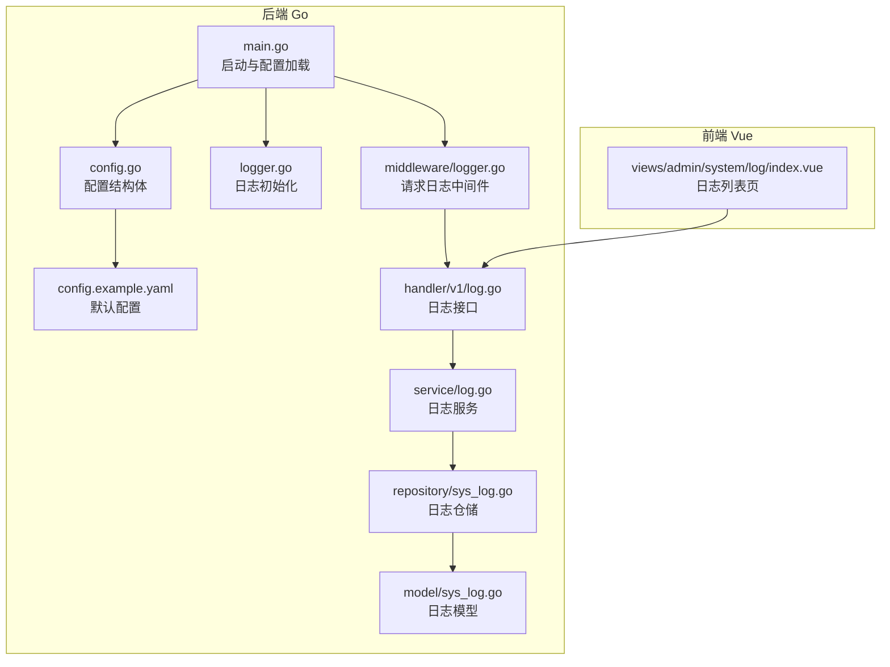
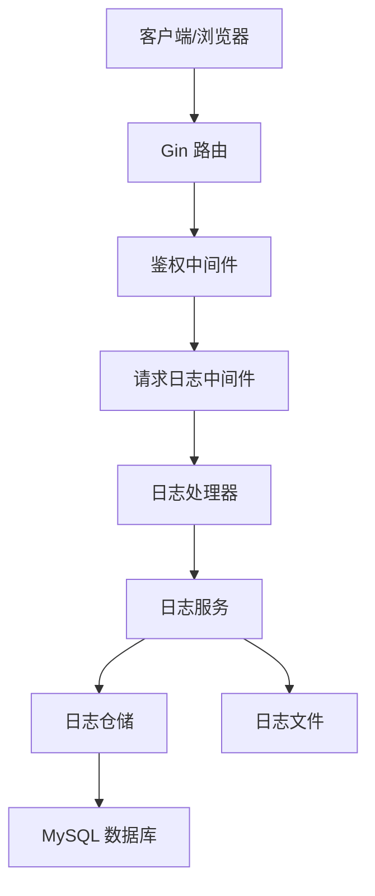
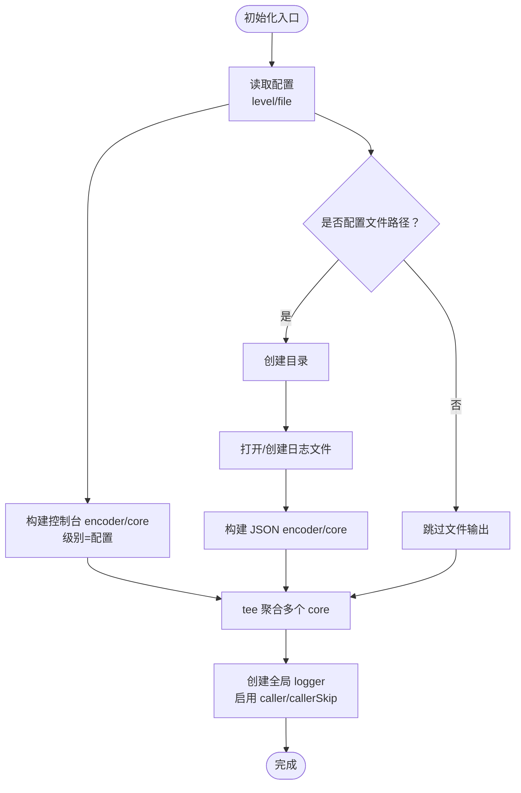
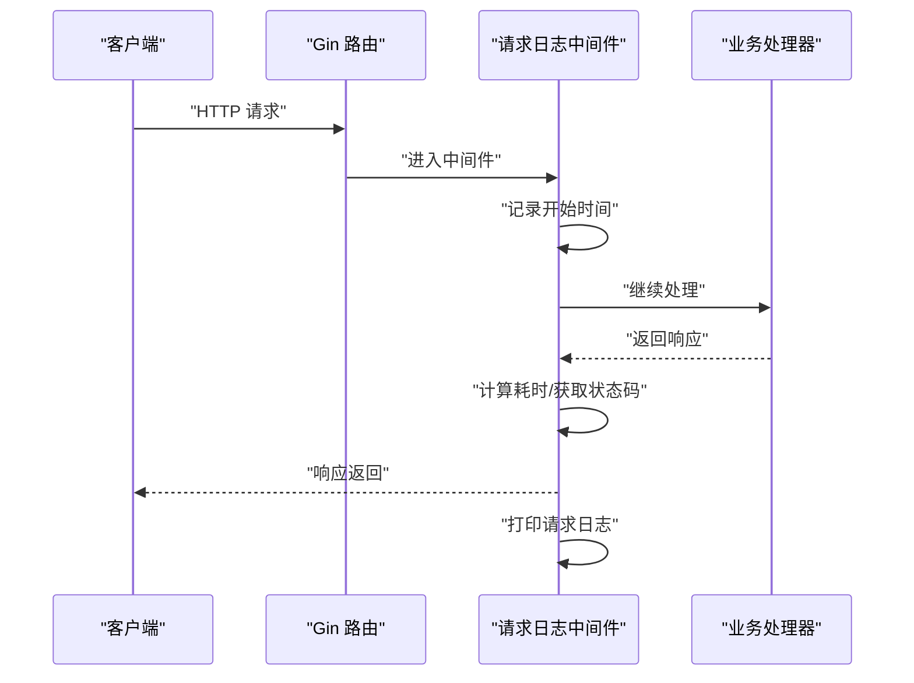
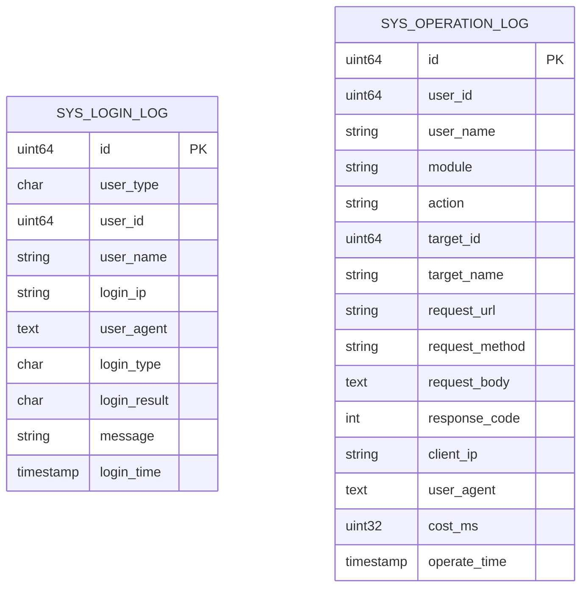
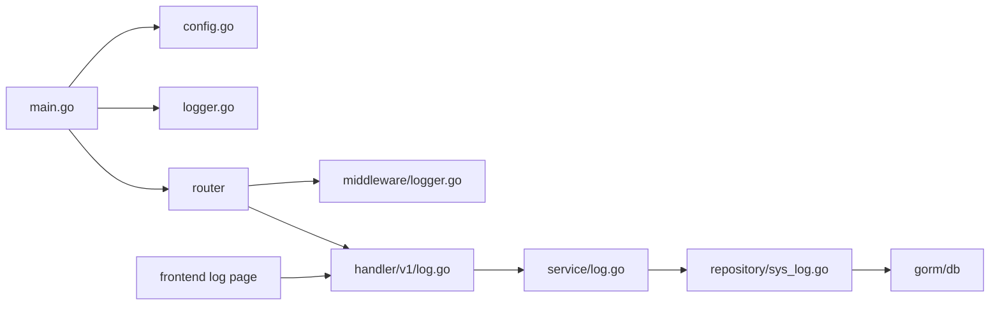

# 日志与调试

<cite>
**本文引用的文件**
- [app\server\pkg\logger\logger.go](file://app/server/pkg/logger/logger.go)
- [app\server\cmd\api\main.go](file://app/server/cmd/api/main.go)
- [app\server\pkg\config\config.go](file://app/server/pkg/config/config.go)
- [app\server\configs\config.example.yaml](file://app/server/configs/config.example.yaml)
- [app\server\internal\middleware\logger.go](file://app/server/internal/middleware/logger.go)
- [app\server\internal\handler\v1\log.go](file://app/server/internal/handler/v1/log.go)
- [app\server\internal\service\log.go](file://app/server/internal/service/log.go)
- [app\server\internal\repository\sys_log.go](file://app/server/internal/repository/sys_log.go)
- [app\server\internal\model\sys_log.go](file://app/server/internal/model/sys_log.go)
- [app\server\internal\handler\v1\auth.go](file://app/server/internal/handler/v1/auth.go)
- [app\server\pkg\utils\ctx.go](file://app/server/pkg/utils/ctx.go)
- [app\web\src\views\admin\system\log\index.vue](file://app/web/src/views/admin/system/log/index.vue)
</cite>

## 目录
1. [简介](#简介)
2. [项目结构](#项目结构)
3. [核心组件](#核心组件)
4. [架构总览](#架构总览)
5. [详细组件分析](#详细组件分析)
6. [依赖分析](#依赖分析)
7. [性能考虑](#性能考虑)
8. [故障排查指南](#故障排查指南)
9. [结论](#结论)
10. [附录](#附录)

## 简介
本指南聚焦于 boread 项目的日志记录与调试技术，覆盖日志级别与格式、日志轮转策略建议、系统化问题定位方法（错误堆栈、调用链、关键路径监控）、调试工具使用（浏览器开发者工具、Node.js 调试器、Go 调试工具）、远程调试与生产环境问题复现技巧、性能分析工具、日志聚合与告警配置思路、以及常见问题的调试案例与解决方案模板。内容基于仓库中实际代码实现与配置进行说明，帮助开发与运维人员建立一致、可追溯、可扩展的日志与调试体系。

## 项目结构
围绕日志与调试的关键目录与文件如下：
- 后端 Go 侧
  - 日志初始化与封装：pkg/logger/logger.go
  - 配置加载与日志配置项：pkg/config/config.go、configs/config.example.yaml
  - 请求级日志中间件：internal/middleware/logger.go
  - 登录/操作日志模型与分页查询：internal/model/sys_log.go、internal/repository/sys_log.go、internal/service/log.go、internal/handler/v1/log.go
  - 主程序入口：cmd/api/main.go
- 前端 Vue 侧
  - 系统日志页面：web/src/views/admin/system/log/index.vue

**图表来源**
- [app\server\cmd\api\main.go:30-84](file://app/server/cmd/api/main.go#L30-L84)
- [app\server\pkg\config\config.go:9-66](file://app/server/pkg/config/config.go#L9-L66)
- [app\server\configs\config.example.yaml:1-21](file://app/server/configs/config.example.yaml#L1-L21)
- [app\server\pkg\logger\logger.go:13-38](file://app/server/pkg/logger/logger.go#L13-L38)
- [app\server\internal\middleware\logger.go:10-28](file://app/server/internal/middleware/logger.go#L10-L28)
- [app\server\internal\handler\v1\log.go:19-63](file://app/server/internal/handler/v1/log.go#L19-L63)
- [app\server\internal\service\log.go:18-34](file://app/server/internal/service/log.go#L18-L34)
- [app\server\internal\repository\sys_log.go:20-82](file://app/server/internal/repository/sys_log.go#L20-L82)
- [app\server\internal\model\sys_log.go:29-64](file://app/server/internal/model/sys_log.go#L29-L64)
- [app\web\src\views\admin\system\log\index.vue:1-195](file://app/web/src/views/admin/system/log/index.vue#L1-L195)

**章节来源**
- [app\server\cmd\api\main.go:30-84](file://app/server/cmd/api/main.go#L30-L84)
- [app\server\pkg\config\config.go:9-66](file://app/server/pkg/config/config.go#L9-L66)
- [app\server\configs\config.example.yaml:1-21](file://app/server/configs/config.example.yaml#L1-L21)
- [app\server\pkg\logger\logger.go:13-38](file://app/server/pkg/logger/logger.go#L13-L38)
- [app\server\internal\middleware\logger.go:10-28](file://app/server/internal/middleware/logger.go#L10-L28)
- [app\server\internal\handler\v1\log.go:19-63](file://app/server/internal/handler/v1/log.go#L19-L63)
- [app\server\internal\service\log.go:18-34](file://app/server/internal/service/log.go#L18-L34)
- [app\server\internal\repository\sys_log.go:20-82](file://app/server/internal/repository/sys_log.go#L20-L82)
- [app\server\internal\model\sys_log.go:29-64](file://app/server/internal/model/sys_log.go#L29-L64)
- [app\web\src\views\admin\system\log\index.vue:1-195](file://app/web/src/views/admin/system/log/index.vue#L1-L195)

## 核心组件
- 日志初始化与输出
  - 使用 zap 初始化日志，支持控制台与文件双通道输出；时间字段、级别编码、调用者信息均按约定配置；支持通过配置项设置日志级别与文件路径。
- 请求级日志中间件
  - 在 Gin 中间件中打印每次请求的状态码、耗时、方法与路径，便于快速观察接口行为与异常。
- 日志模型与分页查询
  - 定义登录日志与操作日志的数据模型，提供分页查询能力，支持多条件过滤与排序。
- 配置与启动流程
  - 从配置文件加载 server、database、jwt、log 等配置；根据配置初始化日志；连接数据库并启动服务。

**章节来源**
- [app\server\pkg\logger\logger.go:13-38](file://app/server/pkg/logger/logger.go#L13-L38)
- [app\server\internal\middleware\logger.go:10-28](file://app/server/internal/middleware/logger.go#L10-L28)
- [app\server\internal\model\sys_log.go:29-64](file://app/server/internal/model/sys_log.go#L29-L64)
- [app\server\internal\repository\sys_log.go:20-82](file://app/server/internal/repository/sys_log.go#L20-L82)
- [app\server\pkg\config\config.go:9-66](file://app/server/pkg/config/config.go#L9-L66)
- [app\server\configs\config.example.yaml:1-21](file://app/server/configs/config.example.yaml#L1-L21)
- [app\server\cmd\api\main.go:34-84](file://app/server/cmd/api/main.go#L34-L84)

## 架构总览
下图展示日志与调试在系统中的位置与交互：

**图表来源**
- [app\server\internal\middleware\logger.go:10-28](file://app/server/internal/middleware/logger.go#L10-L28)
- [app\server\internal\handler\v1\log.go:19-63](file://app/server/internal/handler/v1/log.go#L19-L63)
- [app\server\internal\service\log.go:18-34](file://app/server/internal/service/log.go#L18-L34)
- [app\server\internal\repository\sys_log.go:20-82](file://app/server/internal/repository/sys_log.go#L20-L82)
- [app\server\pkg\logger\logger.go:13-38](file://app/server/pkg/logger/logger.go#L13-L38)

## 详细组件分析

### 组件一：日志初始化与配置
- 初始化流程
  - 读取配置中的日志级别与文件路径；
  - 构造控制台 encoder/core，级别为配置值；
  - 若配置了文件路径，则创建目录并打开文件，构造 JSON encoder/core，同样应用配置级别；
  - 使用 tee 将多个 core 聚合，启用调用者信息与跳过层级，生成全局 logger 实例；
  - 应用在 main 中初始化并在退出时同步缓冲。
- 日志级别
  - 支持 debug/info/warn/error，默认 info；
  - 控制台输出采用控制台编码，文件输出采用 JSON 编码，便于结构化采集。
- 日志格式
  - 时间键名统一为 time，ISO8601 时间格式；
  - 级别大写编码；
  - 包含调用者文件与行号，便于定位。

**图表来源**
- [app\server\pkg\logger\logger.go:13-38](file://app/server/pkg/logger/logger.go#L13-L38)
- [app\server\cmd\api\main.go:34-40](file://app/server/cmd/api/main.go#L34-L40)

**章节来源**
- [app\server\pkg\logger\logger.go:13-38](file://app/server/pkg/logger/logger.go#L13-L38)
- [app\server\cmd\api\main.go:34-40](file://app/server/cmd/api/main.go#L34-L40)

### 组件二：请求级日志中间件
- 功能
  - 记录请求开始时间、结束后的状态码、耗时、方法与路径；
  - 输出到标准输出，便于本地开发观察。
- 使用建议
  - 生产环境建议结合全局日志系统统一收集，避免直接依赖 stdout；
  - 可扩展为结构化输出，便于后续聚合分析。

**图表来源**
- [app\server\internal\middleware\logger.go:10-28](file://app/server/internal/middleware/logger.go#L10-L28)

**章节来源**
- [app\server\internal\middleware\logger.go:10-28](file://app/server/internal/middleware/logger.go#L10-L28)

### 组件三：日志模型与分页查询
- 模型
  - 登录日志：包含用户类型、用户标识、登录 IP、UA、登录类型、结果、消息、时间等字段；
  - 操作日志：包含模块、动作、目标 ID/名称、请求 URL/方法、请求体、响应码、客户端 IP、UA、耗时、时间等字段。
- 分页查询
  - 支持多条件过滤（用户名、IP、类型、结果、起止时间等）；
  - 统计总数与分页取数，按时间倒序排列；
  - 提供登录日志与操作日志两类分页接口。

**图表来源**
- [app\server\internal\model\sys_log.go:29-64](file://app/server/internal/model/sys_log.go#L29-L64)

**章节来源**
- [app\server\internal\model\sys_log.go:29-64](file://app/server/internal/model/sys_log.go#L29-L64)
- [app\server\internal\repository\sys_log.go:20-82](file://app/server/internal/repository/sys_log.go#L20-L82)
- [app\server\internal\service\log.go:18-34](file://app/server/internal/service/log.go#L18-L34)
- [app\server\internal\handler\v1\log.go:19-63](file://app/server/internal/handler/v1/log.go#L19-L63)

### 组件四：前端日志页面
- 功能
  - 提供登录日志与操作日志的分页列表；
  - 支持筛选条件（用户名、IP、类型、结果、起止时间等）与分页参数变更；
  - 远程表格加载，列定义清晰，适配移动端。
- 交互
  - 切换标签页切换不同日志类型；
  - 刷新按钮触发重新拉取数据。

**章节来源**
- [app\web\src\views\admin\system\log\index.vue:1-195](file://app/web/src/views/admin/system/log/index.vue#L1-L195)

## 依赖分析
- 组件耦合
  - main 依赖配置与日志初始化，再依赖路由与数据库；
  - 日志中间件独立于业务逻辑，仅依赖 gin；
  - 日志接口层依赖服务层，服务层依赖仓储层，仓储层依赖 GORM 与数据库；
  - 前端日志页面依赖后端日志接口。
- 外部依赖
  - 日志：zap（控制台与 JSON 编码、级别解析、调用者信息）；
  - Web 框架：gin；
  - ORM：gorm；
  - 配置：yaml；
  - 前端：Vue + Naive UI。

**图表来源**
- [app\server\cmd\api\main.go:34-84](file://app/server/cmd/api/main.go#L34-L84)
- [app\server\pkg\config\config.go:9-66](file://app/server/pkg/config/config.go#L9-L66)
- [app\server\pkg\logger\logger.go:13-38](file://app/server/pkg/logger/logger.go#L13-L38)
- [app\server\internal\middleware\logger.go:10-28](file://app/server/internal/middleware/logger.go#L10-L28)
- [app\server\internal\handler\v1\log.go:19-63](file://app/server/internal/handler/v1/log.go#L19-L63)
- [app\server\internal\service\log.go:18-34](file://app/server/internal/service/log.go#L18-L34)
- [app\server\internal\repository\sys_log.go:20-82](file://app/server/internal/repository/sys_log.go#L20-L82)

**章节来源**
- [app\server\cmd\api\main.go:34-84](file://app/server/cmd/api/main.go#L34-L84)
- [app\server\pkg\config\config.go:9-66](file://app/server/pkg/config/config.go#L9-L66)
- [app\server\pkg\logger\logger.go:13-38](file://app/server/pkg/logger/logger.go#L13-L38)
- [app\server\internal\middleware\logger.go:10-28](file://app/server/internal/middleware/logger.go#L10-L28)
- [app\server\internal\handler\v1\log.go:19-63](file://app/server/internal/handler/v1/log.go#L19-L63)
- [app\server\internal\service\log.go:18-34](file://app/server/internal/service/log.go#L18-L34)
- [app\server\internal\repository\sys_log.go:20-82](file://app/server/internal/repository/sys_log.go#L20-L82)

## 性能考虑
- 日志级别
  - 开发环境可设为 debug，生产环境建议 info 或 warn，避免过多 debug 日志影响性能；
  - 对高频接口可考虑降级为 warn 或 error，仅记录异常与关键事件。
- 输出通道
  - 文件输出采用 JSON 编码，利于结构化采集与检索；
  - 控制台输出用于本地快速观察，生产环境建议集中采集至日志系统。
- 中间件开销
  - 请求日志中间件仅做简单统计与打印，开销极低；
  - 如需更精细的指标，可在中间件中注入自定义指标埋点。
- 数据库日志
  - GORM 日志默认设置为 warn，避免大量 SQL 日志刷屏；
  - 如需诊断 SQL 问题，可临时提升级别，但不建议长期维持。

[本节为通用指导，无需特定文件引用]

## 故障排查指南

### 日志级别与格式规范
- 级别设置
  - 通过配置文件 log.level 设置，支持 debug/info/warn/error；
  - 默认 info，可通过命令行或环境变量覆盖。
- 格式规范
  - 时间字段统一为 time，ISO8601 格式；
  - 级别大写；
  - 包含调用者信息，便于定位源码位置。

**章节来源**
- [app\server\configs\config.example.yaml:19-21](file://app/server/configs/config.example.yaml#L19-L21)
- [app\server\pkg\logger\logger.go:13-38](file://app/server/pkg/logger/logger.go#L13-L38)

### 日志轮转策略（建议）
- 文件大小轮转
  - 使用操作系统自带工具（如 logrotate）按大小轮转，保留 N 份历史文件；
- 时间轮转
  - 按天/小时轮转，配合索引与归档策略；
- 结构化采集
  - 将 JSON 日志输出接入日志收集系统（如 Fluent Bit、Filebeat），统一入库与检索。

[本节为通用指导，无需特定文件引用]

### 系统化问题定位方法
- 错误堆栈分析
  - 在关键路径上增加带堆栈的错误包装，确保调用链完整；
  - 使用 zap 的调用者信息定位到具体文件与行号。
- 调用链追踪
  - 在请求入口注入 trace-id，贯穿中间件、服务、仓储与数据库层；
  - 将 trace-id 写入日志上下文，便于跨服务检索。
- 关键路径监控
  - 对登录、授权、核心业务接口增加耗时指标与错误率统计；
  - 使用中间件统一记录状态码与耗时，辅助快速发现异常。

**章节来源**
- [app\server\pkg\logger\logger.go:37-38](file://app/server/pkg/logger/logger.go#L37-L38)
- [app\server\internal\middleware\logger.go:10-28](file://app/server/internal/middleware/logger.go#L10-L28)

### 调试工具使用技巧
- 浏览器开发者工具
  - Network 面板观察请求/响应、耗时与状态码；
  - Console 面板查看前端错误与警告；
  - Application 面板检查缓存、Cookie、Storage。
- Node.js 调试器
  - 使用 --inspect 启动前端构建或脚本，配合浏览器 DevTools 进行断点调试；
  - 使用 VS Code 的 Node 调试配置附加到进程。
- Go 调试工具
  - 使用 dlv attach/trace 挂载到运行中的进程；
  - 使用 go run -tags debug 启用调试构建；
  - 在 main 中增加延迟启动逻辑以便附加调试器。

[本节为通用指导，无需特定文件引用]

### 远程调试与生产环境问题复现
- 远程调试
  - 在服务器开启安全的调试端口（限制来源），使用本地 IDE 远程附加；
  - 使用 SSH 隧道转发调试端口，避免暴露公网。
- 生产环境复现
  - 通过灰度流量或临时开关在小范围开启更高日志级别；
  - 使用采样策略记录关键请求的上下文与日志。

[本节为通用指导，无需特定文件引用]

### 性能分析工具
- CPU/内存分析
  - Go pprof：在路由中暴露 pprof 端点，采集 CPU/heap/trace；
  - Chrome DevTools：分析前端渲染与网络瓶颈。
- 接口性能
  - 中间件记录耗时分布，结合数据库慢查询日志定位热点。

[本节为通用指导，无需特定文件引用]

### 日志聚合分析与告警
- 聚合
  - 将 JSON 日志导入 ELK/EFK 或 Loki+Promtail；
  - 建立统一字段映射（time、level、caller、trace_id、module、action、cost_ms 等）。
- 告警
  - 基于错误码、错误级别阈值、异常耗时、失败率等规则触发告警；
  - 与值班流程集成，确保及时处置。

[本节为通用指导，无需特定文件引用]

### 常见问题与解决方案模板
- 问题：接口频繁报错，但日志量少
  - 排查：确认日志级别是否过高；检查中间件是否生效；核对文件路径权限；
  - 方案：降低日志级别为 warn/error；确保文件路径存在且可写；集中采集 stdout。
- 问题：登录/操作日志查询为空
  - 排查：确认筛选条件是否正确；检查数据库表是否存在；核对分页参数；
  - 方案：调整查询条件；执行初始化脚本确保表结构与数据存在；校验分页 size。
- 问题：生产环境难以复现问题
  - 排查：确认是否启用了 trace-id；是否具备足够的上下文日志；
  - 方案：临时开启更高日志级别；在小范围灰度放量；引入采样与上下文记录。

[本节为通用指导，无需特定文件引用]

## 结论
boread 项目在日志与调试方面具备清晰的层次：配置驱动的日志初始化、轻量的请求级中间件、完善的日志模型与分页查询、以及前端可视化的日志页面。建议在现有基础上完善日志轮转与结构化采集、引入调用链追踪与性能指标、建立统一的告警与复现机制，以形成闭环的可观测性体系。

[本节为总结性内容，无需特定文件引用]

## 附录

### 配置项说明（与日志相关）
- server.port：服务监听端口
- server.mode：运行模式（如 debug）
- database.*：数据库连接参数
- jwt.secret/expire：JWT 密钥与过期时间
- log.level：日志级别（debug/info/warn/error）
- log.file：日志文件路径（可选）

**章节来源**
- [app\server\configs\config.example.yaml:1-21](file://app/server/configs/config.example.yaml#L1-L21)
- [app\server\pkg\config\config.go:9-66](file://app/server/pkg/config/config.go#L9-L66)

### 关键路径与上下文提取
- 用户上下文
  - 鉴权中间件将 user_id/username 注入上下文，便于日志与审计；
  - 工具函数提供统一的用户 ID/用户名提取，兼容多种类型。
- 请求上下文
  - 处理器在调用服务层时传入 context，便于链路追踪与超时控制。

**章节来源**
- [app\server\internal\handler\v1\auth.go:124-141](file://app/server/internal/handler/v1/auth.go#L124-L141)
- [app\server\pkg\utils\ctx.go:9-48](file://app/server/pkg/utils/ctx.go#L9-L48)