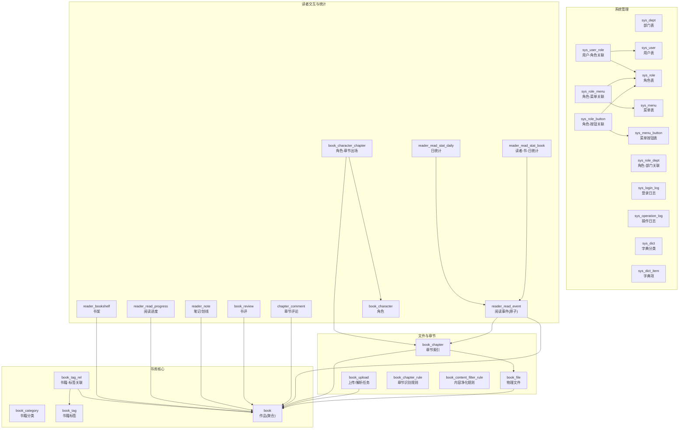
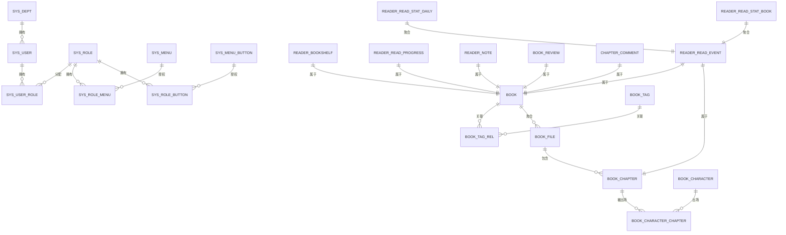
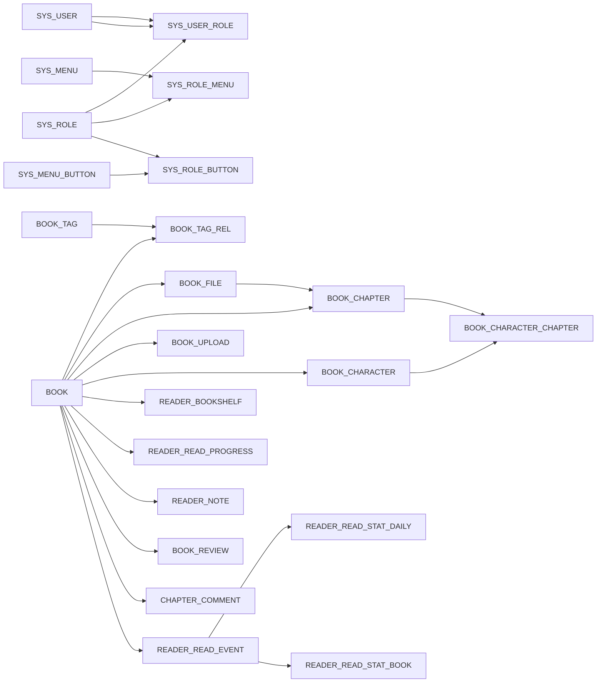

# 数据库表结构

<cite>
**本文档引用的文件**
- [system-manage.sql](file://app/sql/system-manage.sql)
- [book_v1.sql](file://app/sql/book_v1.sql)
- [book_v2.sql](file://app/sql/book_v2.sql)
- [book_v3.sql](file://app/sql/book_v3.sql)
- [book_v4.sql](file://app/sql/book_v4.sql)
- [sys_user.go](file://app/server/internal/model/sys_user.go)
- [sys_dept.go](file://app/server/internal/model/sys_dept.go)
- [sys_role.go](file://app/server/internal/model/sys_role.go)
- [sys_menu.go](file://app/server/internal/model/sys_menu.go)
- [sys_dict.go](file://app/server/internal/model/sys_dict.go)
- [sys_log.go](file://app/server/internal/model/sys_log.go)
- [book.go](file://app/server/internal/model/book.go)
- [book_category.go](file://app/server/internal/model/book_category.go)
- [book_tag.go](file://app/server/internal/model/book_tag.go)
- [book_file.go](file://app/server/internal/model/book_file.go)
</cite>

## 目录
1. [简介](#简介)
2. [项目结构](#项目结构)
3. [核心组件](#核心组件)
4. [架构总览](#架构总览)
5. [详细组件分析](#详细组件分析)
6. [依赖分析](#依赖分析)
7. [性能考虑](#性能考虑)
8. [故障排查指南](#故障排查指南)
9. [结论](#结论)

## 简介
本文件面向boread项目的数据库表结构，系统化梳理后台管理系统与电子书业务相关的核心数据表，包括但不限于：部门、角色、菜单、字典、登录与操作日志、用户；以及电子书的分类、标签、文件、章节、上传任务、规则、角色出场、阅读事件与统计等。文档提供每张表的字段定义、数据类型、约束条件、默认值、索引设计思路，并给出ER关系图与字段说明表，帮助开发者与运维人员快速理解与维护数据库。

## 项目结构
- 数据库初始化脚本位于 app/sql 目录，按功能模块拆分：
  - system-manage.sql：RBAC与系统管理相关表（部门、角色、菜单、字典、日志等）
  - book_v1.sql：书库基础表（分类、标签、作品聚合表、标签关联）
  - book_v2.sql：文件解析与章节管理（物理文件、章节索引、上传任务、章节规则、内容净化规则）
  - book_v3.sql：读者交互（书架、阅读进度、笔记/划线、书评、章节评论）
  - book_v4.sql：高级特性（角色、角色出场、阅读事件与统计）
- 对应的后端模型定义位于 app/server/internal/model，用于ORM映射与代码生成。

图表来源
- [system-manage.sql:27-331](file://app/sql/system-manage.sql#L27-L331)
- [book_v1.sql:34-137](file://app/sql/book_v1.sql#L34-L137)
- [book_v2.sql:14-163](file://app/sql/book_v2.sql#L14-L163)
- [book_v3.sql:15-157](file://app/sql/book_v3.sql#L15-L157)
- [book_v4.sql:14-140](file://app/sql/book_v4.sql#L14-L140)

章节来源
- [system-manage.sql:1-351](file://app/sql/system-manage.sql#L1-L351)
- [book_v1.sql:1-137](file://app/sql/book_v1.sql#L1-L137)
- [book_v2.sql:1-163](file://app/sql/book_v2.sql#L1-L163)
- [book_v3.sql:1-157](file://app/sql/book_v3.sql#L1-L157)
- [book_v4.sql:1-140](file://app/sql/book_v4.sql#L1-L140)

## 核心组件
本节概述各核心表的职责与关键字段，便于快速定位业务含义与使用场景。

- 系统管理表
  - sys_dept：组织架构树，支持祖先链加速子树查询，含软删与唯一索引
  - sys_role：角色定义与数据权限范围，含系统内置标识
  - sys_user：后台用户，含登录风控、密码过期策略、乐观锁
  - sys_menu：菜单树，支持路由元信息与常量路由
  - sys_dict / sys_dict_item：字典分类与字典项，支持运营灵活配置
  - sys_login_log / sys_operation_log：安全审计与行为追踪
- 书库核心表
  - book_category：书籍分类树，支持热分类与排序
  - book_tag：标签，带使用计数
  - book：作品聚合表，统一title+author标识，聚合统计与可见性控制
  - book_tag_rel：书籍-标签关联
- 文件与章节表
  - book_file：多文件聚合，主版本标记，解析状态与MD5去重
  - book_chapter：章节索引，按文件存储，支持VIP章节
  - book_upload：上传任务与解析状态
  - book_chapter_rule：章节识别规则，支持全局与单书覆盖
  - book_content_filter_rule：内容净化规则，支持入库/出库阶段
- 读者交互与统计表
  - reader_bookshelf / reader_read_progress / reader_note
  - book_review / chapter_comment
  - book_character / book_character_chapter
  - reader_read_event / reader_read_stat_daily / reader_read_stat_book

章节来源
- [system-manage.sql:27-331](file://app/sql/system-manage.sql#L27-L331)
- [book_v1.sql:34-137](file://app/sql/book_v1.sql#L34-L137)
- [book_v2.sql:14-163](file://app/sql/book_v2.sql#L14-L163)
- [book_v3.sql:15-157](file://app/sql/book_v3.sql#L15-L157)
- [book_v4.sql:14-140](file://app/sql/book_v4.sql#L14-L140)

## 架构总览
以下ER图展示系统管理与书库相关表之间的主外键关系，突出数据流向与依赖：

图表来源
- [system-manage.sql:27-331](file://app/sql/system-manage.sql#L27-L331)
- [book_v1.sql:34-137](file://app/sql/book_v1.sql#L34-L137)
- [book_v2.sql:14-163](file://app/sql/book_v2.sql#L14-L163)
- [book_v3.sql:15-157](file://app/sql/book_v3.sql#L15-L157)
- [book_v4.sql:14-140](file://app/sql/book_v4.sql#L14-L140)

## 详细组件分析

### 系统管理表

#### sys_dept（部门表）
- 主键：id
- 唯一索引：(dept_code, IFNULL(deleted_at,'1970-01-01 00:00:00'))
- 关键字段
  - parent_id：自关联父节点，顶层为0
  - ancestors：祖先链，加速子树查询
  - dept_name / dept_code：部门名称与编码
  - sort_order / status：排序与状态
  - create_by / update_by / create_time / update_time / deleted_at：通用审计字段
- 使用场景
  - 组织架构树展示与权限数据范围计算
  - 与角色-部门关联表配合实现“自定义部门”数据权限

章节来源
- [system-manage.sql:27-50](file://app/sql/system-manage.sql#L27-L50)
- [sys_dept.go:3-13](file://app/server/internal/model/sys_dept.go#L3-L13)

#### sys_role（角色表）
- 主键：id
- 唯一索引：(role_code, IFNULL(deleted_at,'1970-01-01 00:00:00'))
- 关键字段
  - role_name / role_code：角色标识
  - data_scope：数据权限范围枚举（全部/自定义/本部门/本部门及子部门/仅本人）
  - is_system：系统内置标识
  - sort_order / status：排序与状态
- 使用场景
  - 控制菜单/按钮授权与数据权限范围

章节来源
- [system-manage.sql:52-75](file://app/sql/system-manage.sql#L52-L75)
- [sys_role.go:14-24](file://app/server/internal/model/sys_role.go#L14-L24)

#### sys_role_dept（角色-部门关联）
- 主键：id
- 唯一索引：(role_id, dept_id)
- 关键字段
  - role_id / dept_id：角色与部门
- 使用场景
  - data_scope=2时，限定角色可访问的部门集合

章节来源
- [system-manage.sql:77-89](file://app/sql/system-manage.sql#L77-L89)
- [sys_role.go:28-33](file://app/server/internal/model/sys_role.go#L28-L33)

#### sys_user（用户表）
- 主键：id
- 唯一索引：(user_name, IFNULL(deleted_at,'1970-01-01 00:00:00'))
- 关键字段
  - dept_id：所属部门
  - user_name / password：登录账号与加密密码
  - pwd_updated_at / pwd_error_count / locked_until：密码过期与风控
  - user_gender / nick_name / user_phone / user_email / avatar：个人信息
  - last_login_time / last_login_ip：登录轨迹
  - status：状态
  - version：乐观锁
- 使用场景
  - 后台用户登录、权限分配、审计追踪

章节来源
- [system-manage.sql:91-128](file://app/sql/system-manage.sql#L91-L128)
- [sys_user.go:5-23](file://app/server/internal/model/sys_user.go#L5-L23)

#### sys_user_role（用户-角色关联）
- 主键：id
- 唯一索引：(user_id, role_id)
- 关键字段
  - user_id / role_id：用户与角色
  - create_time：关联创建时间
- 使用场景
  - 用户拥有的角色集合

章节来源
- [system-manage.sql:129-143](file://app/sql/system-manage.sql#L129-L143)
- [sys_user.go:27-33](file://app/server/internal/model/sys_user.go#L27-L33)

#### sys_menu（菜单表）
- 主键：id
- 唯一索引：(route_name, IFNULL(deleted_at,'1970-01-01 00:00:00'))
- 关键字段
  - parent_id：父菜单
  - menu_type：目录/菜单
  - menu_name / route_name / route_path：菜单信息
  - component / icon / icon_type：界面元素
  - keep_alive / constant / hide_in_menu / multi_tab / fixed_index_in_tab / query：路由配置
  - is_system / status：系统内置与状态
- 使用场景
  - 动态菜单渲染与权限控制

章节来源
- [system-manage.sql:145-181](file://app/sql/system-manage.sql#L145-L181)
- [sys_menu.go:19-42](file://app/server/internal/model/sys_menu.go#L19-L42)

#### sys_menu_button（菜单按钮表）
- 主键：id
- 唯一索引：(menu_id, button_code, IFNULL(deleted_at,'1970-01-01 00:00:00'))
- 关键字段
  - menu_id / button_code / button_desc：按钮标识与描述
- 使用场景
  - 菜单级按钮权限控制

章节来源
- [system-manage.sql:183-200](file://app/sql/system-manage.sql#L183-L200)

#### sys_role_menu（角色-菜单关联）
- 主键：id
- 唯一索引：(role_id, menu_id)
- 关键字段
  - role_id / menu_id：角色与菜单
- 使用场景
  - 角色可访问的菜单集合

章节来源
- [system-manage.sql:202-214](file://app/sql/system-manage.sql#L202-L214)

#### sys_role_button（角色-按钮关联）
- 主键：id
- 唯一索引：(role_id, button_id)
- 关键字段
  - role_id / button_id：角色与按钮
- 使用场景
  - 角色可执行的按钮操作

章节来源
- [system-manage.sql:216-228](file://app/sql/system-manage.sql#L216-L228)

#### sys_login_log（登录日志）
- 主键：id
- 索引
  - idx_user_time(user_type,user_id,login_time DESC)
  - idx_user_name(user_name)
  - idx_login_time(login_time DESC)
- 关键字段
  - user_type：后台/前台
  - user_id / user_name：用户标识
  - login_ip / user_agent：登录信息
  - login_type：登录/登出
  - login_result：成功/失败
  - message / login_time：提示与时间
- 使用场景
  - 登录审计与风控

章节来源
- [system-manage.sql:231-253](file://app/sql/system-manage.sql#L231-L253)
- [sys_log.go:29-41](file://app/server/internal/model/sys_log.go#L29-L41)

#### sys_operation_log（操作日志）
- 主键：id
- 索引
  - idx_user_time(user_id,operate_time DESC)
  - idx_module_action(module,action)
  - idx_target(module,target_id)
  - idx_operate_time(operate_time DESC)
- 关键字段
  - user_id / user_name：操作人
  - module / action：模块与动作
  - target_id / target_name：目标对象
  - request_url / request_method / request_body：请求信息
  - response_code / client_ip / user_agent：响应与环境
  - cost_ms / operate_time：耗时与时间
- 使用场景
  - 审计追踪与问题回溯

章节来源
- [system-manage.sql:255-283](file://app/sql/system-manage.sql#L255-L283)
- [sys_log.go:45-62](file://app/server/internal/model/sys_log.go#L45-L62)

#### sys_dict / sys_dict_item（字典）
- sys_dict
  - 主键：id
  - 唯一索引：(dict_code, IFNULL(deleted_at,'1970-01-01 00:00:00'))
  - 关键字段：dict_name / dict_code / dict_desc / is_system / status
- sys_dict_item
  - 主键：id
  - 唯一索引：(dict_id, item_value, IFNULL(deleted_at,'1970-01-01 00:00:00'))
  - 关键字段：dict_id / item_label / item_value / item_desc / sort_order / status
- 使用场景
  - 业务状态、可见性等枚举配置

章节来源
- [system-manage.sql:285-331](file://app/sql/system-manage.sql#L285-L331)
- [sys_dict.go:3-24](file://app/server/internal/model/sys_dict.go#L3-L24)

### 书库核心表

#### book_category（书籍分类）
- 主键：id
- 唯一索引：(category_code)
- 关键字段
  - parent_id / ancestors：树结构与祖先链
  - category_name / category_code：分类标识
  - description / sort_order / is_hot / status
- 使用场景
  - 书籍分类树与热门分类筛选

章节来源
- [book_v1.sql:34-57](file://app/sql/book_v1.sql#L34-L57)
- [book_category.go:3-13](file://app/server/internal/model/book_category.go#L3-L13)

#### book_tag（书籍标签）
- 主键：id
- 唯一索引：(tag_name)
- 关键字段
  - tag_name：标签名
  - description / usage_count / status
- 使用场景
  - 标签聚合与热门排序

章节来源
- [book_v1.sql:59-76](file://app/sql/book_v1.sql#L59-L76)
- [book_tag.go:3-8](file://app/server/internal/model/book_tag.go#L3-L8)

#### book（作品/聚合）
- 主键：id
- 索引
  - idx_title(title)
  - idx_author(author)
  - idx_title_author(title, author)
  - idx_category(category_id)
  - idx_dept_id(dept_id)
  - idx_status_visibility(status, visibility)
  - idx_deleted_at(deleted_at)
- 关键字段
  - title / author：聚合标识
  - cover / intro / category_id / language
  - serial_status / visibility：连载状态与可见性
  - primary_file_id：主版本文件
  - total_chapters / total_words / aggregate_status：聚合统计
  - avg_rating / rating_count：评分统计
  - owner_id / dept_id：数据权限
  - status：上架状态
- 使用场景
  - 书库检索、推荐、权限控制

章节来源
- [book_v1.sql:78-117](file://app/sql/book_v1.sql#L78-L117)
- [book.go:40-59](file://app/server/internal/model/book.go#L40-L59)

#### book_tag_rel（书籍-标签关联）
- 主键：id
- 唯一索引：(book_id, tag_id)
- 关键字段：book_id / tag_id
- 使用场景
  - 书籍打标签与筛选

章节来源
- [book_v1.sql:119-136](file://app/sql/book_v1.sql#L119-L136)
- [book.go:63-69](file://app/server/internal/model/book.go#L63-L69)

### 文件与章节表

#### book_file（物理文件）
- 主键：id
- 唯一索引：(content_md5)
- 索引
  - idx_book_id(book_id)
  - idx_book_primary(book_id, is_primary)
  - idx_file_status(file_status)
  - idx_deleted_at(deleted_at)
- 关键字段
  - book_id：归属作品
  - original_name / source_type / source_format / source_file_url：来源信息
  - content_path / content_size / content_md5 / content_charset / content_version：内容信息
  - chapter_count / is_primary：章节数与主版本
  - file_status / parse_message：解析状态与消息
- 使用场景
  - 多文件聚合与主版本选择

章节来源
- [book_v2.sql:14-47](file://app/sql/book_v2.sql#L14-L47)
- [book_file.go:24-41](file://app/server/internal/model/book_file.go#L24-L41)

#### book_chapter（章节索引）
- 主键：id
- 唯一索引：(book_id, file_id, chapter_no)
- 索引
  - idx_book_id(book_id)
  - idx_file_id(file_id)
  - idx_deleted_at(deleted_at)
- 关键字段
  - book_id / file_id：归属作品与来源文件
  - chapter_no / title：章节序号与标题
  - byte_offset / byte_length：字节偏移与长度
  - word_count / is_vip / status：字符数、VIP与状态
- 使用场景
  - 章节导航与内容读取

章节来源
- [book_v2.sql:50-77](file://app/sql/book_v2.sql#L50-L77)
- [book_file.go:54-66](file://app/server/internal/model/book_file.go#L54-L66)

#### book_upload（上传/解析任务）
- 主键：id
- 索引
  - idx_book_id(book_id)
  - idx_file_md5(file_md5)
  - idx_parse_status(parse_status)
- 关键字段
  - book_id：解析成功后回填
  - original_name / file_path / file_size / file_md5：文件信息
  - source_format：源格式
  - parse_status / parse_message：解析状态与消息
  - chapter_count：成功时的章节数
- 使用场景
  - 异步解析与失败追溯

章节来源
- [book_v2.sql:79-104](file://app/sql/book_v2.sql#L79-L104)

#### book_chapter_rule（章节识别规则）
- 主键：id
- 索引
  - idx_scope(scope_type, book_id)
  - idx_priority(priority)
  - idx_deleted_at(deleted_at)
- 关键字段
  - rule_name：规则名
  - scope_type：全局/单书覆盖
  - book_id：单书覆盖时必填
  - pattern / title_group：正则与捕获组
  - min_chapter_len / max_chapter_len：最小/最大长度
  - priority：优先级
  - description / status：说明与状态
- 使用场景
  - 解析txt章节标题

章节来源
- [book_v2.sql:106-133](file://app/sql/book_v2.sql#L106-L133)
- [book_file.go:104-117](file://app/server/internal/model/book_file.go#L104-L117)

#### book_content_filter_rule（内容净化规则）
- 主键：id
- 索引
  - idx_stage_status(apply_stage, status)
  - idx_category(category)
  - idx_deleted_at(deleted_at)
- 关键字段
  - rule_name：规则名
  - match_type：关键词/正则
  - pattern：匹配内容
  - action：替换/拦截/标记审核
  - replacement：替换文本
  - apply_stage：入库/出库阶段
  - category / severity：分类与严重程度
  - description / status：说明与状态
- 使用场景
  - 内容合规与敏感词处理

章节来源
- [book_v2.sql:135-162](file://app/sql/book_v2.sql#L135-L162)
- [book_file.go:155-168](file://app/server/internal/model/book_file.go#L155-L168)

### 读者交互与统计表

#### reader_bookshelf（书架）
- 主键：id
- 唯一索引：(reader_id, book_id)
- 索引
  - idx_book_id(book_id)
  - idx_last_read(reader_id, last_read_time)
  - idx_deleted_at(deleted_at)
- 关键字段
  - reader_id / book_id：读者与书籍
  - group_name / is_top：分组与置顶
  - last_read_time / add_time：最后阅读与加入时间
- 使用场景
  - 个人书架与最近阅读排序

章节来源
- [book_v3.sql:15-38](file://app/sql/book_v3.sql#L15-L38)

#### reader_read_progress（阅读进度）
- 主键：id
- 唯一索引：(reader_id, book_id)
- 索引
  - idx_chapter(chapter_id)
  - idx_deleted_at(deleted_at)
- 关键字段
  - reader_id / book_id：读者与书籍
  - file_id / chapter_id / chapter_no：当前章节
  - position / percent：章内位置与全书百分比
  - read_duration / last_read_time：累计时长与最后阅读
- 使用场景
  - 恢复阅读与进度同步

章节来源
- [book_v3.sql:40-65](file://app/sql/book_v3.sql#L40-L65)

#### reader_note（笔记/划线）
- 主键：id
- 索引
  - idx_reader_book(reader_id, book_id)
  - idx_chapter(chapter_id)
  - idx_deleted_at(deleted_at)
- 关键字段
  - reader_id / book_id：读者与书籍
  - chapter_id：章节（可空）
  - note_type：笔记/划线/划线+笔记
  - selected_text / start_offset / end_offset / highlight_color：选段与高亮
  - content：笔记内容
  - visibility：可见性
- 使用场景
  - 个人阅读标注

章节来源
- [book_v3.sql:67-93](file://app/sql/book_v3.sql#L67-L93)

#### book_review（书评）
- 主键：id
- 索引
  - idx_book_id(book_id)
  - idx_reader_id(reader_id)
  - idx_owner(owner_id)
  - idx_dept_id(dept_id)
  - idx_deleted_at(deleted_at)
- 约束
  - ck_review_rating：评分1-5
- 关键字段
  - book_id / reader_id：书籍与读者
  - rating / title / content：评分与内容
  - like_count / reply_count：互动
  - owner_id / dept_id：数据权限
  - status：状态
- 使用场景
  - 书评与评分

章节来源
- [book_v3.sql:95-124](file://app/sql/book_v3.sql#L95-L124)

#### chapter_comment（章节评论）
- 主键：id
- 索引
  - idx_chapter(chapter_id)
  - idx_book_id(book_id)
  - idx_reader_id(reader_id)
  - idx_parent_id(parent_id)
  - idx_owner(owner_id)
  - idx_dept_id(dept_id)
  - idx_deleted_at(deleted_at)
- 关键字段
  - book_id / chapter_id / reader_id：上下文
  - parent_id：父评论（0=顶层）
  - reply_to_id：回复的读者
  - content：评论内容
  - like_count：点赞
  - owner_id / dept_id：数据权限
  - status：状态
- 使用场景
  - 章节评论与楼中楼

章节来源
- [book_v3.sql:126-156](file://app/sql/book_v3.sql#L126-L156)

#### book_character（角色）
- 主键：id
- 索引
  - idx_book_id(book_id)
  - idx_name(name)
  - idx_role_type(role_type)
  - idx_deleted_at(deleted_at)
- 关键字段
  - book_id：归属作品
  - name / alias：角色名与别名
  - role_type：主角/配角/反派/龙套
  - avatar / intro / sort_order：头像、简介与排序
- 使用场景
  - 角色管理与筛选

章节来源
- [book_v4.sql:14-38](file://app/sql/book_v4.sql#L14-L38)

#### book_character_chapter（角色-章节出场）
- 主键：id
- 唯一索引：(character_id, chapter_id)
- 索引
  - idx_chapter_id(chapter_id)
- 关键字段
  - character_id / chapter_id：角色与章节
  - appearance_desc：出场描述
- 使用场景
  - 按角色筛选章节

章节来源
- [book_v4.sql:40-58](file://app/sql/book_v4.sql#L40-L58)

#### reader_read_event（阅读事件）
- 主键：id
- 索引
  - idx_reader_date(reader_id, event_date)
  - idx_book_id(book_id)
  - idx_event_date(event_date)
  - idx_deleted_at(deleted_at)
- 关键字段
  - reader_id / book_id / chapter_id：上下文
  - duration_sec / word_count：时长与字数
  - event_date / event_time：事件日期与时间
- 使用场景
  - 原始事件明细与日统计聚合源

章节来源
- [book_v4.sql:60-88](file://app/sql/book_v4.sql#L60-L88)

#### reader_read_stat_daily（日统计）
- 主键：id
- 唯一索引：(reader_id, stat_date)
- 索引
  - idx_stat_date(stat_date)
  - idx_deleted_at(deleted_at)
- 关键字段
  - reader_id / stat_date：统计维度
  - read_duration / read_words / book_count / chapter_count / session_count：统计指标
- 使用场景
  - 活跃度与阅读趋势分析

章节来源
- [book_v4.sql:90-114](file://app/sql/book_v4.sql#L90-L114)

#### reader_read_stat_book（读者-书-日统计）
- 主键：id
- 唯一索引：(reader_id, book_id, stat_date)
- 索引
  - idx_book_date(book_id, stat_date)
  - idx_deleted_at(deleted_at)
- 关键字段
  - reader_id / book_id / stat_date：统计维度
  - read_duration / read_words / chapter_count：统计指标
- 使用场景
  - 个人书单阅读排行

章节来源
- [book_v4.sql:116-140](file://app/sql/book_v4.sql#L116-L140)

## 依赖分析
- 外键关系
  - sys_user.dept_id → sys_dept.id
  - sys_user_role.role_id → sys_role.id
  - sys_user_role.user_id → sys_user.id
  - sys_role_menu.menu_id → sys_menu.id
  - sys_role_menu.role_id → sys_role.id
  - sys_role_button.button_id → sys_menu_button.id
  - sys_role_button.role_id → sys_role.id
  - book.category_id → book_category.id
  - book_tag_rel.book_id → book.id
  - book_tag_rel.tag_id → book_tag.id
  - book_file.book_id → book.id
  - book_chapter.file_id → book_file.id
  - book_chapter.book_id → book.id
  - book_upload.book_id → book.id
  - book_character.book_id → book.id
  - book_character_chapter.character_id → book_character.id
  - book_character_chapter.chapter_id → book_chapter.id
  - reader_bookshelf.book_id → book.id
  - reader_read_progress.book_id → book.id
  - reader_note.book_id → book.id
  - book_review.book_id → book.id
  - chapter_comment.book_id → book.id
  - reader_read_event.book_id → book.id
  - reader_read_event.chapter_id → book_chapter.id
  - reader_read_stat_daily.reader_id → sys_user.id
  - reader_read_stat_book.reader_id → sys_user.id
  - reader_read_stat_book.book_id → book.id
- 耦合与内聚
  - 书库模块围绕book为中心，通过文件、章节、标签、角色等扩展
  - 系统管理模块围绕RBAC与审计，与业务表通过外键建立清晰边界
- 潜在循环依赖
  - 未发现循环依赖，表间关系呈树状或星状

图表来源
- [system-manage.sql:27-331](file://app/sql/system-manage.sql#L27-L331)
- [book_v1.sql:34-137](file://app/sql/book_v1.sql#L34-L137)
- [book_v2.sql:14-163](file://app/sql/book_v2.sql#L14-L163)
- [book_v3.sql:15-157](file://app/sql/book_v3.sql#L15-L157)
- [book_v4.sql:14-140](file://app/sql/book_v4.sql#L14-L140)

## 性能考虑
- 索引设计
  - 软删统一使用函数索引(业务键, IFNULL(deleted_at,'1970-01-01 00:00:00'))避免重建同名数据
  - 树形结构使用ancestors前缀索引加速子树查询
  - 高频查询字段建立专用索引（如sys_user.user_name、book.title_author、book.status_visibility）
- 时间精度
  - 所有时间字段采用DATETIME(3)毫秒精度，满足审计与统计需求
- 冗余字段
  - book.total_chapters/words、book.avg_rating/rating_count、reader_read_stat_*等用于降低复杂查询成本
- 日志表
  - sys_login_log与sys_operation_log采用追加式写入，避免频繁更新
- 分区建议
  - reader_read_event按event_date分区可显著提升大体量下的查询性能（后期）

## 故障排查指南
- 常见问题与定位
  - 重复数据：检查唯一索引(业务键, IFNULL(deleted_at,...))是否生效
  - 权限异常：核对sys_role.data_scope与sys_role_dept配置
  - 解析失败：查看book_upload.parse_status与parse_message
  - 内容违规：核查book_content_filter_rule.apply_stage与category
  - 阅读统计不一致：检查reader_read_event到reader_read_stat_*的聚合流程
- 排查步骤
  - 确认外键是否存在且未被软删
  - 核对时间字段与毫秒精度
  - 检查索引是否命中（EXPLAIN）
  - 查看日志表sys_login_log与sys_operation_log定位操作轨迹

章节来源
- [system-manage.sql:1-18](file://app/sql/system-manage.sql#L1-L18)
- [book_v2.sql:135-162](file://app/sql/book_v2.sql#L135-L162)
- [book_v4.sql:60-88](file://app/sql/book_v4.sql#L60-L88)

## 结论
boread数据库以RBAC与书库为核心，围绕book构建了完整的电子书生态：从分类、标签、文件与章节索引，到读者交互与统计分析，形成高内聚、低耦合的表结构体系。通过软删、函数索引、冗余字段与日志审计等设计，兼顾了业务灵活性与运行效率。建议在生产环境中结合业务增长情况对reader_read_event进行分区，并定期清理历史日志与归档冷数据，以维持最佳性能。