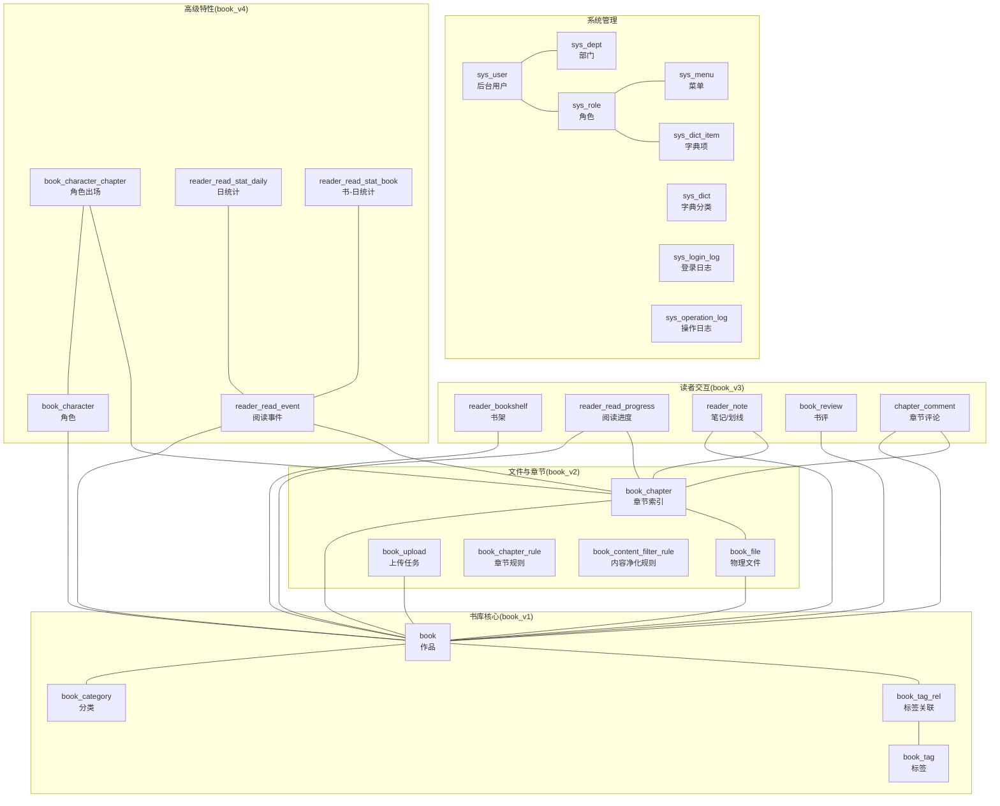
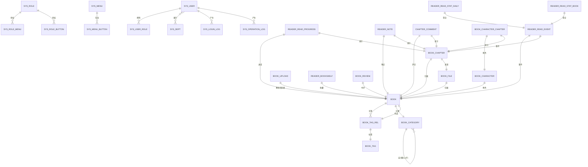
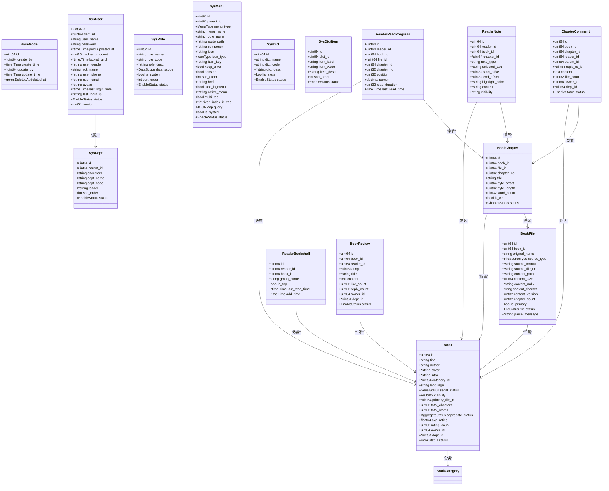
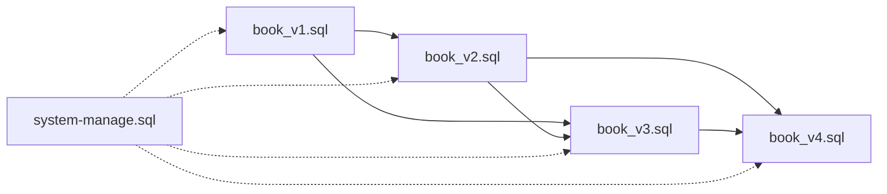

# 数据库设计

<cite>
**本文档引用的文件**
- [book_v1.sql](file://app/sql/book_v1.sql)
- [book_v2.sql](file://app/sql/book_v2.sql)
- [book_v3.sql](file://app/sql/book_v3.sql)
- [book_v4.sql](file://app/sql/book_v4.sql)
- [system-manage.sql](file://app/sql/system-manage.sql)
- [base.go](file://app/server/internal/model/base.go)
- [sys_user.go](file://app/server/internal/model/sys_user.go)
- [sys_dept.go](file://app/server/internal/model/sys_dept.go)
- [sys_role.go](file://app/server/internal/model/sys_role.go)
- [sys_menu.go](file://app/server/internal/model/sys_menu.go)
- [sys_dict.go](file://app/server/internal/model/sys_dict.go)
- [sys_config.go](file://app/server/internal/model/sys_config.go)
- [book.go](file://app/server/internal/model/book.go)
- [book_category.go](file://app/server/internal/model/book_category.go)
- [book_file.go](file://app/server/internal/model/book_file.go)
</cite>

## 目录
1. [简介](#简介)
2. [项目结构](#项目结构)
3. [核心组件](#核心组件)
4. [架构总览](#架构总览)
5. [详细组件分析](#详细组件分析)
6. [依赖分析](#依赖分析)
7. [性能考虑](#性能考虑)
8. [故障排查指南](#故障排查指南)
9. [结论](#结论)
10. [附录](#附录)

## 简介
本文件面向boread项目的数据库设计，聚焦以下主题：
- 电子书相关核心数据模型：作品、分类、标签、文件、章节、规则、角色与出场、阅读事件与统计等
- 用户权限与系统配置：RBAC、数据权限、字典、系统配置、登录与操作日志
- 表间关联关系、索引与约束设计
- 数据字典、枚举值、默认值等业务规则的数据库实现
- 数据库迁移策略、版本管理、备份恢复方案
- 性能优化建议、查询优化技巧、事务处理最佳实践
- ER图、数据流图等可视化设计说明

## 项目结构
数据库脚本按功能分层组织，采用“版本化迁移”的方式逐步演进：
- system-manage.sql：后台管理基础表（RBAC、部门、菜单、字典、日志等）
- book_v1.sql：书库核心（作品、分类、标签、关联）
- book_v2.sql：文件解析与章节管理（文件、章节、上传任务、章节规则、内容净化规则）
- book_v3.sql：读者交互（书架、阅读进度、笔记/划线、书评、章节评论）
- book_v4.sql：高级特性（角色与出场、阅读事件与统计）

图表来源
- [system-manage.sql:30-331](file://app/sql/system-manage.sql#L30-L331)
- [book_v1.sql:37-136](file://app/sql/book_v1.sql#L37-L136)
- [book_v2.sql:19-162](file://app/sql/book_v2.sql#L19-L162)
- [book_v3.sql:19-156](file://app/sql/book_v3.sql#L19-L156)
- [book_v4.sql:18-139](file://app/sql/book_v4.sql#L18-L139)

章节来源
- [system-manage.sql:1-351](file://app/sql/system-manage.sql#L1-L351)
- [book_v1.sql:1-137](file://app/sql/book_v1.sql#L1-L137)
- [book_v2.sql:1-163](file://app/sql/book_v2.sql#L1-L163)
- [book_v3.sql:1-157](file://app/sql/book_v3.sql#L1-L157)
- [book_v4.sql:1-140](file://app/sql/book_v4.sql#L1-L140)

## 核心组件
本节概述各核心数据模型及其职责边界，并给出关键字段与约束。

- 通用基类与枚举
  - BaseModel：统一的业务表字段（主键、创建/更新人、创建/更新时间、软删除），并与GORM命名保持一致
  - EnableStatus：通用启用/禁用状态
  - JSONMap：用于JSON字段的序列化/反序列化

- 系统管理
  - sys_user：后台用户，含部门、登录风控、密码策略、乐观锁版本
  - sys_dept：组织架构树，支持祖先链与层级查询
  - sys_role：角色与数据权限范围（全部/自定义部门/本部门/本部门及子部门/仅本人）
  - sys_menu：菜单与路由元信息
  - sys_dict / sys_dict_item：系统字典与字典项
  - sys_login_log / sys_operation_log：登录与操作审计日志

- 书库核心
  - book：作品聚合表，聚合标题/作者、封面、简介、分类、语言、连载状态、可见性、主文件、统计指标、状态与数据权限
  - book_category：分类树，支持祖先路径加速子树查询
  - book_tag / book_tag_rel：标签与作品的多对多关联

- 文件与章节
  - book_file：物理文件，支持多副本、主版本标记、解析状态、MD5校验、字符集与版本号
  - book_chapter：章节索引，按(作品, 文件, 章节序号)聚合，记录字节偏移与长度
  - book_upload：上传任务跟踪
  - book_chapter_rule：章节识别规则（支持全局默认与单书覆盖）
  - book_content_filter_rule：内容净化规则（入库/出库阶段应用）

- 读者交互
  - reader_bookshelf：书架与分组、置顶、最后阅读时间
  - reader_read_progress：阅读进度（章节、章内位置、全书百分比、累计时长）
  - reader_note：笔记/划线（区分类型、选段、高亮颜色、可见性）
  - book_review：书评（评分1-5星、标题、内容、点赞/回复数、状态）
  - chapter_comment：章节评论（楼中楼父子关系）

- 高级特性
  - book_character / book_character_chapter：角色与出场章节
  - reader_read_event：阅读事件原子日志（按天分区利于统计）
  - reader_read_stat_daily / reader_read_stat_book：按日与按书-日的聚合统计

章节来源
- [base.go:12-52](file://app/server/internal/model/base.go#L12-L52)
- [sys_user.go:5-36](file://app/server/internal/model/sys_user.go#L5-L36)
- [sys_dept.go:3-16](file://app/server/internal/model/sys_dept.go#L3-L16)
- [sys_role.go:14-36](file://app/server/internal/model/sys_role.go#L14-L36)
- [sys_menu.go:19-45](file://app/server/internal/model/sys_menu.go#L19-L45)
- [sys_dict.go:3-27](file://app/server/internal/model/sys_dict.go#L3-L27)
- [sys_config.go:3-89](file://app/server/internal/model/sys_config.go#L3-L89)
- [book.go:40-70](file://app/server/internal/model/book.go#L40-L70)
- [book_category.go:3-15](file://app/server/internal/model/book_category.go#L3-L15)
- [book_file.go:24-181](file://app/server/internal/model/book_file.go#L24-L181)

## 架构总览
数据库整体采用“后台管理+书库业务”双域分离：
- 后台管理域：RBAC、组织、菜单、字典、日志等，支撑系统治理与运营
- 书库业务域：作品、文件、章节、读者交互与统计，支撑阅读体验与内容运营

图表来源
- [system-manage.sql:30-331](file://app/sql/system-manage.sql#L30-L331)
- [book_v1.sql:37-136](file://app/sql/book_v1.sql#L37-L136)
- [book_v2.sql:19-162](file://app/sql/book_v2.sql#L19-L162)
- [book_v3.sql:19-156](file://app/sql/book_v3.sql#L19-L156)
- [book_v4.sql:18-139](file://app/sql/book_v4.sql#L18-L139)

## 详细组件分析

### 电子书相关表

#### 作品表 book
- 业务要点
  - 聚合标识：title+author
  - 主版本文件：primary_file_id
  - 统计冗余：total_chapters、total_words、avg_rating、rating_count
  - 状态与可见性：status、visibility
  - 数据权限：owner_id、dept_id
- 关键索引
  - 标题/作者组合索引、分类索引、部门索引、状态-可见性组合索引
- 约束与默认
  - 枚举值：serial_status、visibility、aggregate_status、status
  - 默认值：语言、聚合状态、评分与计数等

章节来源
- [book_v1.sql:84-117](file://app/sql/book_v1.sql#L84-L117)
- [book.go:40-59](file://app/server/internal/model/book.go#L40-L59)

#### 分类表 book_category
- 业务要点
  - 自关联树，ancestors加速子树查询
  - 唯一编码：category_code
- 关键索引
  - 父节点索引、唯一编码索引
- 约束与默认
  - 状态：启用/禁用
  - 热门标记

章节来源
- [book_v1.sql:37-57](file://app/sql/book_v1.sql#L37-L57)
- [book_category.go:3-15](file://app/server/internal/model/book_category.go#L3-L15)

#### 标签与关联表
- book_tag：标签名唯一、使用计数冗余
- book_tag_rel：唯一约束(book_id, tag_id)，加速标签-作品查询

章节来源
- [book_v1.sql:62-136](file://app/sql/book_v1.sql#L62-L136)

#### 物理文件与章节
- book_file
  - 多副本支持、主版本标记、MD5校验、解析状态、字符集与版本号
  - 唯一索引：content_md5；复合索引：book_id+is_primary
- book_chapter
  - 聚合：(book_id, file_id, chapter_no)唯一
  - 记录字节偏移与长度，便于文件切片读取
- book_upload：上传任务跟踪，解析状态机
- book_chapter_rule：章节识别规则，支持全局默认与单书覆盖
- book_content_filter_rule：内容净化规则，支持入库/出库阶段

章节来源
- [book_v2.sql:19-162](file://app/sql/book_v2.sql#L19-L162)
- [book_file.go:24-181](file://app/server/internal/model/book_file.go#L24-L181)

#### 读者交互
- reader_bookshelf：书架分组、置顶、最后阅读时间
- reader_read_progress：持续覆写的阅读进度，记录章节与章内位置
- reader_note：笔记/划线合并设计，note_type区分类型
- book_review：书评评分1-5星，带标题、内容、点赞/回复数
- chapter_comment：楼中楼评论，parent_id自关联

章节来源
- [book_v3.sql:19-156](file://app/sql/book_v3.sql#L19-L156)

#### 高级特性
- book_character / book_character_chapter：角色与出场章节
- reader_read_event：阅读事件原子日志，按event_date分区
- reader_read_stat_daily / reader_read_stat_book：按日与按书-日聚合统计

章节来源
- [book_v4.sql:18-139](file://app/sql/book_v4.sql#L18-L139)

### 用户权限与系统配置

#### RBAC与数据权限
- sys_user：后台用户，部门关联、登录风控、密码策略、乐观锁
- sys_dept：组织树，祖先链与层级查询
- sys_role：角色与数据权限范围（全部/自定义部门/本部门/本部门及子部门/仅本人）
- sys_role_dept：自定义部门数据权限
- sys_user_role、sys_role_menu、sys_role_button：关联表

章节来源
- [system-manage.sql:30-228](file://app/sql/system-manage.sql#L30-L228)
- [sys_user.go:5-36](file://app/server/internal/model/sys_user.go#L5-L36)
- [sys_dept.go:3-16](file://app/server/internal/model/sys_dept.go#L3-L16)
- [sys_role.go:14-36](file://app/server/internal/model/sys_role.go#L14-L36)

#### 菜单与按钮
- sys_menu：菜单类型、路由、组件、图标、国际化、缓存、常量路由等
- sys_menu_button：按钮编码与描述
- sys_role_menu、sys_role_button：角色授权

章节来源
- [system-manage.sql:149-228](file://app/sql/system-manage.sql#L149-L228)
- [sys_menu.go:19-45](file://app/server/internal/model/sys_menu.go#L19-L45)

#### 字典与系统配置
- sys_dict / sys_dict_item：系统字典与字典项，item_value业务唯一
- sys_config / sys_config_rule / sys_config_history：系统配置主表、规则明细与变更历史

章节来源
- [system-manage.sql:285-331](file://app/sql/system-manage.sql#L285-L331)
- [sys_dict.go:3-27](file://app/server/internal/model/sys_dict.go#L3-L27)
- [sys_config.go:3-89](file://app/server/internal/model/sys_config.go#L3-L89)

#### 审计日志
- sys_login_log：登录/登出结果、IP、UA、时间索引
- sys_operation_log：模块、动作、目标、请求/响应、耗时、时间索引

章节来源
- [system-manage.sql:237-283](file://app/sql/system-manage.sql#L237-L283)

### 数据模型类图（代码级）

图表来源
- [base.go:12-52](file://app/server/internal/model/base.go#L12-L52)
- [sys_user.go:5-36](file://app/server/internal/model/sys_user.go#L5-L36)
- [sys_dept.go:3-16](file://app/server/internal/model/sys_dept.go#L3-L16)
- [sys_role.go:14-36](file://app/server/internal/model/sys_role.go#L14-L36)
- [sys_menu.go:19-45](file://app/server/internal/model/sys_menu.go#L19-L45)
- [sys_dict.go:3-27](file://app/server/internal/model/sys_dict.go#L3-L27)
- [book.go:40-59](file://app/server/internal/model/book.go#L40-L59)
- [book_file.go:24-68](file://app/server/internal/model/book_file.go#L24-L68)
- [book.go:40-59](file://app/server/internal/model/book.go#L40-L59)
- [book_file.go:24-68](file://app/server/internal/model/book_file.go#L24-L68)
- [book_file.go:54-68](file://app/server/internal/model/book_file.go#L54-L68)
- [book_file.go:80-94](file://app/server/internal/model/book_file.go#L80-L94)
- [book_file.go:104-119](file://app/server/internal/model/book_file.go#L104-L119)
- [book_file.go:155-170](file://app/server/internal/model/book_file.go#L155-L170)
- [book_v3.sql:19-156](file://app/sql/book_v3.sql#L19-L156)

## 依赖分析
- 版本依赖
  - book_v2依赖book_v1的book表
  - book_v3依赖book_v1的book以及book_v2的book_chapter
  - book_v4依赖book_v1的book以及book_v2的book_chapter
  - system-manage.sql为后台管理域，不依赖业务表
- 外键与软删除
  - 业务表统一增加deleted_at软删除字段，配合函数索引避免重建同名数据问题
  - 关联表统一使用id外键，避免历史数据因用户改名导致的脏数据
- 数据权限
  - sys_role.data_scope与sys_role_dept共同决定数据可见范围

图表来源
- [book_v1.sql:1-10](file://app/sql/book_v1.sql#L1-L10)
- [book_v2.sql:1-10](file://app/sql/book_v2.sql#L1-L10)
- [book_v3.sql:1-10](file://app/sql/book_v3.sql#L1-L10)
- [book_v4.sql:1-10](file://app/sql/book_v4.sql#L1-L10)
- [system-manage.sql:1-18](file://app/sql/system-manage.sql#L1-L18)

章节来源
- [book_v1.sql:1-10](file://app/sql/book_v1.sql#L1-L10)
- [book_v2.sql:1-10](file://app/sql/book_v2.sql#L1-L10)
- [book_v3.sql:1-10](file://app/sql/book_v3.sql#L1-L10)
- [book_v4.sql:1-10](file://app/sql/book_v4.sql#L1-L10)
- [system-manage.sql:1-18](file://app/sql/system-manage.sql#L1-L18)

## 性能考虑
- 索引设计
  - 作品：title、author、title+author、category_id、dept_id、status+visibility、deleted_at
  - 分类：parent_id、category_code、deleted_at
  - 标签：tag_name、deleted_at
  - 文件：book_id、content_md5、book_id+is_primary、file_status、deleted_at
  - 章节：book_id、file_id、uk_book_file_chapter、deleted_at
  - 上传：book_id、file_md5、parse_status、deleted_at
  - 规则：scope_type+book_id、priority、stage+status、category、deleted_at
  - 读者交互：唯一索引(reader_id, book_id)、章节索引、评论父子索引、deleted_at
  - 高级特性：角色出场唯一索引、事件按日期分区索引
- 查询优化
  - 使用联合索引覆盖常见过滤条件（如status+visibility）
  - 利用函数索引避免软删后无法重建同名数据
  - 通过冗余字段减少复杂统计（如total_chapters、avg_rating）
- 事务与并发
  - 乐观锁：sys_user.version，避免并发更新冲突
  - 读写分离：日志表追加型，适合异步落盘
  - 分区：reader_read_event按event_date分区，提升统计查询效率
- 缓存与批处理
  - 章节索引基于字节偏移，结合文件系统缓存提升随机读性能
  - 统计表采用定时聚合，降低在线查询压力

## 故障排查指南
- 常见问题定位
  - 软删除重建：确认函数索引使用IFNULL(deleted_at,'1970-01-01')
  - 唯一约束冲突：检查业务键+deleted_at函数索引组合
  - 数据权限异常：核对sys_role.data_scope与sys_role_dept配置
- 日志审计
  - 登录/操作日志：sys_login_log、sys_operation_log，按用户+时间排序快速定位
- 业务异常
  - 评分范围：book_review.rating约束1-5
  - 章节状态：book_chapter.status枚举值
  - 文件解析：book_file.file_status状态机

章节来源
- [system-manage.sql:46-47](file://app/sql/system-manage.sql#L46-L47)
- [book_v3.sql:123-123](file://app/sql/book_v3.sql#L123-L123)
- [book_file.go:14-22](file://app/server/internal/model/book_file.go#L14-L22)
- [book_v2.sql:34-34](file://app/sql/book_v2.sql#L34-L34)

## 结论
本设计以“版本化迁移”为主线，将后台管理与书库业务清晰分离，围绕作品、文件、章节与读者交互构建完整闭环。通过合理的索引、约束与冗余设计，兼顾查询性能与维护成本；通过数据权限与审计日志保障系统安全与合规。建议在生产环境中结合分区、归档与备份策略，持续优化热点查询与统计计算。

## 附录

### 数据库迁移策略与版本管理
- 迁移策略
  - 采用顺序版本脚本（book_v1 → book_v2 → book_v3 → book_v4），确保依赖关系明确
  - system-manage.sql独立部署，不随业务脚本回滚
- 版本管理
  - 通过注释标明依赖与注意事项，便于回溯与升级
  - 建议在CI/CD中执行迁移脚本，记录执行结果与回滚点
- 备份与恢复
  - 建议定期全量备份+增量日志备份
  - 生产环境开启binlog，支持时间点恢复
  - 重要业务表（如reader_read_stat_*）建议周期性导出归档

### 业务规则与数据字典
- 枚举与默认值
  - 状态类：启用/禁用（EnableStatus）
  - 作品状态：已上架/下架/审核中/审核拒绝
  - 可见性：公开/仅自己/部门内
  - 连载状态：连载中/已完结/断更
  - 文件/章节状态：待处理/处理中/成功/失败/发布/草稿/下架
  - 数据权限范围：全部/自定义部门/本部门/本部门及子部门/仅本人
  - 章节规则作用域：全局默认/单书覆盖
  - 内容净化动作：替换/拦截整章/标记审核
- 字典表
  - sys_dict与sys_dict_item提供统一的业务字典管理，避免硬编码

章节来源
- [base.go:23-29](file://app/server/internal/model/base.go#L23-L29)
- [book.go:3-38](file://app/server/internal/model/book.go#L3-L38)
- [book_file.go:14-22](file://app/server/internal/model/book_file.go#L14-L22)
- [book_file.go:45-52](file://app/server/internal/model/book_file.go#L45-L52)
- [book_file.go:70-78](file://app/server/internal/model/book_file.go#L70-L78)
- [sys_role.go:3-12](file://app/server/internal/model/sys_role.go#L3-L12)
- [book_file.go:96-102](file://app/server/internal/model/book_file.go#L96-L102)
- [book_file.go:121-144](file://app/server/internal/model/book_file.go#L121-L144)
- [system-manage.sql:337-351](file://app/sql/system-manage.sql#L337-L351)