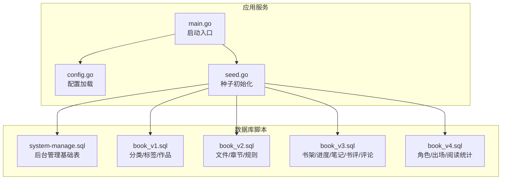
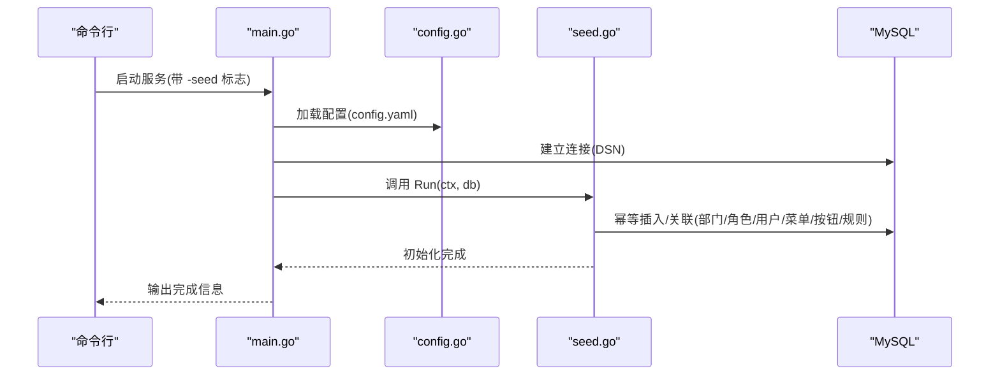
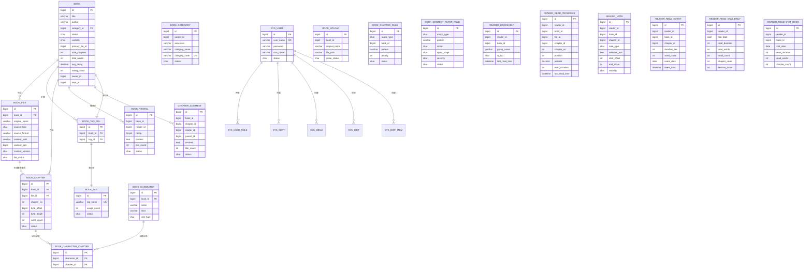
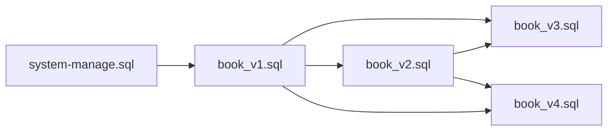

# 数据库迁移管理

<cite>
**本文引用的文件**   
- [book_v1.sql](file://app/sql/book_v1.sql)
- [book_v2.sql](file://app/sql/book_v2.sql)
- [book_v3.sql](file://app/sql/book_v3.sql)
- [book_v4.sql](file://app/sql/book_v4.sql)
- [system-manage.sql](file://app/sql/system-manage.sql)
- [main.go](file://app/server/cmd/api/main.go)
- [config.go](file://app/server/pkg/config/config.go)
- [config.example.yaml](file://app/server/configs/config.example.yaml)
- [config.yaml](file://app/server/configs/config.yaml)
- [seed.go](file://app/server/internal/seed/seed.go)
- [sys_user.go](file://app/server/internal/model/sys_user.go)
- [book.go](file://app/server/internal/model/book.go)
- [project.yaml](file://project.yaml)
</cite>

## 目录
1. [简介](#简介)
2. [项目结构](#项目结构)
3. [核心组件](#核心组件)
4. [架构总览](#架构总览)
5. [详细组件分析](#详细组件分析)
6. [依赖关系分析](#依赖关系分析)
7. [性能考量](#性能考量)
8. [故障排查指南](#故障排查指南)
9. [结论](#结论)
10. [附录](#附录)

## 简介
本文件系统化梳理 boread 项目的数据库迁移管理实践，围绕“书库”主题从 book_v1 到 book_v4 的版本演进，明确迁移脚本编写规范、版本控制策略、回滚机制与部署流程；并给出开发/测试/生产三阶段的落地步骤、数据备份与恢复策略、增量与全量迁移选择原则、风险评估与一致性保障、迁移后验证方法、工具使用与故障处理方案。

## 项目结构
- 数据库脚本集中于 app/sql，按功能域分版本维护：system-manage.sql 提供后台管理基础表（RBAC、字典、日志等），book_v1 至 book_v4 逐步扩展书库能力。
- 后端启动入口通过命令行参数触发“种子初始化”，连接数据库后执行幂等初始化，确保系统初始数据一致可用。
- 配置采用 YAML，包含数据库连接、日志级别、JWT 等关键参数，支持不同环境差异化配置。

**图表来源**
- [main.go:30-84](file://app/server/cmd/api/main.go#L30-L84)
- [config.go:58-66](file://app/server/pkg/config/config.go#L58-L66)
- [seed.go:14-54](file://app/server/internal/seed/seed.go#L14-L54)
- [system-manage.sql:1-351](file://app/sql/system-manage.sql#L1-L351)
- [book_v1.sql:1-137](file://app/sql/book_v1.sql#L1-L137)
- [book_v2.sql:1-163](file://app/sql/book_v2.sql#L1-L163)
- [book_v3.sql:1-157](file://app/sql/book_v3.sql#L1-L157)
- [book_v4.sql:1-140](file://app/sql/book_v4.sql#L1-L140)

**章节来源**
- [main.go:30-84](file://app/server/cmd/api/main.go#L30-L84)
- [config.go:58-66](file://app/server/pkg/config/config.go#L58-L66)
- [config.example.yaml:1-21](file://app/server/configs/config.example.yaml#L1-L21)
- [config.yaml:1-21](file://app/server/configs/config.yaml#L1-L21)

## 核心组件
- 迁移脚本集合：按版本顺序维护，明确依赖关系与注释，确保幂等与可回溯。
- 后端启动与种子初始化：通过命令行参数触发，连接数据库后执行幂等初始化，避免重复数据。
- 配置体系：YAML 驱动，支持不同环境差异化配置，便于 CI/CD 注入。

**章节来源**
- [system-manage.sql:1-351](file://app/sql/system-manage.sql#L1-L351)
- [book_v1.sql:1-137](file://app/sql/book_v1.sql#L1-L137)
- [book_v2.sql:1-163](file://app/sql/book_v2.sql#L1-L163)
- [book_v3.sql:1-157](file://app/sql/book_v3.sql#L1-L157)
- [book_v4.sql:1-140](file://app/sql/book_v4.sql#L1-L140)
- [seed.go:14-54](file://app/server/internal/seed/seed.go#L14-L54)

## 架构总览
以下序列图展示“种子初始化”的关键调用链，体现迁移脚本与后端服务的衔接。

**图表来源**
- [main.go:30-84](file://app/server/cmd/api/main.go#L30-L84)
- [config.go:58-66](file://app/server/pkg/config/config.go#L58-L66)
- [seed.go:14-54](file://app/server/internal/seed/seed.go#L14-L54)

## 详细组件分析

### 版本演进与结构变更（book_v1 → book_v4）
- book_v1：构建书库核心实体，包含用户扩展、分类、标签、作品主表与标签关联，奠定聚合式作品模型与软删除规范。
- book_v2：引入文件与章节索引，支持多文件聚合、章节规则与内容净化规则，形成“文件-章节-索引”的解耦架构。
- book_v3：读者交互增强，涵盖书架分组与置顶、阅读进度、笔记/划线、书评与章节评论，完善用户行为闭环。
- book_v4：高级特性扩展，新增角色与出场、阅读事件与多层统计（日/书-日），支撑精细化运营与分析。

**图表来源**
- [system-manage.sql:1-351](file://app/sql/system-manage.sql#L1-L351)
- [book_v1.sql:1-137](file://app/sql/book_v1.sql#L1-L137)
- [book_v2.sql:1-163](file://app/sql/book_v2.sql#L1-L163)
- [book_v3.sql:1-157](file://app/sql/book_v3.sql#L1-L157)
- [book_v4.sql:1-140](file://app/sql/book_v4.sql#L1-L140)

**章节来源**
- [book_v1.sql:1-137](file://app/sql/book_v1.sql#L1-L137)
- [book_v2.sql:1-163](file://app/sql/book_v2.sql#L1-L163)
- [book_v3.sql:1-157](file://app/sql/book_v3.sql#L1-L157)
- [book_v4.sql:1-140](file://app/sql/book_v4.sql#L1-L140)

### 迁移脚本编写规范
- 版本化命名：以 book_vN.sql 体现演进顺序，system-manage.sql 作为后台管理基础。
- 明确依赖：各版本脚本注释中声明依赖关系，确保执行顺序正确。
- 幂等性：通过唯一索引、软删除字段、函数索引等手段规避重复创建与重建问题。
- 可回溯：每个版本聚焦单一主题，便于定位问题与回滚。
- 注释与约束：详尽注释字段含义、索引用途与业务约束，提升可维护性。

**章节来源**
- [book_v1.sql:1-10](file://app/sql/book_v1.sql#L1-L10)
- [book_v2.sql:1-10](file://app/sql/book_v2.sql#L1-L10)
- [book_v3.sql:1-11](file://app/sql/book_v3.sql#L1-L11)
- [book_v4.sql:1-10](file://app/sql/book_v4.sql#L1-L10)
- [system-manage.sql:1-18](file://app/sql/system-manage.sql#L1-L18)

### 版本控制策略
- 分支策略：每个版本对应一个稳定分支或标签，变更通过 PR 合并。
- 标签规范：以 vN 命名，配合变更日志与发布说明。
- 合并限制：禁止跨版本直接修改，必须基于最新版本进行增量演进。

[本节为通用策略说明，不直接分析具体文件，故无“章节来源”]

### 回滚机制
- 原则：优先使用“降级/禁用”而非删除，保留历史数据与审计线索。
- 回滚清单：
  - 删除新增表/索引时，需同步删除相关规则与关联数据。
  - 修改列属性时，应先添加新列，迁移数据，再删除旧列。
  - 禁用规则/开关：通过状态字段或配置项控制，避免破坏性变更。
- 验证：回滚后检查关键查询与接口行为，确保业务可用。

[本节为通用策略说明，不直接分析具体文件，故无“章节来源”]

### 迁移流程（开发/测试/生产）
- 开发环境
  - 使用本地 MySQL 实例，配置文件指向本地地址。
  - 启动服务时附加 -seed 标志，自动执行幂等初始化。
  - 验证：访问后台管理与书库接口，确认数据与权限正常。
- 测试环境
  - 使用测试库实例，配置文件指向测试地址。
  - 执行全量脚本（system-manage.sql + book_v1~v4），确保依赖顺序正确。
  - 运行回归测试，覆盖关键业务路径。
- 生产环境
  - 采用只读备份窗口，执行预演与演练。
  - 严格遵循“先备份、后变更、再验证、最后回滚演练”的四步法。
  - 通过灰度或蓝绿发布，逐步切换流量，监控关键指标。

**章节来源**
- [main.go:30-84](file://app/server/cmd/api/main.go#L30-L84)
- [config.yaml:1-21](file://app/server/configs/config.yaml#L1-L21)
- [config.example.yaml:1-21](file://app/server/configs/config.example.yaml#L1-L21)

### 数据备份与恢复策略
- 备份
  - 全量备份：mysqldump 导出（含触发器、视图、存储过程）。
  - 增量备份：binlog 增量，结合时间点恢复（PITR）。
  - 结构备份：单独导出 schema，便于快速重建。
- 恢复
  - 恢复顺序：先 system-manage.sql，再按版本顺序导入 book_v1~v4。
  - 验证：执行一致性校验与抽样查询，确保数据完整性。
- 灾备
  - 多机房部署，定期同步备份至异地。
  - 建立自动化恢复演练，验证 RTO/RPO 指标。

[本节为通用策略说明，不直接分析具体文件，故无“章节来源”]

### 增量迁移与全量迁移选择原则
- 增量迁移
  - 场景：小范围字段调整、索引补充、规则更新。
  - 优点：风险低、耗时短。
  - 注意：保持向后兼容，避免破坏现有查询计划。
- 全量迁移
  - 场景：重构表结构、拆分聚合表、引入新范式。
  - 优点：彻底优化、消除历史技术债。
  - 注意：需要严格的停机窗口与回滚预案。

[本节为通用策略说明，不直接分析具体文件，故无“章节来源”]

### 迁移风险评估与一致性保障
- 风险评估
  - 数据一致性：通过事务包裹关键 DML，必要时使用两阶段提交。
  - 性能影响：在低峰时段执行，评估锁竞争与 IO 峰值。
  - 兼容性：确保 ORM 映射与 SQL 约束一致，避免运行时异常。
- 一致性保障
  - 幂等初始化：种子逻辑按唯一键去重，避免重复数据。
  - 软删除：统一使用 deleted_at 字段，保留审计轨迹。
  - 索引与约束：使用函数索引与业务唯一键，防止重建冲突。

**章节来源**
- [seed.go:14-54](file://app/server/internal/seed/seed.go#L14-L54)
- [system-manage.sql:1-18](file://app/sql/system-manage.sql#L1-L18)

### 迁移后的验证方法
- 结构验证：对比目标版本的表结构与索引，确保与脚本一致。
- 数据验证：抽样查询关键表，核对业务字段与约束。
- 接口验证：调用核心接口（书架、阅读、评论、统计），观察返回与日志。
- 回归测试：执行自动化测试用例，覆盖主要业务路径。

[本节为通用策略说明，不直接分析具体文件，故无“章节来源”]

### 迁移工具使用指南
- 命令行参数
  - -seed：执行幂等初始化后退出，适用于首次部署或修复环境。
- 配置注入
  - 通过 config.yaml 指定数据库连接参数，CI/CD 中以环境变量覆盖。
- 运行方式
  - 开发：本地启动，自动连接数据库并执行初始化。
  - 生产：容器化部署，通过项目配置文件与环境变量注入。

**章节来源**
- [main.go:30-84](file://app/server/cmd/api/main.go#L30-L84)
- [config.go:58-66](file://app/server/pkg/config/config.go#L58-L66)
- [config.yaml:1-21](file://app/server/configs/config.yaml#L1-L21)
- [project.yaml:1-30](file://project.yaml#L1-L30)

## 依赖关系分析
- 脚本依赖
  - book_v1 依赖 system-manage.sql（sys_user 等基础表）。
  - book_v2 依赖 book_v1（book 表）。
  - book_v3 依赖 book_v1（book 表）与 book_v2（book_chapter）。
  - book_v4 依赖 book_v1（book 表）与 book_v2（book_chapter）。
- 服务依赖
  - main.go 通过 config.go 加载配置，建立数据库连接。
  - seed.go 在连接建立后执行幂等初始化，确保系统可用。

**图表来源**
- [system-manage.sql:1-351](file://app/sql/system-manage.sql#L1-L351)
- [book_v1.sql:1-137](file://app/sql/book_v1.sql#L1-L137)
- [book_v2.sql:1-163](file://app/sql/book_v2.sql#L1-L163)
- [book_v3.sql:1-157](file://app/sql/book_v3.sql#L1-L157)
- [book_v4.sql:1-140](file://app/sql/book_v4.sql#L1-L140)

**章节来源**
- [book_v1.sql:1-10](file://app/sql/book_v1.sql#L1-L10)
- [book_v2.sql:1-10](file://app/sql/book_v2.sql#L1-L10)
- [book_v3.sql:1-11](file://app/sql/book_v3.sql#L1-L11)
- [book_v4.sql:1-10](file://app/sql/book_v4.sql#L1-L10)

## 性能考量
- 索引设计
  - 聚合查询常用字段建立复合索引，如 book 的 title+author、章节的 book_id+file_id。
  - 软删除字段统一建立索引，避免全表扫描。
- 查询优化
  - 避免 SELECT *，按需查询减少网络与解析开销。
  - 对高频统计表（如阅读统计）考虑分区或物化视图。
- 连接池
  - 合理设置最大空闲/活动连接数，避免资源争用。

[本节为通用性能建议，不直接分析具体文件，故无“章节来源”]

## 故障排查指南
- 连接失败
  - 检查 config.yaml 中主机、端口、用户名、密码是否正确。
  - 确认数据库服务可达与防火墙策略。
- 权限不足
  - 确保数据库用户具备 CREATE/ALTER/DROP 权限。
  - 对 system-manage.sql 的函数索引需满足 MySQL 版本要求。
- 幂等初始化失败
  - 查看 seed.go 的错误输出，确认重复键冲突与外键依赖。
  - 检查 sys_user_profile 是否依赖 sys_user 存在。
- 回滚与恢复
  - 使用备份进行恢复，按依赖顺序导入脚本。
  - 若涉及列变更，优先采用“新增列→迁移→删除旧列”的两阶段策略。

**章节来源**
- [config.yaml:1-21](file://app/server/configs/config.yaml#L1-L21)
- [seed.go:14-54](file://app/server/internal/seed/seed.go#L14-L54)
- [system-manage.sql:1-18](file://app/sql/system-manage.sql#L1-L18)

## 结论
boread 的数据库迁移管理以“版本化脚本 + 幂等初始化 + 明确依赖 + 渐进演进”为核心，通过清晰的结构与严格的流程控制，有效降低了迁移风险并提升了可维护性。建议在生产环境中坚持“预演-备份-验证-回滚演练”的四步法，并结合自动化工具与监控告警，持续优化迁移效率与稳定性。

## 附录
- 配置示例
  - 开发/测试/生产分别使用不同的 config.yaml，通过环境变量注入敏感信息。
- 模型参考
  - 后端模型与数据库字段一一对应，确保 ORM 与 SQL 的一致性。

**章节来源**
- [config.example.yaml:1-21](file://app/server/configs/config.example.yaml#L1-L21)
- [config.yaml:1-21](file://app/server/configs/config.yaml#L1-L21)
- [sys_user.go:1-36](file://app/server/internal/model/sys_user.go#L1-L36)
- [book.go:1-70](file://app/server/internal/model/book.go#L1-L70)