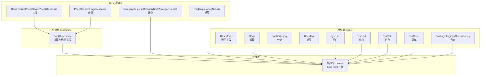
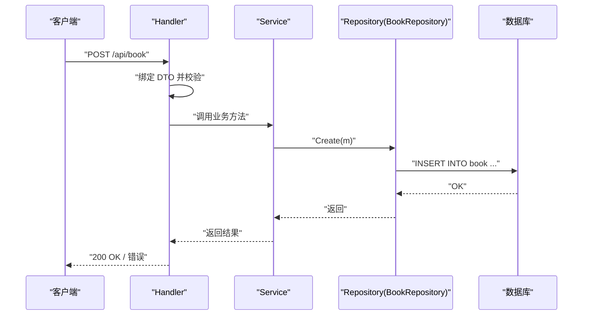
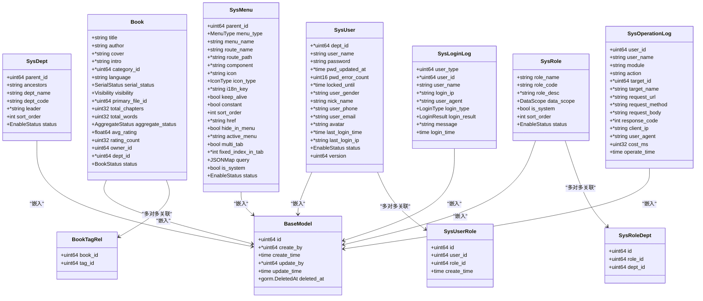
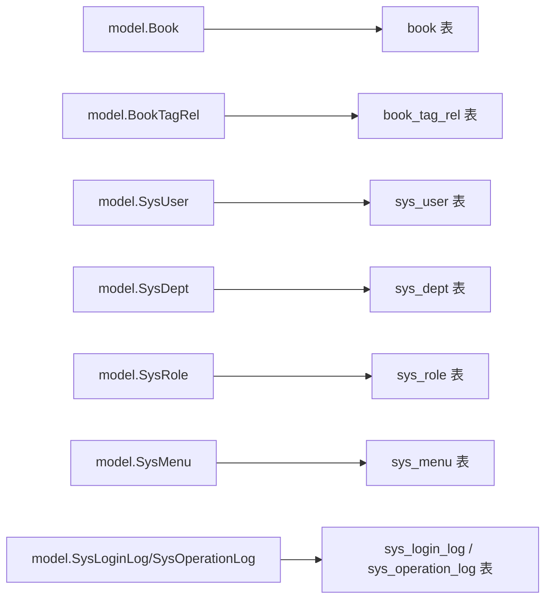

# 数据模型映射

<cite>
**本文引用的文件**
- [base.go](file://app/server/internal/model/base.go)
- [book.go](file://app/server/internal/model/book.go)
- [book_category.go](file://app/server/internal/model/book_category.go)
- [book_tag.go](file://app/server/internal/model/book_tag.go)
- [sys_user.go](file://app/server/internal/model/sys_user.go)
- [sys_dept.go](file://app/server/internal/model/sys_dept.go)
- [sys_role.go](file://app/server/internal/model/sys_role.go)
- [sys_menu.go](file://app/server/internal/model/sys_menu.go)
- [sys_log.go](file://app/server/internal/model/sys_log.go)
- [book.go](file://app/server/internal/repository/book.go)
- [common.go](file://app/server/internal/dto/common.go)
- [book.go](file://app/server/internal/dto/book.go)
- [book_category.go](file://app/server/internal/dto/book_category.go)
- [book_tag.go](file://app/server/internal/dto/book_tag.go)
- [system-manage.sql](file://app/sql/system-manage.sql)
- [book_v4.sql](file://app/sql/book_v4.sql)
</cite>

## 目录
1. [简介](#简介)
2. [项目结构](#项目结构)
3. [核心组件](#核心组件)
4. [架构总览](#架构总览)
5. [详细组件分析](#详细组件分析)
6. [依赖分析](#依赖分析)
7. [性能考虑](#性能考虑)
8. [故障排查指南](#故障排查指南)
9. [结论](#结论)
10. [附录](#附录)

## 简介
本文件聚焦于 boread 项目的“数据模型与数据库映射关系”，系统化梳理 Go 结构体（model）与数据库表之间的字段映射、数据类型转换、标签配置、Repository 层数据访问模式、ORM 使用方式、查询构建器实现、DTO 模式的作用与校验规则、模型继承关系图、查询示例与事务处理模式、性能优化建议与最佳实践。

## 项目结构
- 模型层位于 internal/model，采用 GORM 标签进行列名、索引、类型与约束声明。
- DTO 层位于 internal/dto，负责请求/响应数据结构与参数校验。
- Repository 层位于 internal/repository，封装数据库访问逻辑，使用 GORM 的链式查询构建器。
- SQL 初始化脚本位于 app/sql，定义表结构、索引与约束，确保模型与数据库一致。

图表来源
- [book.go:40-61](file://app/server/internal/model/book.go#L40-L61)
- [sys_user.go:6-25](file://app/server/internal/model/sys_user.go#L6-L25)
- [sys_dept.go:4-15](file://app/server/internal/model/sys_dept.go#L4-L15)
- [sys_role.go:15-26](file://app/server/internal/model/sys_role.go#L15-L26)
- [sys_menu.go:20-44](file://app/server/internal/model/sys_menu.go#L20-L44)
- [sys_log.go:30-64](file://app/server/internal/model/sys_log.go#L30-L64)
- [book.go:12-18](file://app/server/internal/repository/book.go#L12-L18)
- [system-manage.sql:99-128](file://app/sql/system-manage.sql#L99-L128)
- [book_v4.sql:19-38](file://app/sql/book_v4.sql#L19-L38)

章节来源
- [book.go:1-70](file://app/server/internal/model/book.go#L1-L70)
- [sys_user.go:1-36](file://app/server/internal/model/sys_user.go#L1-L36)
- [sys_dept.go:1-16](file://app/server/internal/model/sys_dept.go#L1-L16)
- [sys_role.go:1-36](file://app/server/internal/model/sys_role.go#L1-L36)
- [sys_menu.go:1-45](file://app/server/internal/model/sys_menu.go#L1-L45)
- [sys_log.go:1-65](file://app/server/internal/model/sys_log.go#L1-L65)
- [book.go:1-169](file://app/server/internal/repository/book.go#L1-L169)
- [common.go:1-52](file://app/server/internal/dto/common.go#L1-L52)
- [book.go:1-53](file://app/server/internal/dto/book.go#L1-L53)
- [book_category.go:1-42](file://app/server/internal/dto/book_category.go#L1-L42)
- [book_tag.go:1-11](file://app/server/internal/dto/book_tag.go#L1-L11)
- [system-manage.sql:1-351](file://app/sql/system-manage.sql#L1-L351)
- [book_v4.sql:1-140](file://app/sql/book_v4.sql#L1-L140)

## 核心组件
- 模型基类 BaseModel：统一 id、创建/更新/删除字段、毫秒时间戳、软删除索引，确保所有业务表具备一致的审计与生命周期字段。
- 通用状态枚举 EnableStatus：统一启用/禁用状态，与前端枚举对齐。
- JSONMap：自定义 JSON 字段类型，实现 driver.Valuer 与 sql.Scanner 接口，用于存储 JSON 数据（如菜单 query）。
- 书籍相关模型：Book、BookTagRel（书籍-标签关联）、BookCategory、BookTag。
- 系统管理相关模型：SysUser、SysUserRole、SysDept、SysRole、SysRoleDept、SysMenu、SysLoginLog、SysOperationLog。
- DTO：分页请求/响应、书籍请求/搜索/响应、分类请求/节点/搜索、标签请求/搜索。
- 仓储：BookRepository 封装书籍与标签关联的 CRUD、分页、条件查询、批量查询与关联查询。

章节来源
- [base.go:12-51](file://app/server/internal/model/base.go#L12-L51)
- [book.go:40-70](file://app/server/internal/model/book.go#L40-L70)
- [sys_user.go:6-35](file://app/server/internal/model/sys_user.go#L6-L35)
- [sys_dept.go:4-15](file://app/server/internal/model/sys_dept.go#L4-L15)
- [sys_role.go:15-35](file://app/server/internal/model/sys_role.go#L15-L35)
- [sys_menu.go:20-44](file://app/server/internal/model/sys_menu.go#L20-L44)
- [sys_log.go:30-64](file://app/server/internal/model/sys_log.go#L30-L64)
- [book.go:12-169](file://app/server/internal/repository/book.go#L12-L169)
- [common.go:3-52](file://app/server/internal/dto/common.go#L3-L52)
- [book.go:5-53](file://app/server/internal/dto/book.go#L5-L53)
- [book_category.go:5-42](file://app/server/internal/dto/book_category.go#L5-L42)
- [book_tag.go:3-11](file://app/server/internal/dto/book_tag.go#L3-L11)

## 架构总览
- 数据流：Handler 接收请求 → DTO 校验 → Service 组装 → Repository 查询/持久化 → Model 映射 → 返回 DTO/响应。
- ORM 使用：GORM v2，使用结构体标签声明列名、类型、约束、索引；使用链式查询构建器 Where/Order/Join/Count/Limit/Offset 等。
- DTO 校验：基于 binding 标签（如 required、max、oneof、min）在请求进入业务层前进行参数校验。
- 事务：在需要一致性保证的复合操作中使用事务（例如批量插入标签关联、更新书籍与标签关系）。

图表来源
- [book.go:20-26](file://app/server/internal/repository/book.go#L20-L26)
- [book.go:6-16](file://app/server/internal/dto/book.go#L6-L16)

## 详细组件分析

### 模型与表映射关系
- 通用字段映射（BaseModel → sys_user/sys_role/sys_menu 等）
  - 字段：id、create_by、create_time、update_by、update_time、deleted_at（带索引）
  - 类型：id、create_by、update_by、version 等为整型；时间字段为 DATETIME(3) 毫秒精度
  - 标签：gorm:"column:...;..."，json:"..."
- 书籍模型（book）
  - 主表：book → model.Book
  - 关联表：book_tag_rel → model.BookTagRel
  - 关键字段：标题、作者、封面、简介、分类、语言、连载状态、可见性、主文件、章节数、字数、聚合状态、评分、状态、拥有者、部门、软删除
  - 约束：字符长度、默认值、枚举映射、索引（category_id、dept_id、update_time）
- 分类模型（book_category）
  - 字段：parent_id、ancestors、category_name、category_code、description、sort_order、is_hot、status
  - 约束：自关联树、祖先链、唯一性、索引
- 标签模型（book_tag）
  - 字段：tag_name、description、usage_count
  - 约束：唯一性、索引
- 系统用户（sys_user）
  - 字段：dept_id、user_name、password、pwd_updated_at、pwd_error_count、locked_until、user_gender、nick_name、user_phone、user_email、avatar、last_login_time、last_login_ip、status、version
  - 约束：唯一索引（用户名）、索引（phone/email）、软删除
- 部门（sys_dept）
  - 字段：parent_id、ancestors、dept_name、dept_code、leader、sort_order、status
  - 约束：树形结构、唯一索引（dept_code）
- 角色（sys_role）
  - 字段：role_name、role_code、role_desc、data_scope、is_system、sort_order、status
  - 约束：唯一索引（role_code）、函数索引避免软删后无法重建
- 菜单（sys_menu）
  - 字段：parent_id、menu_type、menu_name、route_name、route_path、component、icon、icon_type、i18n_key、keep_alive、constant、sort_order、href、hide_in_menu、active_menu、multi_tab、fixed_index_in_tab、query(JSON)、is_system、status
  - 约束：唯一索引（route_name）、JSON 字段、索引
- 登录日志（sys_login_log）
  - 字段：user_type、user_id、user_name、login_ip、user_agent、login_type、login_result、message、login_time
  - 约束：索引（user_id+login_time DESC）
- 操作日志（sys_operation_log）
  - 字段：user_id、user_name、module、action、target_id、target_name、request_url、request_method、request_body、response_code、client_ip、user_agent、cost_ms、operate_time
  - 约束：索引（module/action、target_id）

章节来源
- [base.go:14-21](file://app/server/internal/model/base.go#L14-L21)
- [book.go:40-61](file://app/server/internal/model/book.go#L40-L61)
- [book_category.go:3-15](file://app/server/internal/model/book_category.go#L3-L15)
- [book_tag.go:3-11](file://app/server/internal/model/book_tag.go#L3-L11)
- [sys_user.go:6-25](file://app/server/internal/model/sys_user.go#L6-L25)
- [sys_dept.go:4-15](file://app/server/internal/model/sys_dept.go#L4-L15)
- [sys_role.go:15-26](file://app/server/internal/model/sys_role.go#L15-L26)
- [sys_menu.go:20-44](file://app/server/internal/model/sys_menu.go#L20-L44)
- [sys_log.go:30-64](file://app/server/internal/model/sys_log.go#L30-L64)
- [system-manage.sql:31-128](file://app/sql/system-manage.sql#L31-L128)
- [book_v4.sql:19-88](file://app/sql/book_v4.sql#L19-L88)

### DTO 模式与数据验证
- 分页通用：PageRequest（current、size、keyword）与 PageResponse（records、current、size、total）
- 书籍：BookRequest（新增/编辑）、BookUpdateStatusRequest（状态变更）、BookSearch（分页+多维过滤）、BookResponse（聚合标签与分类名）
- 分类：CategoryRequest、CategoryNode（树形结构）、CategorySearch
- 标签：TagRequest、TagSearch
- 校验规则：binding 标签（required、max、oneof、min、omitempty 等），在 Handler 层统一校验，减少脏数据进入业务层。

章节来源
- [common.go:4-52](file://app/server/internal/dto/common.go#L4-L52)
- [book.go:6-53](file://app/server/internal/dto/book.go#L6-L53)
- [book_category.go:5-42](file://app/server/internal/dto/book_category.go#L5-L42)
- [book_tag.go:3-11](file://app/server/internal/dto/book_tag.go#L3-L11)

### Repository 层数据访问模式与查询构建器
- BookRepository
  - 基础 CRUD：Create、Update、Delete、GetByID
  - 分页查询：Page（动态拼接 Where 条件：标题/作者模糊匹配、分类、状态、可见性、连载状态、标签、字数区间、更新时间区间），先 Count 再 Order+Offset+Limit
  - 精确查找：FindByTitleAndAuthor
  - 批量查询：ListByIDs
  - 标签关联：GetTagIDsByBookID、DeleteByBookID、BatchCreate、GetTagsByBookIDs、ListTagsByBookID（Join book_tag_rel + book_tag）
- 查询构建器使用要点
  - WithContext 传递上下文
  - Model 指定表
  - Where 动态拼接条件
  - Count 先统计总数
  - Order/Offset/Limit 控制排序与分页
  - Pluck/Joins/Select 优化字段与关联查询
  - IN/模糊 LIKE/比较运算符/空值判断

```mermaid
flowchart TD
Start(["进入 Page(ctx, req)"]) --> Init["初始化查询 tx = Model(Book)"]
Init --> CheckTitle{"req.Title 非空?"}
CheckTitle --> |是| WTitle["tx.Where(title LIKE %%)"] --> Next
CheckTitle --> |否| Next["继续"]
Next --> CheckAuthor{"req.Author 非空?"}
CheckAuthor --> |是| WAuthor["tx.Where(author LIKE %%)"] --> Next2
CheckAuthor --> |否| Next2
Next2 --> CheckCatIDs{"req.CategoryIDs 非空?"}
CheckCatIDs --> |是| WCIDs["tx.Where(category_id IN ?)"] --> Next3
CheckCatIDs --> |否| Next3
Next3 --> CheckStatus{"req.Status 非空?"}
CheckStatus --> |是| WStatus["tx.Where(status = ?)"] --> Next4
CheckStatus --> |否| Next4
Next4 --> CheckVisibility{"req.Visibility 非空?"}
CheckVisibility --> |是| WVis["tx.Where(visibility = ?)"] --> Next5
CheckVisibility --> |否| Next5
Next5 --> CheckSerial{"req.SerialStatus 非空?"}
CheckSerial --> |是| WSerial["tx.Where(serial_status = ?)"] --> Next6
CheckSerial --> |否| Next6
Next6 --> CheckTag{"req.TagID > 0?"}
CheckTag --> |是| WTag["tx.Where(id IN (SELECT book_id FROM book_tag_rel WHERE tag_id = ?))"] --> Next7
CheckTag --> |否| Next7
Next7 --> CheckWords{"Min/Max Words 设置?"}
CheckWords --> |是| WWords["tx.Where(total_words >=/*<=*/ ?)"] --> Next8
CheckWords --> |否| Next8
Next8 --> CheckTime{"时间范围设置?"}
CheckTime --> |是| WTime["tx.Where(update_time BETWEEN ...)"] --> Next9
CheckTime --> |否| Next9
Next9 --> Count["tx.Count(&total)"]
Count --> OrderLimit["Order(id DESC).Offset().Limit().Find(&rows)"]
OrderLimit --> Done(["返回 rows,total"])
```

图表来源
- [book.go:40-84](file://app/server/internal/repository/book.go#L40-L84)

章节来源
- [book.go:12-169](file://app/server/internal/repository/book.go#L12-L169)

### 模型继承关系与组合
- 继承关系
  - BaseModel 作为所有业务表的嵌入基类，统一审计字段与软删除
  - Book 组合 BaseModel，扩展书籍特有字段
  - 系统管理表（用户、部门、角色、菜单、日志）同样组合 BaseModel
- 组合关系
  - Book 与 BookTagRel（多对多中间表）配合实现标签关联
  - SysUser 与 SysUserRole 实现用户-角色关联
  - SysRole 与 SysRoleDept 实现角色-部门数据权限

图表来源
- [base.go:14-21](file://app/server/internal/model/base.go#L14-L21)
- [book.go:40-61](file://app/server/internal/model/book.go#L40-L61)
- [sys_user.go:6-25](file://app/server/internal/model/sys_user.go#L6-L25)
- [sys_dept.go:4-15](file://app/server/internal/model/sys_dept.go#L4-L15)
- [sys_role.go:15-26](file://app/server/internal/model/sys_role.go#L15-L26)
- [sys_menu.go:20-44](file://app/server/internal/model/sys_menu.go#L20-L44)
- [sys_log.go:30-64](file://app/server/internal/model/sys_log.go#L30-L64)

### 查询示例与事务处理模式
- 查询示例
  - 按标题/作者模糊搜索：Where("title LIKE ? AND author LIKE ?")
  - 按分类集合过滤：Where("category_id IN ?", ids)
  - 按标签过滤：子查询关联 book_tag_rel
  - 按字数区间过滤：Where("total_words >= ? AND total_words <= ?")
  - 按更新时间范围过滤：Between
  - 批量查询与标签聚合：Pluck/Join/Group
- 事务处理模式
  - 在需要一致性保证的复合操作中使用事务，例如：
    - 开启事务：Begin()
    - 执行多个写操作（如更新书籍、删除旧标签关联、批量插入新标签）
    - 提交或回滚：Commit()/Rollback()

章节来源
- [book.go:40-84](file://app/server/internal/repository/book.go#L40-L84)
- [book.go:118-168](file://app/server/internal/repository/book.go#L118-L168)

## 依赖分析
- 模型与 SQL 的一致性
  - BaseModel 字段与 system-manage.sql 中 sys_user 等表字段保持一致（id、create_by、create_time、update_by、update_time、deleted_at）
  - 书籍模型字段与 book_v4.sql 中 book、book_character、book_character_chapter、reader_* 表字段保持一致
- DTO 与模型的映射
  - DTO 字段与模型字段一一对应，部分 DTO 为模型的扩展（如 BookResponse 聚合标签与分类名）
- 仓储与模型
  - Repository 直接操作 model.Book 与 model.BookTagRel，通过 GORM 标签映射到数据库表

图表来源
- [book.go:40-61](file://app/server/internal/model/book.go#L40-L61)
- [sys_user.go:6-25](file://app/server/internal/model/sys_user.go#L6-L25)
- [sys_dept.go:4-15](file://app/server/internal/model/sys_dept.go#L4-L15)
- [sys_role.go:15-26](file://app/server/internal/model/sys_role.go#L15-L26)
- [sys_menu.go:20-44](file://app/server/internal/model/sys_menu.go#L20-L44)
- [sys_log.go:30-64](file://app/server/internal/model/sys_log.go#L30-L64)
- [system-manage.sql:99-128](file://app/sql/system-manage.sql#L99-L128)
- [book_v4.sql:19-38](file://app/sql/book_v4.sql#L19-L38)

章节来源
- [system-manage.sql:1-351](file://app/sql/system-manage.sql#L1-L351)
- [book_v4.sql:1-140](file://app/sql/book_v4.sql#L1-L140)

## 性能考虑
- 索引设计
  - BaseModel 的 deleted_at 建有索引，支持软删除场景下的高效查询
  - 业务常用过滤字段（category_id、dept_id、user_phone、user_email、route_name、dept_code 等）建立索引
  - 函数索引：(业务键, IFNULL(deleted_at,'1970-01-01')) 避免软删后无法重建
- 查询优化
  - 分页使用 Count + Order + Offset + Limit，避免全表扫描
  - 关联查询使用 Join + Select 指定字段，减少不必要的列加载
  - 批量查询使用 IN 子句与 Pluck，降低网络往返
- 时间精度
  - 时间字段使用 DATETIME(3) 毫秒精度，满足审计与统计需求
- JSON 字段
  - JSONMap 实现自定义序列化/反序列化，避免 ORM 默认行为导致的不必要转换

章节来源
- [base.go:34-51](file://app/server/internal/model/base.go#L34-L51)
- [system-manage.sql:46-49](file://app/sql/system-manage.sql#L46-L49)
- [system-manage.sql:123-127](file://app/sql/system-manage.sql#L123-L127)
- [system-manage.sql:178-179](file://app/sql/system-manage.sql#L178-L179)
- [system-manage.sql:304-305](file://app/sql/system-manage.sql#L304-L305)

## 故障排查指南
- 常见问题
  - 字段名不一致：检查 GORM 标签 column 与 SQL 列名是否一致
  - 类型不匹配：确认 Go 类型与 SQL 类型（如 char(1)、JSON、DATETIME(3)）一致
  - 软删除：deleted_at 未正确设置导致查询不到数据，需确保 BaseModel 嵌入与软删除逻辑
  - JSON 字段：JSONMap Scan/Value 实现异常，检查 JSONMap 的序列化/反序列化
  - 分页错位：未先 Count 导致 total 不准确，确保先 Count 再分页查询
- 排查步骤
  - 核对模型标签与 SQL 脚本
  - 使用最小可复现请求，逐步缩小问题范围
  - 查看日志与慢查询，定位瓶颈

章节来源
- [base.go:34-51](file://app/server/internal/model/base.go#L34-L51)
- [book.go:76-83](file://app/server/internal/repository/book.go#L76-L83)

## 结论
本项目通过 BaseModel 统一审计字段、GORM 标签精确映射数据库列、DTO 校验前置、Repository 封装查询构建器，形成了清晰、可维护且高性能的数据访问层。结合合理的索引设计与事务处理模式，能够支撑业务的持续演进与稳定运行。

## 附录
- 字段映射速查
  - BaseModel → sys_user/sys_role/sys_menu 等：id、create_by、create_time、update_by、update_time、deleted_at
  - 书籍 → book：title、author、cover、intro、category_id、language、serial_status、visibility、primary_file_id、total_chapters、total_words、aggregate_status、avg_rating、rating_count、owner_id、dept_id、status
  - 标签关联 → book_tag_rel：book_id、tag_id
  - 用户 → sys_user：dept_id、user_name、password、pwd_updated_at、pwd_error_count、locked_until、user_gender、nick_name、user_phone、user_email、avatar、last_login_time、last_login_ip、status、version
  - 部门 → sys_dept：parent_id、ancestors、dept_name、dept_code、leader、sort_order、status
  - 角色 → sys_role：role_name、role_code、role_desc、data_scope、is_system、sort_order、status
  - 菜单 → sys_menu：parent_id、menu_type、menu_name、route_name、route_path、component、icon、icon_type、i18n_key、keep_alive、constant、sort_order、href、hide_in_menu、active_menu、multi_tab、fixed_index_in_tab、query(JSON)、is_system、status
  - 登录日志 → sys_login_log：user_type、user_id、user_name、login_ip、user_agent、login_type、login_result、message、login_time
  - 操作日志 → sys_operation_log：user_id、user_name、module、action、target_id、target_name、request_url、request_method、request_body、response_code、client_ip、user_agent、cost_ms、operate_time

章节来源
- [base.go:14-21](file://app/server/internal/model/base.go#L14-L21)
- [book.go:40-61](file://app/server/internal/model/book.go#L40-L61)
- [sys_user.go:6-25](file://app/server/internal/model/sys_user.go#L6-L25)
- [sys_dept.go:4-15](file://app/server/internal/model/sys_dept.go#L4-L15)
- [sys_role.go:15-26](file://app/server/internal/model/sys_role.go#L15-L26)
- [sys_menu.go:20-44](file://app/server/internal/model/sys_menu.go#L20-L44)
- [sys_log.go:30-64](file://app/server/internal/model/sys_log.go#L30-L64)
- [system-manage.sql:99-128](file://app/sql/system-manage.sql#L99-L128)
- [book_v4.sql:19-38](file://app/sql/book_v4.sql#L19-L38)