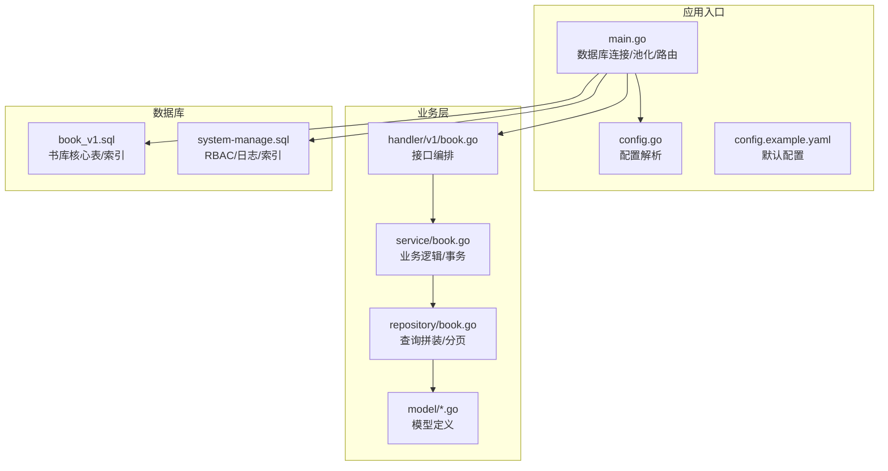
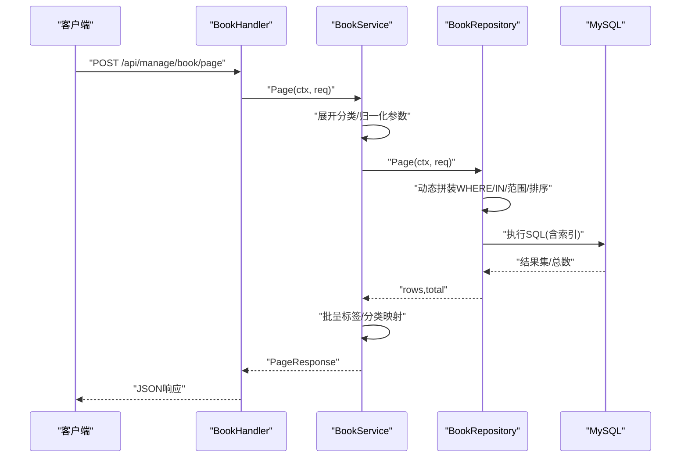
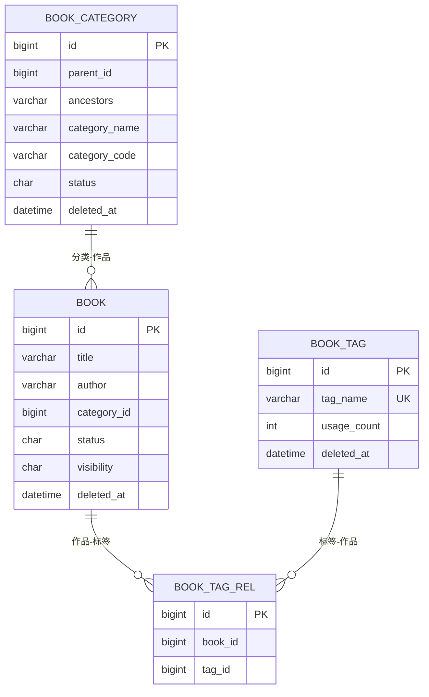
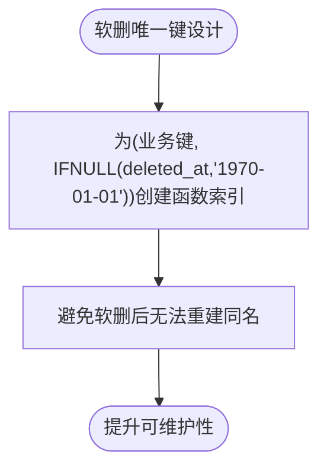
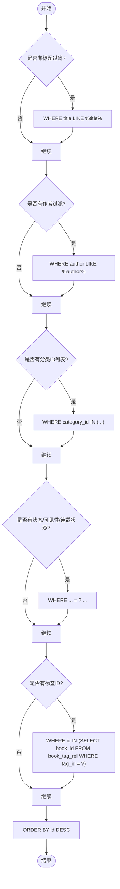
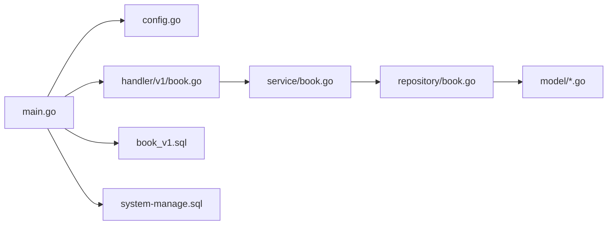

# 索引与性能优化

<cite>
**本文引用的文件**
- [main.go](file://app/server/cmd/api/main.go)
- [config.go](file://app/server/pkg/config/config.go)
- [config.example.yaml](file://app/server/configs/config.example.yaml)
- [book_v1.sql](file://app/sql/book_v1.sql)
- [system-manage.sql](file://app/sql/system-manage.sql)
- [base.go](file://app/server/internal/model/base.go)
- [book.go](file://app/server/internal/model/book.go)
- [sys_user.go](file://app/server/internal/model/sys_user.go)
- [book.go](file://app/server/internal/repository/book.go)
- [book.go](file://app/server/internal/service/book.go)
- [book.go](file://app/server/internal/handler/v1/book.go)
</cite>

## 目录
1. [简介](#简介)
2. [项目结构](#项目结构)
3. [核心组件](#核心组件)
4. [架构总览](#架构总览)
5. [详细组件分析](#详细组件分析)
6. [依赖关系分析](#依赖关系分析)
7. [性能考量](#性能考量)
8. [故障排查指南](#故障排查指南)
9. [结论](#结论)
10. [附录](#附录)

## 简介
本文件聚焦boread项目的数据库索引设计与性能优化，结合现有SQL脚本与Go服务实现，系统阐述以下主题：
- 索引设计策略：单列索引、复合索引、唯一索引、函数索引、前缀索引、降序索引
- 查询性能分析方法：慢查询日志、执行计划解读
- 索引优化建议：覆盖索引、前缀索引、降序索引技巧
- 高级优化技术：分区表设计思路、读写分离、缓存策略
- 实战案例：基于现有SQL与服务层的SQL优化建议、性能监控指标、容量规划建议

## 项目结构
后端采用Gin + GORM + MySQL架构，数据库连接与池化在入口处集中配置；业务模型、仓储与服务层清晰分层，查询条件主要集中在仓储层拼装。

**图表来源**
- [main.go:30-84](file://app/server/cmd/api/main.go#L30-L84)
- [config.go:58-66](file://app/server/pkg/config/config.go#L58-L66)
- [config.example.yaml:1-21](file://app/server/configs/config.example.yaml#L1-L21)
- [book.go:1-180](file://app/server/internal/handler/v1/book.go#L1-L180)
- [book.go:1-339](file://app/server/internal/service/book.go#L1-L339)
- [book.go:1-169](file://app/server/internal/repository/book.go#L1-L169)
- [book_v1.sql:1-137](file://app/sql/book_v1.sql#L1-L137)
- [system-manage.sql:1-351](file://app/sql/system-manage.sql#L1-L351)

**章节来源**
- [main.go:30-84](file://app/server/cmd/api/main.go#L30-L84)
- [config.go:58-66](file://app/server/pkg/config/config.go#L58-L66)
- [config.example.yaml:1-21](file://app/server/configs/config.example.yaml#L1-L21)

## 核心组件
- 数据库连接与池化：在入口处建立GORM连接并设置最大空闲/活跃连接数，确保并发访问稳定性。
- 业务模型：统一的BaseModel包含软删字段deleted_at，便于函数索引与软删场景。
- 仓储层：按查询条件动态拼装WHERE子句，支持分页、排序与多维筛选。
- 服务层：封装事务与标签/分类关联更新，减少重复查询。
- SQL脚本：书库核心表与系统管理表均定义了明确的索引策略，涵盖唯一索引、单列索引、复合索引与函数索引。

**章节来源**
- [main.go:44-65](file://app/server/cmd/api/main.go#L44-L65)
- [base.go:14-21](file://app/server/internal/model/base.go#L14-L21)
- [book.go:40-84](file://app/server/internal/repository/book.go#L40-L84)
- [book.go:87-116](file://app/server/internal/service/book.go#L87-L116)
- [book_v1.sql:110-117](file://app/sql/book_v1.sql#L110-L117)
- [system-manage.sql:46-49](file://app/sql/system-manage.sql#L46-L49)

## 架构总览
从请求到数据库的关键路径如下：

**图表来源**
- [book.go:127-139](file://app/server/internal/handler/v1/book.go#L127-L139)
- [book.go:258-306](file://app/server/internal/service/book.go#L258-L306)
- [book.go:40-84](file://app/server/internal/repository/book.go#L40-L84)

## 详细组件分析

### 书库核心表索引设计（book_v1.sql）
- 主键与常用过滤字段
  - 作品表book：单列索引title、author；复合索引(title, author)；category_id、dept_id、status+visibility、deleted_at。
  - 标签表book_tag：唯一索引tag_name；deleted_at。
  - 分类表book_category：唯一索引category_code；parent_id；deleted_at。
  - 关联表book_tag_rel：唯一索引(book_id, tag_id)；tag_id；deleted_at。
- 设计意图
  - 覆盖常见搜索：标题/作者模糊匹配、分类/可见性/状态组合过滤。
  - 唯一键在软删场景通过函数索引规避重建问题。
  - 关联查询通过唯一索引与单列索引配合，降低回表成本。

**图表来源**
- [book_v1.sql:37-57](file://app/sql/book_v1.sql#L37-L57)
- [book_v1.sql:62-76](file://app/sql/book_v1.sql#L62-L76)
- [book_v1.sql:84-117](file://app/sql/book_v1.sql#L84-L117)
- [book_v1.sql:122-136](file://app/sql/book_v1.sql#L122-L136)

**章节来源**
- [book_v1.sql:110-117](file://app/sql/book_v1.sql#L110-L117)
- [book_v1.sql:54-56](file://app/sql/book_v1.sql#L54-L56)
- [book_v1.sql:74](file://app/sql/book_v1.sql#L74)
- [book_v1.sql:133-135](file://app/sql/book_v1.sql#L133-L135)

### 系统管理表索引设计（system-manage.sql）
- 唯一索引采用函数索引：(业务键, IFNULL(deleted_at,'1970-01-01'))，避免软删后无法重建同名。
- 部门表dept：ancestors前缀索引(64)，配合LIKE前缀匹配走索引。
- 登录日志/操作日志：按用户+时间维度建立索引，满足“某用户历史记录”和“按时间倒序”的高频场景。
- 用户表：用户名唯一（函数索引）；phone/email单列索引；dept_id索引。

**图表来源**
- [system-manage.sql:16-17](file://app/sql/system-manage.sql#L16-L17)
- [system-manage.sql:46](file://app/sql/system-manage.sql#L46)
- [system-manage.sql:123](file://app/sql/system-manage.sql#L123)
- [system-manage.sql:250](file://app/sql/system-manage.sql#L250)
- [system-manage.sql:279](file://app/sql/system-manage.sql#L279)

**章节来源**
- [system-manage.sql:46-49](file://app/sql/system-manage.sql#L46-L49)
- [system-manage.sql:123](file://app/sql/system-manage.sql#L123)
- [system-manage.sql:250](file://app/sql/system-manage.sql#L250)
- [system-manage.sql:279](file://app/sql/system-manage.sql#L279)

### 仓储层查询拼装与索引利用
- 仓储层根据请求参数动态拼装WHERE条件，包含LIKE模糊匹配、IN列表、范围查询、时间区间、排序等。
- 为保证索引命中，建议：
  - 将可选过滤条件按选择性排序，优先放置高选择性的条件。
  - LIKE以“%xxx%”形式可能无法命中前缀索引，应评估是否可改为“xxx%”或全文索引。
  - 使用复合索引时注意最左前缀原则，确保查询谓词能命中索引左侧列。

**图表来源**
- [book.go:40-84](file://app/server/internal/repository/book.go#L40-L84)

**章节来源**
- [book.go:40-84](file://app/server/internal/repository/book.go#L40-L84)

### 服务层事务与批量操作
- 创建/更新书籍时，先校验分类与标签有效性，再在事务内完成主表与关联表的写入，并更新标签usage_count。
- 批量获取标签与分类映射，减少多次往返，提高整体吞吐。

**章节来源**
- [book.go:87-116](file://app/server/internal/service/book.go#L87-L116)
- [book.go:149-203](file://app/server/internal/service/book.go#L149-L203)
- [book.go:279-305](file://app/server/internal/service/book.go#L279-L305)

### Handler层接口编排
- 接口负责参数绑定与错误映射，调用服务层完成业务处理，返回统一响应格式。

**章节来源**
- [book.go:127-139](file://app/server/internal/handler/v1/book.go#L127-L139)

## 依赖关系分析
- 入口依赖配置模块加载数据库连接参数，随后建立GORM连接并设置连接池。
- 业务层通过仓储层间接依赖数据库索引设计，查询性能直接受索引影响。
- 模型层统一软删字段deleted_at，便于在系统管理表中使用函数索引规避软删重建问题。

**图表来源**
- [main.go:30-84](file://app/server/cmd/api/main.go#L30-L84)
- [config.go:58-66](file://app/server/pkg/config/config.go#L58-L66)
- [book.go:1-180](file://app/server/internal/handler/v1/book.go#L1-L180)
- [book.go:1-339](file://app/server/internal/service/book.go#L1-L339)
- [book.go:1-169](file://app/server/internal/repository/book.go#L1-L169)
- [book_v1.sql:1-137](file://app/sql/book_v1.sql#L1-L137)
- [system-manage.sql:1-351](file://app/sql/system-manage.sql#L1-L351)

**章节来源**
- [main.go:44-65](file://app/server/cmd/api/main.go#L44-L65)
- [base.go:20](file://app/server/internal/model/base.go#L20)

## 性能考量

### 查询性能分析方法
- 慢查询日志
  - 在MySQL中开启慢查询日志，设置阈值（如1秒），定位执行时间长的SQL。
  - 结合执行计划EXPLAIN分析索引使用情况，识别全表扫描与回表。
- 执行计划解读
  - 关注type、possible_keys、key、key_len、rows、Extra等字段，判断是否命中索引、索引长度、扫描行数与是否使用临时表/文件排序。
- 业务热点SQL
  - 书库分页查询涉及LIKE、IN、范围与排序，需关注这些条件对索引的影响。

**章节来源**
- [book.go:40-84](file://app/server/internal/repository/book.go#L40-L84)

### 索引优化建议
- 覆盖索引
  - 对高频查询字段组合建立复合索引，使查询仅通过索引返回所需列，避免回表。
  - 示例：在book表上为(status, visibility, id)建立复合索引，满足按状态/可见性过滤并按主键排序的场景。
- 前缀索引
  - 对超长字符串（如ancestors）使用前缀索引，平衡存储与匹配效率。
  - 系统管理表dept已对ancestors(64)建立前缀索引，配合LIKE前缀匹配。
- 降序索引
  - 对需要按时间倒序的查询，考虑降序索引以避免额外排序。
  - 系统管理表sys_login_log与sys_operation_log已对login_time与operate_time使用降序索引。
- 函数索引
  - 软删场景使用函数索引(业务键, IFNULL(deleted_at,'1970-01-01'))，避免重建同名导致的唯一约束冲突。
- 唯一索引与软删
  - 所有唯一键均采用函数索引策略，确保软删后可安全重建。

**章节来源**
- [system-manage.sql:46-49](file://app/sql/system-manage.sql#L46-L49)
- [system-manage.sql:177-179](file://app/sql/system-manage.sql#L177-L179)
- [system-manage.sql:250](file://app/sql/system-manage.sql#L250)
- [system-manage.sql:279](file://app/sql/system-manage.sql#L279)

### 高级优化技术
- 分区表设计（思路）
  - 对日志类表（sys_login_log、sys_operation_log）按时间分区，实现热数据冷数据分离与快速归档。
  - 通过分区裁剪减少扫描范围，提升查询与清理效率。
- 读写分离
  - 将写入集中在主库（事务写入），读取流量下沉至只读副本，缓解主库压力。
  - 对高频只读查询（如分页列表）可适度放宽一致性要求。
- 缓存策略
  - 对热点数据（如分类树、标签列表、热门书籍）引入Redis缓存，减少数据库压力。
  - 注意缓存失效策略与一致性，避免脏读。

[本节为通用指导，不直接分析具体文件]

### SQL优化案例
- 案例1：标题/作者模糊搜索
  - 当前：title LIKE %title%，author LIKE %author%
  - 建议：若业务允许，改为title LIKE title% 或 author LIKE author%；若必须支持中段匹配，考虑全文索引或搜索引擎。
- 案例2：分类ID列表查询
  - 当前：category_id IN (?)
  - 建议：确保category_id上有索引；对IN列表进行去重与长度限制，避免过大IN导致索引失效。
- 案例3：标签关联查询
  - 当前：子查询book_tag_rel.tag_id
  - 建议：在book_tag_rel(book_id, tag_id)上建立复合索引，必要时使用JOIN替代子查询并配合覆盖索引。
- 案例4：按时间倒序分页
  - 当前：ORDER BY id DESC
  - 建议：对(id)建立索引；若存在按update_time倒序的查询，考虑为(update_time)建立降序索引。

**章节来源**
- [book.go:40-84](file://app/server/internal/repository/book.go#L40-L84)
- [book_v1.sql:110-117](file://app/sql/book_v1.sql#L110-L117)
- [system-manage.sql:250](file://app/sql/system-manage.sql#L250)
- [system-manage.sql:279](file://app/sql/system-manage.sql#L279)

### 性能监控指标
- 数据库层面
  - QPS/TPS、连接数、慢查询数量、InnoDB缓冲池命中率、锁等待与死锁次数。
- 应用层面
  - 请求延迟分布、错误率、事务提交耗时、仓储层SQL执行耗时。
- 建议采集点
  - Gin中间件埋点记录请求耗时与状态码。
  - GORM日志级别调整为Warn以上，结合慢查询日志定位问题。

**章节来源**
- [main.go:52-54](file://app/server/cmd/api/main.go#L52-L54)
- [config.go:58-66](file://app/server/pkg/config/config.go#L58-L66)

### 容量规划建议
- 连接池
  - 根据峰值QPS与平均响应时间估算最大并发连接数，合理设置max_open_conns与max_idle_conns。
- 存储与索引
  - 评估索引大小与维护成本，定期分析碎片率与冗余索引。
- 读写分离与分区
  - 对日志类表实施分区与归档；对读多写少表实施只读副本分流。

**章节来源**
- [config.example.yaml:12-13](file://app/server/configs/config.example.yaml#L12-L13)
- [main.go:63-64](file://app/server/cmd/api/main.go#L63-L64)

## 故障排查指南
- 连接失败/超时
  - 检查数据库连接参数与网络连通性；确认连接池配置是否合理。
- 查询缓慢
  - 使用EXPLAIN分析执行计划，确认索引是否命中；检查是否存在隐式转换或函数作用在列上导致索引失效。
- 软删重建失败
  - 确认唯一键是否采用函数索引策略；检查deleted_at字段是否正确参与唯一性判断。
- 日志查询慢
  - 确认按用户+时间的索引是否有效；必要时增加降序索引或对日志表进行分区。

**章节来源**
- [main.go:44-65](file://app/server/cmd/api/main.go#L44-L65)
- [system-manage.sql:16-17](file://app/sql/system-manage.sql#L16-L17)
- [system-manage.sql:250](file://app/sql/system-manage.sql#L250)

## 结论
boread项目在数据库层面已具备较为完善的索引设计基础：软删唯一键采用函数索引、部门表使用前缀索引、日志表针对高频查询建立降序索引。结合仓储层的动态查询拼装，建议进一步完善覆盖索引、优化LIKE模式、评估全文索引与分区/读写分离方案，以持续提升查询性能与系统容量。

## 附录
- 配置文件示例与连接池参数参考
  - [config.example.yaml:5-13](file://app/server/configs/config.example.yaml#L5-L13)
- 数据库连接与池化初始化
  - [main.go:44-65](file://app/server/cmd/api/main.go#L44-L65)