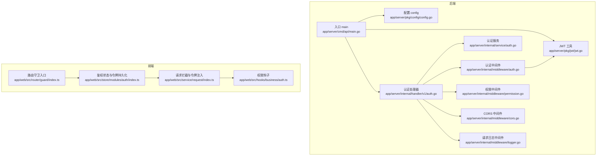
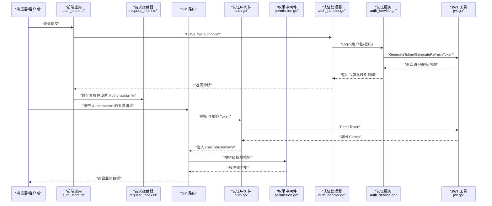
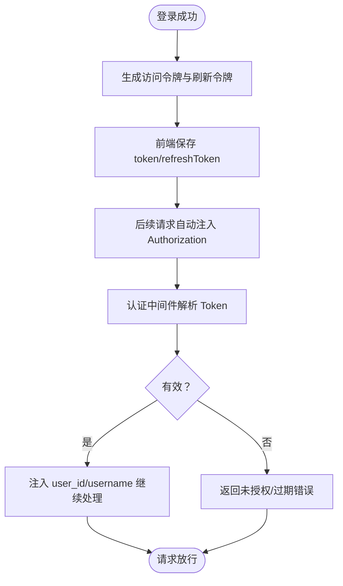
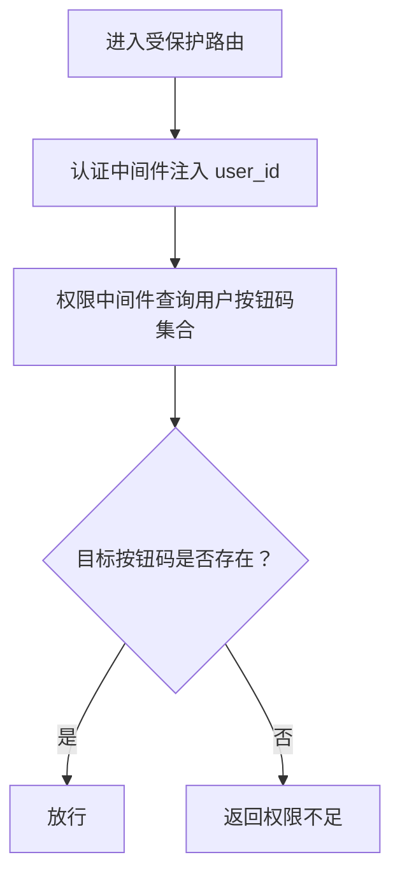
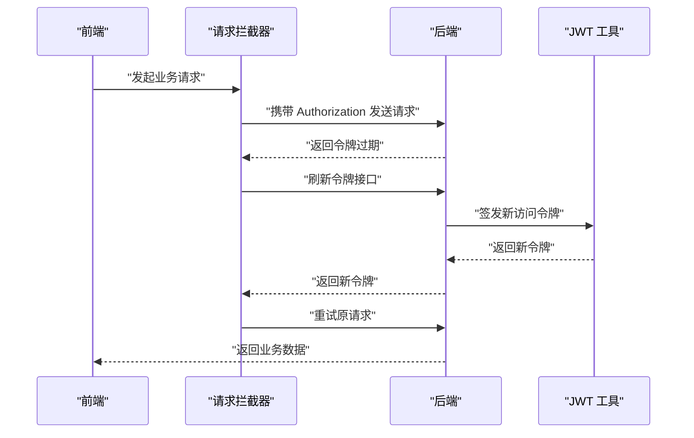
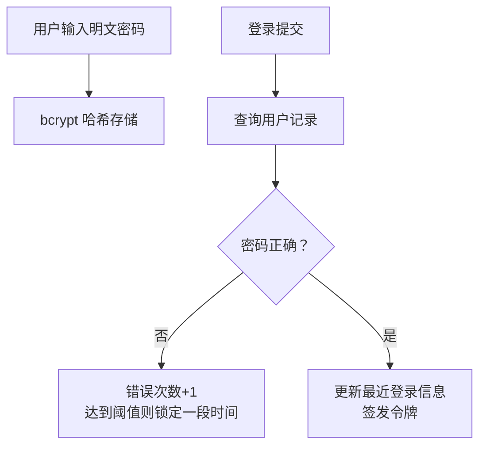
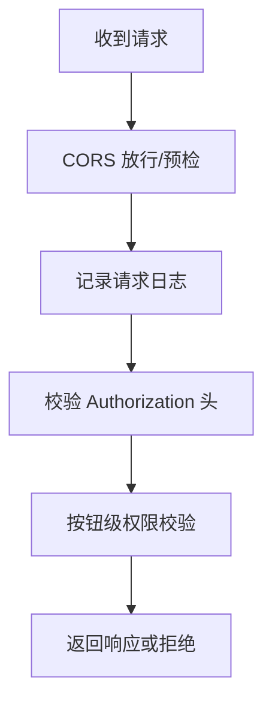
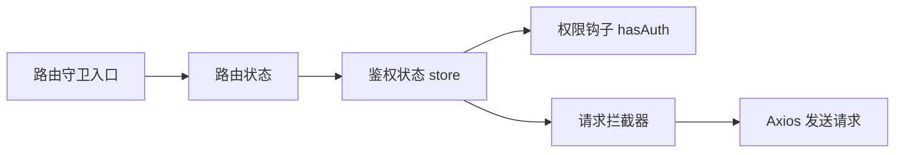
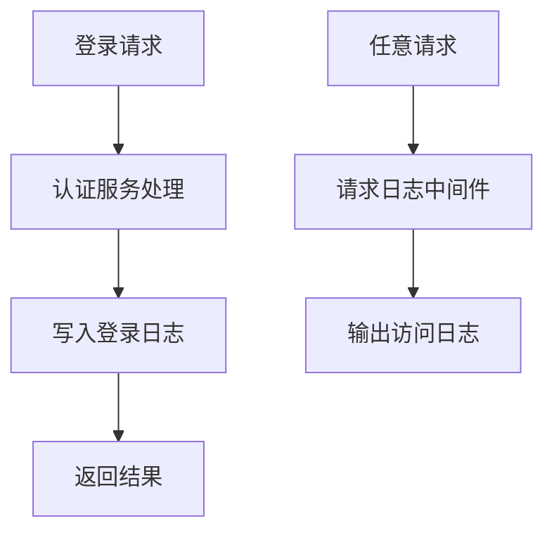
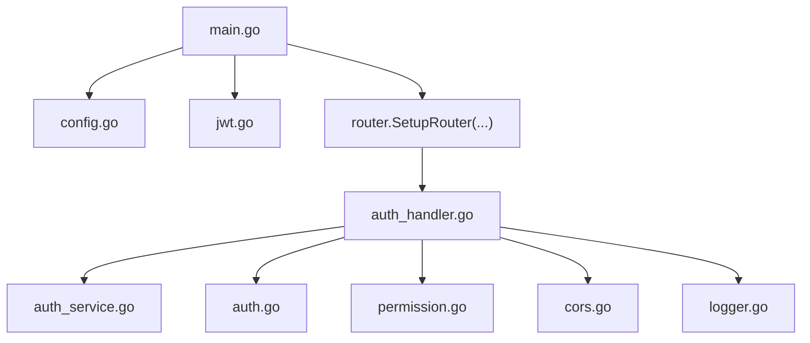

# 安全架构

<cite>
**本文引用的文件**
- [main.go](file://app/server/cmd/api/main.go)
- [config.go](file://app/server/pkg/config/config.go)
- [config.example.yaml](file://app/server/configs/config.example.yaml)
- [jwt.go](file://app/server/pkg/jwt/jwt.go)
- [auth.go](file://app/server/internal/middleware/auth.go)
- [permission.go](file://app/server/internal/middleware/permission.go)
- [auth_handler.go](file://app/server/internal/handler/v1/auth.go)
- [auth_service.go](file://app/server/internal/service/auth.go)
- [cors.go](file://app/server/internal/middleware/cors.go)
- [logger.go](file://app/server/internal/middleware/logger.go)
- [index.ts](file://app/web/src/router/guard/index.ts)
- [auth_store.ts](file://app/web/src/store/modules/auth/index.ts)
- [request_index.ts](file://app/web/src/service/request/index.ts)
- [auth_hook.ts](file://app/web/src/hooks/business/auth.ts)
</cite>

## 目录
1. [引言](#引言)
2. [项目结构](#项目结构)
3. [核心组件](#核心组件)
4. [架构总览](#架构总览)
5. [详细组件分析](#详细组件分析)
6. [依赖分析](#依赖分析)
7. [性能考虑](#性能考虑)
8. [故障排查指南](#故障排查指南)
9. [结论](#结论)
10. [附录](#附录)

## 引言
本文件面向 boread 项目的安全架构，系统化梳理后端与前端的安全机制与实现，覆盖身份认证（JWT）、授权控制（RBAC）、会话与令牌管理、密码加密存储、中间件安全机制（请求拦截、参数校验、跨域处理、访问日志）、前端安全策略（路由守卫、权限控制、敏感信息保护）、安全审计与异常监控、入侵检测建议、数据传输与 API 安全、第三方集成安全考虑，并给出安全配置最佳实践、漏洞扫描方案与应急响应流程。

## 项目结构
后端采用 Go + Gin 架构，使用 GORM 连接 MySQL；前端采用 Vue3 + Pinia + Axios。安全相关代码主要分布在以下模块：
- 后端：配置加载、JWT 工具、认证中间件、权限中间件、认证处理器、认证服务、日志与 CORS 中间件
- 前端：路由守卫、鉴权状态与令牌持久化、请求拦截与令牌注入、权限钩子

图表来源
- [main.go:30-84](file://app/server/cmd/api/main.go#L30-L84)
- [config.go:58-66](file://app/server/pkg/config/config.go#L58-L66)
- [jwt.go:19-38](file://app/server/pkg/jwt/jwt.go#L19-L38)
- [auth.go:12-40](file://app/server/internal/middleware/auth.go#L12-L40)
- [permission.go:10-52](file://app/server/internal/middleware/permission.go#L10-L52)
- [cors.go:9-23](file://app/server/internal/middleware/cors.go#L9-L23)
- [logger.go:10-28](file://app/server/internal/middleware/logger.go#L10-L28)
- [auth_handler.go:14-142](file://app/server/internal/handler/v1/auth.go#L14-L142)
- [auth_service.go:41-95](file://app/server/internal/service/auth.go#L41-L95)
- [index.ts:11-15](file://app/web/src/router/guard/index.ts#L11-L15)
- [auth_store.ts:14-184](file://app/web/src/store/modules/auth/index.ts#L14-L184)
- [request_index.ts:13-128](file://app/web/src/service/request/index.ts#L13-L128)
- [auth_hook.ts:3-21](file://app/web/src/hooks/business/auth.ts#L3-L21)

章节来源
- [main.go:30-84](file://app/server/cmd/api/main.go#L30-L84)
- [config.go:58-66](file://app/server/pkg/config/config.go#L58-L66)

## 核心组件
- 配置与密钥管理：后端通过 YAML 加载配置，包含 JWT 密钥、数据库连接、日志级别等；JWT 密钥与过期时间在启动时初始化。
- 身份认证（JWT）：登录成功后签发访问令牌与刷新令牌，解析与校验在中间件中完成。
- 授权控制（RBAC）：基于用户角色聚合按钮权限码，请求通过按钮级权限中间件校验。
- 会话与令牌管理：前端本地存储令牌，请求自动注入 Authorization 头；过期时通过统一拦截器刷新并重试。
- 密码加密存储：bcrypt 对明文密码进行哈希存储，登录时比对哈希。
- 请求安全：CORS 放行常用方法与头，日志中间件记录请求状态，Handler 层进行 JSON 参数绑定与错误映射。
- 审计与监控：登录结果写入登录日志表，请求日志输出到标准输出；建议结合外部日志系统与告警。

章节来源
- [config.go:9-54](file://app/server/pkg/config/config.go#L9-L54)
- [config.example.yaml:15-17](file://app/server/configs/config.example.yaml#L15-L17)
- [jwt.go:19-71](file://app/server/pkg/jwt/jwt.go#L19-L71)
- [auth.go:12-40](file://app/server/internal/middleware/auth.go#L12-L40)
- [permission.go:10-52](file://app/server/internal/middleware/permission.go#L10-L52)
- [auth_service.go:41-95](file://app/server/internal/service/auth.go#L41-L95)
- [cors.go:9-23](file://app/server/internal/middleware/cors.go#L9-L23)
- [logger.go:10-28](file://app/server/internal/middleware/logger.go#L10-L28)
- [auth_handler.go:31-56](file://app/server/internal/handler/v1/auth.go#L31-L56)
- [auth_store.ts:131-146](file://app/web/src/store/modules/auth/index.ts#L131-L146)
- [request_index.ts:28-128](file://app/web/src/service/request/index.ts#L28-L128)

## 架构总览
下图展示从客户端到后端的典型认证与授权流程，以及前端令牌注入与权限控制路径。

图表来源
- [auth_handler.go:31-56](file://app/server/internal/handler/v1/auth.go#L31-L56)
- [auth_service.go:41-95](file://app/server/internal/service/auth.go#L41-L95)
- [jwt.go:24-55](file://app/server/pkg/jwt/jwt.go#L24-L55)
- [auth.go:13-39](file://app/server/internal/middleware/auth.go#L13-L39)
- [permission.go:20-51](file://app/server/internal/middleware/permission.go#L20-L51)
- [auth_store.ts:131-146](file://app/web/src/store/modules/auth/index.ts#L131-L146)
- [request_index.ts:28-33](file://app/web/src/service/request/index.ts#L28-L33)

## 详细组件分析

### 身份认证（JWT）
- 初始化：启动时读取配置中的 JWT Secret 与过期秒数，初始化全局密钥与过期时长。
- 令牌签发：登录成功后生成访问令牌与刷新令牌，分别设置 IssuedAt 与 ExpiresAt。
- 令牌解析：认证中间件从 Authorization 头提取 Bearer Token，调用 ParseToken 校验签名与有效期。
- 令牌刷新：前端在请求拦截器中处理“令牌过期”场景，触发刷新逻辑并重试原请求。

图表来源
- [jwt.go:19-55](file://app/server/pkg/jwt/jwt.go#L19-L55)
- [auth.go:13-39](file://app/server/internal/middleware/auth.go#L13-L39)
- [auth_store.ts:131-146](file://app/web/src/store/modules/auth/index.ts#L131-L146)
- [request_index.ts:88-97](file://app/web/src/service/request/index.ts#L88-L97)

章节来源
- [config.go:46-49](file://app/server/pkg/config/config.go#L46-L49)
- [config.example.yaml:15-17](file://app/server/configs/config.example.yaml#L15-L17)
- [jwt.go:19-71](file://app/server/pkg/jwt/jwt.go#L19-L71)
- [auth.go:12-40](file://app/server/internal/middleware/auth.go#L12-L40)
- [auth_store.ts:131-146](file://app/web/src/store/modules/auth/index.ts#L131-L146)
- [request_index.ts:28-128](file://app/web/src/service/request/index.ts#L28-L128)

### 授权控制（RBAC）
- 用户信息：认证服务聚合用户角色与按钮权限码，供前端渲染与前端权限钩子使用。
- 按钮级权限：权限中间件从上下文取出 user_id，查询用户具备的按钮码集合，匹配目标 code。
- 性能提示：当前为每次请求查库，建议引入缓存（如 sync.Map 或 Redis）以降低 DB 压力。

图表来源
- [permission.go:20-51](file://app/server/internal/middleware/permission.go#L20-L51)
- [auth_service.go:97-134](file://app/server/internal/service/auth.go#L97-L134)
- [auth_handler.go:102-122](file://app/server/internal/handler/v1/auth.go#L102-L122)
- [auth_hook.ts:6-20](file://app/web/src/hooks/business/auth.ts#L6-L20)

章节来源
- [permission.go:10-52](file://app/server/internal/middleware/permission.go#L10-L52)
- [auth_service.go:97-134](file://app/server/internal/service/auth.go#L97-L134)
- [auth_handler.go:102-122](file://app/server/internal/handler/v1/auth.go#L102-L122)
- [auth_hook.ts:3-21](file://app/web/src/hooks/business/auth.ts#L3-L21)

### 会话管理与令牌生命周期
- 前端：登录成功后将 token 与 refreshToken 存入本地存储；请求拦截器在发送请求前注入 Authorization 头；当后端返回“令牌过期”时，触发刷新流程并重试。
- 后端：JWT 工具负责签发与解析；认证中间件负责校验并注入用户上下文。

图表来源
- [auth_store.ts:131-146](file://app/web/src/store/modules/auth/index.ts#L131-L146)
- [request_index.ts:88-97](file://app/web/src/service/request/index.ts#L88-L97)
- [jwt.go:24-55](file://app/server/pkg/jwt/jwt.go#L24-L55)

章节来源
- [auth_store.ts:131-146](file://app/web/src/store/modules/auth/index.ts#L131-L146)
- [request_index.ts:28-128](file://app/web/src/service/request/index.ts#L28-L128)
- [jwt.go:24-55](file://app/server/pkg/jwt/jwt.go#L24-L55)

### 密码加密存储
- 存储：bcrypt 对明文密码进行哈希后入库。
- 登录：登录时使用 bcrypt.CompareHashAndPassword 对比哈希，失败计数与临时锁定逻辑防止暴力破解。

图表来源
- [auth_service.go:41-95](file://app/server/internal/service/auth.go#L41-L95)

章节来源
- [auth_service.go:41-95](file://app/server/internal/service/auth.go#L41-L95)

### 中间件安全机制
- CORS：允许常见方法与必要头部，OPTIONS 预检快速返回。
- 日志：记录状态码、耗时、方法与路径，便于审计与异常定位。
- 认证：强制要求 Authorization 头且格式为 Bearer，解析失败直接拒绝。
- 权限：按钮级权限校验，避免越权操作。

图表来源
- [cors.go:9-23](file://app/server/internal/middleware/cors.go#L9-L23)
- [logger.go:10-28](file://app/server/internal/middleware/logger.go#L10-L28)
- [auth.go:13-39](file://app/server/internal/middleware/auth.go#L13-L39)
- [permission.go:20-51](file://app/server/internal/middleware/permission.go#L20-L51)

章节来源
- [cors.go:9-23](file://app/server/internal/middleware/cors.go#L9-L23)
- [logger.go:10-28](file://app/server/internal/middleware/logger.go#L10-L28)
- [auth.go:12-40](file://app/server/internal/middleware/auth.go#L12-L40)
- [permission.go:10-52](file://app/server/internal/middleware/permission.go#L10-L52)

### 前端安全策略
- 路由守卫：统一注册进度条、路由与标题守卫，确保页面切换与权限一致性。
- 权限控制：鉴权状态集中管理，提供 hasAuth 钩子判断按钮权限；支持静态超级角色模式。
- 敏感信息保护：令牌与刷新令牌本地存储，请求拦截器自动注入 Authorization；登出时清理存储与状态。

图表来源
- [index.ts:11-15](file://app/web/src/router/guard/index.ts#L11-L15)
- [auth_store.ts:14-184](file://app/web/src/store/modules/auth/index.ts#L14-L184)
- [auth_hook.ts:3-21](file://app/web/src/hooks/business/auth.ts#L3-L21)
- [request_index.ts:28-33](file://app/web/src/service/request/index.ts#L28-L33)

章节来源
- [index.ts:11-15](file://app/web/src/router/guard/index.ts#L11-L15)
- [auth_store.ts:14-184](file://app/web/src/store/modules/auth/index.ts#L14-L184)
- [auth_hook.ts:3-21](file://app/web/src/hooks/business/auth.ts#L3-L21)
- [request_index.ts:28-128](file://app/web/src/service/request/index.ts#L28-L128)

### 安全审计、异常监控与入侵检测
- 登录审计：登录成功/失败均写入登录日志，包含用户代理、IP、结果与消息。
- 请求审计：日志中间件输出状态码、耗时、方法与路径。
- 入侵检测建议：结合 WAF、速率限制、IP 黑名单、异常登录行为（多地区、多设备）告警；对外暴露的 API 使用 HTTPS 与证书固定。

图表来源
- [auth_service.go:234-247](file://app/server/internal/service/auth.go#L234-L247)
- [logger.go:10-28](file://app/server/internal/middleware/logger.go#L10-L28)

章节来源
- [auth_service.go:234-247](file://app/server/internal/service/auth.go#L234-L247)
- [logger.go:10-28](file://app/server/internal/middleware/logger.go#L10-L28)

### 数据传输加密、API 安全与第三方集成
- 传输加密：建议生产环境启用 HTTPS，TLS 版本与套件按合规要求配置。
- API 安全：使用 JWT Bearer 认证；限制请求频率；对敏感接口开启按钮级权限；对输入参数进行严格校验与最小权限暴露。
- 第三方集成：前端请求拦截器可扩展鉴权头；后端中间件可接入 WAF、风控与审计系统。

章节来源
- [auth_handler.go:24-56](file://app/server/internal/handler/v1/auth.go#L24-L56)
- [cors.go:9-23](file://app/server/internal/middleware/cors.go#L9-L23)
- [request_index.ts:28-33](file://app/web/src/service/request/index.ts#L28-L33)

## 依赖分析
后端组件之间的依赖关系如下：

图表来源
- [main.go:34-76](file://app/server/cmd/api/main.go#L34-L76)
- [auth_handler.go:19-21](file://app/server/internal/handler/v1/auth.go#L19-L21)
- [auth_service.go:37-39](file://app/server/internal/service/auth.go#L37-L39)
- [auth.go:8-10](file://app/server/internal/middleware/auth.go#L8-L10)
- [permission.go:6-8](file://app/server/internal/middleware/permission.go#L6-L8)
- [cors.go:6-7](file://app/server/internal/middleware/cors.go#L6-L7)
- [logger.go:7-8](file://app/server/internal/middleware/logger.go#L7-L8)

章节来源
- [main.go:34-76](file://app/server/cmd/api/main.go#L34-L76)
- [auth_handler.go:19-21](file://app/server/internal/handler/v1/auth.go#L19-L21)

## 性能考虑
- 权限中间件当前每次请求查库，建议引入缓存层（如 sync.Map 或 Redis），减少 DB 压力；仅在确有性能问题时启用。
- JWT 密钥与过期时间在启动时初始化，避免运行时重复计算。
- 日志中间件输出到标准输出，建议结合外部日志系统进行异步落盘与分级存储。

章节来源
- [permission.go:17-19](file://app/server/internal/middleware/permission.go#L17-L19)
- [jwt.go:19-22](file://app/server/pkg/jwt/jwt.go#L19-L22)
- [logger.go:10-28](file://app/server/internal/middleware/logger.go#L10-L28)

## 故障排查指南
- 未携带或格式不正确的 Authorization 头：认证中间件直接返回未授权错误。
- 令牌无效或过期：前端拦截器识别后尝试刷新并重试；若刷新失败则登出。
- 登录失败：根据错误类型返回用户不存在、密码错误、账户禁用或锁定等信息。
- 权限不足：按钮级权限中间件返回拒绝，需检查用户角色与按钮码配置。

章节来源
- [auth.go:16-34](file://app/server/internal/middleware/auth.go#L16-L34)
- [auth_handler.go:42-52](file://app/server/internal/handler/v1/auth.go#L42-L52)
- [permission.go:22-50](file://app/server/internal/middleware/permission.go#L22-L50)
- [request_index.ts:88-97](file://app/web/src/service/request/index.ts#L88-L97)

## 结论
boread 的安全架构以 JWT 认证为核心，结合 RBAC 按钮级权限与严格的登录审计，配合前端路由守卫与令牌自动注入，形成前后端协同的安全体系。建议在生产环境中强化传输加密、引入速率限制与 WAF、完善缓存与日志归档，并建立完善的应急响应流程与漏洞扫描机制。

## 附录

### 安全配置最佳实践
- JWT 密钥：使用足够长度的随机字符串，定期轮换；禁止硬编码在代码中。
- 数据库凭据：使用只读/受限账号，最小权限原则；连接池参数按负载调整。
- CORS：生产环境限制 Allow-Origin 为可信域名，避免通配符。
- 日志：开启访问日志与审计日志，敏感字段脱敏；日志轮转与保留策略明确。

章节来源
- [config.example.yaml:15-17](file://app/server/configs/config.example.yaml#L15-L17)
- [cors.go:11-13](file://app/server/internal/middleware/cors.go#L11-L13)
- [logger.go:10-28](file://app/server/internal/middleware/logger.go#L10-L28)

### 漏洞扫描方案
- 依赖扫描：定期扫描 Go 与 Node 依赖的已知漏洞。
- 静态分析：对 Go 与 TS 代码执行静态安全扫描。
- 动态测试：对登录、权限变更、敏感接口进行渗透测试与 API 自动化测试。

[本节为通用建议，无需特定文件引用]

### 应急响应流程
- 触发条件：检测到异常登录、频繁 401/403、高延迟、DDoS 症状。
- 处置步骤：快速隔离可疑 IP、临时封禁账户、回滚可疑变更、恢复备份、发布补丁。
- 事后复盘：审计日志与告警联动，形成改进闭环。

[本节为通用建议，无需特定文件引用]