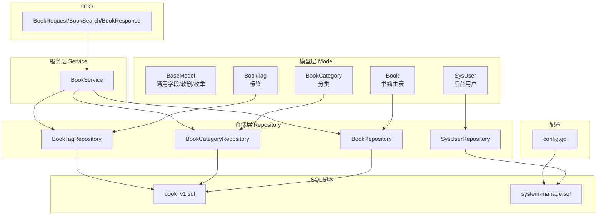
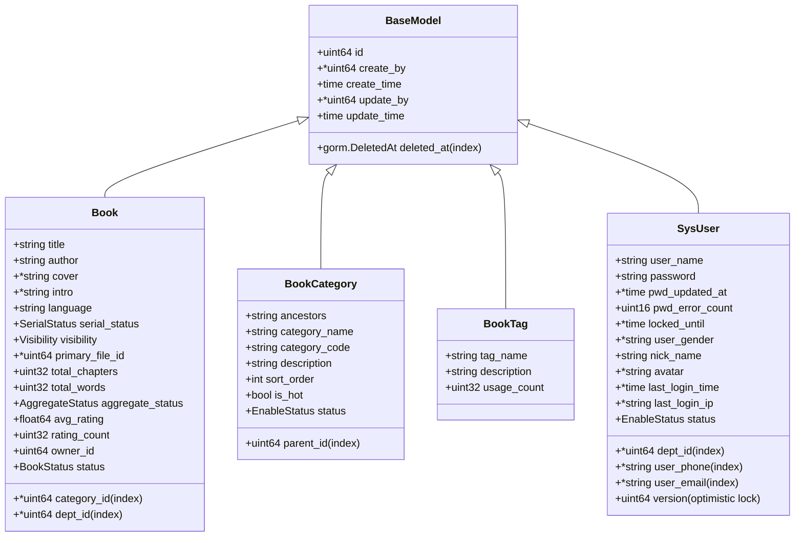
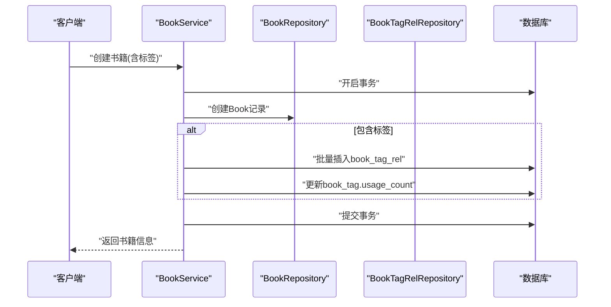
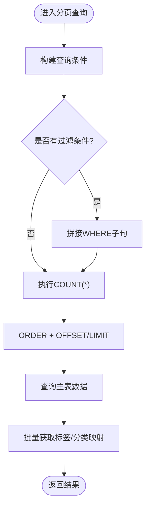
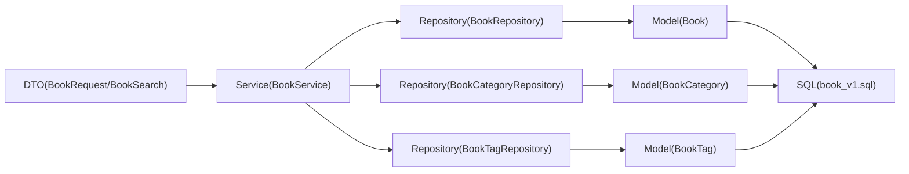

# 数据架构

<cite>
**本文档引用的文件**
- [base.go](file://app/server/internal/model/base.go)
- [book.go](file://app/server/internal/model/book.go)
- [sys_user.go](file://app/server/internal/model/sys_user.go)
- [book_category.go](file://app/server/internal/model/book_category.go)
- [book_tag.go](file://app/server/internal/model/book_tag.go)
- [book.go](file://app/server/internal/repository/book.go)
- [sys_user.go](file://app/server/internal/repository/sys_user.go)
- [book_category.go](file://app/server/internal/repository/book_category.go)
- [book_tag.go](file://app/server/internal/repository/book_tag.go)
- [book.go](file://app/server/internal/service/book.go)
- [book.go](file://app/server/internal/dto/book.go)
- [config.go](file://app/server/pkg/config/config.go)
- [book_v1.sql](file://app/sql/book_v1.sql)
- [system-manage.sql](file://app/sql/system-manage.sql)
</cite>

## 目录
1. [引言](#引言)
2. [项目结构](#项目结构)
3. [核心组件](#核心组件)
4. [架构总览](#架构总览)
5. [详细组件分析](#详细组件分析)
6. [依赖分析](#依赖分析)
7. [性能考虑](#性能考虑)
8. [故障排查指南](#故障排查指南)
9. [结论](#结论)
10. [附录](#附录)

## 引言
本文件面向boread项目的数据库与数据层，系统化梳理数据架构设计，包括实体关系模型、表结构与索引策略、约束规则；阐释数据访问层（Repository Pattern）实现、ORM映射关系与查询优化策略；明确数据一致性与事务处理、并发控制方案；给出数据迁移策略、版本管理与备份恢复建议；并提出缓存与数据同步、性能监控指标、数据安全与隐私保护、合规性要求。

## 项目结构
围绕数据层的关键代码组织如下：
- 模型层（Model）：定义业务实体与通用基类、枚举类型、JSON字段适配器
- 仓储层（Repository）：封装数据访问逻辑，提供CRUD与组合查询
- 服务层（Service）：编排业务流程，执行事务与跨表一致性处理
- DTO层：输入输出参数与分页请求
- SQL脚本：数据库初始化与演进脚本
- 配置：数据库连接与池配置

图表来源
- [base.go:12-21](file://app/server/internal/model/base.go#L12-L21)
- [book.go:40-59](file://app/server/internal/model/book.go#L40-L59)
- [sys_user.go:6-23](file://app/server/internal/model/sys_user.go#L6-L23)
- [book_category.go:3-13](file://app/server/internal/model/book_category.go#L3-L13)
- [book_tag.go:3-8](file://app/server/internal/model/book_tag.go#L3-L8)
- [book.go:12-18](file://app/server/internal/repository/book.go#L12-L18)
- [sys_user.go:12-19](file://app/server/internal/repository/sys_user.go#L12-L19)
- [book_category.go:11-17](file://app/server/internal/repository/book_category.go#L11-L17)
- [book_tag.go:12-18](file://app/server/internal/repository/book_tag.go#L12-L18)
- [book.go:21-43](file://app/server/internal/service/book.go#L21-L43)
- [book.go:5-52](file://app/server/internal/dto/book.go#L5-L52)
- [config.go:35-44](file://app/server/pkg/config/config.go#L35-L44)
- [book_v1.sql:84-117](file://app/sql/book_v1.sql#L84-L117)
- [system-manage.sql:99-128](file://app/sql/system-manage.sql#L99-L128)

章节来源
- [base.go:12-51](file://app/server/internal/model/base.go#L12-L51)
- [book.go:40-70](file://app/server/internal/model/book.go#L40-L70)
- [sys_user.go:6-36](file://app/server/internal/model/sys_user.go#L6-L36)
- [book_category.go:3-15](file://app/server/internal/model/book_category.go#L3-L15)
- [book_tag.go:3-11](file://app/server/internal/model/book_tag.go#L3-L11)
- [book.go:12-169](file://app/server/internal/repository/book.go#L12-L169)
- [sys_user.go:12-197](file://app/server/internal/repository/sys_user.go#L12-L197)
- [book_category.go:11-149](file://app/server/internal/repository/book_category.go#L11-L149)
- [book_tag.go:12-62](file://app/server/internal/repository/book_tag.go#L12-L62)
- [book.go:21-339](file://app/server/internal/service/book.go#L21-L339)
- [book.go:5-53](file://app/server/internal/dto/book.go#L5-L53)
- [config.go:35-44](file://app/server/pkg/config/config.go#L35-L44)
- [book_v1.sql:84-137](file://app/sql/book_v1.sql#L84-L137)
- [system-manage.sql:99-331](file://app/sql/system-manage.sql#L99-L331)

## 核心组件
- 通用基类与枚举
  - BaseModel：统一主键、软删除、创建/更新时间与操作人字段，提供通用索引
  - 枚举类型：启用/禁用、连载状态、可见性、聚合状态、上架状态
  - JSONMap：适配JSON字段的扫描与值化
- 业务模型
  - 书籍（book）：标题、作者、封面、简介、分类、语言、连载状态、可见性、主文件、统计字段、拥有者、部门、状态
  - 分类（book_category）：父子关系、祖先路径、热度、排序、状态
  - 标签（book_tag）：标签名、描述、使用计数
  - 后台用户（sys_user）：部门、登录凭据、风控字段、状态、乐观锁版本
- 仓储接口
  - 书籍：创建/更新/删除/分页/条件查询/标签关联批量处理
  - 分类：树形遍历、分页、映射查询
  - 标签：创建/更新/删除/分页
  - 用户：按用户名/ID查询、登录成功/失败计数、角色/菜单/按钮权限查询、分页
- 服务编排
  - 书籍：事务内创建/更新/删除，标签变更差集计算与计数维护
  - 用户：替换角色集合（事务）

章节来源
- [base.go:12-51](file://app/server/internal/model/base.go#L12-L51)
- [book.go:3-70](file://app/server/internal/model/book.go#L3-L70)
- [sys_user.go:6-36](file://app/server/internal/model/sys_user.go#L6-L36)
- [book_category.go:3-15](file://app/server/internal/model/book_category.go#L3-L15)
- [book_tag.go:3-11](file://app/server/internal/model/book_tag.go#L3-L11)
- [book.go:12-169](file://app/server/internal/repository/book.go#L12-L169)
- [sys_user.go:12-197](file://app/server/internal/repository/sys_user.go#L12-L197)
- [book_category.go:11-149](file://app/server/internal/repository/book_category.go#L11-L149)
- [book_tag.go:12-62](file://app/server/internal/repository/book_tag.go#L12-L62)
- [book.go:45-234](file://app/server/internal/service/book.go#L45-L234)

## 架构总览
数据架构采用清晰的分层与职责分离：
- ORM映射：GORM模型直接映射到SQL表，遵循统一字段命名与索引策略
- 仓储抽象：Repository封装具体SQL与GORM调用，屏蔽复杂查询细节
- 服务编排：Service负责事务边界、跨表一致性与业务规则
- DTO：隔离API输入输出与内部模型差异
- 配置驱动：数据库连接参数与池大小通过配置文件集中管理

图表来源
- [base.go:12-21](file://app/server/internal/model/base.go#L12-L21)
- [book.go:40-59](file://app/server/internal/model/book.go#L40-L59)
- [sys_user.go:6-23](file://app/server/internal/model/sys_user.go#L6-L23)
- [book_category.go:3-13](file://app/server/internal/model/book_category.go#L3-L13)
- [book_tag.go:3-8](file://app/server/internal/model/book_tag.go#L3-L8)

## 详细组件分析

### 实体关系模型与表结构设计
- 书籍（book）
  - 主键：id
  - 关键索引：title、author、(title,author)、category_id、dept_id、(status,visibility)、deleted_at
  - 字段要点：聚合状态、总章节数/字数、平均分与评分数、拥有者与部门、可见性、上架状态
- 分类（book_category）
  - 主键：id；自关联：parent_id；祖先路径：ancestors；唯一索引：category_code + 软删函数索引
  - 索引：parent_id、deleted_at
- 标签（book_tag）
  - 主键：id；唯一索引：tag_name + 软删函数索引；索引：deleted_at
  - 使用计数：usage_count，便于热门排序
- 用户（sys_user）
  - 主键：id；唯一索引：user_name + 软删函数索引；索引：dept_id、user_phone、user_email、deleted_at
  - 风控字段：pwd_error_count、locked_until；乐观锁：version
- 关联表
  - book_tag_rel：唯一索引（book_id,tag_id）、tag_id索引、deleted_at索引

章节来源
- [book_v1.sql:84-117](file://app/sql/book_v1.sql#L84-L117)
- [book_v1.sql:37-57](file://app/sql/book_v1.sql#L37-L57)
- [book_v1.sql:62-76](file://app/sql/book_v1.sql#L62-L76)
- [book_v1.sql:122-136](file://app/sql/book_v1.sql#L122-L136)
- [system-manage.sql:99-128](file://app/sql/system-manage.sql#L99-L128)
- [system-manage.sql:30-50](file://app/sql/system-manage.sql#L30-L50)
- [system-manage.sql:60-75](file://app/sql/system-manage.sql#L60-L75)
- [system-manage.sql:149-181](file://app/sql/system-manage.sql#L149-L181)
- [system-manage.sql:309-331](file://app/sql/system-manage.sql#L309-L331)

### 索引策略与约束规则
- 软删除与函数索引
  - 所有业务表统一带deleted_at软删字段，唯一索引采用“业务键 + IFNULL(deleted_at,'1970-01-01')”以避免软删后无法重建同名
- 书籍表
  - 名称/作者组合索引支持模糊搜索与精确匹配；分类/部门/状态可见性复合索引支撑筛选与权限控制
- 分类表
  - 父节点索引与祖先路径配合，加速树形查询与子树展开
- 标签表
  - 标签名唯一，使用usage_count支持热门排序
- 用户表
  - 用户名唯一、手机号/邮箱索引，便于登录与检索；乐观锁version保障并发更新一致性

章节来源
- [system-manage.sql:16-17](file://app/sql/system-manage.sql#L16-L17)
- [book_v1.sql:110-116](file://app/sql/book_v1.sql#L110-L116)
- [book_v1.sql:41-56](file://app/sql/book_v1.sql#L41-L56)
- [book_v1.sql:67-75](file://app/sql/book_v1.sql#L67-L75)
- [system-manage.sql:123-127](file://app/sql/system-manage.sql#L123-L127)
- [system-manage.sql:46-49](file://app/sql/system-manage.sql#L46-L49)
- [system-manage.sql:72-74](file://app/sql/system-manage.sql#L72-L74)
- [system-manage.sql:178-180](file://app/sql/system-manage.sql#L178-L180)
- [system-manage.sql:328-330](file://app/sql/system-manage.sql#L328-L330)

### 数据访问层（Repository Pattern）与ORM映射
- 仓储职责
  - 提供标准CRUD与复杂查询方法，如书籍分页、标签关联批量查询、分类树遍历、用户权限查询
  - 通过GORM上下文传递与事务封装，确保查询与更新的一致性
- ORM映射
  - 模型字段与SQL列一一对应，遵循GORM命名约定；通用基类统一字段与索引
  - JSONMap用于JSON字段的序列化/反序列化
- 查询优化
  - 条件拼接：按需拼装WHERE子句，避免多余过滤
  - 聚合与计数：先Count再分页查询，减少结果集
  - 批量查询：ListByIDs/GetTagsByBookIDs等批量接口降低多次往返

章节来源
- [book.go:12-169](file://app/server/internal/repository/book.go#L12-L169)
- [sys_user.go:12-197](file://app/server/internal/repository/sys_user.go#L12-L197)
- [book_category.go:11-149](file://app/server/internal/repository/book_category.go#L11-L149)
- [book_tag.go:12-62](file://app/server/internal/repository/book_tag.go#L12-L62)
- [base.go:34-51](file://app/server/internal/model/base.go#L34-L51)

### 服务层编排与事务处理
- 书籍服务
  - 创建/更新/删除：在事务内完成主表与标签关联的原子性操作
  - 标签变更：计算旧集合与新集合差集，仅对变化部分进行新增/删除，并维护标签使用计数
  - 分页：先查询主表，再批量获取标签与分类映射，减少多次查询
- 用户服务
  - 替换角色集合：先清空旧关系，再批量插入新关系，保证权限一致性

图表来源
- [book.go:87-111](file://app/server/internal/service/book.go#L87-L111)
- [book.go:12-18](file://app/server/internal/repository/book.go#L12-L18)
- [book.go:132-137](file://app/server/internal/repository/book.go#L132-L137)

章节来源
- [book.go:45-234](file://app/server/internal/service/book.go#L45-L234)

### 查询流程与优化策略
- 书籍分页
  - 条件过滤：标题/作者模糊匹配、分类ID集合、状态/可见性/连载状态、标签ID、字数区间、更新时间范围
  - 先计数后分页：避免大结果集排序成本
  - 批量关联：一次性拉取标签与分类映射，减少N+1查询
- 分类树遍历
  - 构建邻接表，广度优先收集后代ID，支持“选中父分类即包含所有子分类”的查询语义

图表来源
- [book.go:40-84](file://app/server/internal/repository/book.go#L40-L84)
- [book.go:258-306](file://app/server/internal/service/book.go#L258-L306)
- [book_category.go:55-77](file://app/server/internal/repository/book_category.go#L55-L77)

章节来源
- [book.go:40-84](file://app/server/internal/repository/book.go#L40-L84)
- [book.go:258-306](file://app/server/internal/service/book.go#L258-L306)
- [book_category.go:55-77](file://app/server/internal/repository/book_category.go#L55-L77)

### 数据一致性与并发控制
- 事务边界
  - 书籍创建/更新/删除：事务包裹主表与关联表操作，保证原子性
  - 用户角色替换：事务内清空旧关系并插入新关系
- 并发控制
  - 用户登录风控：使用UpdateColumn对pwd_error_count进行原子自增
  - 乐观锁：sys_user.version字段用于并发更新冲突检测
- 软删除
  - 统一deleted_at软删，配合函数索引避免重建同名问题

章节来源
- [book.go:87-111](file://app/server/internal/service/book.go#L87-L111)
- [book.go:149-203](file://app/server/internal/service/book.go#L149-L203)
- [sys_user.go:52-64](file://app/server/internal/repository/sys_user.go#L52-L64)
- [sys_user.go:182-196](file://app/server/internal/repository/sys_user.go#L182-L196)
- [system-manage.sql:116-116](file://app/sql/system-manage.sql#L116-L116)

### 数据迁移策略与版本管理
- 版本演进
  - 书籍模块：book_v1.sql至book_v4.sql逐步演进，建议按版本顺序执行
- 迁移实践
  - 新增字段：添加NOT NULL默认值与注释，保持向后兼容
  - 唯一索引：采用“业务键 + IFNULL(deleted_at,...)”函数索引
  - 软删：统一deleted_at字段，避免物理删除
- 备份与回滚
  - 建议在迁移前执行全量备份；迁移脚本应具备幂等性与回滚步骤

章节来源
- [book_v1.sql:1-10](file://app/sql/book_v1.sql#L1-L10)
- [system-manage.sql:1-18](file://app/sql/system-manage.sql#L1-L18)

### 缓存架构与数据同步
- 缓存建议
  - 热点分类与标签：使用Redis缓存热门分类列表与标签映射，设置合理TTL
  - 权限数据：用户角色/菜单/按钮缓存，结合失效策略与双写一致性
- 同步机制
  - 标签使用计数：在事务内维护book_tag.usage_count，避免缓存与DB不一致
  - 分类树：本地内存构建邻接表，定期刷新或事件驱动更新

[本节为概念性建议，不直接分析具体文件]

### 性能监控指标
- 查询层面
  - QPS、P95/P99延迟、慢查询数量、索引命中率
- 事务层面
  - 事务成功率、平均持续时间、死锁次数
- 数据层面
  - 表行数、索引大小、软删比例、热点字段访问频次

[本节为概念性建议，不直接分析具体文件]

### 数据安全与隐私保护
- 访问控制
  - 基于RBAC与数据权限范围（全部/自定义部门/本部门/本部门及子部门/仅本人）控制数据可见性
- 敏感信息
  - 用户密码使用安全散列存储；登录日志与操作日志记录关键行为
- 合规要求
  - 软删除与审计日志满足数据可追溯；唯一索引函数索引避免重建同名导致的数据治理风险

章节来源
- [system-manage.sql:62-70](file://app/sql/system-manage.sql#L62-L70)
- [system-manage.sql:238-253](file://app/sql/system-manage.sql#L238-L253)
- [system-manage.sql:262-283](file://app/sql/system-manage.sql#L262-L283)

## 依赖分析
- 组件耦合
  - Service依赖多个Repository，形成清晰的业务编排层
  - Repository依赖GORM与DTO，承担查询与映射职责
- 外部依赖
  - GORM ORM、MySQL驱动、YAML配置解析
- 潜在循环依赖
  - 当前结构为单向依赖（DTO→Service→Repository→Model→SQL），未发现循环

图表来源
- [book.go:5-53](file://app/server/internal/dto/book.go#L5-L53)
- [book.go:21-43](file://app/server/internal/service/book.go#L21-L43)
- [book.go:12-18](file://app/server/internal/repository/book.go#L12-L18)
- [book_category.go:11-17](file://app/server/internal/repository/book_category.go#L11-L17)
- [book_tag.go:12-18](file://app/server/internal/repository/book_tag.go#L12-L18)
- [book.go:40-59](file://app/server/internal/model/book.go#L40-L59)
- [book_category.go:3-13](file://app/server/internal/model/book_category.go#L3-L13)
- [book_tag.go:3-8](file://app/server/internal/model/book_tag.go#L3-L8)
- [book_v1.sql:84-136](file://app/sql/book_v1.sql#L84-L136)

章节来源
- [book.go:5-53](file://app/server/internal/dto/book.go#L5-L53)
- [book.go:21-43](file://app/server/internal/service/book.go#L21-L43)
- [book.go:12-18](file://app/server/internal/repository/book.go#L12-L18)
- [book_category.go:11-17](file://app/server/internal/repository/book_category.go#L11-L17)
- [book_tag.go:12-18](file://app/server/internal/repository/book_tag.go#L12-L18)
- [book.go:40-59](file://app/server/internal/model/book.go#L40-L59)
- [book_category.go:3-13](file://app/server/internal/model/book_category.go#L3-L13)
- [book_tag.go:3-8](file://app/server/internal/model/book_tag.go#L3-L8)
- [book_v1.sql:84-136](file://app/sql/book_v1.sql#L84-L136)

## 性能考虑
- 索引设计
  - 书籍：(status,visibility)、(title,author)、category_id、dept_id、deleted_at
  - 用户：user_name、dept_id、user_phone、user_email、deleted_at
  - 分类：parent_id、ancestors、deleted_at
- 查询优化
  - 分页先计数，避免大结果集排序
  - 批量查询替代N+1，减少往返
  - 条件拼接按需添加，避免全表扫描
- 事务与锁
  - 控制事务粒度，减少锁持有时间
  - 使用乐观锁version避免写写冲突

[本节提供一般性指导，不直接分析具体文件]

## 故障排查指南
- 常见问题
  - 软删后无法重建同名：检查唯一索引是否采用函数索引
  - 登录失败频繁：检查pwd_error_count与locked_until是否正确更新
  - 标签使用计数不一致：确认事务内是否同步更新book_tag.usage_count
- 排查步骤
  - 核对索引是否存在且生效
  - 检查事务是否正确提交/回滚
  - 审核日志与登录日志定位异常

章节来源
- [system-manage.sql:16-17](file://app/sql/system-manage.sql#L16-L17)
- [sys_user.go:52-64](file://app/server/internal/repository/sys_user.go#L52-L64)
- [book.go:104-108](file://app/server/internal/service/book.go#L104-L108)
- [book.go:176-200](file://app/server/internal/service/book.go#L176-L200)

## 结论
boread项目的数据架构以清晰的分层与统一的ORM映射为基础，通过Repository模式封装复杂查询，Service层编排事务与一致性，配合完善的索引与软删除策略，满足业务的高性能与可维护性需求。建议在现有基础上完善缓存与监控体系，强化迁移与备份流程，持续提升系统的稳定性与可运维性。

## 附录
- 配置项
  - 数据库连接参数：驱动、主机、端口、用户名、密码、库名、最大空闲/活动连接数
- 初始化脚本
  - 书籍模块：book_v1.sql至book_v4.sql
  - 系统管理：system-manage.sql（RBAC与日志）

章节来源
- [config.go:35-44](file://app/server/pkg/config/config.go#L35-L44)
- [book_v1.sql:1-10](file://app/sql/book_v1.sql#L1-L10)
- [system-manage.sql:1-18](file://app/sql/system-manage.sql#L1-L18)