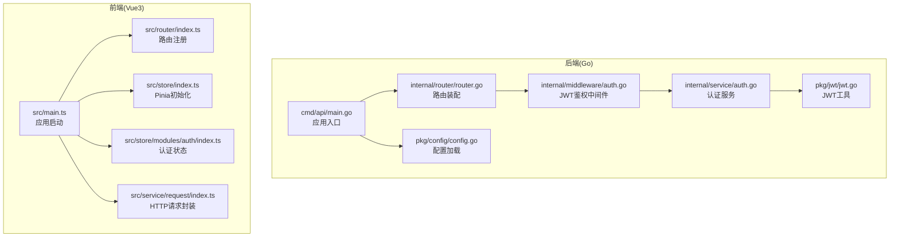
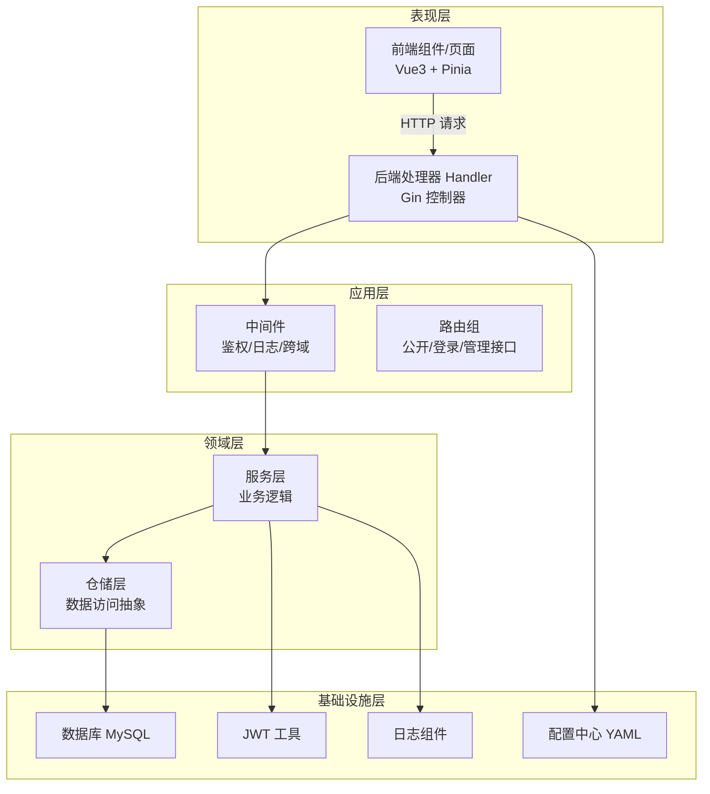
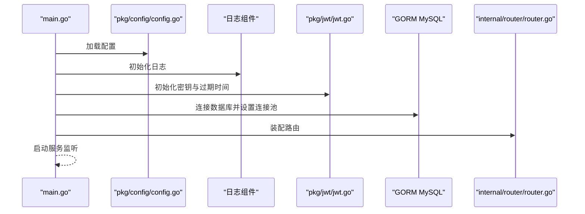
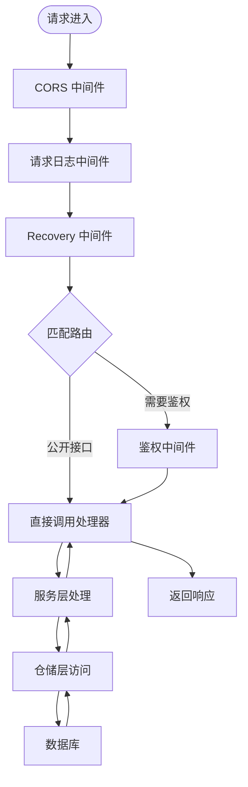
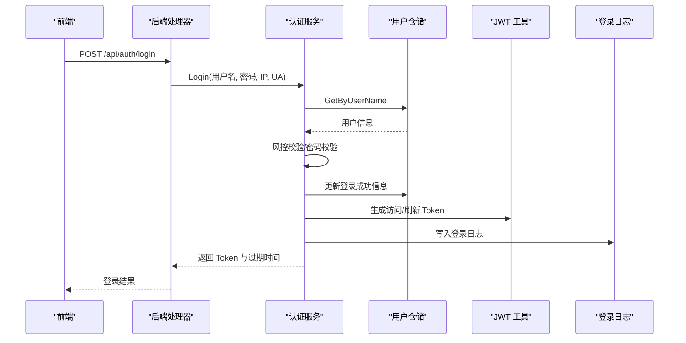
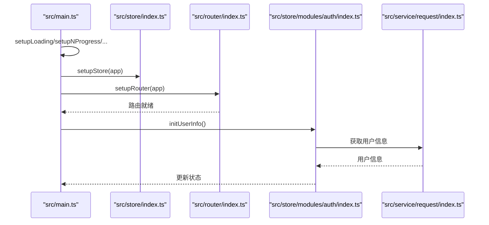
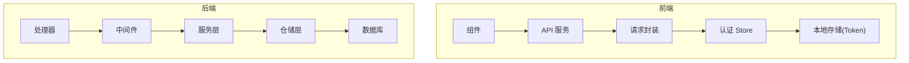
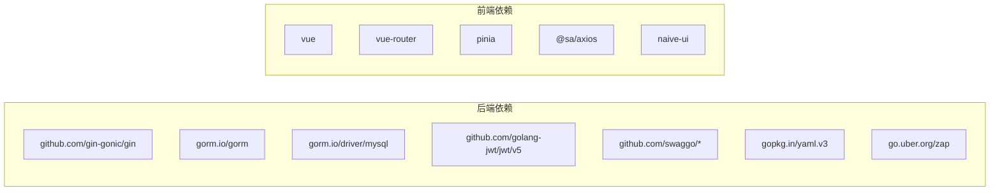

# 架构设计

<cite>
**本文引用的文件**
- [main.go](file://app/server/cmd/api/main.go)
- [router.go](file://app/server/internal/router/router.go)
- [auth.go（服务）](file://app/server/internal/service/auth.go)
- [auth.go（中间件）](file://app/server/internal/middleware/auth.go)
- [jwt.go](file://app/server/pkg/jwt/jwt.go)
- [config.go](file://app/server/pkg/config/config.go)
- [auth.go（DTO）](file://app/server/internal/dto/auth.go)
- [sys_user.go](file://app/server/internal/model/sys_user.go)
- [main.ts](file://app/web/src/main.ts)
- [router/index.ts](file://app/web/src/router/index.ts)
- [index.ts（请求封装）](file://app/web/src/service/request/index.ts)
- [index.ts（Pinia Store）](file://app/web/src/store/index.ts)
- [index.ts（认证 Store）](file://app/web/src/store/modules/auth/index.ts)
- [go.mod](file://app/server/go.mod)
- [package.json](file://app/web/package.json)
</cite>

## 目录
1. [引言](#引言)
2. [项目结构](#项目结构)
3. [核心组件](#核心组件)
4. [架构总览](#架构总览)
5. [详细组件分析](#详细组件分析)
6. [依赖分析](#依赖分析)
7. [性能考虑](#性能考虑)
8. [故障排查指南](#故障排查指南)
9. [结论](#结论)
10. [附录](#附录)

## 引言
本项目采用 Clean Architecture 分层思想，结合前后端分离实践，构建一个可扩展、可维护的小说阅读平台后端与前端系统。后端以 Go + Gin 为核心，提供 REST API；前端使用 Vue3 + TypeScript + Pinia + Vue Router，形成 SPA 应用。系统通过 JWT 实现鉴权，通过 Swagger 提供接口文档，通过配置中心统一管理运行参数，并在路由与中间件层面实现细粒度的权限控制。

## 项目结构
- 后端（Go）位于 app/server，包含入口程序、路由装配、中间件、领域服务、仓储层、数据模型、DTO、配置与工具包等。
- 前端（Vue3）位于 app/web，包含应用入口、路由、状态管理、请求封装、业务页面与组件库等。
- 数据库迁移脚本位于 app/sql，用于系统初始化与版本演进。

图表来源
- [main.go:30-84](file://app/server/cmd/api/main.go#L30-L84)
- [router.go:15-205](file://app/server/internal/router/router.go#L15-L205)
- [auth.go（中间件）:12-40](file://app/server/internal/middleware/auth.go#L12-L40)
- [auth.go（服务）:31-95](file://app/server/internal/service/auth.go#L31-L95)
- [jwt.go:19-55](file://app/server/pkg/jwt/jwt.go#L19-L55)
- [config.go:58-66](file://app/server/pkg/config/config.go#L58-L66)
- [main.ts:10-36](file://app/web/src/main.ts#L10-L36)
- [router/index.ts:20-30](file://app/web/src/router/index.ts#L20-L30)
- [index.ts（请求封装）:13-128](file://app/web/src/service/request/index.ts#L13-L128)
- [index.ts（Pinia Store）:5-12](file://app/web/src/store/index.ts#L5-L12)
- [index.ts（认证 Store）:14-184](file://app/web/src/store/modules/auth/index.ts#L14-L184)

章节来源
- [main.go:30-84](file://app/server/cmd/api/main.go#L30-L84)
- [router.go:15-205](file://app/server/internal/router/router.go#L15-L205)
- [main.ts:10-36](file://app/web/src/main.ts#L10-L36)
- [router/index.ts:20-30](file://app/web/src/router/index.ts#L20-L30)

## 核心组件
- 后端入口：负责配置加载、数据库连接、种子初始化、路由装配与服务启动。
- 路由层：集中装配路由与中间件，按模块拆分管理接口，区分公开接口与受保护接口。
- 中间件层：统一处理跨域、日志、恢复与鉴权，鉴权中间件解析 Bearer Token 并注入用户上下文。
- 服务层：封装业务逻辑，如登录风控、菜单树构建、用户信息聚合等。
- DTO/模型：定义请求/响应结构与数据库模型映射。
- 前端入口：应用初始化顺序（插件、路由、国际化、状态），挂载根节点。
- 请求封装：统一封装请求头、成功判定、错误处理与 Token 刷新流程。
- 状态管理：Pinia 初始化与认证 Store 管理登录态、用户信息与路由切换。

章节来源
- [main.go:34-84](file://app/server/cmd/api/main.go#L34-L84)
- [router.go:15-205](file://app/server/internal/router/router.go#L15-L205)
- [auth.go（中间件）:12-40](file://app/server/internal/middleware/auth.go#L12-L40)
- [auth.go（服务）:31-163](file://app/server/internal/service/auth.go#L31-L163)
- [auth.go（DTO）:3-57](file://app/server/internal/dto/auth.go#L3-L57)
- [sys_user.go:5-36](file://app/server/internal/model/sys_user.go#L5-L36)
- [main.ts:10-36](file://app/web/src/main.ts#L10-L36)
- [index.ts（请求封装）:13-128](file://app/web/src/service/request/index.ts#L13-L128)
- [index.ts（Pinia Store）:5-12](file://app/web/src/store/index.ts#L5-L12)
- [index.ts（认证 Store）:14-184](file://app/web/src/store/modules/auth/index.ts#L14-L184)

## 架构总览
系统采用 Clean Architecture 的分层思想：
- 表现层（后端 Handler、前端组件）：负责用户交互与展示。
- 应用层（后端中间件、前端路由守卫）：负责流程编排与权限控制。
- 领域层（后端服务）：封装核心业务规则与流程。
- 基础设施层（数据库、配置、日志、JWT 工具）：提供通用能力支撑。

图表来源
- [router.go:15-205](file://app/server/internal/router/router.go#L15-L205)
- [auth.go（中间件）:12-40](file://app/server/internal/middleware/auth.go#L12-L40)
- [auth.go（服务）:31-95](file://app/server/internal/service/auth.go#L31-L95)
- [jwt.go:19-55](file://app/server/pkg/jwt/jwt.go#L19-L55)
- [config.go:58-66](file://app/server/pkg/config/config.go#L58-L66)

## 详细组件分析

### 后端入口与配置加载
- 入口程序加载配置、初始化日志、JWT 密钥与过期时间、建立数据库连接、设置连接池参数。
- 支持种子模式：仅执行初始化脚本后退出，便于首次部署。
- 启动路由并监听端口。

图表来源
- [main.go:34-84](file://app/server/cmd/api/main.go#L34-L84)
- [config.go:58-66](file://app/server/pkg/config/config.go#L58-L66)
- [jwt.go:19-22](file://app/server/pkg/jwt/jwt.go#L19-L22)
- [router.go:15-205](file://app/server/internal/router/router.go#L15-L205)

章节来源
- [main.go:34-84](file://app/server/cmd/api/main.go#L34-L84)
- [config.go:58-66](file://app/server/pkg/config/config.go#L58-L66)

### 路由与中间件
- 统一注册 CORS、请求日志与 Recovery 中间件。
- 健康检查与 Swagger UI。
- 依赖注入：按模块实例化仓储与服务，再注入对应处理器。
- 权限控制：公开接口无需鉴权；登录态接口需 Bearer Token；管理接口在登录基础上校验按钮级权限。

图表来源
- [router.go:15-205](file://app/server/internal/router/router.go#L15-L205)
- [auth.go（中间件）:12-40](file://app/server/internal/middleware/auth.go#L12-L40)

章节来源
- [router.go:15-205](file://app/server/internal/router/router.go#L15-L205)
- [auth.go（中间件）:12-40](file://app/server/internal/middleware/auth.go#L12-L40)

### 认证服务与 JWT
- 登录流程：查询用户、风控校验（禁用、锁定）、密码校验、更新登录信息、签发访问与刷新 Token，并记录登录日志。
- 用户信息：聚合角色与按钮码，构建菜单树，支持首页路由推断。
- JWT 工具：初始化密钥与过期时长，生成与解析 Token。

图表来源
- [auth.go（服务）:41-95](file://app/server/internal/service/auth.go#L41-L95)
- [auth.go（DTO）:3-15](file://app/server/internal/dto/auth.go#L3-L15)
- [jwt.go:24-55](file://app/server/pkg/jwt/jwt.go#L24-L55)
- [sys_user.go:5-36](file://app/server/internal/model/sys_user.go#L5-L36)

章节来源
- [auth.go（服务）:41-163](file://app/server/internal/service/auth.go#L41-L163)
- [jwt.go:19-55](file://app/server/pkg/jwt/jwt.go#L19-L55)
- [auth.go（DTO）:3-57](file://app/server/internal/dto/auth.go#L3-L57)
- [sys_user.go:5-36](file://app/server/internal/model/sys_user.go#L5-L36)

### 前端应用启动与状态管理
- 应用启动顺序：加载插件（进度条、图标离线、国际化等）、初始化 Pinia、注册路由守卫、挂载根节点。
- 认证 Store：管理 Token、用户信息、登录态判断、登出与重置、初始化用户信息。
- 请求封装：统一设置 Authorization 头、成功判定、后端失败处理（登出码、弹窗登出、Token 过期刷新重试）。

图表来源
- [main.ts:10-36](file://app/web/src/main.ts#L10-L36)
- [index.ts（Pinia Store）:5-12](file://app/web/src/store/index.ts#L5-L12)
- [router/index.ts:25-30](file://app/web/src/router/index.ts#L25-L30)
- [index.ts（认证 Store）:161-172](file://app/web/src/store/modules/auth/index.ts#L161-L172)
- [index.ts（请求封装）:25-128](file://app/web/src/service/request/index.ts#L25-L128)

章节来源
- [main.ts:10-36](file://app/web/src/main.ts#L10-L36)
- [index.ts（Pinia Store）:5-12](file://app/web/src/store/index.ts#L5-L12)
- [router/index.ts:20-30](file://app/web/src/router/index.ts#L20-L30)
- [index.ts（认证 Store）:14-184](file://app/web/src/store/modules/auth/index.ts#L14-L184)
- [index.ts（请求封装）:13-128](file://app/web/src/service/request/index.ts#L13-L128)

### 数据流与状态管理模式
- 前端数据流：组件通过 API 服务发起请求，请求封装统一处理 Token 注入与错误分支；认证 Store 在登录后持久化 Token 并拉取用户信息，驱动全局状态与路由跳转。
- 后端数据流：Handler 接收请求，经中间件鉴权，调用服务层处理业务，服务层通过仓储访问数据库，最终返回 DTO 响应。

图表来源
- [index.ts（请求封装）:13-128](file://app/web/src/service/request/index.ts#L13-L128)
- [index.ts（认证 Store）:92-172](file://app/web/src/store/modules/auth/index.ts#L92-L172)
- [router.go:78-202](file://app/server/internal/router/router.go#L78-L202)
- [auth.go（中间件）:12-40](file://app/server/internal/middleware/auth.go#L12-L40)
- [auth.go（服务）:31-95](file://app/server/internal/service/auth.go#L31-L95)

章节来源
- [index.ts（请求封装）:13-128](file://app/web/src/service/request/index.ts#L13-L128)
- [index.ts（认证 Store）:92-172](file://app/web/src/store/modules/auth/index.ts#L92-L172)
- [router.go:78-202](file://app/server/internal/router/router.go#L78-L202)
- [auth.go（中间件）:12-40](file://app/server/internal/middleware/auth.go#L12-L40)
- [auth.go（服务）:31-95](file://app/server/internal/service/auth.go#L31-L95)

### 微服务化考虑、API 设计与错误处理
- 微服务化：当前为单体后端，建议后续按业务域拆分服务（如用户、内容、任务），通过网关与消息队列解耦。
- API 设计：统一路径前缀 /api，按模块细分 /manage 管理接口，公开接口与受保护接口清晰分离；响应结构统一，便于前端判定。
- 错误处理：后端中间件与前端请求封装分别处理鉴权失败、后端错误码、Token 过期与登出场景，避免重复代码。

章节来源
- [router.go:78-202](file://app/server/internal/router/router.go#L78-L202)
- [index.ts（请求封装）:34-128](file://app/web/src/service/request/index.ts#L34-L128)

### 安全架构设计
- 鉴权：Bearer Token，中间件解析并注入用户上下文；管理接口进一步校验按钮级权限。
- 密码：bcrypt 哈希存储，登录风控（错误次数与锁定时长）。
- 日志：登录日志记录结果与原因，便于审计与追踪。
- CORS/日志/恢复：统一中间件保障跨域、可观测性与稳定性。

章节来源
- [auth.go（中间件）:12-40](file://app/server/internal/middleware/auth.go#L12-L40)
- [auth.go（服务）:19-95](file://app/server/internal/service/auth.go#L19-L95)
- [jwt.go:19-55](file://app/server/pkg/jwt/jwt.go#L19-L55)

## 依赖分析
- 后端依赖：Gin、GORM、MySQL 驱动、JWT、Swagger、YAML、Zap 等。
- 前端依赖：Vue3、Vue Router、Pinia、NaiveUI、Axios 封装等。

图表来源
- [go.mod:5-16](file://app/server/go.mod#L5-L16)
- [package.json:46-67](file://app/web/package.json#L46-L67)

章节来源
- [go.mod:5-16](file://app/server/go.mod#L5-L16)
- [package.json:46-67](file://app/web/package.json#L46-L67)

## 性能考虑
- 数据库连接池：在入口处设置最大空闲与最大打开连接数，避免连接争用。
- 日志级别：生产环境建议调整日志级别，减少 IO 压力。
- 中间件顺序：将轻量中间件前置，避免阻塞后续处理。
- 前端缓存：合理利用浏览器缓存与组件缓存，减少重复请求。

章节来源
- [main.go:59-65](file://app/server/cmd/api/main.go#L59-L65)

## 故障排查指南
- 登录失败：检查用户名是否存在、是否被禁用或锁定；确认密码哈希比对与风控逻辑。
- Token 过期：前端请求封装会自动处理过期场景，若仍失败，检查刷新 Token 逻辑与后端 JWT 配置。
- 鉴权失败：确认 Authorization 头格式是否为 Bearer；检查中间件是否正确注入用户上下文。
- 路由无权限：确认按钮级权限是否授予；检查菜单树构建与路由元信息。

章节来源
- [auth.go（服务）:41-95](file://app/server/internal/service/auth.go#L41-L95)
- [auth.go（中间件）:12-40](file://app/server/internal/middleware/auth.go#L12-L40)
- [index.ts（请求封装）:86-97](file://app/web/src/service/request/index.ts#L86-L97)

## 结论
本项目以 Clean Architecture 为骨架，后端通过 Gin + GORM 实现高内聚低耦合的服务层，前端以 Vue3 + Pinia 构建现代化 SPA，前后端通过统一的 API 规范与鉴权机制协同工作。通过中间件与请求封装实现一致的安全与错误处理策略，具备良好的可扩展性与可维护性。建议后续在成熟阶段推进微服务拆分与可观测性建设。

## 附录
- 系统边界：后端仅暴露 REST API；前端独立构建并托管于静态服务器；数据库为单一实例。
- 外部依赖：MySQL、JWT、Swagger、Zap、YAML。
- 安全要点：JWT 密钥管理、Token 过期策略、登录风控、日志审计。