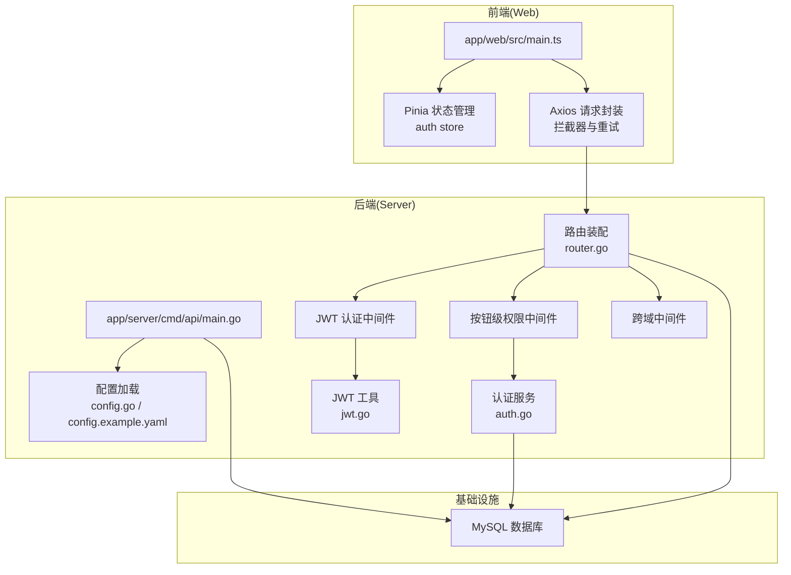
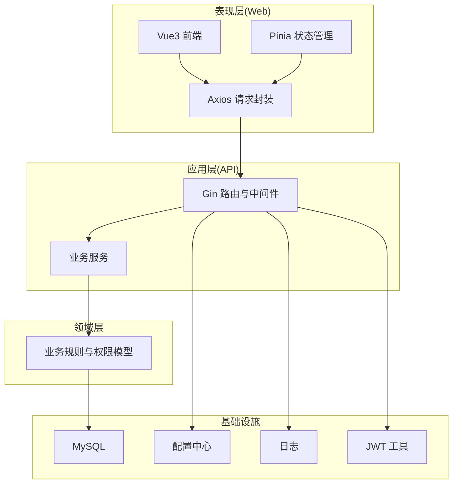
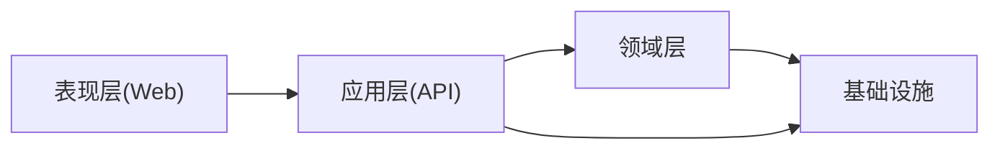
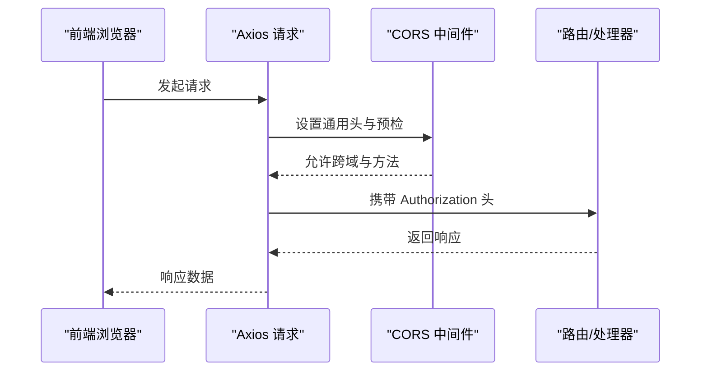
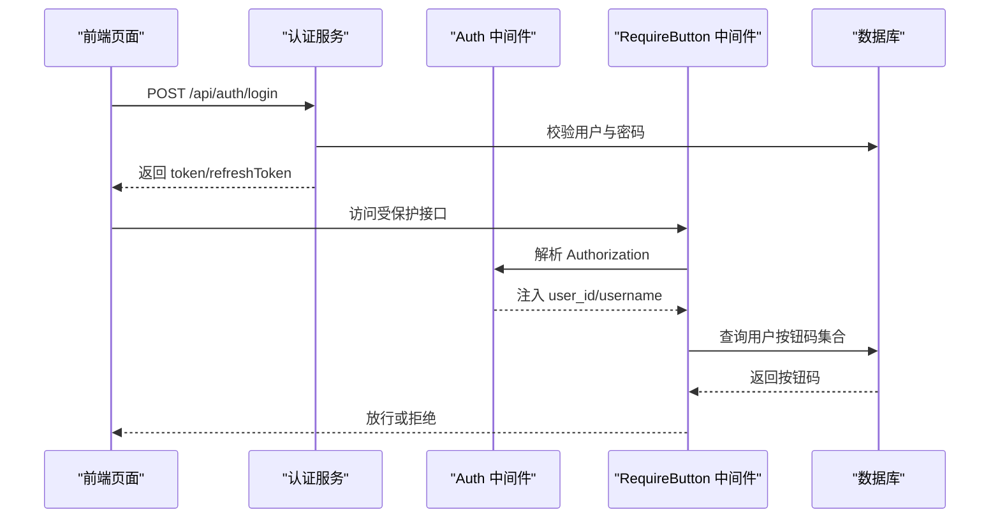
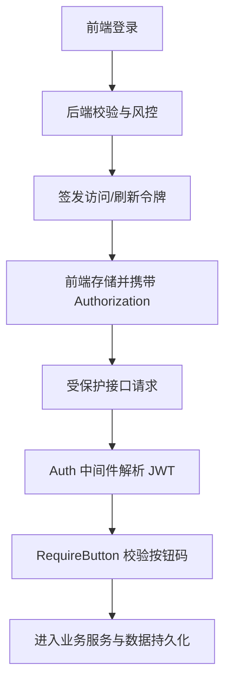
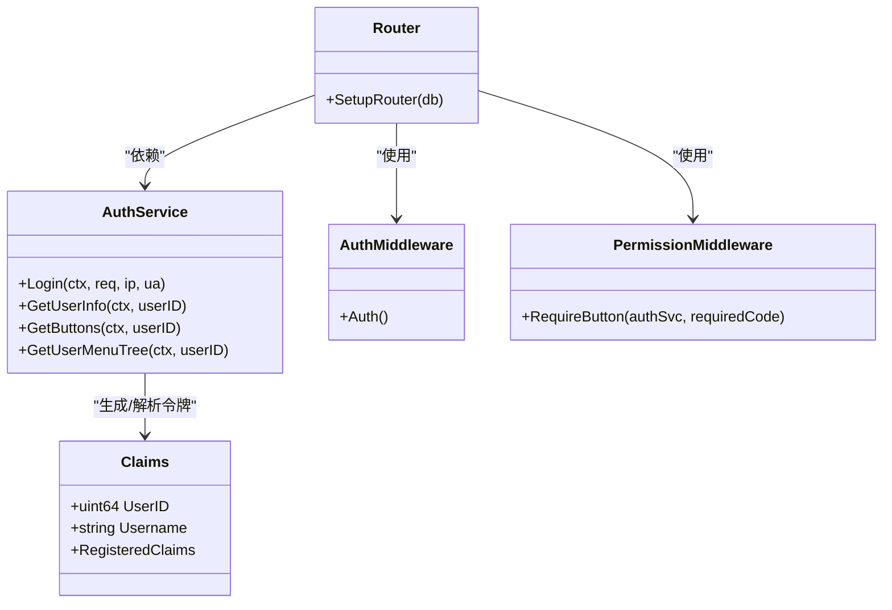
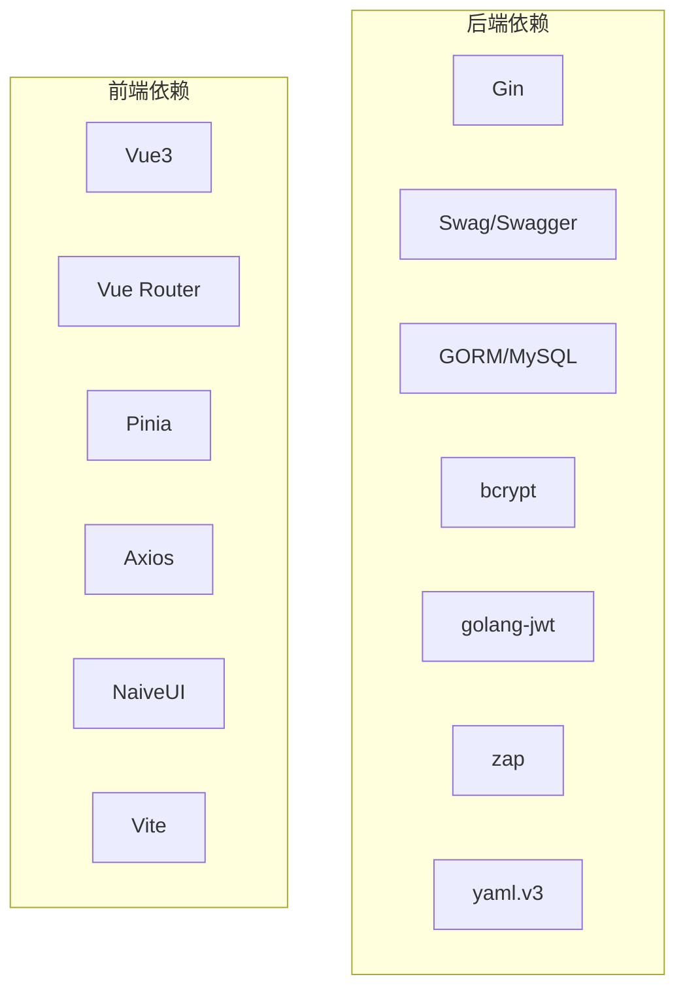

# 系统架构

<cite>
**本文引用的文件**
- [main.go](file://app/server/cmd/api/main.go)
- [router.go](file://app/server/internal/router/router.go)
- [config.go](file://app/server/pkg/config/config.go)
- [config.example.yaml](file://app/server/configs/config.example.yaml)
- [auth.go](file://app/server/internal/middleware/auth.go)
- [cors.go](file://app/server/internal/middleware/cors.go)
- [permission.go](file://app/server/internal/middleware/permission.go)
- [jwt.go](file://app/server/pkg/jwt/jwt.go)
- [auth.go](file://app/server/internal/service/auth.go)
- [main.ts](file://app/web/src/main.ts)
- [index.ts](file://app/web/src/store/modules/auth/index.ts)
- [index.ts](file://app/web/src/service/request/index.ts)
- [go.mod](file://app/server/go.mod)
- [package.json](file://app/web/package.json)
</cite>

## 目录
1. [引言](#引言)
2. [项目结构](#项目结构)
3. [核心组件](#核心组件)
4. [架构总览](#架构总览)
5. [详细组件分析](#详细组件分析)
6. [依赖分析](#依赖分析)
7. [性能考量](#性能考量)
8. [故障排查指南](#故障排查指南)
9. [结论](#结论)
10. [附录](#附录)

## 引言
本文件面向 boread 项目的系统架构文档，围绕 Clean Architecture 的分层设计，系统化阐述表现层（Web 前端 Vue3）、应用层（Go API 服务）、领域层（业务逻辑）与基础设施层（数据库、缓存）的职责划分与交互关系；同时说明前后端分离实现、RESTful API 设计原则、跨域处理策略、用户认证授权机制（含 JWT 令牌管理与权限控制模型），并给出系统边界、模块间依赖关系图与数据流向图，最后提供架构演进路线图与扩展性建议。

## 项目结构
boread 采用前后端分离架构：
- 前端：Vue3 + Vite + TypeScript + NaiveUI，位于 app/web 目录，负责用户界面与交互、状态管理、请求封装与拦截。
- 后端：Go Gin + GORM，位于 app/server 目录，负责路由装配、中间件、业务服务、数据访问与配置管理。
- 数据库：MySQL，通过 GORM 进行对象映射与连接池配置。
- 配置：统一 YAML 配置文件，支持服务器、数据库、JWT、日志等参数加载。

图表来源
- [main.go:30-84](file://app/server/cmd/api/main.go#L30-L84)
- [router.go:20-205](file://app/server/internal/router/router.go#L20-L205)
- [auth.go:12-40](file://app/server/internal/middleware/auth.go#L12-L40)
- [permission.go:20-52](file://app/server/internal/middleware/permission.go#L20-L52)
- [cors.go:9-23](file://app/server/internal/middleware/cors.go#L9-L23)
- [jwt.go:19-71](file://app/server/pkg/jwt/jwt.go#L19-L71)
- [config.go:58-66](file://app/server/pkg/config/config.go#L58-L66)
- [config.example.yaml:1-21](file://app/server/configs/config.example.yaml#L1-L21)
- [main.ts:10-36](file://app/web/src/main.ts#L10-L36)
- [index.ts:13-128](file://app/web/src/service/request/index.ts#L13-L128)

章节来源
- [main.go:30-84](file://app/server/cmd/api/main.go#L30-L84)
- [router.go:20-205](file://app/server/internal/router/router.go#L20-L205)
- [config.go:58-66](file://app/server/pkg/config/config.go#L58-L66)
- [config.example.yaml:1-21](file://app/server/configs/config.example.yaml#L1-L21)
- [main.ts:10-36](file://app/web/src/main.ts#L10-L36)

## 核心组件
- 表现层（Web 前端）
  - 应用入口：初始化插件、路由、国际化、状态管理与挂载。
  - 状态管理：Pinia 管理用户信息、登录态、路由与标签页。
  - 请求封装：Axios 统一拦截器，自动注入 Authorization，处理后端成功码、过期令牌刷新与错误提示。
- 应用层（Go API 服务）
  - 入口：加载配置、初始化日志、JWT、数据库连接池，装配路由与中间件。
  - 路由：按公开、登录态、受保护管理接口三层组织，使用中间件进行鉴权与权限控制。
  - 中间件：认证（JWT）、跨域、请求日志、按钮级权限。
  - 服务：认证服务（登录风控、签发令牌、菜单与按钮权限聚合）。
  - 配置：YAML 配置加载，支持服务器、数据库、JWT、日志参数。
- 领域层（业务逻辑）
  - 认证领域：用户登录、密码校验、账户锁定、登录日志、角色与按钮权限聚合。
  - 权限模型：角色-菜单-按钮三级权限，按钮级细粒度控制。
- 基础设施层（数据库、缓存）
  - 数据库：GORM + MySQL，连接池参数可配置。
  - 缓存：当前未见显式缓存实现，按钮级权限中间件注释提示后续可引入缓存优化。

章节来源
- [main.ts:10-36](file://app/web/src/main.ts#L10-L36)
- [index.ts:14-184](file://app/web/src/store/modules/auth/index.ts#L14-L184)
- [index.ts:13-128](file://app/web/src/service/request/index.ts#L13-L128)
- [main.go:30-84](file://app/server/cmd/api/main.go#L30-L84)
- [router.go:15-205](file://app/server/internal/router/router.go#L15-L205)
- [auth.go:12-40](file://app/server/internal/middleware/auth.go#L12-L40)
- [permission.go:10-52](file://app/server/internal/middleware/permission.go#L10-L52)
- [jwt.go:19-71](file://app/server/pkg/jwt/jwt.go#L19-L71)
- [auth.go:41-247](file://app/server/internal/service/auth.go#L41-L247)
- [config.go:58-66](file://app/server/pkg/config/config.go#L58-L66)

## 架构总览
Clean Architecture 分层与职责：
- 表现层（Web）：仅负责展示与交互，不直接访问数据源。
- 应用层（Go）：编排业务用例，装配路由与中间件，协调服务层。
- 领域层（Go）：封装核心业务规则与权限模型。
- 基础设施层（Go）：数据库、配置、日志、加密等技术细节。

图表来源
- [main.go:30-84](file://app/server/cmd/api/main.go#L30-L84)
- [router.go:20-205](file://app/server/internal/router/router.go#L20-L205)
- [jwt.go:19-71](file://app/server/pkg/jwt/jwt.go#L19-L71)
- [config.go:58-66](file://app/server/pkg/config/config.go#L58-L66)

## 详细组件分析

### 清洁架构分层与模块边界
- 表现层边界：仅处理视图与用户交互，不包含业务逻辑；通过统一请求封装与后端交互。
- 应用层边界：集中于路由与中间件装配，不直接承载业务规则；业务规则下沉至服务层。
- 领域层边界：封装核心业务与权限模型，保持对上层透明。
- 基础设施边界：数据库、配置、日志、加密等，向上提供稳定抽象。

图表来源
- [main.go:30-84](file://app/server/cmd/api/main.go#L30-L84)
- [router.go:20-205](file://app/server/internal/router/router.go#L20-L205)
- [auth.go:41-247](file://app/server/internal/service/auth.go#L41-L247)

章节来源
- [main.go:30-84](file://app/server/cmd/api/main.go#L30-L84)
- [router.go:20-205](file://app/server/internal/router/router.go#L20-L205)
- [auth.go:41-247](file://app/server/internal/service/auth.go#L41-L247)

### 前后端分离与 RESTful API 设计
- 前后端分离：前端独立构建部署，后端提供 RESTful 接口；通过 Axios 统一请求封装与拦截。
- RESTful 设计原则：
  - 资源命名：以名词复数形式（如 /api/manage/dept、/api/book）。
  - 动作语义：GET/POST/PUT/DELETE 对应查询、创建、更新、删除。
  - 状态码：遵循后端统一响应码约定，前端据此判断成功与失败。
  - 错误处理：后端返回结构化错误码与消息，前端统一提示与登出处理。

章节来源
- [router.go:78-202](file://app/server/internal/router/router.go#L78-L202)
- [index.ts:34-100](file://app/web/src/service/request/index.ts#L34-L100)

### 跨域处理策略
- 服务端：全局启用 CORS 中间件，允许任意来源、常用头部与方法，并对预检请求快速返回。
- 客户端：Axios 在请求前自动注入 Authorization 头，确保携带令牌。

图表来源
- [cors.go:9-23](file://app/server/internal/middleware/cors.go#L9-L23)
- [index.ts:28-33](file://app/web/src/service/request/index.ts#L28-L33)

章节来源
- [cors.go:9-23](file://app/server/internal/middleware/cors.go#L9-L23)
- [index.ts:28-33](file://app/web/src/service/request/index.ts#L28-L33)

### 用户认证授权机制与 JWT 令牌管理
- 认证流程：
  - 登录：后端校验用户名/密码与风控（错误次数与锁定），成功后签发访问令牌与刷新令牌。
  - 会话：前端存储令牌并在后续请求头中携带 Authorization: Bearer <token>。
  - 刷新：当后端返回令牌过期码时，前端触发刷新流程并重试原请求。
- 权限控制模型：
  - 角色-菜单-按钮三级权限；只读接口仅需登录态，写操作需按钮级权限。
  - 按钮级权限中间件从上下文取 user_id，查询用户拥有的按钮 code 集合，匹配目标 code。

图表来源
- [auth.go:41-95](file://app/server/internal/service/auth.go#L41-L95)
- [auth.go:12-40](file://app/server/internal/middleware/auth.go#L12-L40)
- [permission.go:20-52](file://app/server/internal/middleware/permission.go#L20-L52)
- [jwt.go:24-55](file://app/server/pkg/jwt/jwt.go#L24-L55)
- [index.ts:99-146](file://app/web/src/store/modules/auth/index.ts#L99-L146)

章节来源
- [auth.go:41-95](file://app/server/internal/service/auth.go#L41-L95)
- [auth.go:12-40](file://app/server/internal/middleware/auth.go#L12-L40)
- [permission.go:20-52](file://app/server/internal/middleware/permission.go#L20-L52)
- [jwt.go:24-55](file://app/server/pkg/jwt/jwt.go#L24-L55)
- [index.ts:99-146](file://app/web/src/store/modules/auth/index.ts#L99-L146)

### 数据流向图
- 登录与权限加载：
  - 前端提交用户名/密码，后端验证并通过 JWT 签发令牌。
  - 前端拉取用户信息与菜单树，后端聚合角色与按钮权限。
- 写操作流程：
  - 前端发起受保护请求，中间件解析 JWT 并注入用户信息。
  - 按钮级中间件校验用户按钮码集合，通过后进入业务处理。

图表来源
- [auth.go:41-95](file://app/server/internal/service/auth.go#L41-L95)
- [auth.go:12-40](file://app/server/internal/middleware/auth.go#L12-L40)
- [permission.go:20-52](file://app/server/internal/middleware/permission.go#L20-L52)
- [jwt.go:24-55](file://app/server/pkg/jwt/jwt.go#L24-L55)

章节来源
- [auth.go:41-95](file://app/server/internal/service/auth.go#L41-L95)
- [auth.go:12-40](file://app/server/internal/middleware/auth.go#L12-L40)
- [permission.go:20-52](file://app/server/internal/middleware/permission.go#L20-L52)
- [jwt.go:24-55](file://app/server/pkg/jwt/jwt.go#L24-L55)

### 关键类与关系（代码级）

图表来源
- [auth.go:31-134](file://app/server/internal/service/auth.go#L31-L134)
- [jwt.go:10-71](file://app/server/pkg/jwt/jwt.go#L10-L71)
- [router.go:20-205](file://app/server/internal/router/router.go#L20-L205)
- [auth.go:12-40](file://app/server/internal/middleware/auth.go#L12-L40)
- [permission.go:20-52](file://app/server/internal/middleware/permission.go#L20-L52)

章节来源
- [auth.go:31-134](file://app/server/internal/service/auth.go#L31-L134)
- [jwt.go:10-71](file://app/server/pkg/jwt/jwt.go#L10-L71)
- [router.go:20-205](file://app/server/internal/router/router.go#L20-L205)
- [auth.go:12-40](file://app/server/internal/middleware/auth.go#L12-L40)
- [permission.go:20-52](file://app/server/internal/middleware/permission.go#L20-L52)

## 依赖分析
- 外部依赖（后端 Go）
  - Web 框架：Gin
  - 文档：Swag（Swagger）
  - ORM：GORM + MySQL Driver
  - 加密：bcrypt
  - JWT：golang-jwt
  - 日志：zap
  - YAML：yaml.v3
- 外部依赖（前端 Vue3）
  - 核心：Vue3、Vue Router、Pinia
  - HTTP：Axios
  - UI：NaiveUI
  - 构建：Vite

图表来源
- [go.mod:5-16](file://app/server/go.mod#L5-L16)
- [package.json:46-67](file://app/web/package.json#L46-L67)

章节来源
- [go.mod:5-16](file://app/server/go.mod#L5-L16)
- [package.json:46-67](file://app/web/package.json#L46-L67)

## 性能考量
- 连接池与日志：后端通过配置设置最大空闲/打开连接数，并设置 GORM 日志级别，避免过度输出影响性能。
- 中间件顺序：CORS、日志、恢复中间件在路由前执行，减少下游处理负担。
- 权限校验：按钮级权限中间件当前每次请求查询数据库，存在热点路径性能风险；建议引入本地缓存（如 sync.Map 或 Redis）降低 DB 压力。
- 前端请求：统一拦截器与错误处理，避免重复请求与无谓重试。

章节来源
- [main.go:59-65](file://app/server/cmd/api/main.go#L59-L65)
- [router.go:20-24](file://app/server/internal/router/router.go#L20-L24)
- [permission.go:17-19](file://app/server/internal/middleware/permission.go#L17-L19)

## 故障排查指南
- 登录失败
  - 用户不存在、密码错误、账户被禁用或锁定：后端记录登录日志并返回对应错误；前端根据后端返回码进行提示或登出。
- 令牌无效或过期
  - 前端检测到令牌过期码后，尝试刷新令牌并重试原请求；若刷新失败则清空本地状态并跳转登录。
- 跨域问题
  - 确认服务端已启用 CORS 中间件，客户端请求头包含正确的 Authorization；预检请求返回 204。
- 权限不足
  - 检查用户按钮码集合是否包含目标 code；确认路由是否正确挂载 RequireButton 中间件。

章节来源
- [auth.go:42-95](file://app/server/internal/service/auth.go#L42-L95)
- [index.ts:86-97](file://app/web/src/service/request/index.ts#L86-L97)
- [cors.go:9-23](file://app/server/internal/middleware/cors.go#L9-L23)
- [permission.go:20-52](file://app/server/internal/middleware/permission.go#L20-L52)

## 结论
boread 采用 Clean Architecture 分层，前后端职责清晰、边界明确。后端通过 Gin 路由与中间件实现认证、跨域与权限控制，结合 JWT 实现无状态会话；前端通过 Axios 统一请求封装与状态管理，形成一致的用户体验。当前架构具备良好的可维护性与扩展性，后续可在权限中间件引入缓存、增强可观测性与安全防护，进一步提升系统稳定性与性能。

## 附录
- 架构演进路线图
  - 短期：引入按钮级权限缓存、完善登录风控与审计日志。
  - 中期：拆分微服务（用户、内容、系统管理）、引入 Redis 缓存与消息队列。
  - 长期：可观测性体系（日志、指标、链路追踪）、容器化与多环境治理。
- 扩展性建议
  - 服务拆分：按业务域拆分为独立服务，减少耦合。
  - 缓存策略：热点数据（菜单树、字典、按钮码）引入本地缓存与分布式缓存。
  - 安全加固：HTTPS、CSRF 防护、敏感日志脱敏、速率限制与 WAF。
  - 监控告警：接入 Prometheus/Grafana、Sentry、APM 工具。