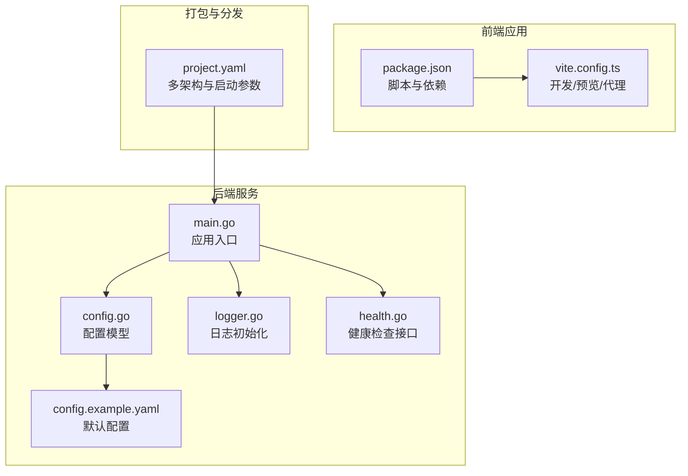
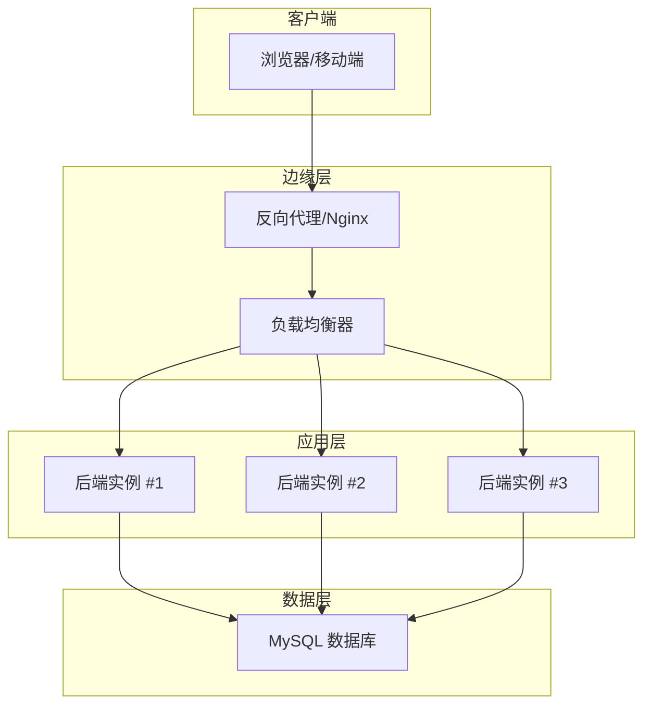
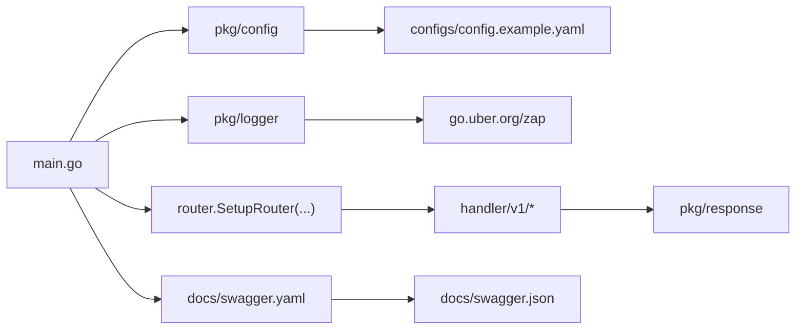
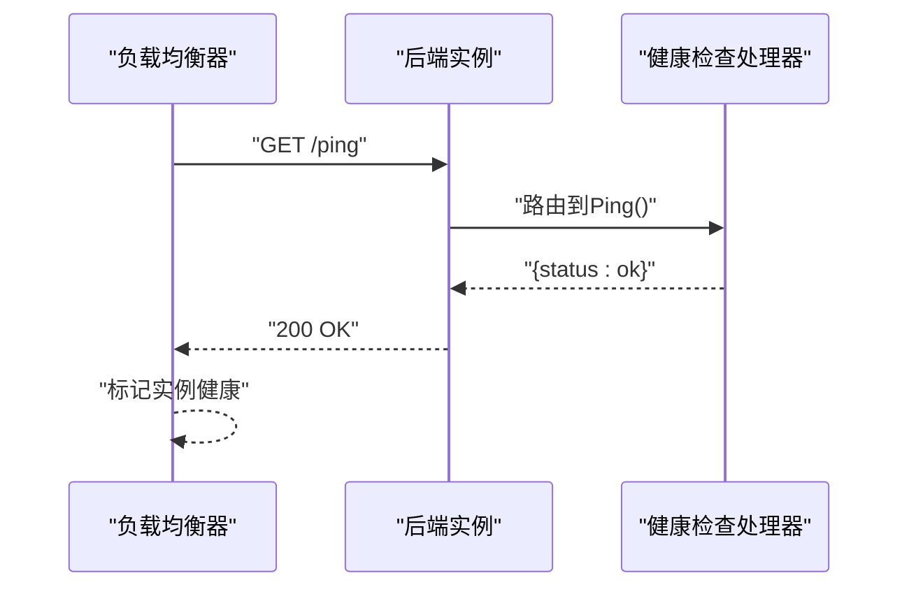

# 部署架构

<cite>
**本文引用的文件**
- [main.go](file://app/server/cmd/api/main.go)
- [config.example.yaml](file://app/server/configs/config.example.yaml)
- [config.go](file://app/server/pkg/config/config.go)
- [health.go](file://app/server/internal/handler/v1/health.go)
- [logger.go](file://app/server/pkg/logger/logger.go)
- [go.mod](file://app/server/go.mod)
- [project.yaml](file://project.yaml)
- [package.json](file://app/web/package.json)
- [vite.config.ts](file://app/web/vite.config.ts)
</cite>

## 目录
1. [简介](#简介)
2. [项目结构](#项目结构)
3. [核心组件](#核心组件)
4. [架构总览](#架构总览)
5. [详细组件分析](#详细组件分析)
6. [依赖分析](#依赖分析)
7. [性能考量](#性能考量)
8. [故障排查指南](#故障排查指南)
9. [结论](#结论)
10. [附录](#附录)

## 简介
本文件面向boread项目的部署与运维团队，系统化阐述容器化部署策略、多架构支持（amd64/arm64）、微服务部署模式、负载均衡与健康检查、CI/CD流水线设计、环境与配置管理、密钥管理策略、监控告警与日志分析、性能指标监控、故障恢复与灾难备份、扩展性设计以及云平台适配与Kubernetes编排要点。文档同时给出可落地的实施建议与可视化图示，帮助不同技术背景的读者快速理解并执行。

## 项目结构
boread由前后端分离架构组成：后端采用Go语言实现的Web服务，前端使用Vue3+Vite构建。项目根目录提供跨平台打包元信息，后端通过命令行入口启动HTTP服务，并加载配置、初始化数据库连接与路由。

**图表来源**
- [main.go:30-84](file://app/server/cmd/api/main.go#L30-L84)
- [config.go:58-66](file://app/server/pkg/config/config.go#L58-L66)
- [config.example.yaml:1-21](file://app/server/configs/config.example.yaml#L1-L21)
- [logger.go:13-38](file://app/server/pkg/logger/logger.go#L13-L38)
- [health.go:23-25](file://app/server/internal/handler/v1/health.go#L23-L25)
- [package.json:29-44](file://app/web/package.json#L29-L44)
- [vite.config.ts:7-51](file://app/web/vite.config.ts#L7-L51)
- [project.yaml:4-11](file://project.yaml#L4-L11)

**章节来源**
- [main.go:30-84](file://app/server/cmd/api/main.go#L30-L84)
- [config.example.yaml:1-21](file://app/server/configs/config.example.yaml#L1-L21)
- [config.go:58-66](file://app/server/pkg/config/config.go#L58-L66)
- [logger.go:13-38](file://app/server/pkg/logger/logger.go#L13-L38)
- [health.go:23-25](file://app/server/internal/handler/v1/health.go#L23-L25)
- [package.json:29-44](file://app/web/package.json#L29-L44)
- [vite.config.ts:7-51](file://app/web/vite.config.ts#L7-L51)
- [project.yaml:4-11](file://project.yaml#L4-L11)

## 核心组件
- 应用入口与生命周期
  - 启动顺序：解析命令行参数 → 加载配置 → 初始化日志 → 初始化JWT → 连接数据库并设置连接池 → 可选种子初始化 → 构建路由 → 启动HTTP服务。
  - 关键路径参考：[main.go:30-84](file://app/server/cmd/api/main.go#L30-L84)。
- 配置管理
  - 支持从YAML文件加载server、database、jwt、log等配置项；提供默认样例文件便于本地与CI环境使用。
  - 关键路径参考：[config.go:58-66](file://app/server/pkg/config/config.go#L58-L66)、[config.example.yaml:1-21](file://app/server/configs/config.example.yaml#L1-L21)。
- 日志系统
  - 使用zap，支持控制台与文件双通道输出，按级别过滤，自动创建日志目录。
  - 关键路径参考：[logger.go:13-38](file://app/server/pkg/logger/logger.go#L13-L38)。
- 健康检查
  - 提供/ping接口返回状态，便于K8s/反向代理进行存活/就绪探针。
  - 关键路径参考：[health.go:23-25](file://app/server/internal/handler/v1/health.go#L23-L25)。
- 前端构建与开发
  - Vite开发服务器、代理、构建模式与脚本定义，支持多环境变量与代理转发。
  - 关键路径参考：[package.json:29-44](file://app/web/package.json#L29-L44)、[vite.config.ts:7-51](file://app/web/vite.config.ts#L7-L51)。

**章节来源**
- [main.go:30-84](file://app/server/cmd/api/main.go#L30-L84)
- [config.go:58-66](file://app/server/pkg/config/config.go#L58-L66)
- [config.example.yaml:1-21](file://app/server/configs/config.example.yaml#L1-L21)
- [logger.go:13-38](file://app/server/pkg/logger/logger.go#L13-L38)
- [health.go:23-25](file://app/server/internal/handler/v1/health.go#L23-L25)
- [package.json:29-44](file://app/web/package.json#L29-L44)
- [vite.config.ts:7-51](file://app/web/vite.config.ts#L7-L51)

## 架构总览
下图展示boread的部署架构：后端服务作为单一可执行程序，前端静态资源通过Nginx或反向代理提供；数据库独立部署；健康检查接口用于探活；CI/CD负责构建与发布。

**图表来源**
- [main.go:76-83](file://app/server/cmd/api/main.go#L76-L83)
- [health.go:23-25](file://app/server/internal/handler/v1/health.go#L23-L25)

## 详细组件分析

### 容器化与镜像构建
- 多架构支持
  - 项目元信息声明支持amd64与arm64，便于统一打包与分发。
  - 参考：[project.yaml:4-6](file://project.yaml#L4-L6)。
- 镜像构建策略
  - 建议使用多阶段构建：构建阶段使用完整Go工具链生成二进制，运行阶段仅包含最小根文件系统与二进制，减少攻击面与体积。
  - 参考：[go.mod:3](file://app/server/go.mod#L3)。
- 入口与端口
  - 通过配置文件指定监听端口；容器内暴露该端口并映射至宿主机。
  - 参考：[config.example.yaml:2](file://app/server/configs/config.example.yaml#L2)、[main.go:78](file://app/server/cmd/api/main.go#L78)。
- 健康检查
  - 在容器编排中使用/ping作为liveness/readiness探针，确保流量只导向健康实例。
  - 参考：[health.go:23-25](file://app/server/internal/handler/v1/health.go#L23-L25)。

**章节来源**
- [project.yaml:4-6](file://project.yaml#L4-L6)
- [go.mod:3](file://app/server/go.mod#L3)
- [config.example.yaml:2](file://app/server/configs/config.example.yaml#L2)
- [main.go:78](file://app/server/cmd/api/main.go#L78)
- [health.go:23-25](file://app/server/internal/handler/v1/health.go#L23-L25)

### 微服务部署模式与负载均衡
- 单体服务模式
  - 当前后端为单可执行文件，适合小型到中型规模；若业务增长，可拆分为网关+领域服务的微服务架构。
- 负载均衡
  - 建议在K8s中使用Service/Ingress或外部LB，结合就绪探针避免将请求转发至未就绪实例。
- 健康检查
  - 使用/ping作为就绪探针，成功即加入流量；失败则隔离直至恢复。
- 扩展性
  - 水平扩展：增加Pod副本数；垂直扩展：提升CPU/内存资源配额；有状态组件（如数据库）需独立扩缩容策略。

**章节来源**
- [health.go:23-25](file://app/server/internal/handler/v1/health.go#L23-L25)

### CI/CD流水线设计
- 触发条件
  - 主分支保护：PR合并触发流水线；标签发布触发制品归档。
- 步骤建议
  - 代码检出 → 依赖安装 → 单元测试/静态检查 → 构建后端二进制 → 构建前端产物 → Docker镜像构建（多架构） → 推送镜像仓库 → 发布到目标环境 → 健康检查验证。
- 自动化测试
  - 建议在流水线中集成后端单元测试与前端E2E测试，失败即阻断发布。
- 持续部署
  - 开发/测试/生产三环境分离，采用GitOps或声明式配置管理（如Helm/Kustomize），变更可追溯、可回滚。

**章节来源**
- [package.json:29-44](file://app/web/package.json#L29-L44)
- [vite.config.ts:7-51](file://app/web/vite.config.ts#L7-L51)

### 环境管理与配置管理
- 环境区分
  - 开发：本地或沙箱集群，启用调试日志与较宽松的安全策略；测试：模拟生产流量与数据；生产：严格权限、限流与审计。
- 配置注入
  - 通过环境变量覆盖配置文件中的敏感字段（如数据库凭据、JWT密钥）；生产环境优先使用密钥管理服务。
- 配置文件
  - 默认样例文件用于本地与CI环境快速启动；实际部署时替换为安全的生产配置。
- 参考路径
  - [config.example.yaml:1-21](file://app/server/configs/config.example.yaml#L1-L21)、[config.go:58-66](file://app/server/pkg/config/config.go#L58-L66)。

**章节来源**
- [config.example.yaml:1-21](file://app/server/configs/config.example.yaml#L1-L21)
- [config.go:58-66](file://app/server/pkg/config/config.go#L58-L66)

### 密钥管理策略
- 生产密钥
  - 使用云原生存储（如KMS、Vault）或平台密钥管理服务，避免硬编码在配置文件或镜像中。
- 最小权限
  - 为数据库、对象存储等外部服务授予最小必要权限；定期轮换密钥。
- 变更审计
  - 所有密钥变更记录在案，配合CI/CD的审批流程。

**章节来源**
- [config.go:46-49](file://app/server/pkg/config/config.go#L46-L49)

### 监控告警体系
- 指标采集
  - HTTP请求数、响应时间、错误率、并发连接数、数据库连接池使用率、JVM/GC（如使用Java运行时）。
- 日志采集
  - 结合zap输出结构化日志，集中收集至ELK/EFK或云日志服务，支持检索与聚合分析。
- 告警策略
  - 基于阈值与趋势的告警；对关键路径（登录、支付、搜索）设置更严格的阈值。
- 健康检查
  - K8s探针与外部监控共同保障实例健康。

**章节来源**
- [logger.go:13-38](file://app/server/pkg/logger/logger.go#L13-L38)

### 性能指标监控
- 后端
  - Gin中间件统计QPS、P95/P99延迟；数据库连接池指标（空闲/活跃/等待）。
- 前端
  - 页面首屏时间、资源加载时间、用户交互延迟。
- 数据库
  - 查询慢日志、锁等待、连接数峰值。

**章节来源**
- [main.go:59-65](file://app/server/cmd/api/main.go#L59-L65)

### 故障恢复与灾难备份
- 快速恢复
  - 多副本+滚动更新；失败实例自动重启；探针失败时从负载均衡摘除。
- 数据备份
  - 定期全量+增量备份；异地容灾；备份校验与恢复演练。
- 灾难预案
  - 降级开关、熔断限流、只读模式；快速回滚至上一稳定版本。

**章节来源**
- [health.go:23-25](file://app/server/internal/handler/v1/health.go#L23-L25)

### 扩展性设计考虑
- 无状态化
  - 会话与状态尽量外置（Redis/Memcached），后端实例可弹性伸缩。
- 缓存与CDN
  - 图片/静态资源走CDN；热点数据加缓存；缓存失效策略与一致性。
- 异步处理
  - 大文件上传、转码、推送通知等异步化，降低主请求延迟。

**章节来源**
- [main.go:44-57](file://app/server/cmd/api/main.go#L44-L57)

### 云平台适配与Kubernetes编排
- 集群规划
  - 分环境命名空间隔离；RBAC最小权限；网络策略限制访问。
- 工作负载
  - Deployment管理副本；Service暴露端口；Ingress统一入口。
- 存储与持久化
  - PVC绑定持久卷；日志与备份目录挂载至对象存储或共享存储。
- 配置与密钥
  - ConfigMap管理非敏感配置；Secret管理敏感信息；环境差异化通过Helm Values/Kustomize Overlay。
- 健康检查
  - livenessProbe/readinessProbe指向/ping；启动延迟与超时根据实例启动时间调整。
- 资源优化
  - 设置requests/limits；HPA基于CPU/自定义指标自动扩缩；PodDisruptionBudget保障可用性。

**章节来源**
- [health.go:23-25](file://app/server/internal/handler/v1/health.go#L23-L25)
- [project.yaml:4-11](file://project.yaml#L4-L11)

## 依赖分析
后端模块依赖清晰，核心包括Web框架、ORM、日志、配置解析与Swagger文档生成。前端通过Vite进行开发与构建，脚本与代理配置完善。

**图表来源**
- [main.go:13-19](file://app/server/cmd/api/main.go#L13-L19)
- [main.go:76](file://app/server/cmd/api/main.go#L76)
- [config.go:58-66](file://app/server/pkg/config/config.go#L58-L66)
- [logger.go:13-38](file://app/server/pkg/logger/logger.go#L13-L38)

**章节来源**
- [main.go:13-19](file://app/server/cmd/api/main.go#L13-L19)
- [config.go:58-66](file://app/server/pkg/config/config.go#L58-L66)
- [logger.go:13-38](file://app/server/pkg/logger/logger.go#L13-L38)

## 性能考量
- 数据库连接池
  - 合理设置最大空闲/活动连接数，避免连接泄漏与抖动。
  - 参考：[main.go:63-64](file://app/server/cmd/api/main.go#L63-L64)、[config.example.yaml:12-13](file://app/server/configs/config.example.yaml#L12-L13)。
- 日志性能
  - 结构化日志与异步写入，避免阻塞请求处理。
  - 参考：[logger.go:25-34](file://app/server/pkg/logger/logger.go#L25-L34)。
- 前端构建
  - 生产模式开启压缩与Tree-shaking；合理拆分包，启用懒加载与CDN。

**章节来源**
- [main.go:63-64](file://app/server/cmd/api/main.go#L63-L64)
- [config.example.yaml:12-13](file://app/server/configs/config.example.yaml#L12-L13)
- [logger.go:25-34](file://app/server/pkg/logger/logger.go#L25-L34)
- [package.json:30](file://app/web/package.json#L30)

## 故障排查指南
- 启动失败
  - 检查配置文件路径与权限；确认数据库连通性与账号权限。
  - 参考：[main.go:34-57](file://app/server/cmd/api/main.go#L34-L57)、[config.go:58-66](file://app/server/pkg/config/config.go#L58-L66)。
- 健康检查异常
  - 查看/ping返回；确认探针路径与端口；检查日志级别与输出位置。
  - 参考：[health.go:23-25](file://app/server/internal/handler/v1/health.go#L23-L25)、[logger.go:13-38](file://app/server/pkg/logger/logger.go#L13-L38)。
- 数据库问题
  - 检查连接池参数与慢查询；核对DSN格式与网络策略。
  - 参考：[main.go:44-57](file://app/server/cmd/api/main.go#L44-L57)、[config.example.yaml:5-13](file://app/server/configs/config.example.yaml#L5-L13)。

**章节来源**
- [main.go:34-57](file://app/server/cmd/api/main.go#L34-L57)
- [config.go:58-66](file://app/server/pkg/config/config.go#L58-L66)
- [health.go:23-25](file://app/server/internal/handler/v1/health.go#L23-L25)
- [logger.go:13-38](file://app/server/pkg/logger/logger.go#L13-L38)
- [config.example.yaml:5-13](file://app/server/configs/config.example.yaml#L5-L13)

## 结论
boread当前具备清晰的单体后端与现代化前端架构，结合多架构打包能力与健康检查接口，可快速落地容器化与Kubernetes编排。建议在生产环境中完善CI/CD、密钥管理、监控告警与灾难备份体系，逐步引入微服务与异步化以支撑业务增长。

## 附录
- 健康检查序列示意

**图表来源**
- [health.go:23-25](file://app/server/internal/handler/v1/health.go#L23-L25)