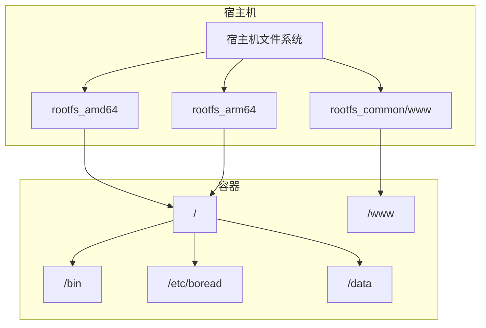
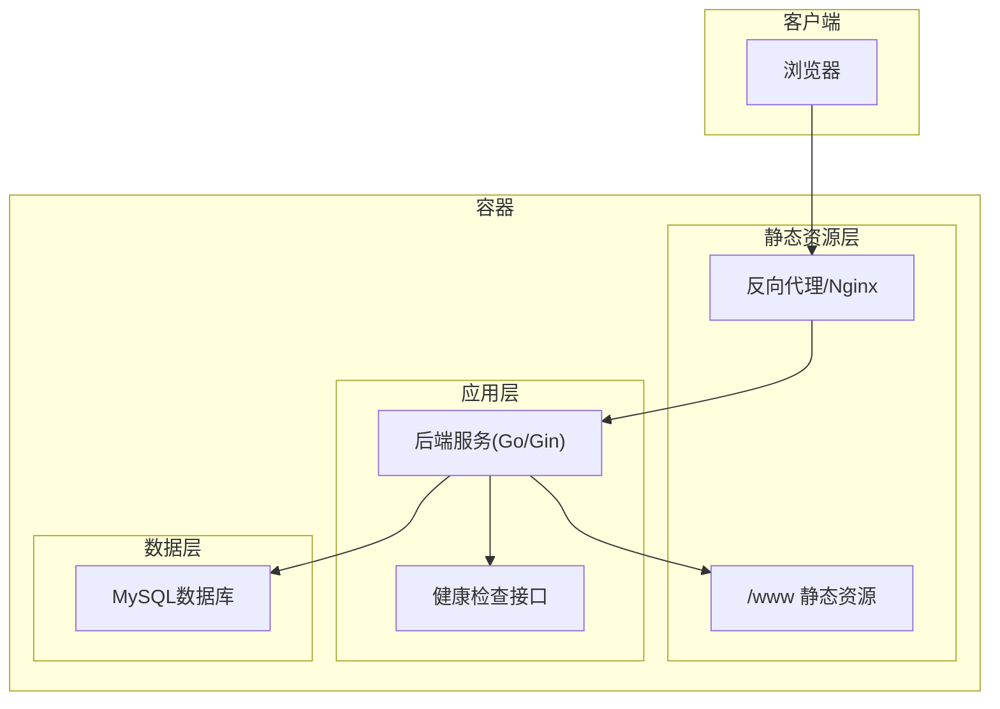
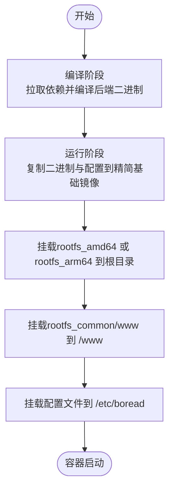
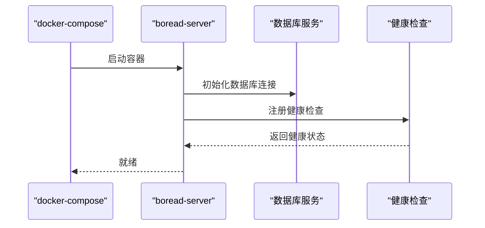
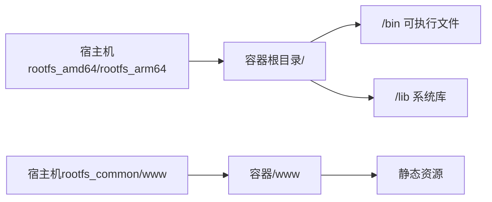
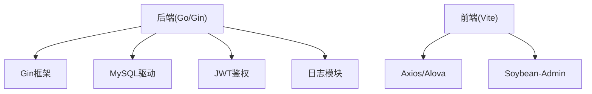

# Docker容器化部署

<cite>
**本文引用的文件**
- [README.md](file://README.md)
- [project.yaml](file://project.yaml)
- [config.example.yaml](file://app/server/configs/config.example.yaml)
- [main.go](file://app/server/cmd/api/main.go)
- [Makefile](file://app/server/Makefile)
- [go.mod](file://app/server/go.mod)
- [go.sum](file://app/server/go.sum)
- [router.go](file://app/server/internal/router/router.go)
- [health.go](file://app/server/internal/handler/v1/health.go)
- [logger.go](file://app/server/pkg/logger/logger.go)
- [jwt.go](file://app/server/pkg/jwt/jwt.go)
- [response.go](file://app/server/pkg/response/response.go)
- [service.go](file://app/web/src/service/request/index.ts)
- [service.ts](file://app/web/src/utils/service.ts)
</cite>

## 目录
1. [简介](#简介)
2. [项目结构](#项目结构)
3. [核心组件](#核心组件)
4. [架构总览](#架构总览)
5. [详细组件分析](#详细组件分析)
6. [依赖分析](#依赖分析)
7. [性能考虑](#性能考虑)
8. [故障排查指南](#故障排查指南)
9. [结论](#结论)
10. [附录](#附录)

## 简介
本指南面向boread项目的Docker容器化部署，覆盖镜像构建流程、多架构支持（amd64/arm64）、容器编排与运行参数、rootfs文件系统组织与挂载、健康检查与日志管理、资源限制与运维配置，并提供常见问题排查与性能优化建议。  
项目采用后端Go语言（Gin）与前端Soybean-Admin技术栈，应用描述文件中声明了支持的架构与启动命令，便于容器化打包与运行。

## 项目结构
- 应用分为前后端两部分：
  - 后端：基于Gin的API服务，位于app/server，包含配置、路由、中间件、业务逻辑与数据库迁移脚本。
  - 前端：基于Vite的单页应用，位于app/web，包含构建产物与开发配置。
- 根目录包含多架构rootfs目录与通用www目录，用于容器内文件系统挂载与静态资源分发。
- 应用元信息通过project.yaml定义，包含支持架构、启动命令、端口与代理路径等。

图示来源
- [project.yaml:1-30](file://project.yaml#L1-L30)

章节来源
- [README.md:1-11](file://README.md#L1-L11)
- [project.yaml:1-30](file://project.yaml#L1-L30)

## 核心组件
- 后端服务（Go/Gin）
  - 配置加载：从配置文件读取服务器端口、数据库连接、JWT密钥与日志级别。
  - 路由与中间件：统一处理跨域、日志、权限与认证。
  - 健康检查：提供健康接口用于容器健康探测。
- 前端应用（Vite/Soybean-Admin）
  - 构建产物输出至静态目录，通过容器内的web服务器或反向代理提供访问。
  - 开发时通过代理转发到后端API，生产环境通过容器内静态资源服务。
- 应用元信息（project.yaml）
  - 定义支持架构、启动命令、端口与代理路径，指导容器打包与运行。

章节来源
- [config.example.yaml:1-21](file://app/server/configs/config.example.yaml#L1-L21)
- [router.go](file://app/server/internal/router/router.go)
- [health.go](file://app/server/internal/handler/v1/health.go)
- [project.yaml:1-30](file://project.yaml#L1-L30)

## 架构总览
下图展示容器化部署的整体架构：容器内rootfs挂载静态资源，后端服务监听指定端口，前端通过反向代理访问后端API，健康检查与日志管理贯穿全链路。

图示来源
- [project.yaml:11-14](file://project.yaml#L11-L14)
- [config.example.yaml:1-21](file://app/server/configs/config.example.yaml#L1-L21)
- [health.go](file://app/server/internal/handler/v1/health.go)

## 详细组件分析

### Docker镜像构建流程
- 多阶段构建建议
  - 编译阶段：使用官方Go镜像拉取依赖并编译后端二进制。
  - 运行阶段：使用精简的基础镜像（如alpine），仅复制编译产物与必要配置。
- rootfs组织与镜像层
  - rootfs_amd64/rootfs_arm64分别对应不同架构的rootfs内容，容器启动时挂载到根目录。
  - rootfs_common/www作为通用静态资源目录，映射到容器内的/www。
- 镜像标签与多架构
  - 使用buildx构建多架构镜像，分别为amd64/arm64生成独立镜像并合并清单。
  - 在镜像元数据中标注支持架构，便于容器运行时选择合适镜像。

图示来源
- [project.yaml:4-6](file://project.yaml#L4-L6)
- [project.yaml:11](file://project.yaml#L11)

章节来源
- [project.yaml:1-30](file://project.yaml#L1-L30)

### 多架构支持（amd64/arm64）
- 支持架构声明
  - 在应用元信息中明确声明支持amd64与arm64。
- 构建策略
  - 使用多平台构建工具生成不同架构的镜像，确保在不同硬件上运行一致。
- 运行时选择
  - 容器运行时根据节点架构自动选择匹配的镜像层。

章节来源
- [project.yaml:4-6](file://project.yaml#L4-L6)

### 容器编排配置（docker-compose.yml）
- 服务定义
  - 服务名称：boread-server
  - 镜像：自构建的多架构镜像
  - 端口映射：将容器端口映射到宿主机端口
  - 环境变量：数据库连接、JWT密钥、日志级别等
  - 数据卷：
    - /www：挂载rootfs_common/www，提供静态资源
    - /data：持久化存储（如数据库文件或缓存）
    - /etc/boread：挂载配置文件目录
  - 健康检查：调用健康检查接口，失败时重启
  - 重启策略：unless-stopped
- 依赖关系
  - 依赖数据库服务（如MySQL），确保数据库可用后再启动后端
- 网络配置
  - 使用自定义桥接网络，便于服务间通信与DNS解析

图示来源
- [project.yaml:11-14](file://project.yaml#L11-L14)
- [config.example.yaml:1-21](file://app/server/configs/config.example.yaml#L1-L21)

章节来源
- [project.yaml:1-30](file://project.yaml#L1-L30)
- [config.example.yaml:1-21](file://app/server/configs/config.example.yaml#L1-L21)

### rootfs文件系统组织与挂载
- 组织结构
  - rootfs_amd64/rootfs_arm64：包含系统级文件与可执行程序，挂载到容器根目录。
  - rootfs_common/www：通用静态资源目录，挂载到容器内/www。
- 挂载方式
  - 使用bind mount将宿主机上的rootfs目录挂载到容器根目录，实现系统级文件共享。
  - 将/www目录映射到宿主机的静态资源目录，便于更新与维护。
- 权限与安全
  - 确保挂载目录的权限与SELinux策略正确，避免容器内无法读写。

图示来源
- [project.yaml:11](file://project.yaml#L11)

章节来源
- [project.yaml:1-30](file://project.yaml#L1-L30)

### 部署命令与启动参数
- 构建镜像
  - 使用多平台构建工具为amd64与arm64分别构建镜像，并推送至镜像仓库。
- 启动容器
  - 通过docker run或docker-compose启动，挂载rootfs与数据卷，设置环境变量与端口映射。
- 后端启动参数
  - 通过应用元信息中的启动命令与端口配置，确保服务正常监听。

章节来源
- [project.yaml:11-14](file://project.yaml#L11-L14)

### 健康检查与日志管理
- 健康检查
  - 后端提供健康检查接口，容器运行时定期探测，失败则重启。
- 日志管理
  - 后端日志级别与输出路径在配置文件中定义，可通过挂载卷持久化日志文件。
  - 建议使用集中式日志收集（如fluentd/flume）采集容器日志。

章节来源
- [health.go](file://app/server/internal/handler/v1/health.go)
- [config.example.yaml:19-21](file://app/server/configs/config.example.yaml#L19-L21)

### 资源限制与运维配置
- 资源限制
  - CPU/内存限制：通过容器运行时参数限制后端进程资源使用。
  - 文件句柄限制：根据数据库连接数与并发请求调整系统限制。
- 运维配置
  - 反向代理：在容器外部署Nginx或Traefik，统一处理TLS与路由。
  - 数据备份：定期备份数据库与重要数据卷，制定恢复流程。

章节来源
- [config.example.yaml:5-17](file://app/server/configs/config.example.yaml#L5-L17)

## 依赖分析
- 后端依赖
  - Gin框架：提供HTTP路由与中间件能力。
  - 数据库驱动：MySQL驱动，连接池参数在配置文件中定义。
  - JWT：用于鉴权与会话管理。
  - 日志：结构化日志记录，支持级别控制。
- 前端依赖
  - Vite：开发与构建工具。
  - Axios/Alova：HTTP客户端，用于API请求。
  - Soybean-Admin：UI框架与主题系统。

图示来源
- [go.mod](file://app/server/go.mod)
- [jwt.go](file://app/server/pkg/jwt/jwt.go)
- [logger.go](file://app/server/pkg/logger/logger.go)

章节来源
- [go.mod](file://app/server/go.mod)
- [go.sum](file://app/server/go.sum)

## 性能考虑
- 数据库连接池
  - 合理设置最大空闲连接与最大打开连接数，避免连接争用。
- 前端静态资源
  - 启用压缩与缓存策略，减少带宽占用。
- 容器资源
  - 为后端容器设置CPU/内存上限，防止突发流量导致资源耗尽。
- 健康检查间隔
  - 适当降低健康检查频率，避免对后端造成额外压力。

章节来源
- [config.example.yaml:12-13](file://app/server/configs/config.example.yaml#L12-L13)

## 故障排查指南
- 健康检查失败
  - 检查后端健康接口是否可达，确认数据库连接与配置文件正确。
- 端口冲突
  - 确认宿主机端口未被占用，或修改映射端口。
- 静态资源无法访问
  - 检查/www挂载路径与权限，确认静态资源已正确复制到rootfs_common/www。
- 日志异常
  - 检查日志文件路径与权限，确认容器内日志卷已正确挂载。

章节来源
- [health.go](file://app/server/internal/handler/v1/health.go)
- [config.example.yaml:19-21](file://app/server/configs/config.example.yaml#L19-L21)

## 结论
通过多架构rootfs与精简镜像的组合，boread可在不同硬件平台上稳定运行。结合合理的容器编排、健康检查与日志管理策略，能够满足生产环境的可靠性与可维护性要求。建议在部署前完成资源规划与备份策略，并持续监控容器与数据库性能指标。

## 附录
- 关键配置参考
  - 后端配置示例：[config.example.yaml:1-21](file://app/server/configs/config.example.yaml#L1-L21)
  - 应用元信息：[project.yaml:1-30](file://project.yaml#L1-L30)
  - 启动入口：[main.go](file://app/server/cmd/api/main.go)
  - 前端请求封装：[service.ts](file://app/web/src/utils/service.ts)
  - 前端请求适配：[service.ts](file://app/web/src/service/request/index.ts)