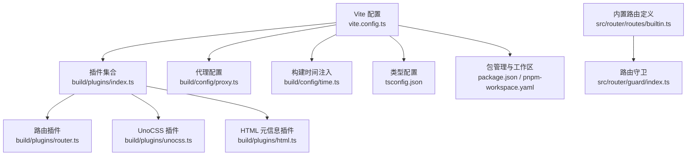
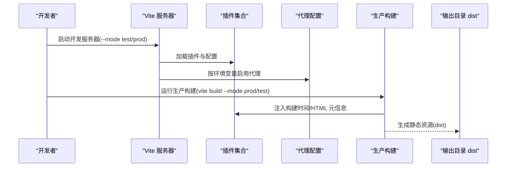
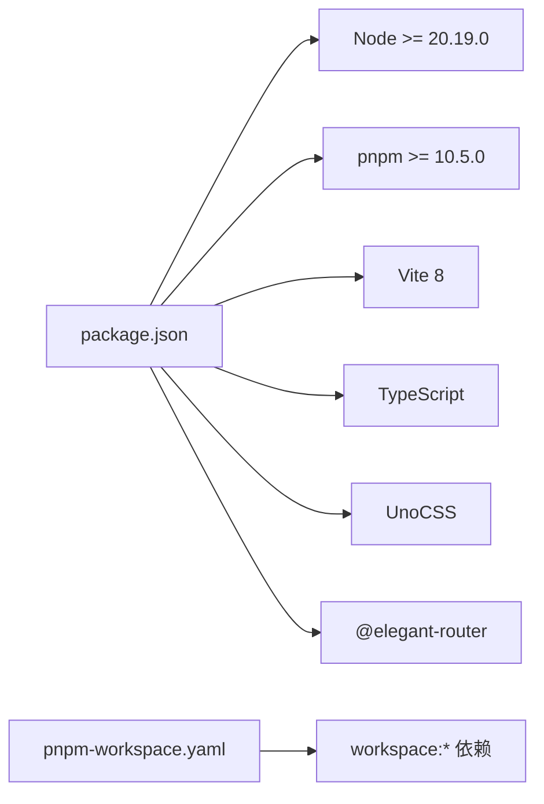

# 前端构建部署

<cite>
**本文引用的文件**
- [vite.config.ts](file://app/web/vite.config.ts)
- [package.json](file://app/web/package.json)
- [pnpm-workspace.yaml](file://app/web/pnpm-workspace.yaml)
- [.npmrc](file://app/web/.npmrc)
- [tsconfig.json](file://app/web/tsconfig.json)
- [build/config/index.ts](file://app/web/build/config/index.ts)
- [build/config/proxy.ts](file://app/web/build/config/proxy.ts)
- [build/config/time.ts](file://app/web/build/config/time.ts)
- [build/plugins/index.ts](file://app/web/build/plugins/index.ts)
- [build/plugins/router.ts](file://app/web/build/plugins/router.ts)
- [build/plugins/unocss.ts](file://app/web/build/plugins/unocss.ts)
- [build/plugins/html.ts](file://app/web/build/plugins/html.ts)
- [src/router/routes/builtin.ts](file://app/web/src/router/routes/builtin.ts)
- [src/router/guard/index.ts](file://app/web/src/router/guard/index.ts)
</cite>

## 目录
1. [简介](#简介)
2. [项目结构](#项目结构)
3. [核心组件](#核心组件)
4. [架构总览](#架构总览)
5. [详细组件分析](#详细组件分析)
6. [依赖分析](#依赖分析)
7. [性能考虑](#性能考虑)
8. [故障排查指南](#故障排查指南)
9. [结论](#结论)
10. [附录](#附录)

## 简介
本指南面向boread项目的前端团队与运维人员，系统性讲解前端构建与部署流程，包括Node.js与pnpm环境要求、Vite构建配置、打包优化、静态资源处理、多包工作空间（pnpm workspaces）的构建与依赖策略、生产构建命令与输出目录、CDN配置建议、前端路由与API代理、环境变量管理、构建性能优化与缓存策略，以及部署到Nginx、CDN与静态托管平台的操作步骤。

## 项目结构
前端工程位于 app/web 目录，采用 Vite 8 + TypeScript + Vue 3 技术栈，并通过 pnpm workspaces 管理多包。关键目录与文件：
- 构建与配置：vite.config.ts、build/config、build/plugins
- 包管理：package.json、pnpm-workspace.yaml、.npmrc
- 路由与守卫：src/router/routes、src/router/guard
- 类型与编译：tsconfig.json

图表来源
- [vite.config.ts:1-52](file://app/web/vite.config.ts#L1-L52)
- [build/plugins/index.ts:1-27](file://app/web/build/plugins/index.ts#L1-L27)
- [build/config/proxy.ts:1-56](file://app/web/build/config/proxy.ts#L1-L56)
- [build/config/time.ts:1-13](file://app/web/build/config/time.ts#L1-L13)
- [build/plugins/router.ts:1-42](file://app/web/build/plugins/router.ts#L1-L42)
- [build/plugins/unocss.ts:1-33](file://app/web/build/plugins/unocss.ts#L1-L33)
- [build/plugins/html.ts:1-14](file://app/web/build/plugins/html.ts#L1-L14)
- [tsconfig.json:1-26](file://app/web/tsconfig.json#L1-L26)
- [package.json:1-108](file://app/web/package.json#L1-L108)
- [pnpm-workspace.yaml:1-11](file://app/web/pnpm-workspace.yaml#L1-L11)
- [src/router/routes/builtin.ts:1-32](file://app/web/src/router/routes/builtin.ts#L1-L32)
- [src/router/guard/index.ts:1-16](file://app/web/src/router/guard/index.ts#L1-L16)

章节来源
- [vite.config.ts:1-52](file://app/web/vite.config.ts#L1-L52)
- [package.json:1-108](file://app/web/package.json#L1-L108)
- [pnpm-workspace.yaml:1-11](file://app/web/pnpm-workspace.yaml#L1-L11)
- [tsconfig.json:1-26](file://app/web/tsconfig.json#L1-L26)

## 核心组件
- Vite 构建配置：统一入口，加载环境变量、设置别名、CSS预处理器、插件、开发服务器与代理、构建参数等。
- 多包工作空间：通过 pnpm-workspace.yaml 定义 packages/*，启用 hoist 与链接策略，支持 workspace:* 依赖。
- 路由与守卫：使用 @elegant-router 生成路由，内置常量路由与守卫链路。
- 插件体系：Vue、JSX、进度条、过渡根校验、Elegant 路由、UnoCSS、Unplugin 生态、HTML 元信息注入。
- 代理与服务配置：根据环境变量动态启用代理，支持日志打印与路径重写。
- 构建时间注入：在 HTML head 中注入构建时间元信息，便于版本追踪。

章节来源
- [vite.config.ts:7-51](file://app/web/vite.config.ts#L7-L51)
- [build/plugins/index.ts:12-26](file://app/web/build/plugins/index.ts#L12-L26)
- [build/config/proxy.ts:12-28](file://app/web/build/config/proxy.ts#L12-L28)
- [build/config/time.ts:5-12](file://app/web/build/config/time.ts#L5-L12)
- [build/plugins/html.ts:3-13](file://app/web/build/plugins/html.ts#L3-L13)
- [src/router/routes/builtin.ts:5-31](file://app/web/src/router/routes/builtin.ts#L5-L31)
- [src/router/guard/index.ts:11-15](file://app/web/src/router/guard/index.ts#L11-L15)

## 架构总览
下图展示从开发到生产的整体流程：开发模式启动 Vite 服务器，按需加载插件；生产模式执行 Vite 打包，注入构建时间与构建配置，最终输出静态资源供 Nginx 或 CDN 分发。

图表来源
- [vite.config.ts:34-49](file://app/web/vite.config.ts#L34-L49)
- [build/plugins/index.ts:12-26](file://app/web/build/plugins/index.ts#L12-L26)
- [build/config/proxy.ts:12-28](file://app/web/build/config/proxy.ts#L12-L28)
- [build/plugins/html.ts:3-13](file://app/web/build/plugins/html.ts#L3-L13)

## 详细组件分析

### Vite 构建配置
- 环境变量加载：通过 loadEnv 读取当前 mode 的 .env 文件，统一注入到 import.meta.env。
- 别名与解析：设置 ~ 与 @ 别名，提升导入便捷性。
- CSS 预处理：SCSS 使用 modern-compiler，自动注入全局样式。
- 插件：集中调用 setupVitePlugins，包含 Vue、JSX、Elegant 路由、UnoCSS、Unplugin、进度条、HTML 元信息、过渡根校验等。
- 开发服务器：host、port、open、proxy 由 createViteProxy 动态决定。
- 构建参数：reportCompressedSize 关闭体积报告，sourcemap 受环境变量控制，commonjsOptions 设置忽略 try/catch 规则。
- define：向运行时注入 BUILD_TIME。

章节来源
- [vite.config.ts:7-51](file://app/web/vite.config.ts#L7-L51)

### 多包工作空间（pnpm workspaces）
- 工作区定义：packages: ['packages/*']，允许子包以 workspace:* 引用。
- 依赖提升：shamefullyHoist: true 提升公共依赖，减少重复安装。
- 链接策略：linkWorkspacePackages: true，使子包可直接链接本地源码。
- 禁用特定构建工具：allowBuilds 中禁用部分工具，避免重复构建。
- 注册表：.npmrc 指向国内镜像，提升安装速度。

章节来源
- [pnpm-workspace.yaml:1-11](file://app/web/pnpm-workspace.yaml#L1-L11)
- [.npmrc:1-2](file://app/web/.npmrc#L1-L2)

### 路由与守卫
- 内置路由：ROOT_ROUTE 与 NOT_FOUND_ROUTE 作为常量路由，确保路由稳定与错误页可用。
- 路由生成：通过 @elegant-router 将自定义路由转换为 Vue Router 路由，支持模块化布局与路径变换。
- 路由守卫：进度、权限与标题守卫串联，保证用户体验与安全。

章节来源
- [src/router/routes/builtin.ts:5-31](file://app/web/src/router/routes/builtin.ts#L5-L31)
- [build/plugins/router.ts:5-41](file://app/web/build/plugins/router.ts#L5-L41)
- [src/router/guard/index.ts:11-15](file://app/web/src/router/guard/index.ts#L11-L15)

### 插件体系
- Vue/JSX：基础渲染与 JSX 支持。
- Elegant 路由：生成路由与布局映射。
- UnoCSS：图标本地化加载、前缀与尺寸配置。
- Unplugin 生态：统一处理组件与图标等资源。
- 进度条：构建可视化反馈。
- HTML 元信息：在 head 注入构建时间。
- 过渡根校验：确保过渡根节点正确。

章节来源
- [build/plugins/index.ts:12-26](file://app/web/build/plugins/index.ts#L12-L26)
- [build/plugins/router.ts:5-41](file://app/web/build/plugins/router.ts#L5-L41)
- [build/plugins/unocss.ts:7-32](file://app/web/build/plugins/unocss.ts#L7-L32)
- [build/plugins/html.ts:3-13](file://app/web/build/plugins/html.ts#L3-L13)

### API 代理与环境变量
- 代理开关：VITE_HTTP_PROXY='Y' 时启用代理；仅在 serve 模式且非 preview 时生效。
- 日志开关：VITE_PROXY_LOG='Y' 时输出请求与错误日志。
- 服务配置：createServiceConfig 返回 baseURL、proxyPattern 与其他分组，统一生成代理规则。
- 路径重写：rewrite 去除 proxyPattern 前缀，转发至真实后端。

章节来源
- [vite.config.ts:12-39](file://app/web/vite.config.ts#L12-L39)
- [build/config/proxy.ts:12-55](file://app/web/build/config/proxy.ts#L12-L55)

### 构建时间注入与输出
- 构建时间：getBuildTime 使用时区格式化当前时间，注入到 HTML head 的 meta 中。
- 输出目录：默认 dist，可通过 Vite base 与构建参数调整。
- 源码映射：VITE_SOURCE_MAP='Y' 时开启，便于生产调试与问题定位。

章节来源
- [build/config/time.ts:5-12](file://app/web/build/config/time.ts#L5-L12)
- [build/plugins/html.ts:3-13](file://app/web/build/plugins/html.ts#L3-L13)
- [vite.config.ts:43-49](file://app/web/vite.config.ts#L43-L49)

### TypeScript 与类型配置
- 编译目标：ESNext，模块解析使用 bundler，严格模式与空值检查。
- 路径别名：@/* 与 ~/\* 对应 src 与根目录，提升导入一致性。
- 类型声明：集成 Vite、Node、图标与 Naive UI 的类型声明。

章节来源
- [tsconfig.json:2-25](file://app/web/tsconfig.json#L2-L25)

## 依赖分析
- Node.js 与 pnpm 版本：engines 要求 Node >= 20.19.0，pnpm >= 10.5.0。
- 依赖管理：workspace:* 用于内部包引用，减少重复发布成本。
- 构建工具链：Vite 8、Vue 3、TypeScript、UnoCSS、@elegant-router 等。

图表来源
- [package.json:102-105](file://app/web/package.json#L102-L105)
- [pnpm-workspace.yaml:1-11](file://app/web/pnpm-workspace.yaml#L1-L11)

章节来源
- [package.json:102-105](file://app/web/package.json#L102-L105)
- [pnpm-workspace.yaml:1-11](file://app/web/pnpm-workspace.yaml#L1-L11)

## 性能考虑
- 构建体积与报告：reportCompressedSize=false，减少体积统计开销；如需分析可临时开启。
- 源码映射：生产环境建议关闭 VITE_SOURCE_MAP，降低包体与提升安全性；需要调试时再开启。
- 代码分割：保持默认的按需加载与路由懒加载策略，避免单体 bundle。
- 静态资源：SVG 图标本地化加载，减少网络请求；合理使用 CDN 缓存。
- 依赖提升：pnpm hoist 提升公共依赖，减少重复安装与包体积。
- 构建缓存：利用 Vite 的开发缓存与浏览器缓存策略，结合 CDN 缓存头优化二次访问。

## 故障排查指南
- 代理未生效
  - 检查 VITE_HTTP_PROXY 是否为 'Y'，确认 serve 模式且非 preview。
  - 查看 VITE_PROXY_LOG 是否开启，观察代理日志输出。
  - 确认 createServiceConfig 返回的 baseURL 与 proxyPattern 正确。
- 构建失败或体积异常
  - 检查 VITE_SOURCE_MAP 配置，必要时关闭以减小体积。
  - 确认 tsconfig 的 strict 与 moduleResolution 设置是否与项目一致。
- 路由跳转异常
  - 核对内置路由与 @elegant-router 生成的路由映射，确保常量路由存在。
  - 检查路由守卫链路是否阻断了正常导航。
- 本地开发无法访问
  - 确认 server.host、port 未被占用，代理端口与后端一致。

章节来源
- [vite.config.ts:12-39](file://app/web/vite.config.ts#L12-L39)
- [build/config/proxy.ts:12-55](file://app/web/build/config/proxy.ts#L12-L55)
- [src/router/routes/builtin.ts:5-31](file://app/web/src/router/routes/builtin.ts#L5-L31)
- [src/router/guard/index.ts:11-15](file://app/web/src/router/guard/index.ts#L11-L15)

## 结论
boread 前端工程以 Vite 为核心，配合 pnpm workspaces 实现多包协同与高效依赖管理；通过 @elegant-router 与 UnoCSS 提升开发效率与样式一致性；借助代理与环境变量实现灵活的开发与联调能力；生产构建通过构建时间注入与可选源码映射满足版本追踪与调试需求。结合本文提供的部署与优化建议，可稳定地交付高性能的前端产物。

## 附录

### 环境要求与安装
- Node.js：版本要求见 engines 字段。
- pnpm：版本要求见 engines 字段。
- 安装依赖：在 app/web 目录执行 pnpm install，确保 pnpm-workspace.yaml 生效。

章节来源
- [package.json:102-105](file://app/web/package.json#L102-L105)
- [pnpm-workspace.yaml:1-11](file://app/web/pnpm-workspace.yaml#L1-L11)

### 构建命令与输出
- 开发模式
  - 测试模式：vite --mode test
  - 生产模式：vite --mode prod
- 预览模式：vite preview
- 生产构建
  - 生产环境：vite build --mode prod
  - 测试环境：vite build --mode test
- 输出目录：默认 dist，可通过 Vite base 与构建参数调整。

章节来源
- [package.json:29-44](file://app/web/package.json#L29-L44)
- [vite.config.ts:43-49](file://app/web/vite.config.ts#L43-L49)

### 环境变量清单
- VITE_BASE_URL：应用基础路径，影响静态资源与路由前缀。
- VITE_HTTP_PROXY：是否启用代理（'Y'/'N'）。
- VITE_PROXY_LOG：是否输出代理日志（'Y'/'N'）。
- VITE_SOURCE_MAP：是否生成源码映射（'Y'/'N'）。
- VITE_ICON_PREFIX：UnoCSS 图标前缀。
- VITE_ICON_LOCAL_PREFIX：本地图标集合名称前缀。

章节来源
- [vite.config.ts:14-15](file://app/web/vite.config.ts#L14-L15)
- [build/config/proxy.ts:12-17](file://app/web/build/config/proxy.ts#L12-L17)
- [build/plugins/unocss.ts:7-8](file://app/web/build/plugins/unocss.ts#L7-L8)

### 部署到 Nginx
- 配置要点
  - root 指向 dist 目录。
  - 静态资源缓存：对带哈希文件设置长缓存，对 index.html 设置短缓存或 no-cache。
  - 回退路由：将所有未匹配路径重写到 index.html，配合前端路由。
  - CORS：如需跨域，按需配置响应头。
- 示例步骤
  - 将 dist 目录上传至服务器。
  - 在 Nginx 中添加站点配置，指向 dist。
  - 重启 Nginx 生效。

### 部署到 CDN
- 上传策略
  - 将 dist 下的静态资源上传至 CDN 存储桶或对象存储。
  - 配置 CDN 缓存策略：CSS/JS 带 hash 长缓存，HTML 短缓存或协商缓存。
- 访问域名
  - 将域名 CNAME 至 CDN 域名，确保 HTTPS 证书有效。
- 回源配置
  - 若需回源到自有服务器，配置回源地址与鉴权（如有）。

### 静态托管平台
- 适用平台：Vercel、Netlify、GitHub Pages 等。
- 注意事项
  - 设置基路径（VITE_BASE_URL）与路由回退规则。
  - 配置环境变量（如 VITE_BASE_URL、VITE_SOURCE_MAP）。
  - 构建目录选择 dist，构建命令使用生产构建脚本。