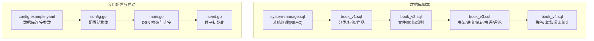
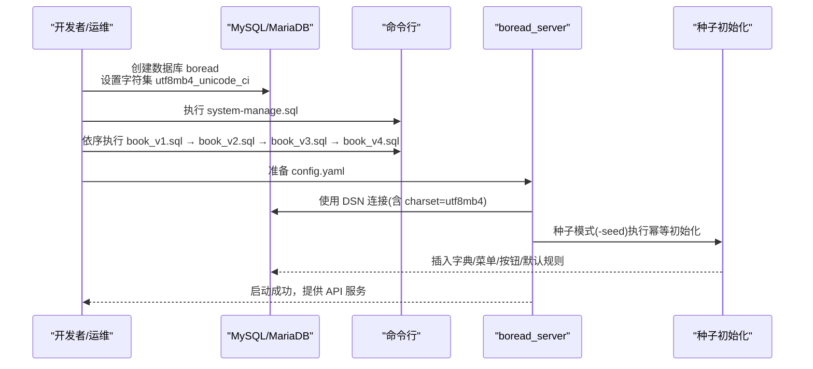
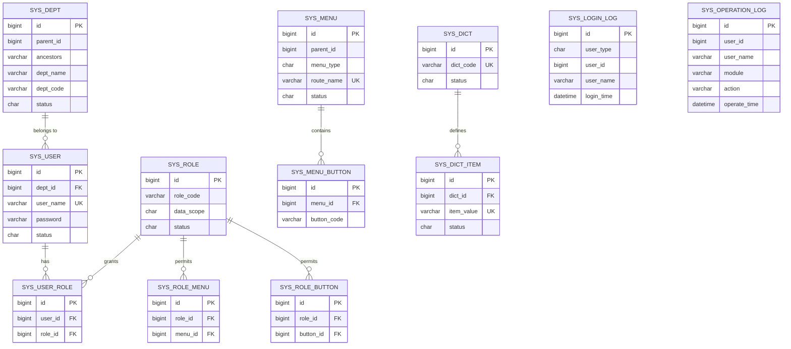
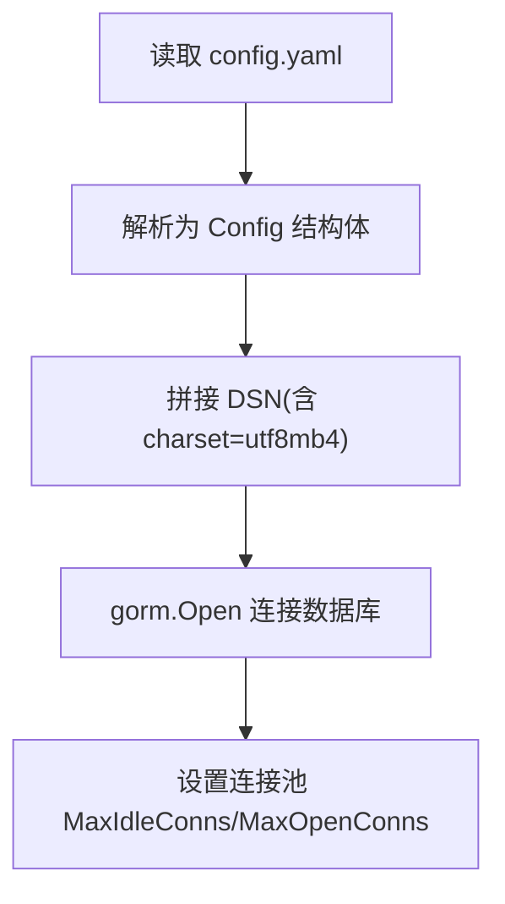
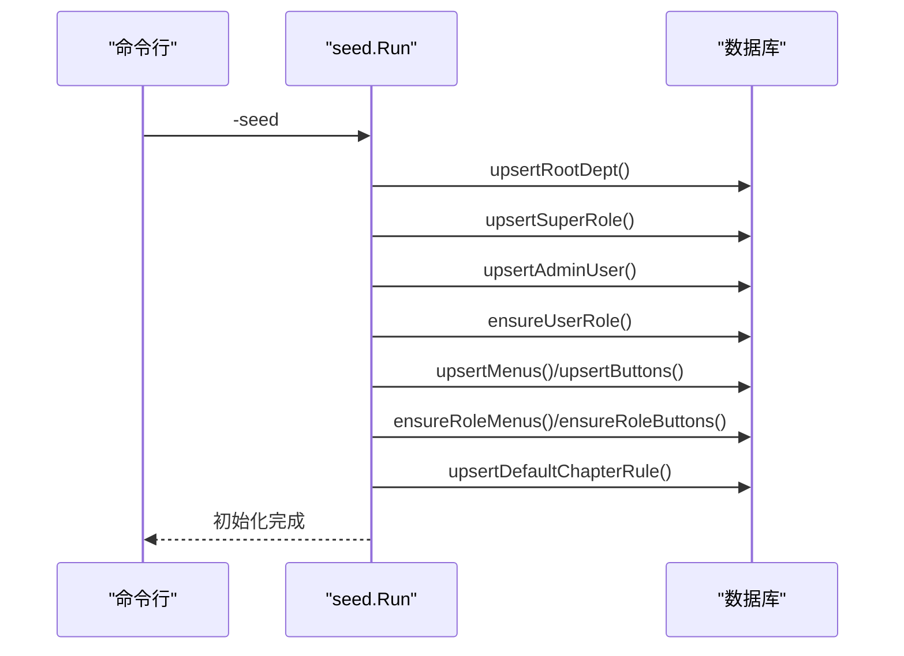
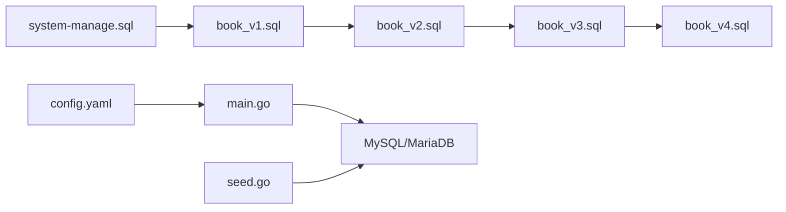

# 数据库初始化

<cite>
**本文引用的文件**
- [book_v1.sql](file://app/sql/book_v1.sql)
- [book_v2.sql](file://app/sql/book_v2.sql)
- [book_v3.sql](file://app/sql/book_v3.sql)
- [book_v4.sql](file://app/sql/book_v4.sql)
- [system-manage.sql](file://app/sql/system-manage.sql)
- [config.example.yaml](file://app/server/configs/config.example.yaml)
- [config.go](file://app/server/pkg/config/config.go)
- [main.go](file://app/server/cmd/api/main.go)
- [seed.go](file://app/server/internal/seed/seed.go)
- [sys_user.go](file://app/server/internal/model/sys_user.go)
- [base.go](file://app/server/internal/model/base.go)
</cite>

## 目录
1. [简介](#简介)
2. [项目结构](#项目结构)
3. [核心组件](#核心组件)
4. [架构总览](#架构总览)
5. [详细组件分析](#详细组件分析)
6. [依赖关系分析](#依赖关系分析)
7. [性能考虑](#性能考虑)
8. [故障排查指南](#故障排查指南)
9. [结论](#结论)
10. [附录](#附录)

## 简介
本指南面向 b oread 项目的数据库初始化与配置，涵盖 MySQL/MariaDB 的安装与基础配置、SQL 脚本的作用与执行顺序（从 book_v1 到 book_v4 的版本演进）、系统管理表结构与权限模型、初始数据导入、数据库连接与字符集设置、存储引擎选择、备份策略、性能调优与索引优化、数据迁移与版本升级流程以及数据完整性检查方法。文档同时给出面向开发与运维的可视化图示与实操步骤，帮助快速、安全地完成数据库初始化与上线。

## 项目结构
数据库相关资源集中在 app/sql 目录，包含四份业务版本脚本与一份系统管理脚本；应用启动时通过配置加载与 DSN 连接数据库，并在种子模式下执行幂等初始化。

**图表来源**
- [system-manage.sql:20-22](file://app/sql/system-manage.sql#L20-L22)
- [book_v1.sql:12-137](file://app/sql/book_v1.sql#L12-L137)
- [book_v2.sql:12-163](file://app/sql/book_v2.sql#L12-L163)
- [book_v3.sql:13-157](file://app/sql/book_v3.sql#L13-L157)
- [book_v4.sql:12-140](file://app/sql/book_v4.sql#L12-L140)
- [config.example.yaml:5-13](file://app/server/configs/config.example.yaml#L5-L13)
- [config.go:35-44](file://app/server/pkg/config/config.go#L35-L44)
- [main.go:44-50](file://app/server/cmd/api/main.go#L44-L50)
- [seed.go:14-54](file://app/server/internal/seed/seed.go#L14-L54)

**章节来源**
- [config.example.yaml:1-21](file://app/server/configs/config.example.yaml#L1-L21)
- [config.go:1-66](file://app/server/pkg/config/config.go#L1-L66)
- [main.go:30-84](file://app/server/cmd/api/main.go#L30-L84)
- [seed.go:1-54](file://app/server/internal/seed/seed.go#L1-L54)

## 核心组件
- 数据库脚本集合：按版本演进组织，确保依赖顺序正确。
- 系统管理脚本：提供 RBAC 权限体系与后台管理所需的基础表。
- 业务脚本集合：逐步引入文件、章节、读者交互、角色与统计等能力。
- 应用配置与连接：通过 YAML 配置与 DSN 动态拼接，设置连接池参数。
- 种子初始化：幂等创建根部门、超级角色、管理员用户、菜单/按钮与默认规则。

**章节来源**
- [system-manage.sql:1-351](file://app/sql/system-manage.sql#L1-L351)
- [book_v1.sql:1-137](file://app/sql/book_v1.sql#L1-L137)
- [book_v2.sql:1-163](file://app/sql/book_v2.sql#L1-L163)
- [book_v3.sql:1-157](file://app/sql/book_v3.sql#L1-L157)
- [book_v4.sql:1-140](file://app/sql/book_v4.sql#L1-L140)
- [config.example.yaml:5-13](file://app/server/configs/config.example.yaml#L5-L13)
- [config.go:35-44](file://app/server/pkg/config/config.go#L35-L44)
- [main.go:44-64](file://app/server/cmd/api/main.go#L44-L64)
- [seed.go:14-54](file://app/server/internal/seed/seed.go#L14-L54)

## 架构总览
数据库初始化与启动的关键流程如下：

**图表来源**
- [system-manage.sql:20-22](file://app/sql/system-manage.sql#L20-L22)
- [book_v1.sql:12-137](file://app/sql/book_v1.sql#L12-L137)
- [book_v2.sql:12-163](file://app/sql/book_v2.sql#L12-L163)
- [book_v3.sql:13-157](file://app/sql/book_v3.sql#L13-L157)
- [book_v4.sql:12-140](file://app/sql/book_v4.sql#L12-L140)
- [config.example.yaml:5-13](file://app/server/configs/config.example.yaml#L5-L13)
- [main.go:44-50](file://app/server/cmd/api/main.go#L44-L50)
- [seed.go:14-54](file://app/server/internal/seed/seed.go#L14-L54)

## 详细组件分析

### 版本演进与脚本作用
- system-manage.sql
  - 作用：创建数据库 boread，定义 RBAC 与后台管理表结构（部门、角色、用户、菜单、按钮、字典、登录/操作日志），并插入系统字典初始数据。
  - 依赖：无。
  - 注意：需 MySQL 8.0.13+ 以支持函数索引；采用 utf8mb4_unicode_ci 字符集与 InnoDB 引擎。
- book_v1.sql
  - 作用：定义书库核心实体：用户扩展信息、书籍分类、书籍标签、作品主表、标签关联。
  - 依赖：依赖 system-manage.sql 中的 sys_user 表。
  - 关键点：分类树、标题/作者联合索引、软删除字段。
- book_v2.sql
  - 作用：引入文件解析与章节管理：物理文件、章节索引、上传任务、章节识别规则、内容净化规则。
  - 依赖：依赖 book_v1.sql 的 book 表。
  - 关键点：章节按文件存储，字节偏移索引；MD5 去重与内容版本控制。
- book_v3.sql
  - 作用：读者交互：书架、阅读进度、笔记/划线、书评、章节评论（楼中楼）。
  - 依赖：依赖 book_v1.sql 的 book 与 book_v2.sql 的 book_chapter。
  - 关键点：进度持续覆写、笔记/划线合并设计、评分校验。
- book_v4.sql
  - 作用：高级特性：角色与出场、阅读事件与多层统计（日聚合、书-日聚合）。
  - 依赖：依赖 book_v1.sql 的 book 与 book_v2.sql 的 book_chapter。
  - 关键点：事件原子表 + 日聚合解耦；按日期分区预留。

**章节来源**
- [system-manage.sql:1-351](file://app/sql/system-manage.sql#L1-L351)
- [book_v1.sql:1-137](file://app/sql/book_v1.sql#L1-L137)
- [book_v2.sql:1-163](file://app/sql/book_v2.sql#L1-L163)
- [book_v3.sql:1-157](file://app/sql/book_v3.sql#L1-L157)
- [book_v4.sql:1-140](file://app/sql/book_v4.sql#L1-L140)

### 系统管理表结构与权限模型
- 数据库与字符集
  - 创建数据库 boread，默认字符集 utf8mb4，排序规则 utf8mb4_unicode_ci。
- RBAC 与数据权限
  - 部门树、角色与数据范围（全部/自定义部门/本部门/本部门及子部门/仅本人）、用户-角色、菜单-按钮-角色关联。
  - 软删除统一字段 deleted_at，唯一索引使用函数索引避免“软删后无法重建”问题。
- 日志与审计
  - 登录日志与操作日志表，记录用户行为与请求上下文，便于审计与排障。
- 字典体系
  - 字典分类与字典项，支持业务枚举值与 UI 展示分离。

**图表来源**
- [system-manage.sql:31-331](file://app/sql/system-manage.sql#L31-L331)

**章节来源**
- [system-manage.sql:20-351](file://app/sql/system-manage.sql#L20-L351)

### 数据库连接配置与字符集设置
- 连接参数
  - 驱动：mysql
  - 主机、端口、用户名、密码、数据库名
  - 连接池：最大空闲连接、最大打开连接
- DSN 构造
  - 使用 utf8mb4 字符集，parseTime 与 loc 设置
- 应用侧配置
  - YAML 结构体映射，加载后用于构造 DSN 与初始化连接池

**图表来源**
- [config.example.yaml:5-13](file://app/server/configs/config.example.yaml#L5-L13)
- [config.go:35-44](file://app/server/pkg/config/config.go#L35-L44)
- [main.go:44-64](file://app/server/cmd/api/main.go#L44-L64)

**章节来源**
- [config.example.yaml:1-21](file://app/server/configs/config.example.yaml#L1-L21)
- [config.go:1-66](file://app/server/pkg/config/config.go#L1-L66)
- [main.go:30-84](file://app/server/cmd/api/main.go#L30-L84)

### 初始数据导入与种子初始化
- 系统字典与字典项
  - 在 system-manage.sql 中插入系统字典与字典项，支撑业务枚举。
- 种子初始化流程
  - 幂等创建根部门、超级角色、管理员用户、用户-角色关联、菜单/按钮、角色-菜单/按钮关联、默认章节识别规则。
  - 通过命令行参数 -seed 触发，初始化完成后退出。

**图表来源**
- [seed.go:14-54](file://app/server/internal/seed/seed.go#L14-L54)
- [system-manage.sql:337-351](file://app/sql/system-manage.sql#L337-L351)

**章节来源**
- [seed.go:1-54](file://app/server/internal/seed/seed.go#L1-L54)
- [system-manage.sql:337-351](file://app/sql/system-manage.sql#L337-L351)

## 依赖关系分析
- 版本依赖链
  - system-manage.sql → book_v1.sql → book_v2.sql → book_v3.sql → book_v4.sql
- 外键与索引
  - 业务表统一带软删除字段与函数索引；外键使用 id 字段；大量复合索引支撑常见查询。
- 应用侧依赖
  - main.go 通过 DSN 连接数据库；seed.go 在种子模式下执行初始化。

**图表来源**
- [system-manage.sql:20-22](file://app/sql/system-manage.sql#L20-L22)
- [book_v1.sql:12-137](file://app/sql/book_v1.sql#L12-L137)
- [book_v2.sql:12-163](file://app/sql/book_v2.sql#L12-L163)
- [book_v3.sql:13-157](file://app/sql/book_v3.sql#L13-L157)
- [book_v4.sql:12-140](file://app/sql/book_v4.sql#L12-L140)
- [config.example.yaml:5-13](file://app/server/configs/config.example.yaml#L5-L13)
- [main.go:44-50](file://app/server/cmd/api/main.go#L44-L50)
- [seed.go:14-54](file://app/server/internal/seed/seed.go#L14-L54)

**章节来源**
- [main.go:30-84](file://app/server/cmd/api/main.go#L30-L84)
- [seed.go:1-54](file://app/server/internal/seed/seed.go#L1-L54)

## 性能考虑
- 字符集与排序规则
  - 使用 utf8mb4_unicode_ci，兼顾多语言与排序一致性。
- 存储引擎
  - 全部采用 InnoDB，支持事务与行级锁。
- 索引设计
  - 业务键与软删除组合索引使用函数索引规避重建问题。
  - 常见查询维度建立复合索引（如标题/作者、分类、章节、日期等）。
- 连接池
  - 合理设置最大空闲与最大连接数，避免连接争用。
- 阅读统计
  - 事件原子表 + 日聚合解耦，按日期分区可提升查询效率（建议在数据量增长后实施）。
- 章节索引
  - 章节按文件存储，字节偏移索引，适合大文件切片读取。

**章节来源**
- [system-manage.sql:4-18](file://app/sql/system-manage.sql#L4-L18)
- [book_v1.sql:110-116](file://app/sql/book_v1.sql#L110-L116)
- [book_v2.sql:42-46](file://app/sql/book_v2.sql#L42-L46)
- [book_v3.sql:34-37](file://app/sql/book_v3.sql#L34-L37)
- [book_v4.sql:84-87](file://app/sql/book_v4.sql#L84-L87)
- [main.go:63-64](file://app/server/cmd/api/main.go#L63-L64)

## 故障排查指南
- 连接失败
  - 检查 config.yaml 中主机、端口、用户名、密码、数据库名是否正确。
  - 确认 DSN 中 charset=utf8mb4 已生效。
- 权限不足
  - 确保数据库用户具备创建数据库、表与索引的权限。
- 软删除重建失败
  - 使用函数索引的唯一键组合，避免软删后无法重建同名数据。
- 种子初始化异常
  - 使用 -seed 模式执行，观察输出的错误堆栈定位具体步骤。
- 日志与审计
  - 登录/操作日志可用于追踪问题发生的时间线与责任人。

**章节来源**
- [config.example.yaml:5-13](file://app/server/configs/config.example.yaml#L5-L13)
- [main.go:44-50](file://app/server/cmd/api/main.go#L44-L50)
- [seed.go:14-54](file://app/server/internal/seed/seed.go#L14-L54)
- [system-manage.sql:46-48](file://app/sql/system-manage.sql#L46-L48)

## 结论
通过严格遵循脚本执行顺序与配置规范，boread 的数据库初始化可在 MySQL/MariaDB 上稳定落地。系统管理脚本提供完善的 RBAC 与审计能力，业务脚本按版本逐步增强功能。结合合理的索引与连接池配置，可满足生产环境的性能与可靠性要求。建议在部署前完成备份策略与数据完整性检查，并在数据量增长后实施分区与归档策略。

## 附录

### 数据库安装与基础配置（MySQL/MariaDB）
- 安装
  - 使用官方包管理器或二进制包安装 MySQL 8.0.13+ 或 MariaDB。
- 创建数据库与用户
  - 创建数据库 boread，设置字符集与排序规则为 utf8mb4_unicode_ci。
  - 创建专用数据库用户并授权。
- 基础参数建议
  - 字符集：utf8mb4
  - 排序规则：utf8mb4_unicode_ci
  - 存储引擎：InnoDB
  - 事务隔离：READ-COMMITTED 或 REPEATABLE-READ（按业务需要）

### 执行顺序与版本升级
- 执行顺序
  - system-manage.sql → book_v1.sql → book_v2.sql → book_v3.sql → book_v4.sql
- 升级策略
  - 新增版本脚本时，保持向后兼容；对现有表新增列时，提供默认值与索引。
  - 使用种子初始化保证系统内置数据一致。

### 备份策略
- 全量备份
  - 使用逻辑导出（mysqldump）或物理快照（xtrabackup/LVM）定期备份。
- 增量备份
  - 结合二进制日志（binlog）进行增量恢复。
- 归档与恢复测试
  - 定期验证备份文件可恢复性，模拟故障演练。

### 索引优化建议
- 唯一键与软删除
  - 使用函数索引组合（业务键, IFNULL(deleted_at,'1970-01-01')）。
- 查询热点
  - 为常用过滤条件与排序字段建立复合索引。
- 分区
  - 阅读事件与统计表按日期分区，提升查询与维护效率。

### 数据完整性检查
- 唯一约束与外键
  - 核对业务键唯一性与外键引用一致性。
- 软删除一致性
  - 确保软删除字段与函数索引配合使用，避免重建冲突。
- 日志审计
  - 定期核对登录与操作日志，发现异常行为及时处置。