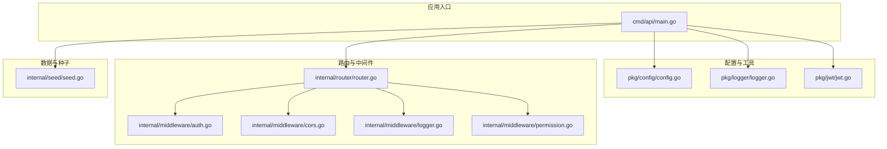
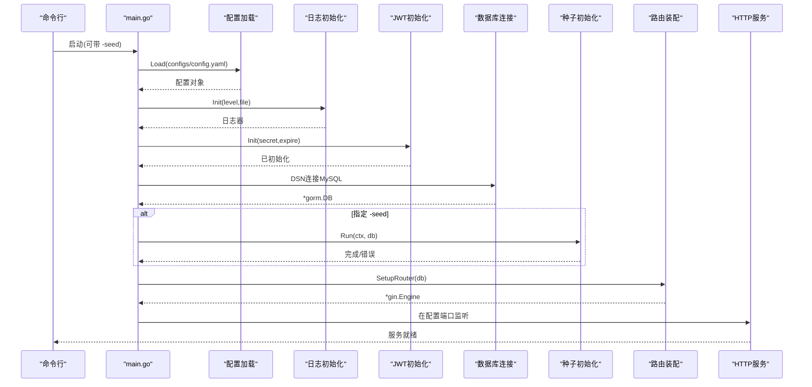
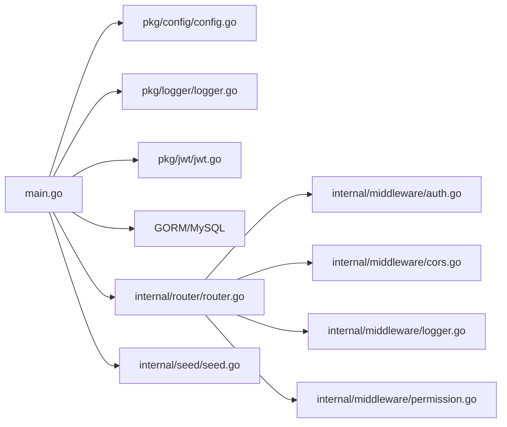

# 服务器直接部署

<cite>
**本文引用的文件**
- [app/server/Makefile](file://app/server/Makefile)
- [app/server/go.mod](file://app/server/go.mod)
- [app/server/cmd/api/main.go](file://app/server/cmd/api/main.go)
- [app/server/configs/config.example.yaml](file://app/server/configs/config.example.yaml)
- [app/server/pkg/config/config.go](file://app/server/pkg/config/config.go)
- [app/server/internal/router/router.go](file://app/server/internal/router/router.go)
- [app/server/pkg/logger/logger.go](file://app/server/pkg/logger/logger.go)
- [app/server/pkg/jwt/jwt.go](file://app/server/pkg/jwt/jwt.go)
- [app/server/internal/seed/seed.go](file://app/server/internal/seed/seed.go)
- [app/server/internal/middleware/auth.go](file://app/server/internal/middleware/auth.go)
- [app/server/internal/middleware/cors.go](file://app/server/internal/middleware/cors.go)
- [app/server/internal/middleware/logger.go](file://app/server/internal/middleware/logger.go)
- [app/server/internal/middleware/permission.go](file://app/server/internal/middleware/permission.go)
</cite>

## 目录
1. [简介](#简介)
2. [项目结构](#项目结构)
3. [核心组件](#核心组件)
4. [架构总览](#架构总览)
5. [详细组件分析](#详细组件分析)
6. [依赖分析](#依赖分析)
7. [性能考虑](#性能考虑)
8. [故障排查指南](#故障排查指南)
9. [结论](#结论)
10. [附录](#附录)

## 简介
本指南面向在服务器上直接部署 boread 后端服务的运维与开发人员，覆盖从环境准备、Go 语言与依赖管理、构建与交叉编译、服务启动与配置加载、数据库连接、systemd 进程管理与自动重启、防火墙与安全加固、日志轮转与监控告警到备份恢复策略的全流程。

## 项目结构
后端位于 app/server 目录，采用模块化分层设计：入口程序负责加载配置、初始化日志与 JWT、建立数据库连接、装配路由；中间件提供 CORS、请求日志与鉴权；路由层组织 API 分组与权限控制；工具包提供配置解析、日志与 JWT 能力；种子模块用于幂等初始化系统基础数据。

**图表来源**
- [app/server/cmd/api/main.go:30-84](file://app/server/cmd/api/main.go#L30-L84)
- [app/server/pkg/config/config.go:58-66](file://app/server/pkg/config/config.go#L58-L66)
- [app/server/pkg/logger/logger.go:13-38](file://app/server/pkg/logger/logger.go#L13-L38)
- [app/server/pkg/jwt/jwt.go:19-22](file://app/server/pkg/jwt/jwt.go#L19-L22)
- [app/server/internal/router/router.go:20-205](file://app/server/internal/router/router.go#L20-L205)
- [app/server/internal/middleware/auth.go:12-40](file://app/server/internal/middleware/auth.go#L12-L40)
- [app/server/internal/middleware/cors.go:9-23](file://app/server/internal/middleware/cors.go#L9-L23)
- [app/server/internal/middleware/logger.go:10-28](file://app/server/internal/middleware/logger.go#L10-L28)
- [app/server/internal/middleware/permission.go:20-52](file://app/server/internal/middleware/permission.go#L20-L52)
- [app/server/internal/seed/seed.go:14-54](file://app/server/internal/seed/seed.go#L14-L54)

**章节来源**
- [app/server/cmd/api/main.go:30-84](file://app/server/cmd/api/main.go#L30-L84)
- [app/server/internal/router/router.go:20-205](file://app/server/internal/router/router.go#L20-L205)

## 核心组件
- 构建与编译：通过 Makefile 提供 run/build/build-local/test/lint/tidy/clean/swag/seed 等命令，支持 Linux/amd64 交叉编译与 CGO 关闭的精简二进制。
- 配置系统：YAML 配置文件加载为结构化对象，包含 server、database、jwt、log 等段落。
- 日志系统：基于 zap，支持控制台与文件 JSON 输出，级别可配置。
- JWT：基于 HS256 的签发与解析，支持过期时间与刷新令牌。
- 路由与中间件：Gin 路由装配，包含 CORS、请求日志、鉴权与按钮级权限控制。
- 数据库：GORM + MySQL 驱动，连接池参数可配置。
- 种子数据：幂等初始化根部门、超级管理员角色、管理员用户、菜单与按钮、默认章节规则等。

**章节来源**
- [app/server/Makefile:1-43](file://app/server/Makefile#L1-L43)
- [app/server/go.mod:1-66](file://app/server/go.mod#L1-L66)
- [app/server/configs/config.example.yaml:1-21](file://app/server/configs/config.example.yaml#L1-L21)
- [app/server/pkg/config/config.go:58-66](file://app/server/pkg/config/config.go#L58-L66)
- [app/server/pkg/logger/logger.go:13-38](file://app/server/pkg/logger/logger.go#L13-L38)
- [app/server/pkg/jwt/jwt.go:19-22](file://app/server/pkg/jwt/jwt.go#L19-L22)
- [app/server/internal/router/router.go:20-205](file://app/server/internal/router/router.go#L20-L205)
- [app/server/internal/middleware/auth.go:12-40](file://app/server/internal/middleware/auth.go#L12-L40)
- [app/server/internal/middleware/permission.go:20-52](file://app/server/internal/middleware/permission.go#L20-L52)
- [app/server/internal/seed/seed.go:14-54](file://app/server/internal/seed/seed.go#L14-L54)

## 架构总览
后端启动流程自上而下：命令行参数解析 → 加载 YAML 配置 → 初始化日志与 JWT → 建立数据库连接与连接池 → 条件执行种子初始化 → 组装 Gin 路由 → 监听端口启动服务。

**图表来源**
- [app/server/cmd/api/main.go:30-84](file://app/server/cmd/api/main.go#L30-L84)
- [app/server/pkg/config/config.go:58-66](file://app/server/pkg/config/config.go#L58-L66)
- [app/server/pkg/logger/logger.go:13-38](file://app/server/pkg/logger/logger.go#L13-L38)
- [app/server/pkg/jwt/jwt.go:19-22](file://app/server/pkg/jwt/jwt.go#L19-L22)
- [app/server/internal/router/router.go:20-205](file://app/server/internal/router/router.go#L20-L205)
- [app/server/internal/seed/seed.go:14-54](file://app/server/internal/seed/seed.go#L14-L54)

## 详细组件分析

### 构建与编译（Makefile）
- 支持的命令：run、build、build-local、test、lint、tidy、clean、swag、seed。
- 交叉编译：默认 GOOS=linux、GOARCH=amd64、CGO_ENABLED=0，LDFLAGS="-s -w" 减小体积。
- 构建输出：bin/boread，本地构建可直接在当前平台运行。
- Swagger 文档：通过 swag init 生成文档资源。
- 种子模式：通过 -seed 参数触发，仅初始化数据后退出。

建议在生产环境使用 build 生成静态二进制，结合 systemd 与防火墙策略进行部署。

**章节来源**
- [app/server/Makefile:1-43](file://app/server/Makefile#L1-L43)

### Go 语言与依赖管理
- 语言版本：go 1.26.3。
- 主要依赖：Gin Web 框架、GORM ORM、MySQL 驱动、JWT、Zap 日志、Swag 文档等。
- 依赖整理：go mod tidy 自动维护依赖与间接依赖。

建议在 CI/CD 中执行 go mod tidy 以确保依赖一致性。

**章节来源**
- [app/server/go.mod:1-66](file://app/server/go.mod#L1-L66)

### 配置文件加载与结构
- 配置文件路径：configs/config.yaml。
- 结构字段：server.port、server.mode；database.driver/host/port/username/password/dbname/max_idle_conns/max_open_conns；jwt.secret、jwt.expire；log.level、log.file。
- 加载逻辑：读取文件并反序列化为 Config 对象，供全局使用。

部署时需复制示例配置并按实际环境修改数据库与 JWT 密钥等敏感信息。

**章节来源**
- [app/server/configs/config.example.yaml:1-21](file://app/server/configs/config.example.yaml#L1-L21)
- [app/server/pkg/config/config.go:58-66](file://app/server/pkg/config/config.go#L58-L66)

### 启动流程与数据库连接
- 启动入口：main.go 解析 -seed 参数，加载配置、初始化日志与 JWT。
- 数据库 DSN：用户名、密码、主机、端口、库名拼接，字符集与时区参数设置。
- 连接池：设置最大空闲与最大打开连接数。
- 种子模式：当传入 -seed 时，执行幂等初始化后退出。
- 路由装配：SetupRouter(db) 创建 Gin 引擎并注册路由与中间件。
- 服务监听：根据配置端口启动 HTTP 服务。

**章节来源**
- [app/server/cmd/api/main.go:30-84](file://app/server/cmd/api/main.go#L30-L84)
- [app/server/internal/router/router.go:20-205](file://app/server/internal/router/router.go#L20-L205)

### 路由与中间件
- CORS：允许任意源与常用头部与方法，并处理预检请求。
- 请求日志：打印状态码、耗时、方法与路径。
- 鉴权中间件：从 Authorization 头解析 Bearer Token，解析失败返回错误。
- 按钮级权限：从上下文获取用户 ID，查询其按钮权限集合，校验是否包含所需按钮编码。
- 路由分组：公开接口、登录态接口、受保护管理接口，管理接口进一步按模块细分。

**章节来源**
- [app/server/internal/middleware/cors.go:9-23](file://app/server/internal/middleware/cors.go#L9-L23)
- [app/server/internal/middleware/logger.go:10-28](file://app/server/internal/middleware/logger.go#L10-L28)
- [app/server/internal/middleware/auth.go:12-40](file://app/server/internal/middleware/auth.go#L12-L40)
- [app/server/internal/middleware/permission.go:20-52](file://app/server/internal/middleware/permission.go#L20-L52)
- [app/server/internal/router/router.go:20-205](file://app/server/internal/router/router.go#L20-L205)

### 日志与 JWT
- 日志：控制台与 JSON 文件双核 tee，支持 debug/info/warn/error 级别切换。
- JWT：初始化密钥与过期时间，提供生成访问令牌与刷新令牌、解析令牌的能力。

**章节来源**
- [app/server/pkg/logger/logger.go:13-38](file://app/server/pkg/logger/logger.go#L13-L38)
- [app/server/pkg/jwt/jwt.go:19-22](file://app/server/pkg/jwt/jwt.go#L19-L22)

### 种子数据（幂等初始化）
- 初始化内容：根部门、超级管理员角色、管理员用户、菜单与按钮、默认章节规则。
- 幂等性：按唯一键判断是否存在，避免重复插入。
- 使用场景：首次部署或迁移后重建基础数据。

**章节来源**
- [app/server/internal/seed/seed.go:14-54](file://app/server/internal/seed/seed.go#L14-L54)

## 依赖分析
后端采用分层与依赖注入风格，入口仅负责编排，核心能力通过工具包与中间件复用，路由层集中组织业务接口。

**图表来源**
- [app/server/cmd/api/main.go:30-84](file://app/server/cmd/api/main.go#L30-L84)
- [app/server/pkg/config/config.go:58-66](file://app/server/pkg/config/config.go#L58-L66)
- [app/server/pkg/logger/logger.go:13-38](file://app/server/pkg/logger/logger.go#L13-L38)
- [app/server/pkg/jwt/jwt.go:19-22](file://app/server/pkg/jwt/jwt.go#L19-L22)
- [app/server/internal/router/router.go:20-205](file://app/server/internal/router/router.go#L20-L205)
- [app/server/internal/middleware/auth.go:12-40](file://app/server/internal/middleware/auth.go#L12-L40)
- [app/server/internal/middleware/cors.go:9-23](file://app/server/internal/middleware/cors.go#L9-L23)
- [app/server/internal/middleware/logger.go:10-28](file://app/server/internal/middleware/logger.go#L10-L28)
- [app/server/internal/middleware/permission.go:20-52](file://app/server/internal/middleware/permission.go#L20-L52)
- [app/server/internal/seed/seed.go:14-54](file://app/server/internal/seed/seed.go#L14-L54)

**章节来源**
- [app/server/cmd/api/main.go:30-84](file://app/server/cmd/api/main.go#L30-L84)
- [app/server/internal/router/router.go:20-205](file://app/server/internal/router/router.go#L20-L205)

## 性能考虑
- 二进制体积：CGO_ENABLED=0 且 LDFLAGS="-s -w"，适合容器与服务器部署。
- 连接池：合理设置最大空闲与最大连接数，避免过高导致资源占用，过低导致频繁创建连接。
- 日志级别：生产环境建议 info 或 warn，减少 IO 压力。
- 中间件顺序：CORS 与 Recovery 应前置，保证异常与跨域场景正确处理。
- 按钮权限查询：当前每次请求查询 DB，如存在高并发场景，可在缓存层优化。

[本节为通用指导，不涉及具体文件分析]

## 故障排查指南
- 启动失败：检查配置文件路径与权限、数据库连通性与凭据、端口占用情况。
- 鉴权失败：确认 Authorization 头格式为 Bearer Token，密钥与过期时间配置一致。
- 路由 403：确认用户具备对应按钮权限编码，或临时关闭 RequireButton 中间件定位问题。
- 日志为空：确认 log.file 路径可写，目录已创建，级别配置正确。
- 种子未生效：确认传入 -seed 参数，数据库已初始化，种子执行无错误。

**章节来源**
- [app/server/cmd/api/main.go:34-84](file://app/server/cmd/api/main.go#L34-L84)
- [app/server/internal/middleware/auth.go:12-40](file://app/server/internal/middleware/auth.go#L12-L40)
- [app/server/internal/middleware/permission.go:20-52](file://app/server/internal/middleware/permission.go#L20-L52)
- [app/server/pkg/logger/logger.go:13-38](file://app/server/pkg/logger/logger.go#L13-L38)
- [app/server/internal/seed/seed.go:14-54](file://app/server/internal/seed/seed.go#L14-L54)

## 结论
通过本指南，您可以在服务器上完成 boread 后端的全生命周期部署：环境准备、构建与交叉编译、配置与数据库初始化、服务启动与权限控制、systemd 管理、防火墙与安全加固、日志与监控以及备份恢复。建议在生产环境中启用只读数据库账号、限制暴露端口、定期备份数据库与日志，并对敏感配置进行加密存储。

[本节为总结性内容，不涉及具体文件分析]

## 附录

### 服务器环境准备与 Go 安装
- 操作系统：Linux（推荐 Ubuntu/Debian/CentOS）。
- Go 版本：1.26.3（与 go.mod 一致）。
- 安装方式：官方二进制包或包管理器安装。
- 验证：go version。

[本节为通用指导，不涉及具体文件分析]

### 依赖包管理
- 使用 go mod tidy 维护依赖。
- 推荐在 CI 中执行 go test、go vet、swag init 等步骤。

**章节来源**
- [app/server/go.mod:1-66](file://app/server/go.mod#L1-L66)
- [app/server/Makefile:27-40](file://app/server/Makefile#L27-L40)

### Makefile 构建命令与交叉编译
- build：Linux/amd64 静态二进制，CGO 关闭，LDFLAGS 优化。
- build-local：当前平台二进制，便于本地调试。
- swag：生成 Swagger 文档资源。
- seed：执行种子初始化。

**章节来源**
- [app/server/Makefile:16-25](file://app/server/Makefile#L16-L25)
- [app/server/Makefile:39-43](file://app/server/Makefile#L39-L43)

### 后端服务启动流程与配置加载
- 配置加载：Load("configs/config.yaml")。
- 日志初始化：Init(level, file)。
- JWT 初始化：Init(secret, expire)。
- 数据库连接：DSN 拼接 + GORM + 连接池设置。
- 路由装配：SetupRouter(db)。
- 监听端口：根据配置端口启动。

**章节来源**
- [app/server/cmd/api/main.go:34-84](file://app/server/cmd/api/main.go#L34-L84)
- [app/server/pkg/config/config.go:58-66](file://app/server/pkg/config/config.go#L58-L66)
- [app/server/pkg/logger/logger.go:13-38](file://app/server/pkg/logger/logger.go#L13-L38)
- [app/server/pkg/jwt/jwt.go:19-22](file://app/server/pkg/jwt/jwt.go#L19-L22)
- [app/server/internal/router/router.go:20-205](file://app/server/internal/router/router.go#L20-L205)

### systemd 服务配置、进程管理与自动重启
- 创建服务单元文件，ExecStart 指向二进制，WorkingDirectory 指向工作目录，Environment 加载环境变量。
- 设置 Restart=always，RestartSec 控制重启间隔。
- 使用 systemctl enable/disable 管理开机自启。
- 查看日志：journalctl -u boread.service -f。

[本节为通用指导，不涉及具体文件分析]

### 防火墙配置、端口开放与安全加固
- 开放端口：仅开放服务监听端口（如 8080），关闭不必要的入站。
- 限制来源：仅允许前端或网关 IP 访问。
- 安全加固：禁用 root 运行、最小权限原则、只读文件系统、HTTPS 终止于反向代理。

[本节为通用指导，不涉及具体文件分析]

### 日志轮转、监控告警与备份恢复
- 日志轮转：使用 logrotate 或 journald 配置按大小/时间切分。
- 监控告警：Prometheus/Grafana 指标采集，结合告警规则。
- 备份恢复：数据库定时快照，日志归档，配置文件纳入版本管理。

[本节为通用指导，不涉及具体文件分析]