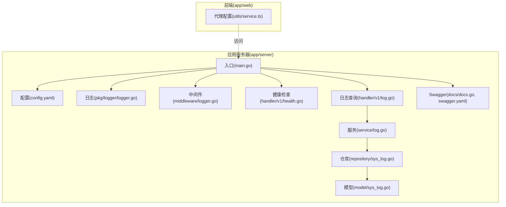
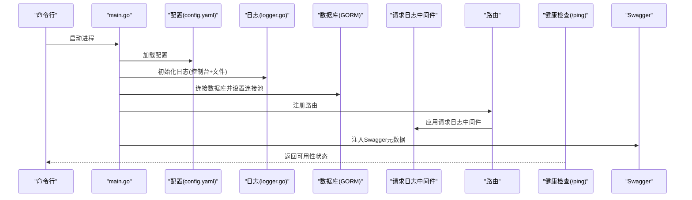
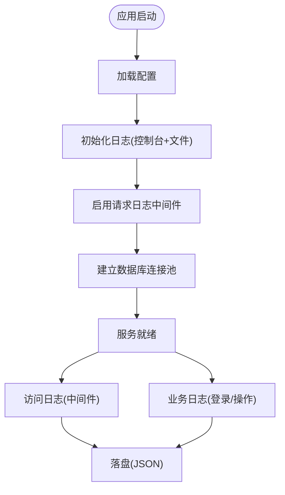
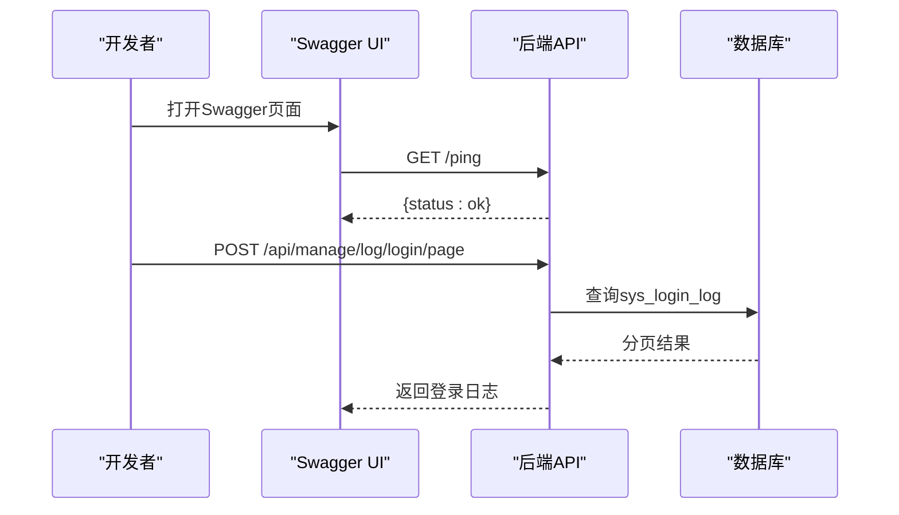
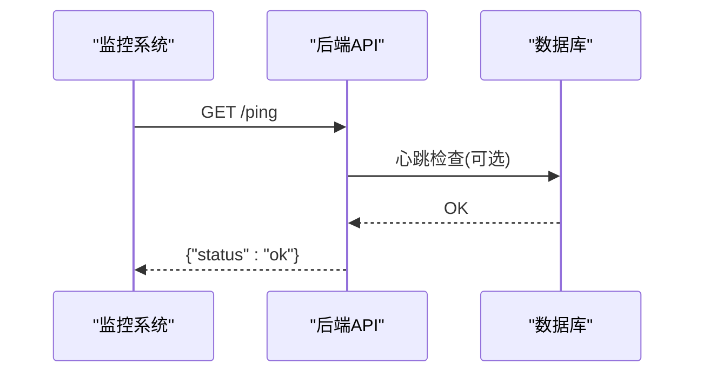
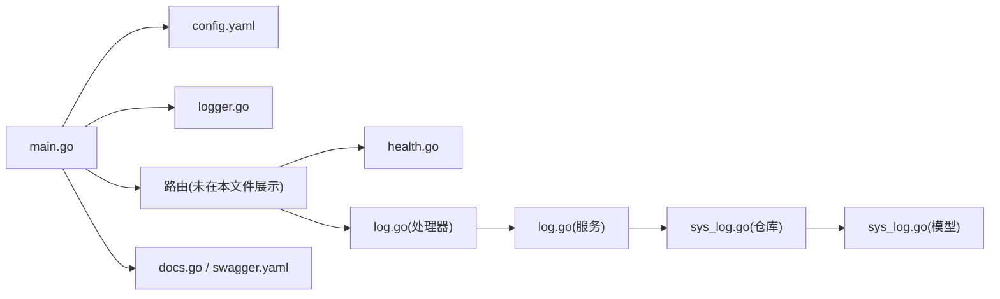

# 监控与运维配置

<cite>
**本文引用的文件**
- [main.go](file://app/server/cmd/api/main.go)
- [config.example.yaml](file://app/server/configs/config.example.yaml)
- [config.yaml](file://app/server/configs/config.yaml)
- [logger.go](file://app/server/pkg/logger/logger.go)
- [logger中间件.go](file://app/server/internal/middleware/logger.go)
- [health.go](file://app/server/internal/handler/v1/health.go)
- [log.go](file://app/server/internal/handler/v1/log.go)
- [sys_log.go](file://app/server/internal/model/sys_log.go)
- [sys_log.go（仓库）](file://app/server/internal/repository/sys_log.go)
- [log.go（服务）](file://app/server/internal/service/log.go)
- [docs.go](file://app/server/docs/docs.go)
- [swagger.yaml](file://app/server/docs/swagger.yaml)
- [project.yaml](file://project.yaml)
- [service.ts](file://app/web/src/utils/service.ts)
</cite>

## 目录
1. [简介](#简介)
2. [项目结构](#项目结构)
3. [核心组件](#核心组件)
4. [架构总览](#架构总览)
5. [详细组件分析](#详细组件分析)
6. [依赖分析](#依赖分析)
7. [性能考虑](#性能考虑)
8. [故障排查指南](#故障排查指南)
9. [结论](#结论)
10. [附录](#附录)

## 简介
本指南面向boread项目的监控与运维团队，聚焦以下目标：
- 日志系统：访问日志、错误日志、业务日志的分类与存储策略
- Swagger API 文档：部署与使用、接口监控与测试建议
- 健康检查端点：可用性监控与快速定位
- 性能指标：数据库连接池、请求耗时等关键指标
- 反向代理与负载均衡：Nginx配置要点、SSL证书
- 告警与仪表盘：基于现有端点与日志的监控方案
- 备份与灾备：数据库备份与恢复建议
- 安全审计：登录与操作日志的采集与留存

## 项目结构
后端采用Go语言与Gin框架，通过统一入口加载配置、初始化日志与数据库，注册路由并启动HTTP服务；前端通过代理访问后端API。

**图表来源**
- [main.go:30-84](file://app/server/cmd/api/main.go#L30-L84)
- [config.yaml:1-21](file://app/server/configs/config.yaml#L1-L21)
- [logger.go:13-38](file://app/server/pkg/logger/logger.go#L13-L38)
- [logger中间件.go:10-29](file://app/server/internal/middleware/logger.go#L10-L29)
- [health.go:17-25](file://app/server/internal/handler/v1/health.go#L17-L25)
- [log.go:19-63](file://app/server/internal/handler/v1/log.go#L19-L63)
- [sys_log.go:29-64](file://app/server/internal/model/sys_log.go#L29-L64)
- [sys_log.go（仓库）:20-82](file://app/server/internal/repository/sys_log.go#L20-L82)
- [log.go（服务）:18-34](file://app/server/internal/service/log.go#L18-L34)
- [docs.go:2689-2707](file://app/server/docs/docs.go#L2689-L2707)
- [swagger.yaml:1-800](file://app/server/docs/swagger.yaml#L1-L800)
- [service.ts:52-75](file://app/web/src/utils/service.ts#L52-L75)

**章节来源**
- [main.go:30-84](file://app/server/cmd/api/main.go#L30-L84)
- [config.yaml:1-21](file://app/server/configs/config.yaml#L1-L21)

## 核心组件
- 配置加载与初始化
  - 启动时加载YAML配置，初始化日志与JWT，建立数据库连接池，注册路由并监听端口。
- 日志系统
  - 控制台与文件双通道输出，支持按级别过滤与JSON格式化；中间件打印请求耗时与状态码。
- 健康检查
  - 提供/ping端点返回服务可用性状态。
- 日志查询
  - 提供登录日志与操作日志的分页查询接口，支持多条件筛选。
- Swagger文档
  - 自动生成API文档，包含健康检查与日志查询等端点信息。

**章节来源**
- [main.go:34-84](file://app/server/cmd/api/main.go#L34-L84)
- [logger.go:13-38](file://app/server/pkg/logger/logger.go#L13-L38)
- [logger中间件.go:10-29](file://app/server/internal/middleware/logger.go#L10-L29)
- [health.go:17-25](file://app/server/internal/handler/v1/health.go#L17-L25)
- [log.go:19-63](file://app/server/internal/handler/v1/log.go#L19-L63)
- [docs.go:2689-2707](file://app/server/docs/docs.go#L2689-L2707)

## 架构总览
后端服务启动流程与关键监控点如下：

**图表来源**
- [main.go:34-84](file://app/server/cmd/api/main.go#L34-L84)
- [logger.go:13-38](file://app/server/pkg/logger/logger.go#L13-L38)
- [docs.go:2689-2707](file://app/server/docs/docs.go#L2689-L2707)

## 详细组件分析

### 日志系统配置与管理
- 日志级别与输出
  - 支持debug/info/warn/error级别；同时输出到控制台与JSON格式文件，文件路径在配置中指定。
- 请求访问日志
  - 中间件记录每次请求的状态码、耗时、方法与路径，便于快速定位慢请求与异常路径。
- 错误日志
  - 数据库连接失败、配置加载失败等错误会通过标准错误输出，便于容器或系统日志聚合。
- 业务日志
  - 登录日志与操作日志模型已定义，可通过日志查询接口进行检索与分析。

**图表来源**
- [logger.go:13-38](file://app/server/pkg/logger/logger.go#L13-L38)
- [logger中间件.go:10-29](file://app/server/internal/middleware/logger.go#L10-L29)
- [sys_log.go:29-64](file://app/server/internal/model/sys_log.go#L29-L64)

**章节来源**
- [logger.go:13-38](file://app/server/pkg/logger/logger.go#L13-L38)
- [logger中间件.go:10-29](file://app/server/internal/middleware/logger.go#L10-L29)
- [sys_log.go:29-64](file://app/server/internal/model/sys_log.go#L29-L64)

### Swagger API 文档部署与使用
- 文档生成
  - 通过注释与docs.go中的路由映射，自动生成Swagger JSON/YAML。
- 使用方式
  - 在浏览器访问Swagger UI（通常由部署环境提供），或使用curl/postman调用接口。
- 接口示例
  - 健康检查：GET /ping
  - 登录日志分页：POST /api/manage/log/login/page
  - 操作日志分页：POST /api/manage/log/operation/page

**图表来源**
- [docs.go:2689-2707](file://app/server/docs/docs.go#L2689-L2707)
- [swagger.yaml:1-800](file://app/server/docs/swagger.yaml#L1-L800)
- [health.go:17-25](file://app/server/internal/handler/v1/health.go#L17-L25)
- [log.go:19-63](file://app/server/internal/handler/v1/log.go#L19-L63)

**章节来源**
- [docs.go:2689-2707](file://app/server/docs/docs.go#L2689-L2707)
- [swagger.yaml:1-800](file://app/server/docs/swagger.yaml#L1-L800)
- [health.go:17-25](file://app/server/internal/handler/v1/health.go#L17-L25)
- [log.go:19-63](file://app/server/internal/handler/v1/log.go#L19-L63)

### 健康检查端点与可用性监控
- 端点
  - GET /ping 返回服务可用性状态。
- 监控建议
  - 使用Prometheus等采集器定期探测/ping，结合告警规则触发通知。
  - 结合请求日志中间件输出，观察异常状态码与高延迟。

**图表来源**
- [health.go:17-25](file://app/server/internal/handler/v1/health.go#L17-L25)

**章节来源**
- [health.go:17-25](file://app/server/internal/handler/v1/health.go#L17-L25)

### 性能指标收集
- 数据库连接池
  - 最大空闲连接数与最大打开连接数在配置中设定，影响并发与资源占用。
- 请求耗时
  - 中间件记录每次请求耗时，可用于识别慢接口与异常路径。
- 日志级别
  - 生产环境建议使用info或更高级别，避免过多debug日志影响性能。

**章节来源**
- [config.yaml:11-13](file://app/server/configs/config.yaml#L11-L13)
- [logger中间件.go:10-29](file://app/server/internal/middleware/logger.go#L10-L29)

### Nginx反向代理、负载均衡与SSL
- 反向代理
  - 前端通过代理访问后端API，代理路径可配置为/api（参考项目配置）。
- 负载均衡
  - 可在Nginx层对多个后端实例做轮询或加权，提升可用性与吞吐。
- SSL/TLS
  - 建议在Nginx层启用HTTPS，使用Let’s Encrypt等自动化证书管理。
- 配置要点
  - 代理到后端端口（如8080）
  - 设置超时、缓冲区与gzip压缩
  - 开启/关闭调试头，生产环境建议移除调试信息

**章节来源**
- [project.yaml:13-14](file://project.yaml#L13-L14)
- [service.ts:52-75](file://app/web/src/utils/service.ts#L52-L75)

### 告警规则与监控仪表盘
- 健康检查
  - 规则：/ping连续失败超过阈值触发告警
- 请求指标
  - 规则：5xx错误率、P95/P99延迟、QPS下降
- 数据库
  - 规则：连接池使用率、慢查询数量、连接拒绝次数
- 日志
  - 规则：错误日志量激增、特定错误码出现频率异常

[本节为通用实践建议，不直接分析具体文件，故无“章节来源”]

### 数据备份与灾难恢复
- 数据库备份
  - 建议使用mysqldump或Percona XtraBackup进行定时全备与增量备份
- 恢复演练
  - 定期进行RTO/RPO测试，验证备份可用性
- 配置与日志
  - 将配置文件与日志目录纳入备份范围

[本节为通用实践建议，不直接分析具体文件，故无“章节来源”]

### 安全审计与合规
- 登录与操作日志
  - 已有模型与查询接口，建议保留至少90天的日志以便审计
- 敏感信息
  - 避免在日志中输出密码、Token等敏感字段；必要时脱敏处理
- 访问控制
  - 对日志查询接口启用鉴权与最小权限原则

**章节来源**
- [sys_log.go:29-64](file://app/server/internal/model/sys_log.go#L29-L64)
- [log.go（服务）:18-34](file://app/server/internal/service/log.go#L18-L34)

## 依赖分析
后端模块之间的依赖关系如下：

**图表来源**
- [main.go:34-84](file://app/server/cmd/api/main.go#L34-L84)
- [config.yaml:1-21](file://app/server/configs/config.yaml#L1-L21)
- [logger.go:13-38](file://app/server/pkg/logger/logger.go#L13-L38)
- [health.go:17-25](file://app/server/internal/handler/v1/health.go#L17-L25)
- [log.go:19-63](file://app/server/internal/handler/v1/log.go#L19-L63)
- [log.go（服务）:18-34](file://app/server/internal/service/log.go#L18-L34)
- [sys_log.go（仓库）:20-82](file://app/server/internal/repository/sys_log.go#L20-L82)
- [sys_log.go:29-64](file://app/server/internal/model/sys_log.go#L29-L64)
- [docs.go:2689-2707](file://app/server/docs/docs.go#L2689-L2707)
- [swagger.yaml:1-800](file://app/server/docs/swagger.yaml#L1-L800)

**章节来源**
- [main.go:34-84](file://app/server/cmd/api/main.go#L34-L84)
- [log.go:19-63](file://app/server/internal/handler/v1/log.go#L19-L63)
- [log.go（服务）:18-34](file://app/server/internal/service/log.go#L18-L34)
- [sys_log.go（仓库）:20-82](file://app/server/internal/repository/sys_log.go#L20-L82)

## 性能考虑
- 日志级别与输出
  - 生产环境建议使用info级别，减少I/O压力
- 数据库连接池
  - 合理设置最大空闲与最大连接数，避免连接不足或资源浪费
- 中间件开销
  - 请求日志中间件为轻量级输出，但应避免在高频场景下开启过细粒度日志

[本节为通用指导，不直接分析具体文件，故无“章节来源”]

## 故障排查指南
- 无法启动
  - 检查配置文件是否存在且格式正确；查看启动日志中关于配置加载与数据库连接的错误信息
- 无响应或500错误
  - 查看/ping是否可用；结合请求日志中间件输出定位异常请求
- 日志查询无数据
  - 确认数据库中存在sys_login_log与sys_operation_log表；检查查询条件与时间范围
- 前端无法访问后端
  - 检查Nginx代理路径与后端端口；确认代理前缀(api)与项目配置一致

**章节来源**
- [main.go:34-84](file://app/server/cmd/api/main.go#L34-L84)
- [logger中间件.go:10-29](file://app/server/internal/middleware/logger.go#L10-L29)
- [health.go:17-25](file://app/server/internal/handler/v1/health.go#L17-L25)
- [log.go:19-63](file://app/server/internal/handler/v1/log.go#L19-L63)

## 结论
本指南基于现有代码与配置，给出了boread项目的监控与运维实施建议。通过健康检查端点、访问日志中间件、业务日志查询接口与Swagger文档，可以构建完整的可观测性体系。配合Nginx反向代理、负载均衡与SSL，以及完善的备份与告警机制，能够有效保障服务的稳定性与安全性。

[本节为总结性内容，不直接分析具体文件，故无“章节来源”]

## 附录
- 关键端点
  - GET /ping
  - POST /api/manage/log/login/page
  - POST /api/manage/log/operation/page
- 配置项参考
  - server.port、server.mode
  - database.max_idle_conns、database.max_open_conns
  - log.level、log.file

**章节来源**
- [health.go:17-25](file://app/server/internal/handler/v1/health.go#L17-L25)
- [log.go:19-63](file://app/server/internal/handler/v1/log.go#L19-L63)
- [config.yaml:1-21](file://app/server/configs/config.yaml#L1-L21)