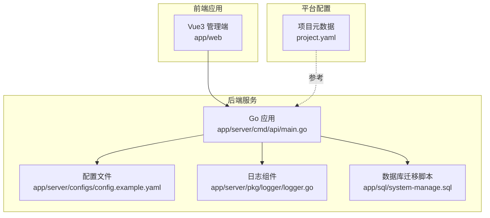
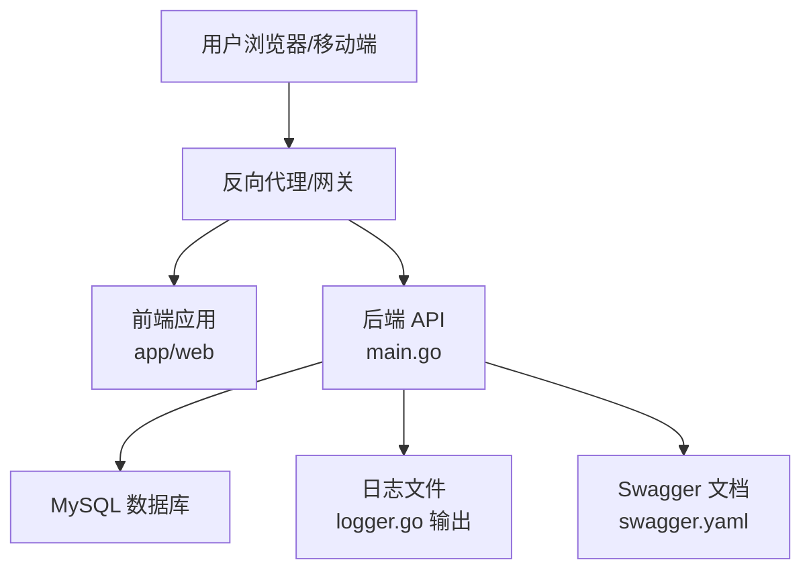
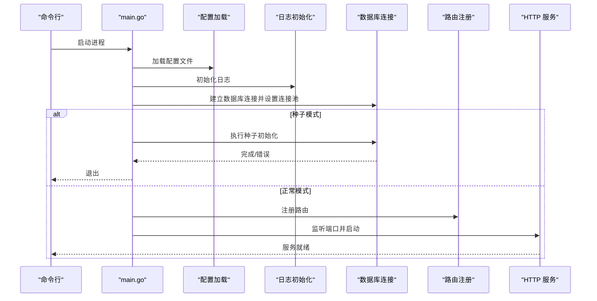
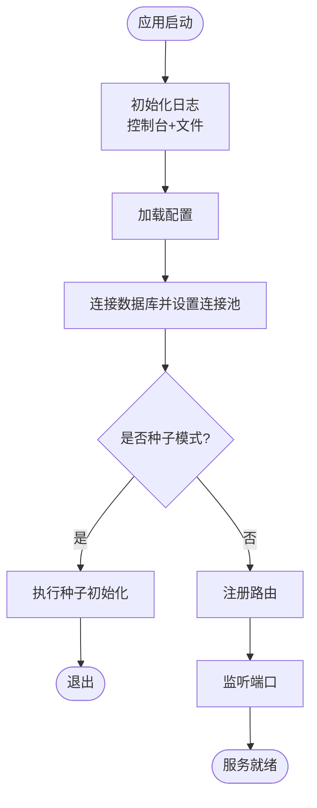
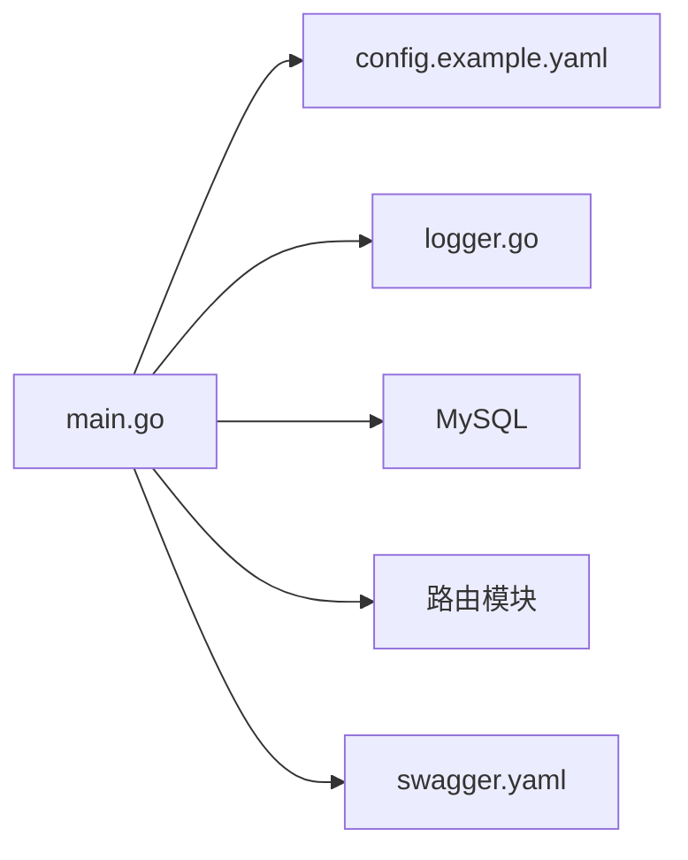

# 部署指南

<cite>
**本文引用的文件**   
- [main.go](file://app/server/cmd/api/main.go)
- [config.example.yaml](file://app/server/configs/config.example.yaml)
- [Makefile](file://app/server/Makefile)
- [go.mod](file://app/server/go.mod)
- [logger.go](file://app/server/pkg/logger/logger.go)
- [system-manage.sql](file://app/sql/system-manage.sql)
- [project.yaml](file://project.yaml)
- [README.md](file://README.md)
- [swagger.yaml](file://app/server/docs/swagger.yaml)
</cite>

## 目录
1. [简介](#简介)
2. [项目结构](#项目结构)
3. [核心组件](#核心组件)
4. [架构总览](#架构总览)
5. [详细组件分析](#详细组件分析)
6. [依赖分析](#依赖分析)
7. [性能考虑](#性能考虑)
8. [故障排除指南](#故障排除指南)
9. [结论](#结论)
10. [附录](#附录)

## 简介
本指南面向运维与开发团队，提供 boread 项目的完整部署实施方法，覆盖 Docker 容器化部署、传统服务器部署、云平台部署等方案；明确部署前准备、环境要求与依赖安装；给出 CI/CD 流水线配置思路、自动化部署脚本与回滚策略；解释负载均衡、SSL 证书与域名解析配置；并提供性能监控、日志收集与健康检查等运维配置建议。

## 项目结构
boread 由前后端分离架构组成：
- 后端（Go/Gin）位于 app/server，提供 REST API、数据库连接、日志与配置管理。
- 前端（Vue3 + Vite）位于 app/web，负责管理端与阅读端界面。
- 数据库迁移脚本位于 app/sql，包含系统管理与书籍相关表结构。
- 顶层配置 project.yaml 描述应用元数据与启动参数，可用于某些平台的打包与运行。

图表来源
- [main.go:1-85](file://app/server/cmd/api/main.go#L1-L85)
- [config.example.yaml:1-21](file://app/server/configs/config.example.yaml#L1-L21)
- [logger.go:1-53](file://app/server/pkg/logger/logger.go#L1-L53)
- [system-manage.sql:243-263](file://app/sql/system-manage.sql#L243-L263)
- [project.yaml:1-30](file://project.yaml#L1-L30)

章节来源
- [README.md:1-11](file://README.md#L1-L11)
- [project.yaml:1-30](file://project.yaml#L1-L30)

## 核心组件
- 应用入口与启动流程：后端通过 main.go 加载配置、初始化日志、建立数据库连接、注册路由并启动 HTTP 服务。
- 配置体系：通过 YAML 配置文件集中管理服务端口、数据库连接、JWT 密钥与过期时间、日志级别与输出路径。
- 日志系统：基于 zap 实现控制台与文件双通道输出，支持按级别过滤。
- 数据库：使用 GORM 连接 MySQL，支持连接池参数配置。
- Swagger 文档：通过 swag 工具生成 OpenAPI 文档，便于 API 文档与联调。
- 构建与种子：Makefile 提供构建、测试、清理、Swagger 生成与种子初始化等目标。

章节来源
- [main.go:30-84](file://app/server/cmd/api/main.go#L30-L84)
- [config.example.yaml:1-21](file://app/server/configs/config.example.yaml#L1-L21)
- [logger.go:13-38](file://app/server/pkg/logger/logger.go#L13-L38)
- [Makefile:1-43](file://app/server/Makefile#L1-L43)
- [swagger.yaml](file://app/server/docs/swagger.yaml)

## 架构总览
下图展示部署层面的总体架构：前端通过反向代理访问后端 API；后端连接 MySQL；日志落盘；Swagger 文档辅助联调；数据库迁移脚本用于初始化系统表。

图表来源
- [main.go:34-84](file://app/server/cmd/api/main.go#L34-L84)
- [logger.go:25-34](file://app/server/pkg/logger/logger.go#L25-L34)
- [swagger.yaml](file://app/server/docs/swagger.yaml)

## 详细组件分析

### 后端启动与配置加载
- 启动流程要点：
  - 解析命令行参数（如种子模式），加载 YAML 配置，初始化日志与 JWT。
  - 构造 MySQL DSN 并建立 GORM 连接，设置连接池参数。
  - 在种子模式下执行初始化后退出；否则注册路由并监听端口。
- 关键配置项：
  - server.port：HTTP 监听端口
  - database.*：主机、端口、用户名、密码、库名与连接池上限
  - jwt.secret/expire：JWT 密钥与过期秒数
  - log.level/file：日志级别与文件路径

图表来源
- [main.go:30-84](file://app/server/cmd/api/main.go#L30-L84)

章节来源
- [main.go:30-84](file://app/server/cmd/api/main.go#L30-L84)
- [config.example.yaml:1-21](file://app/server/configs/config.example.yaml#L1-L21)

### 日志与健康检查
- 日志输出：
  - 控制台 JSON 编码输出，便于结构化日志采集。
  - 可选文件输出，按配置路径写入 JSON 日志。
- 健康检查：
  - 建议在反向代理或平台侧暴露 /health 接口，返回 200 表示健康。
  - 若未内置，可在 Gin 路由中新增健康检查处理器。

图表来源
- [logger.go:13-38](file://app/server/pkg/logger/logger.go#L13-L38)
- [main.go:34-84](file://app/server/cmd/api/main.go#L34-L84)

章节来源
- [logger.go:13-38](file://app/server/pkg/logger/logger.go#L13-L38)

### 数据库与迁移
- 迁移脚本：
  - system-manage.sql 包含系统管理相关表结构与索引，建议在首次部署时执行。
- 连接与池化：
  - 通过配置文件设置最大空闲/打开连接数，避免连接抖动与资源耗尽。

章节来源
- [system-manage.sql:243-263](file://app/sql/system-manage.sql#L243-L263)
- [config.example.yaml:5-13](file://app/server/configs/config.example.yaml#L5-L13)

### 构建与种子
- 构建：
  - Makefile 提供跨平台构建与本地构建目标，支持 CGO_enabled 与 LDFLAGS。
- 种子：
  - 通过 -seed 参数执行初始化数据，适合首次部署或环境重建。

章节来源
- [Makefile:16-25](file://app/server/Makefile#L16-L25)
- [Makefile:42-43](file://app/server/Makefile#L42-L43)
- [main.go:67-74](file://app/server/cmd/api/main.go#L67-L74)

## 依赖分析
- 运行时依赖：
  - Go 1.26.3（go.mod）
  - MySQL 数据库
  - 反向代理/网关（Nginx/Traefik/云负载均衡）
- 组件耦合：
  - main.go 依赖配置、日志、JWT、数据库与路由模块。
  - 日志组件独立，可被其他模块复用。
  - Swagger 文档与 API 定义相互独立，便于联调。

图表来源
- [go.mod:1-66](file://app/server/go.mod#L1-L66)
- [main.go:34-84](file://app/server/cmd/api/main.go#L34-L84)
- [config.example.yaml:1-21](file://app/server/configs/config.example.yaml#L1-L21)
- [logger.go:1-53](file://app/server/pkg/logger/logger.go#L1-L53)
- [swagger.yaml](file://app/server/docs/swagger.yaml)

章节来源
- [go.mod:1-66](file://app/server/go.mod#L1-L66)

## 性能考虑
- 连接池参数：
  - 合理设置最大空闲/打开连接数，避免高并发下的连接争用。
- 日志级别：
  - 生产环境建议使用 info/warn，减少磁盘 IO 与 CPU 开销。
- 前端静态资源：
  - 通过 CDN 与反向代理缓存静态资源，降低后端压力。
- 监控指标：
  - 建议接入 Prometheus/Grafana，采集请求延迟、吞吐、错误率与数据库连接数。

## 故障排除指南
- 启动失败（配置加载/数据库连接）：
  - 检查配置文件路径与字段完整性；确认数据库可达与凭据正确。
- 日志为空或格式异常：
  - 确认日志文件路径存在且具备写权限；核对日志级别配置。
- 种子初始化失败：
  - 查看种子执行输出与数据库权限；必要时清理残留数据后重试。
- Swagger 文档无法访问：
  - 确认 swag 工具已生成文档；检查反向代理路径映射。

章节来源
- [main.go:34-57](file://app/server/cmd/api/main.go#L34-L57)
- [logger.go:25-34](file://app/server/pkg/logger/logger.go#L25-L34)
- [Makefile:39-43](file://app/server/Makefile#L39-L43)

## 结论
本指南提供了 boread 项目的端到端部署方法与运维建议。通过标准化的配置、日志与数据库迁移流程，结合反向代理与健康检查，可实现稳定、可观测与可扩展的生产部署。后续可根据业务增长引入容器编排、自动扩缩容与更细粒度的监控告警。

## 附录

### 部署前准备与环境要求
- 后端
  - Go 运行时：Go 1.26.3
  - 数据库：MySQL（版本兼容性以驱动为准）
  - 反向代理：Nginx/Traefik/云负载均衡
- 前端
  - Node.js 与包管理器（见前端工程说明）
- 通用
  - 系统权限：具备创建日志目录与写入权限
  - 网络连通：后端与数据库网络互通

章节来源
- [go.mod:3-3](file://app/server/go.mod#L3-L3)
- [config.example.yaml:1-21](file://app/server/configs/config.example.yaml#L1-L21)
- [README.md:7-8](file://README.md#L7-L8)

### 多种部署方式

#### Docker 容器化部署
- 构建镜像
  - 使用 Makefile 的构建目标生成二进制，复制至容器根目录。
  - 在容器内以非 root 用户运行，挂载日志目录与配置文件。
- 运行参数
  - 通过环境变量或挂载卷注入配置文件；映射服务端口。
- 健康检查
  - 在容器内暴露 /health 接口，配合反向代理或编排平台健康检查。

章节来源
- [Makefile:16-25](file://app/server/Makefile#L16-L25)
- [main.go:78-83](file://app/server/cmd/api/main.go#L78-L83)

#### 传统服务器部署
- 步骤
  - 下载/构建二进制，准备配置文件与日志目录。
  - 配置 systemd 或进程管理器守护进程。
  - 配置反向代理转发至后端端口。
- 回滚策略
  - 预留上一版本二进制与配置备份；切换失败时快速回切。

章节来源
- [main.go:78-83](file://app/server/cmd/api/main.go#L78-L83)
- [config.example.yaml:1-21](file://app/server/configs/config.example.yaml#L1-L21)

#### 云平台部署
- 方案选择
  - 容器服务（如 Kubernetes/ECS/EKS）或无服务器函数（需评估 API 形态）。
- 配置要点
  - 使用托管数据库与对象存储；启用自动备份与只读副本。
  - 通过平台负载均衡与 WAF 防护流量。

章节来源
- [project.yaml:1-30](file://project.yaml#L1-L30)

### CI/CD 流水线配置与自动化部署
- 构建阶段
  - 拉取代码 → 安装依赖 → 构建二进制（Makefile） → 生成 Swagger 文档
- 测试阶段
  - 运行单元测试与静态检查（Makefile 提供测试与 lint 目标）
- 部署阶段
  - 上传制品 → 触发部署脚本 → 健康检查 → 切流/回滚
- 回滚策略
  - 记录版本号与制品哈希；一键回滚至上一稳定版本

章节来源
- [Makefile:27-40](file://app/server/Makefile#L27-L40)

### 负载均衡、SSL 与域名解析
- 负载均衡
  - 使用 Nginx/Traefik/云负载均衡；配置健康检查与会话亲和（如需要）
- SSL 证书
  - 通过 ACME 自动签发或手动部署证书；反向代理终止 TLS
- 域名解析
  - A/AAAA 记录指向负载均衡器；CNAME 指向 API 子域

### 运维配置：监控、日志与健康检查
- 监控
  - 指标：QPS、P95/P99 延迟、错误率、数据库连接数
  - 告警：阈值触发与趋势异常检测
- 日志
  - 结构化 JSON 日志；集中采集（如 Fluent Bit/Fluentd）与可视化（如 ELK）
- 健康检查
  - /health 返回 200；失败时自动摘除节点并触发告警

### 部署检查清单
- 基础设施
  - 反向代理可用、SSL 证书有效、域名解析生效
- 应用配置
  - 配置文件完整、数据库连通、JWT 密钥安全
- 运行状态
  - 服务进程健康、日志目录可写、连接池参数合理
- 回滚准备
  - 上一版本制品与配置备份、回滚脚本验证通过

### 性能优化建议
- 连接池与数据库
  - 根据 QPS 调整最大连接数；开启慢查询日志定位热点
- 缓存与静态资源
  - 前端静态资源走 CDN；后端热点数据适度缓存
- 监控与容量规划
  - 基于历史峰值与增长趋势设定扩容阈值