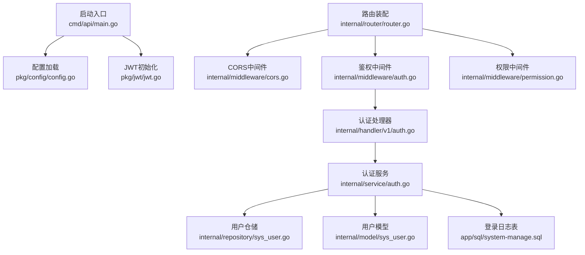
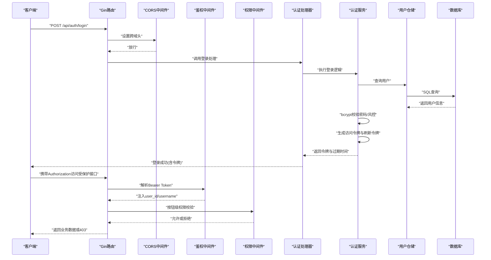
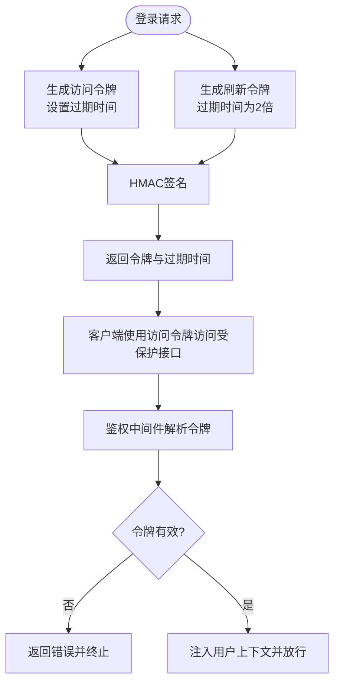
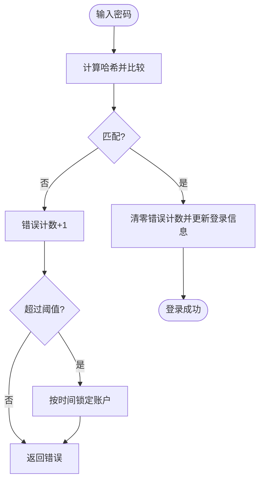
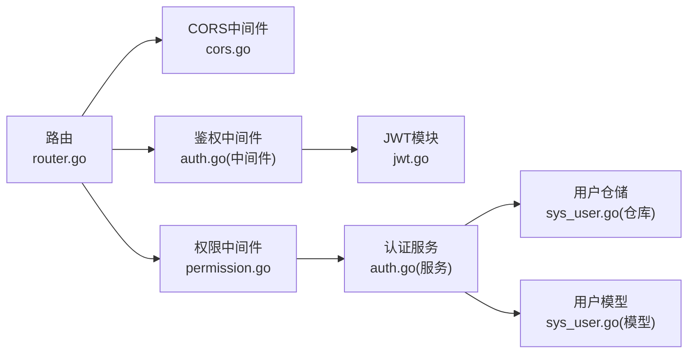

# 安全配置

<cite>
**本文引用的文件**
- [main.go](file://app/server/cmd/api/main.go)
- [config.go](file://app/server/pkg/config/config.go)
- [config.example.yaml](file://app/server/configs/config.example.yaml)
- [jwt.go](file://app/server/pkg/jwt/jwt.go)
- [cors.go](file://app/server/internal/middleware/cors.go)
- [auth.go（中间件）](file://app/server/internal/middleware/auth.go)
- [permission.go](file://app/server/internal/middleware/permission.go)
- [auth.go（处理器）](file://app/server/internal/handler/v1/auth.go)
- [auth.go（服务）](file://app/server/internal/service/auth.go)
- [sys_user.go（模型）](file://app/server/internal/model/sys_user.go)
- [sys_user.go（仓库）](file://app/server/internal/repository/sys_user.go)
- [router.go](file://app/server/internal/router/router.go)
- [system-manage.sql](file://app/sql/system-manage.sql)
</cite>

## 目录
1. [简介](#简介)
2. [项目结构](#项目结构)
3. [核心组件](#核心组件)
4. [架构总览](#架构总览)
5. [详细组件分析](#详细组件分析)
6. [依赖分析](#依赖分析)
7. [性能考虑](#性能考虑)
8. [故障排查指南](#故障排查指南)
9. [结论](#结论)
10. [附录](#附录)

## 简介
本文件面向boread项目的后端安全配置，围绕以下主题展开：JWT令牌配置与刷新机制、密钥管理、过期时间策略；CORS跨域、HTTP安全头、XSS与CSRF防护现状与建议；密码加密、用户认证、权限控制、会话管理；HTTPS部署与证书管理、安全审计与日志记录。文档以代码为依据，结合架构图与流程图，帮助开发者与运维人员快速理解并加固系统安全。

## 项目结构
后端采用Go语言与Gin框架，安全相关能力主要分布在如下模块：
- 配置加载与解析：配置文件、配置结构体、启动入口
- JWT令牌：令牌生成、解析、刷新
- 中间件：CORS、鉴权、权限校验
- 认证与授权：登录处理、用户信息服务、按钮级权限
- 数据模型与仓储：用户模型、登录日志、操作日志
- 路由：公开接口、登录态接口、受保护管理接口

图表来源
- [main.go:30-84](file://app/server/cmd/api/main.go#L30-L84)
- [config.go:58-66](file://app/server/pkg/config/config.go#L58-L66)
- [jwt.go:19-22](file://app/server/pkg/jwt/jwt.go#L19-L22)
- [router.go:20-205](file://app/server/internal/router/router.go#L20-L205)
- [cors.go:9-23](file://app/server/internal/middleware/cors.go#L9-L23)
- [auth.go（中间件）:13-40](file://app/server/internal/middleware/auth.go#L13-L40)
- [permission.go:20-52](file://app/server/internal/middleware/permission.go#L20-L52)
- [auth.go（处理器）:31-56](file://app/server/internal/handler/v1/auth.go#L31-L56)
- [auth.go（服务）:41-95](file://app/server/internal/service/auth.go#L41-L95)
- [sys_user.go（仓库）:21-64](file://app/server/internal/repository/sys_user.go#L21-L64)
- [sys_user.go（模型）:6-23](file://app/server/internal/model/sys_user.go#L6-L23)
- [system-manage.sql:243-263](file://app/sql/system-manage.sql#L243-L263)

章节来源
- [main.go:30-84](file://app/server/cmd/api/main.go#L30-L84)
- [config.go:58-66](file://app/server/pkg/config/config.go#L58-L66)
- [config.example.yaml:1-21](file://app/server/configs/config.example.yaml#L1-L21)

## 核心组件
- 配置系统：从YAML加载server、database、jwt、log等配置，并在启动时初始化日志与JWT。
- JWT模块：集中管理密钥与过期时间，提供访问令牌与刷新令牌生成、解析。
- CORS中间件：统一设置跨域响应头，支持预检请求。
- 鉴权中间件：从Authorization头解析Bearer Token，注入用户上下文。
- 权限中间件：基于用户角色聚合的按钮码集合进行细粒度权限校验。
- 认证服务：登录流程包含密码校验、风控（错误次数与锁定）、登录日志、签发JWT。
- 日志与审计：登录日志表记录登录结果与原因；操作日志表用于审计追踪。

章节来源
- [config.go:9-54](file://app/server/pkg/config/config.go#L9-L54)
- [config.example.yaml:15-17](file://app/server/configs/config.example.yaml#L15-L17)
- [jwt.go:19-71](file://app/server/pkg/jwt/jwt.go#L19-L71)
- [cors.go:9-23](file://app/server/internal/middleware/cors.go#L9-L23)
- [auth.go（中间件）:13-40](file://app/server/internal/middleware/auth.go#L13-L40)
- [permission.go:20-52](file://app/server/internal/middleware/permission.go#L20-L52)
- [auth.go（服务）:41-95](file://app/server/internal/service/auth.go#L41-L95)
- [system-manage.sql:243-263](file://app/sql/system-manage.sql#L243-L263)

## 架构总览
下图展示从客户端到服务端的关键安全交互路径，包括认证、鉴权与权限控制。

图表来源
- [router.go:78-91](file://app/server/internal/router/router.go#L78-L91)
- [auth.go（中间件）:13-40](file://app/server/internal/middleware/auth.go#L13-L40)
- [permission.go:20-52](file://app/server/internal/middleware/permission.go#L20-L52)
- [auth.go（处理器）:31-56](file://app/server/internal/handler/v1/auth.go#L31-L56)
- [auth.go（服务）:41-95](file://app/server/internal/service/auth.go#L41-L95)
- [sys_user.go（仓库）:66-103](file://app/server/internal/repository/sys_user.go#L66-L103)

## 详细组件分析

### JWT令牌配置与刷新机制
- 初始化与配置
  - 在启动阶段读取配置中的JWT密钥与过期秒数，并初始化全局变量。
  - 配置项位于配置文件中，示例值可直接参考配置样例。
- 令牌生成
  - 访问令牌：包含用户ID、用户名以及标准声明（签发时间、过期时间），使用对称签名算法生成。
  - 刷新令牌：过期时间是访问令牌的两倍，用于在访问令牌过期后换取新的令牌。
- 令牌解析
  - 鉴权中间件从Authorization头提取Bearer Token并解析，失败时返回错误并中断请求。
- 刷新流程
  - 登录成功时同时返回访问令牌与刷新令牌，业务侧应安全存储刷新令牌并在需要时使用。

图表来源
- [jwt.go:24-55](file://app/server/pkg/jwt/jwt.go#L24-L55)
- [auth.go（服务）:77-94](file://app/server/internal/service/auth.go#L77-L94)
- [auth.go（中间件）:29-34](file://app/server/internal/middleware/auth.go#L29-L34)

章节来源
- [main.go:42-42](file://app/server/cmd/api/main.go#L42-L42)
- [config.go:46-49](file://app/server/pkg/config/config.go#L46-L49)
- [config.example.yaml:15-17](file://app/server/configs/config.example.yaml#L15-L17)
- [jwt.go:19-71](file://app/server/pkg/jwt/jwt.go#L19-L71)
- [auth.go（服务）:77-94](file://app/server/internal/service/auth.go#L77-L94)
- [auth.go（中间件）:29-34](file://app/server/internal/middleware/auth.go#L29-L34)

### 密钥管理
- 密钥来源：从配置文件读取JWT密钥字符串。
- 建议实践：
  - 使用强随机字符串作为密钥，避免硬编码在版本库。
  - 在生产环境通过环境变量或密钥管理服务注入。
  - 定期轮换密钥，并在轮换期间支持新旧密钥并行解析，确保平滑过渡。

章节来源
- [config.go:46-49](file://app/server/pkg/config/config.go#L46-L49)
- [config.example.yaml:16-16](file://app/server/configs/config.example.yaml#L16-L16)

### 过期时间设置
- 访问令牌过期时间：来自配置项，单位为秒。
- 刷新令牌过期时间：为访问令牌的两倍。
- 建议实践：
  - 根据业务场景调整过期时间，平衡用户体验与安全。
  - 对于高风险操作，可单独缩短访问令牌有效期或增加二次验证。

章节来源
- [config.go:46-49](file://app/server/pkg/config/config.go#L46-L49)
- [jwt.go:24-55](file://app/server/pkg/jwt/jwt.go#L24-L55)

### CORS跨域配置
- 当前实现：
  - 允许任意源、常用头部与方法，并设置预检缓存时间。
- 安全建议：
  - 生产环境应限制允许的源、头部与方法，避免使用通配符。
  - 明确暴露必要响应头，避免泄露敏感信息。

章节来源
- [cors.go:11-14](file://app/server/internal/middleware/cors.go#L11-L14)

### HTTP安全头与内容安全策略
- 当前实现：未显式设置常见安全头（如X-Frame-Options、X-Content-Type-Options、Strict-Transport-Security、Referrer-Policy、Permissions-Policy、Content-Security-Policy等）。
- 建议实践：
  - 在网关或反向代理层统一添加安全头。
  - 对静态资源与API分别制定CSP策略，限制脚本执行与外链资源。
  - 强制HTTPS并配置HSTS。

[本节为通用建议，不直接分析具体文件]

### XSS防护配置
- 当前实现：未发现专门的XSS防护中间件或模板过滤器。
- 建议实践：
  - 输入输出严格转义，避免在HTML中直接插入未经转义的数据。
  - 使用CSP限制脚本来源，启用自动净化库处理富文本。
  - 对Cookie设置HttpOnly与Secure属性（见会话管理）。

[本节为通用建议，不直接分析具体文件]

### CSRF防护配置
- 当前实现：未发现CSRF中间件或Token校验。
- 建议实践：
  - 对于无状态API，优先使用Bearer Token替代Cookie，天然规避CSRF。
  - 若仍使用Cookie，请引入CSRF Token校验与SameSite Cookie策略。
  - 严格区分GET/HEAD幂等请求与写操作。

[本节为通用建议，不直接分析具体文件]

### 密码加密配置
- 实现细节：
  - 登录时使用密码哈希比较，错误次数达到阈值后临时锁定账户。
  - 成功登录后清零错误计数并更新最近登录信息。
- 建议实践：
  - 使用足够强度的哈希参数（bcrypt成本因子）。
  - 定期提醒用户修改弱密码，实施密码复杂度策略。

图表来源
- [auth.go（服务）:62-75](file://app/server/internal/service/auth.go#L62-L75)
- [sys_user.go（仓库）:52-64](file://app/server/internal/repository/sys_user.go#L52-L64)

章节来源
- [auth.go（服务）:19-29](file://app/server/internal/service/auth.go#L19-L29)
- [auth.go（服务）:62-75](file://app/server/internal/service/auth.go#L62-L75)
- [sys_user.go（仓库）:52-64](file://app/server/internal/repository/sys_user.go#L52-L64)

### 用户认证配置
- 登录流程：
  - 查询用户、状态与锁定检查、密码校验、风控、成功后签发双令牌并记录日志。
- 授权范围：
  - 公开接口：如登录、热门分类等。
  - 登录态接口：需Bearer Token。
  - 受保护管理接口：除公开/登录态接口外，均需按钮级权限校验。

章节来源
- [auth.go（处理器）:31-56](file://app/server/internal/handler/v1/auth.go#L31-L56)
- [auth.go（服务）:41-95](file://app/server/internal/service/auth.go#L41-L95)
- [router.go:78-91](file://app/server/internal/router/router.go#L78-L91)

### 权限控制配置
- 角色与按钮码：
  - 用户通过角色关联获得按钮码集合，权限中间件基于该集合进行校验。
- 中间件用法：
  - 在路由上挂载RequireButton中间件，传入所需按钮码。
- 性能建议：
  - 当前每次请求查询数据库，可在服务端引入缓存（如Redis）降低压力。

章节来源
- [permission.go:20-52](file://app/server/internal/middleware/permission.go#L20-L52)
- [sys_user.go（仓库）:90-103](file://app/server/internal/repository/sys_user.go#L90-L103)
- [router.go:101-115](file://app/server/internal/router/router.go#L101-L115)

### 会话管理配置
- 当前实现：
  - 使用JWT无状态令牌，不涉及服务端会话存储。
- 建议实践：
  - 若使用Cookie会话，应设置HttpOnly、Secure、SameSite属性。
  - 对长生命周期会话启用滑动过期与IP/UA绑定校验。

章节来源
- [auth.go（中间件）:13-40](file://app/server/internal/middleware/auth.go#L13-L40)
- [jwt.go:24-55](file://app/server/pkg/jwt/jwt.go#L24-L55)

### HTTPS配置与证书管理
- 当前实现：未在应用层直接处理TLS握手。
- 建议实践：
  - 在反向代理（如Nginx、Traefik）或容器编排中启用TLS。
  - 使用自动化证书（Let’s Encrypt）并配置强制HSTS。
  - 仅允许现代加密套件与协议版本。

[本节为通用建议，不直接分析具体文件]

### 安全审计与日志记录
- 登录审计：
  - 记录用户类型、用户ID/名称、IP、UA、登录类型、结果与消息。
- 操作审计：
  - 操作日志表用于追踪“谁在何时改了什么”，请求体应在入库前脱敏。
- 建议实践：
  - 将敏感字段（密码、令牌）在进入日志前脱敏。
  - 设置日志保留周期与合规归档。

章节来源
- [auth.go（服务）:234-247](file://app/server/internal/service/auth.go#L234-L247)
- [system-manage.sql:243-263](file://app/sql/system-manage.sql#L243-L263)

## 依赖分析
- 组件耦合关系：
  - 路由依赖中间件与处理器；处理器依赖服务；服务依赖仓储与模型。
  - 鉴权中间件依赖JWT模块；权限中间件依赖服务提供的按钮码集合。
- 外部依赖：
  - Gin框架、GORM ORM、JWT库、bcrypt密码库。
- 潜在风险点：
  - CORS使用通配符可能带来跨站风险，应限制允许源。
  - 权限中间件当前每次请求查库，存在性能瓶颈。

图表来源
- [router.go:20-205](file://app/server/internal/router/router.go#L20-L205)
- [cors.go:9-23](file://app/server/internal/middleware/cors.go#L9-L23)
- [auth.go（中间件）:13-40](file://app/server/internal/middleware/auth.go#L13-L40)
- [permission.go:20-52](file://app/server/internal/middleware/permission.go#L20-L52)
- [jwt.go:19-22](file://app/server/pkg/jwt/jwt.go#L19-L22)
- [auth.go（服务）:37-39](file://app/server/internal/service/auth.go#L37-L39)
- [sys_user.go（仓库）:17-19](file://app/server/internal/repository/sys_user.go#L17-L19)
- [sys_user.go（模型）:6-23](file://app/server/internal/model/sys_user.go#L6-L23)

章节来源
- [router.go:20-205](file://app/server/internal/router/router.go#L20-L205)
- [auth.go（服务）:37-39](file://app/server/internal/service/auth.go#L37-L39)

## 性能考虑
- 权限中间件当前每次请求查询数据库，建议引入本地缓存或分布式缓存（如Redis）存放用户按钮码集合，降低DB压力。
- 登录日志写入采用异步方式（忽略错误），不影响主流程，但应确保日志队列稳定与容量规划。
- JWT解析为纯内存操作，性能开销极低；建议保持令牌短周期、刷新令牌长周期的组合。

[本节提供一般性指导，不直接分析具体文件]

## 故障排查指南
- 无法登录
  - 检查用户名是否存在、账户是否被禁用或锁定。
  - 核对密码是否正确，错误次数是否触发锁定。
- 令牌无效或过期
  - 确认Authorization头格式是否为Bearer Token。
  - 检查JWT密钥是否一致且未被轮换。
- 权限不足
  - 确认用户角色是否授予相应按钮码。
  - 检查路由是否正确挂载RequireButton中间件。
- CORS失败
  - 检查浏览器网络面板中的响应头，确认允许的源、方法与头部。
- 审计日志缺失
  - 确认数据库连接正常，日志表结构与字段完整。

章节来源
- [auth.go（服务）:42-70](file://app/server/internal/service/auth.go#L42-L70)
- [auth.go（中间件）:16-27](file://app/server/internal/middleware/auth.go#L16-L27)
- [permission.go:22-33](file://app/server/internal/middleware/permission.go#L22-L33)
- [cors.go:11-14](file://app/server/internal/middleware/cors.go#L11-L14)
- [system-manage.sql:243-263](file://app/sql/system-manage.sql#L243-L263)

## 结论
boread项目在安全方面已具备较为完整的JWT认证与权限体系：登录风控、双令牌机制、按钮级权限与统一日志审计。建议在生产环境中进一步完善CORS白名单、补充HTTP安全头、强化XSS与CSRF防护，并对权限中间件引入缓存以提升性能。HTTPS与证书管理应通过反向代理或编排工具集中治理，确保端到端安全。

## 附录
- 配置文件关键项
  - server.port、server.mode
  - database.*（主机、端口、用户名、密码、库名）
  - jwt.secret、jwt.expire
  - log.level、log.file

章节来源
- [config.example.yaml:1-21](file://app/server/configs/config.example.yaml#L1-L21)