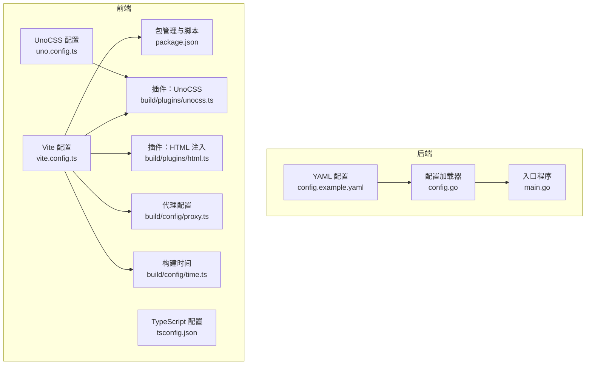
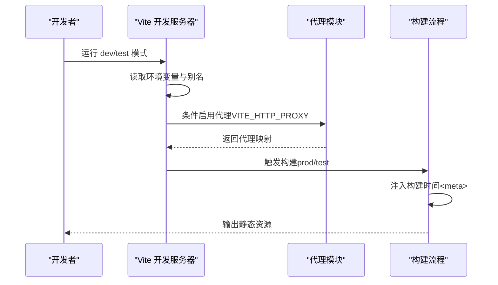
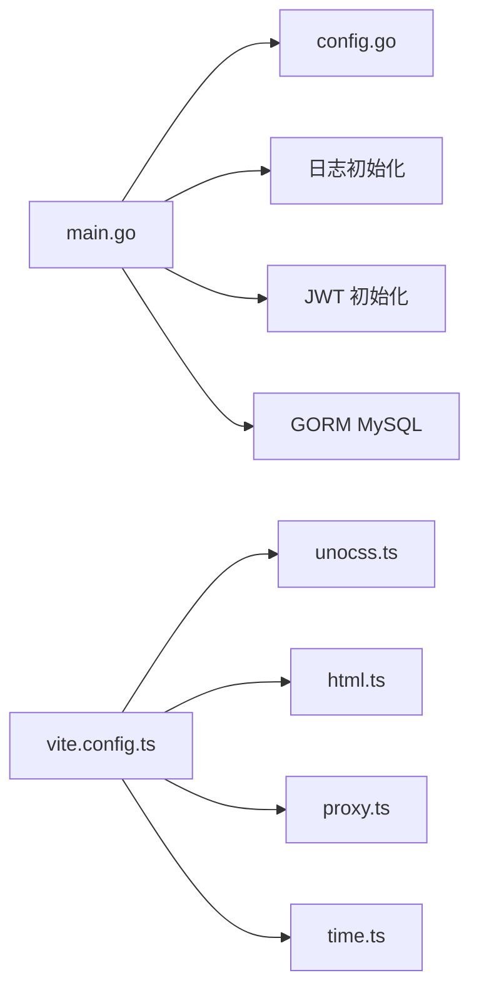

# 应用配置

<cite>
**本文引用的文件**
- [config.example.yaml](file://app/server/configs/config.example.yaml)
- [config.go](file://app/server/pkg/config/config.go)
- [main.go](file://app/server/cmd/api/main.go)
- [vite.config.ts](file://app/web/vite.config.ts)
- [uno.config.ts](file://app/web/uno.config.ts)
- [tsconfig.json](file://app/web/tsconfig.json)
- [package.json](file://app/web/package.json)
- [proxy.ts](file://app/web/build/config/proxy.ts)
- [time.ts](file://app/web/build/config/time.ts)
- [unocss.ts](file://app/web/build/plugins/unocss.ts)
- [html.ts](file://app/web/build/plugins/html.ts)
</cite>

## 目录
1. [简介](#简介)
2. [项目结构](#项目结构)
3. [核心组件](#核心组件)
4. [架构总览](#架构总览)
5. [详细组件分析](#详细组件分析)
6. [依赖分析](#依赖分析)
7. [性能考虑](#性能考虑)
8. [故障排查指南](#故障排查指南)
9. [结论](#结论)
10. [附录](#附录)

## 简介
本文件系统性梳理 boread 应用的配置体系，覆盖后端 Go 配置（YAML）与前端构建配置（Vite、UnoCSS、TypeScript），并给出配置参数说明、默认值参考、开发与生产差异、配置加载顺序与验证建议。目标是帮助开发者快速理解并正确配置本地开发与生产部署环境。

## 项目结构
- 后端配置位于 app/server/configs/config.example.yaml，Go 服务通过 app/server/pkg/config/config.go 解析该 YAML 并在启动时加载。
- 前端构建配置位于 app/web/vite.config.ts、uno.config.ts、tsconfig.json、package.json 及配套的构建插件与工具函数。
- 构建代理、时间戳注入、UnoCSS 图标本地化等能力由 app/web/build 下的模块提供。

图表来源
- [config.example.yaml:1-21](file://app/server/configs/config.example.yaml#L1-L21)
- [config.go:58-66](file://app/server/pkg/config/config.go#L58-L66)
- [main.go:34-42](file://app/server/cmd/api/main.go#L34-L42)
- [vite.config.ts:1-52](file://app/web/vite.config.ts#L1-L52)
- [uno.config.ts:1-27](file://app/web/uno.config.ts#L1-L27)
- [tsconfig.json:1-26](file://app/web/tsconfig.json#L1-L26)
- [package.json:29-44](file://app/web/package.json#L29-L44)
- [unocss.ts:1-33](file://app/web/build/plugins/unocss.ts#L1-L33)
- [html.ts:1-14](file://app/web/build/plugins/html.ts#L1-L14)
- [proxy.ts:1-56](file://app/web/build/config/proxy.ts#L1-L56)
- [time.ts:1-13](file://app/web/build/config/time.ts#L1-L13)

章节来源
- [config.example.yaml:1-21](file://app/server/configs/config.example.yaml#L1-L21)
- [vite.config.ts:1-52](file://app/web/vite.config.ts#L1-L52)
- [uno.config.ts:1-27](file://app/web/uno.config.ts#L1-L27)
- [tsconfig.json:1-26](file://app/web/tsconfig.json#L1-L26)
- [package.json:29-44](file://app/web/package.json#L29-L44)

## 核心组件
本节聚焦两类核心配置：
- 后端 YAML 配置：server、database、jwt、log、meta（元信息提取规则）
- 前端构建配置：Vite、UnoCSS、TypeScript 编译选项、构建脚本与代理

章节来源
- [config.example.yaml:1-21](file://app/server/configs/config.example.yaml#L1-L21)
- [config.go:9-54](file://app/server/pkg/config/config.go#L9-L54)
- [vite.config.ts:7-51](file://app/web/vite.config.ts#L7-L51)
- [uno.config.ts:5-26](file://app/web/uno.config.ts#L5-L26)
- [tsconfig.json:2-25](file://app/web/tsconfig.json#L2-L25)

## 架构总览
后端从 YAML 加载配置，初始化日志、JWT、数据库连接；前端通过 Vite 在开发/生产模式下加载环境变量与插件，按需启用代理、注入构建时间、配置 UnoCSS 与 TypeScript。

图表来源
- [vite.config.ts:7-51](file://app/web/vite.config.ts#L7-L51)
- [proxy.ts:12-28](file://app/web/build/config/proxy.ts#L12-L28)
- [html.ts:3-9](file://app/web/build/plugins/html.ts#L3-L9)

## 详细组件分析

### 后端配置（YAML）
- server
  - port：监听端口，默认示例为 8080
  - mode：运行模式，示例为 debug
- database
  - driver：数据库驱动，示例为 mysql
  - host/port/username/password/dbname：数据库连接参数
  - max_idle_conns/max_open_conns：连接池参数
- jwt
  - secret：JWT 密钥
  - expire：过期间秒数
- log
  - level：日志级别
  - file：日志文件路径
- meta.rules：元信息提取规则数组，用于解析书籍元数据（名称、正则、标题/作者分组、来源、优先级）

加载与使用流程
- main.go 中调用 config.Load 读取 configs/config.yaml，并初始化日志、JWT、数据库连接池
- 日志与 JWT 初始化分别使用配置中的 level/file 与 secret/expire
- 数据库 DSN 组装后以 gorm 打开连接，并设置连接池上限与空闲数

章节来源
- [config.example.yaml:1-21](file://app/server/configs/config.example.yaml#L1-L21)
- [config.go:9-54](file://app/server/pkg/config/config.go#L9-L54)
- [main.go:34-65](file://app/server/cmd/api/main.go#L34-L65)

### 前端构建配置（Vite）
- 基础路径与别名
  - base：来自 VITE_BASE_URL 环境变量
  - alias：~ 指向项目根目录，@ 指向 src
- CSS 预处理
  - SCSS 使用 modern-compiler，自动注入全局样式
- 插件体系
  - Vue、JSX、进度条、过渡根校验、路由生成、UnoCSS、通用插件集、HTML 元信息注入
- 服务器与预览
  - 本地开发 host=0.0.0.0、port=9527、自动打开浏览器
  - 预览 port=9725
- 构建行为
  - 关闭压缩体积报告，按 VITE_SOURCE_MAP 决定是否生成 SourceMap
  - CommonJS 选项忽略 try/catch 规则
- 定义全局常量
  - BUILD_TIME：构建时间字符串

章节来源
- [vite.config.ts:7-51](file://app/web/vite.config.ts#L7-L51)
- [package.json:29-44](file://app/web/package.json#L29-L44)

### UnoCSS 原子化样式配置
- 内容扫描排除 node_modules 与 dist
- 主题扩展：合并主题变量，新增图标字号规范
- 快捷方式：如卡片容器样式
- 转换器：指令与变体分组
- 预设：Wind（含暗色模式 class 策略）与 SoybeanAdmin 预设

章节来源
- [uno.config.ts:5-26](file://app/web/uno.config.ts#L5-L26)

### TypeScript 编译配置
- 目标与模块：ESNext、bundler
- 路径别名：@ 指向 src，~ 指向项目根
- 严格模式：开启严格与空值检查
- 类型声明：Vite、Node、图标类型、Naive UI 的 Volar 支持
- 包含范围：所有 .ts/.tsx/.vue 文件，排除 node_modules 与 dist

章节来源
- [tsconfig.json:2-25](file://app/web/tsconfig.json#L2-L25)

### 构建代理（Vite Proxy）
- 条件启用：仅在 serve 模式且未 preview 时，且 VITE_HTTP_PROXY='Y'
- 动态生成：根据服务配置与通配前缀生成代理映射
- 日志开关：VITE_PROXY_LOG='Y' 时输出请求与错误日志
- 重写规则：移除代理前缀，转发到真实目标

章节来源
- [proxy.ts:12-55](file://app/web/build/config/proxy.ts#L12-L55)

### 构建时间注入
- 使用 dayjs 设置时区为 Asia/Shanghai，格式化为“年-月-日 时:分:秒”
- 通过 HTML 插件在 index.html 的 <head> 中注入 <meta name="buildTime">

章节来源
- [time.ts:5-12](file://app/web/build/config/time.ts#L5-L12)
- [html.ts:3-9](file://app/web/build/plugins/html.ts#L3-L9)

### UnoCSS 本地图标加载
- 本地图标集合：src/assets/svg-icon
- 通过 FileSystemIconLoader 加载 SVG，并统一宽高属性
- 集合命名来源于 VITE_ICON_LOCAL_PREFIX（去除 VITE_ICON_PREFIX 前缀）

章节来源
- [unocss.ts:7-31](file://app/web/build/plugins/unocss.ts#L7-L31)

## 依赖分析
- 后端
  - main.go 依赖 config.Load 与 Cfg，进而初始化日志、JWT、数据库
  - 数据库连接使用 gorm+mysql 驱动
- 前端
  - vite.config.ts 依赖构建插件与工具函数
  - UnoCSS 依赖主题变量与本地图标加载
  - 代理依赖服务配置生成器

图表来源
- [main.go:34-65](file://app/server/cmd/api/main.go#L34-L65)
- [config.go:58-66](file://app/server/pkg/config/config.go#L58-L66)
- [vite.config.ts:30-33](file://app/web/vite.config.ts#L30-L33)
- [unocss.ts:15-31](file://app/web/build/plugins/unocss.ts#L15-L31)
- [html.ts:3-9](file://app/web/build/plugins/html.ts#L3-L9)
- [proxy.ts:12-28](file://app/web/build/config/proxy.ts#L12-L28)
- [time.ts:5-12](file://app/web/build/config/time.ts#L5-L12)

章节来源
- [main.go:34-65](file://app/server/cmd/api/main.go#L34-L65)
- [vite.config.ts:30-33](file://app/web/vite.config.ts#L30-L33)

## 性能考虑
- 前端构建
  - 关闭压缩体积报告可减少构建输出噪声，但不改变产物大小
  - SourceMap 仅在需要调试时开启，避免生产环境额外体积
  - CommonJS 选项保持默认，避免过度优化导致兼容性问题
- 后端数据库
  - 连接池参数（最大空闲/最大并发）应结合业务峰值与数据库承载能力调整
  - GORM 日志级别已设为 Warn，有助于降低生产日志压力

章节来源
- [vite.config.ts:43-49](file://app/web/vite.config.ts#L43-L49)
- [main.go:52-54](file://app/server/cmd/api/main.go#L52-L54)

## 故障排查指南
- 后端配置加载失败
  - 症状：启动时报“Failed to load config”
  - 排查：确认 configs/config.yaml 存在且可读；字段拼写与类型匹配
- 数据库连接失败
  - 症状：启动时报“Failed to connect database”
  - 排查：核对 host/port/username/password/dbname；确认数据库可达与账号权限
- JWT 初始化异常
  - 症状：鉴权相关报错
  - 排查：确认 secret 非默认值且长度足够；expire 合理
- 日志文件无法写入
  - 症状：日志未落盘或报权限错误
  - 排查：确认 log.file 路径存在且进程有写权限
- 前端代理未生效
  - 症状：开发时接口 404 或跨域
  - 排查：确认 VITE_HTTP_PROXY='Y' 且代理前缀与服务配置一致；查看代理日志开关
- UnoCSS 图标缺失
  - 症状：图标类名无效
  - 排查：确认本地图标目录存在；VITE_ICON_LOCAL_PREFIX 与集合命名一致

章节来源
- [main.go:34-42](file://app/server/cmd/api/main.go#L34-L42)
- [config.example.yaml:5-21](file://app/server/configs/config.example.yaml#L5-L21)
- [proxy.ts:12-28](file://app/web/build/config/proxy.ts#L12-L28)
- [unocss.ts:10-13](file://app/web/build/plugins/unocss.ts#L10-L13)

## 结论
boread 的配置体系清晰地划分为后端 YAML 与前端 Vite/UnoCSS/TS 三部分。后端通过单一配置文件集中管理服务、数据库、JWT、日志与元信息规则；前端通过多模块插件实现代理、图标、主题与构建时间注入。遵循本文档的参数说明、默认值参考与差异对比，可快速完成本地与生产的正确配置。

## 附录

### 后端配置参数说明与默认值参考
- server
  - port：整数；默认示例 8080
  - mode：字符串；默认示例 debug
- database
  - driver：字符串；默认示例 mysql
  - host/port/username/password/dbname：字符串/整数；默认示例见示例文件
  - max_idle_conns/max_open_conns：整数；默认示例见示例文件
- jwt
  - secret：字符串；默认示例为占位符，需替换
  - expire：整数（秒）；默认示例 7200
- log
  - level：字符串；默认示例 info
  - file：字符串；默认示例 logs/boread.log
- meta.rules：数组；每项包含 name、pattern、titleGroup、authorGroup、source、priority

章节来源
- [config.example.yaml:1-21](file://app/server/configs/config.example.yaml#L1-L21)
- [config.go:9-54](file://app/server/pkg/config/config.go#L9-L54)

### 前端构建配置参数说明与默认值参考
- Vite 基础
  - base：来自 VITE_BASE_URL；默认未设置
  - 别名：~ 指向项目根，@ 指向 src
  - host/port/open：默认 host=0.0.0.0、port=9527、open=true
  - preview.port：默认 9725
- CSS
  - SCSS：modern-compiler，自动注入全局样式
- 插件
  - Vue、JSX、进度条、过渡根校验、路由生成、UnoCSS、通用插件集、HTML 注入
- 构建
  - reportCompressedSize=false、sourcemap=VITE_SOURCE_MAP=='Y'
  - commonjsOptions.ignoreTryCatch=false
- 环境变量（常用）
  - VITE_BASE_URL：基础路径
  - VITE_HTTP_PROXY='Y'：启用代理
  - VITE_PROXY_LOG='Y'：代理日志
  - VITE_SOURCE_MAP='Y'：生成 SourceMap
  - VITE_ICON_PREFIX：图标前缀
  - VITE_ICON_LOCAL_PREFIX：本地图标集合前缀

章节来源
- [vite.config.ts:14-49](file://app/web/vite.config.ts#L14-L49)
- [package.json:29-44](file://app/web/package.json#L29-L44)
- [proxy.ts:12-28](file://app/web/build/config/proxy.ts#L12-L28)
- [unocss.ts:7-31](file://app/web/build/plugins/unocss.ts#L7-L31)
- [html.ts:3-9](file://app/web/build/plugins/html.ts#L3-L9)

### 开发模式与生产模式差异
- 开发模式
  - Vite 默认使用 test 模式（脚本 dev/test），自动打开浏览器，启用代理与日志（可选）
- 生产模式
  - Vite 默认使用 prod 模式（脚本 build），关闭压缩体积报告，按需生成 SourceMap

章节来源
- [package.json:35-36](file://app/web/package.json#L35-L36)
- [package.json:30-31](file://app/web/package.json#L30-L31)
- [vite.config.ts:43-49](file://app/web/vite.config.ts#L43-L49)

### 配置加载顺序与验证建议
- 后端
  - 顺序：读取 YAML → 反序列化为结构体 → 初始化日志/JWT/数据库
  - 建议：启动前先校验 YAML 语法与字段类型；数据库连通性测试；日志目录可写
- 前端
  - 顺序：读取 .env.* → Vite 加载配置与插件 → 构建/预览
  - 建议：代理前缀与后端路由一致；图标集合命名与本地目录匹配；生产构建前核对 SourceMap 与产物

章节来源
- [config.go:58-66](file://app/server/pkg/config/config.go#L58-L66)
- [main.go:34-42](file://app/server/cmd/api/main.go#L34-L42)
- [vite.config.ts:7-8](file://app/web/vite.config.ts#L7-L8)