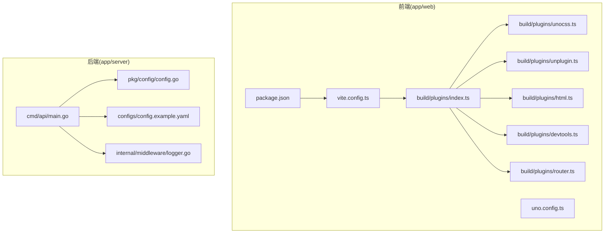
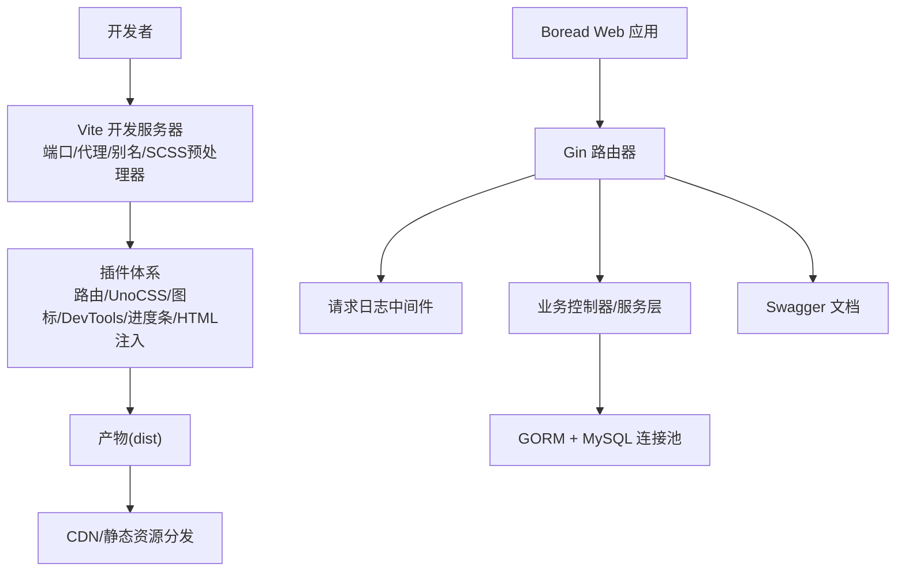
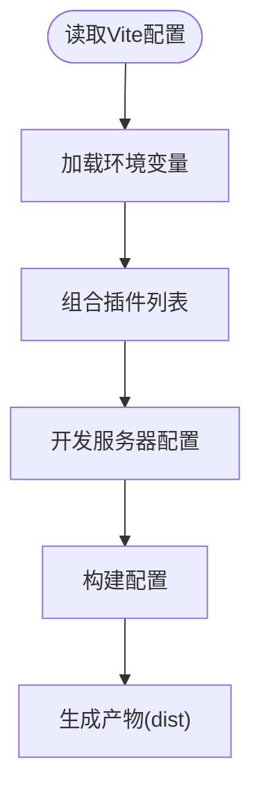
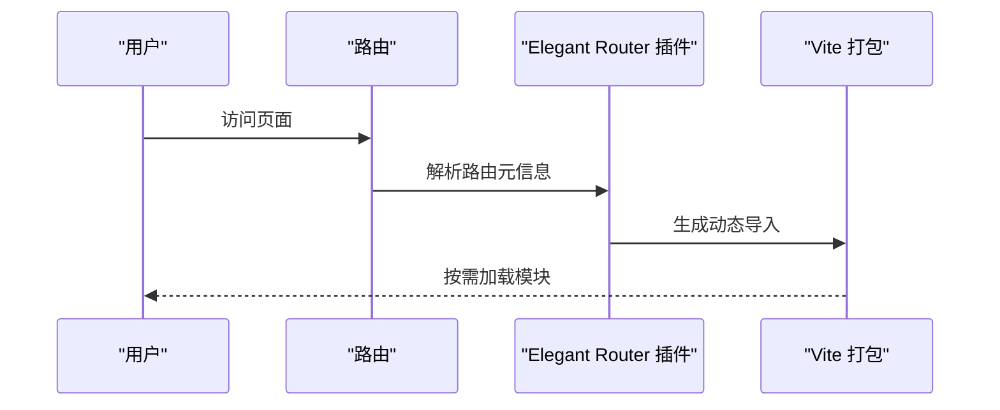
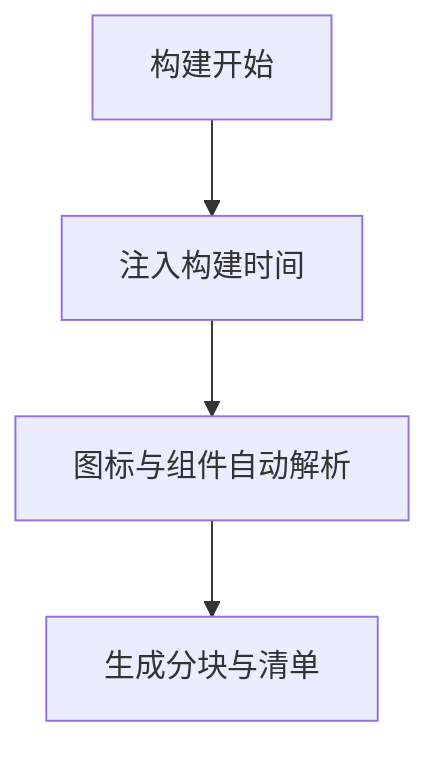
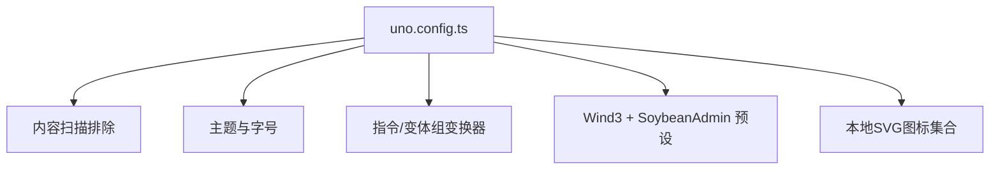
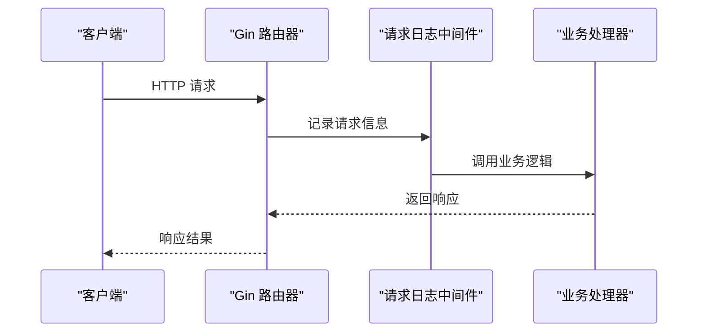
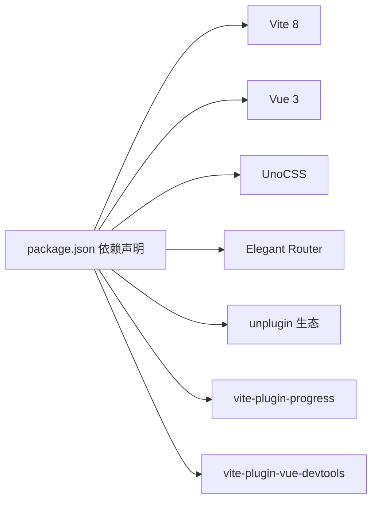

# 性能配置

<cite>
**本文引用的文件**
- [vite.config.ts](file://app/web/vite.config.ts)
- [uno.config.ts](file://app/web/uno.config.ts)
- [plugins/index.ts](file://app/web/build/plugins/index.ts)
- [plugins/unocss.ts](file://app/web/build/plugins/unocss.ts)
- [plugins/unplugin.ts](file://app/web/build/plugins/unplugin.ts)
- [plugins/html.ts](file://app/web/build/plugins/html.ts)
- [plugins/devtools.ts](file://app/web/build/plugins/devtools.ts)
- [plugins/router.ts](file://app/web/build/plugins/router.ts)
- [package.json](file://app/web/package.json)
- [main.go](file://app/server/cmd/api/main.go)
- [config.go](file://app/server/pkg/config/config.go)
- [config.example.yaml](file://app/server/configs/config.example.yaml)
- [logger.go](file://app/server/internal/middleware/logger.go)
</cite>

## 目录
1. [简介](#简介)
2. [项目结构](#项目结构)
3. [核心组件](#核心组件)
4. [架构总览](#架构总览)
5. [详细组件分析](#详细组件分析)
6. [依赖分析](#依赖分析)
7. [性能考量](#性能考量)
8. [故障排查指南](#故障排查指南)
9. [结论](#结论)
10. [附录](#附录)

## 简介
本文件聚焦于boread项目的性能配置与优化实践，覆盖前端构建优化（Vite压缩、代码分割、懒加载、预加载策略）、UnoCSS原子化样式与Tree Shaking、后端Gin中间件与日志、数据库连接池、并发与内存管理等，并给出缓存、CDN、负载均衡、监控指标与性能基准测试的落地建议。内容以仓库现有实现为依据，避免臆测，便于不同技术背景的读者理解与实施。

## 项目结构
- 前端位于 app/web，采用Vite 8 + Vue 3 + TypeScript + UnoCSS + Elegant Router 架构，构建脚本通过package.json统一管理。
- 后端位于 app/server，使用Go语言、Gin框架、GORM访问MySQL，配置通过YAML文件集中管理。

图表来源
- [vite.config.ts:1-52](file://app/web/vite.config.ts#L1-L52)
- [uno.config.ts:1-27](file://app/web/uno.config.ts#L1-L27)
- [plugins/index.ts:1-27](file://app/web/build/plugins/index.ts#L1-L27)
- [plugins/unocss.ts:1-33](file://app/web/build/plugins/unocss.ts#L1-L33)
- [plugins/unplugin.ts:1-48](file://app/web/build/plugins/unplugin.ts#L1-L48)
- [plugins/html.ts:1-14](file://app/web/build/plugins/html.ts#L1-L14)
- [plugins/devtools.ts:1-10](file://app/web/build/plugins/devtools.ts#L1-L10)
- [plugins/router.ts:1-42](file://app/web/build/plugins/router.ts#L1-L42)
- [package.json:1-108](file://app/web/package.json#L1-L108)
- [main.go:1-85](file://app/server/cmd/api/main.go#L1-L85)
- [config.go:1-66](file://app/server/pkg/config/config.go#L1-L66)
- [config.example.yaml:1-21](file://app/server/configs/config.example.yaml#L1-L21)
- [logger.go:1-29](file://app/server/internal/middleware/logger.go#L1-L29)

章节来源
- [vite.config.ts:1-52](file://app/web/vite.config.ts#L1-L52)
- [package.json:1-108](file://app/web/package.json#L1-L108)
- [main.go:1-85](file://app/server/cmd/api/main.go#L1-L85)

## 核心组件
- 前端构建与优化：Vite配置、插件体系（路由、UnoCSS、图标组件自动注册、DevTools、进度条、HTML元信息注入）。
- UnoCSS原子化样式：主题变量、指令与变体转换器、本地图标集合、内容扫描排除。
- 后端性能：Gin中间件（请求日志）、GORM数据库连接池、日志级别、JWT初始化、路由启动。

章节来源
- [vite.config.ts:1-52](file://app/web/vite.config.ts#L1-L52)
- [uno.config.ts:1-27](file://app/web/uno.config.ts#L1-L27)
- [plugins/index.ts:1-27](file://app/web/build/plugins/index.ts#L1-L27)
- [plugins/unocss.ts:1-33](file://app/web/build/plugins/unocss.ts#L1-L33)
- [plugins/unplugin.ts:1-48](file://app/web/build/plugins/unplugin.ts#L1-L48)
- [plugins/html.ts:1-14](file://app/web/build/plugins/html.ts#L1-L14)
- [plugins/devtools.ts:1-10](file://app/web/build/plugins/devtools.ts#L1-L10)
- [plugins/router.ts:1-42](file://app/web/build/plugins/router.ts#L1-L42)
- [main.go:1-85](file://app/server/cmd/api/main.go#L1-L85)
- [config.go:1-66](file://app/server/pkg/config/config.go#L1-L66)
- [config.example.yaml:1-21](file://app/server/configs/config.example.yaml#L1-L21)
- [logger.go:1-29](file://app/server/internal/middleware/logger.go#L1-L29)

## 架构总览
前端通过Vite进行开发与生产构建，插件链路负责路由、UnoCSS、图标组件、HTML元信息与开发工具集成；后端通过Gin承载HTTP服务，结合GORM与MySQL，配置文件集中管理服务器、数据库、JWT与日志参数。

图表来源
- [vite.config.ts:1-52](file://app/web/vite.config.ts#L1-L52)
- [plugins/index.ts:1-27](file://app/web/build/plugins/index.ts#L1-L27)
- [plugins/unocss.ts:1-33](file://app/web/build/plugins/unocss.ts#L1-L33)
- [plugins/unplugin.ts:1-48](file://app/web/build/plugins/unplugin.ts#L1-L48)
- [plugins/html.ts:1-14](file://app/web/build/plugins/html.ts#L1-L14)
- [plugins/devtools.ts:1-10](file://app/web/build/plugins/devtools.ts#L1-L10)
- [plugins/router.ts:1-42](file://app/web/build/plugins/router.ts#L1-L42)
- [main.go:1-85](file://app/server/cmd/api/main.go#L1-L85)
- [logger.go:1-29](file://app/server/internal/middleware/logger.go#L1-L29)

## 详细组件分析

### 前端构建优化（Vite）
- 基础路径与别名：设置基础路径与路径别名，提升开发体验与打包一致性。
- SCSS预处理器：启用现代编译API并注入全局样式，减少重复引入。
- 插件体系：按需启用Vue/VueJSX、Elegant Router、UnoCSS、图标组件自动解析、SVG图标、DevTools、进度条、HTML元信息注入与根过渡校验。
- 服务器与预览：开发服务器绑定0.0.0.0、默认端口、自动打开浏览器；预览端口独立。
- 构建配置：关闭打包体积报告（可选开启）、按环境变量控制SourceMap、CommonJS选项。

图表来源
- [vite.config.ts:1-52](file://app/web/vite.config.ts#L1-L52)
- [plugins/index.ts:1-27](file://app/web/build/plugins/index.ts#L1-L27)

章节来源
- [vite.config.ts:1-52](file://app/web/vite.config.ts#L1-L52)
- [plugins/index.ts:1-27](file://app/web/build/plugins/index.ts#L1-L27)

### 代码分割与懒加载
- 路由级懒加载：Elegant Router插件在路由层面生成动态导入，结合路由元信息，实现页面级代码分割与按需加载。
- 组件级懒加载：通过unplugin-vue-components自动解析与按需注册，减少初始包体。

图表来源
- [plugins/router.ts:1-42](file://app/web/build/plugins/router.ts#L1-L42)
- [plugins/index.ts:1-27](file://app/web/build/plugins/index.ts#L1-L27)

章节来源
- [plugins/router.ts:1-42](file://app/web/build/plugins/router.ts#L1-L42)
- [plugins/index.ts:1-27](file://app/web/build/plugins/index.ts#L1-L27)

### 预加载策略
- HTML注入构建时间：通过HTML插件在<head>中注入构建时间元信息，便于版本追踪与缓存失效控制。
- 图标与组件按需加载：本地SVG图标集合与图标组件自动解析，减少未使用资源进入产物。

图表来源
- [plugins/html.ts:1-14](file://app/web/build/plugins/html.ts#L1-L14)
- [plugins/unplugin.ts:1-48](file://app/web/build/plugins/unplugin.ts#L1-L48)
- [plugins/unocss.ts:1-33](file://app/web/build/plugins/unocss.ts#L1-L33)

章节来源
- [plugins/html.ts:1-14](file://app/web/build/plugins/html.ts#L1-L14)
- [plugins/unplugin.ts:1-48](file://app/web/build/plugins/unplugin.ts#L1-L48)
- [plugins/unocss.ts:1-33](file://app/web/build/plugins/unocss.ts#L1-L33)

### UnoCSS原子化样式与Tree Shaking
- 内容扫描排除：排除node_modules与dist，避免扫描到第三方与构建产物，提升扫描效率。
- 主题与字号：合并主题变量与自定义字号，统一设计系统。
- 变换器：启用指令与变体组变换器，支持复杂选择器与条件类。
- 本地图标集合：从本地assets目录加载SVG图标，作为UnoCSS集合使用，减少外部依赖。
- Tree Shaking：通过内容扫描与按需使用，确保未使用的原子类不进入产物。

图表来源
- [uno.config.ts:1-27](file://app/web/uno.config.ts#L1-L27)
- [plugins/unocss.ts:1-33](file://app/web/build/plugins/unocss.ts#L1-L33)
- [plugins/unplugin.ts:1-48](file://app/web/build/plugins/unplugin.ts#L1-L48)

章节来源
- [uno.config.ts:1-27](file://app/web/uno.config.ts#L1-L27)
- [plugins/unocss.ts:1-33](file://app/web/build/plugins/unocss.ts#L1-L33)
- [plugins/unplugin.ts:1-48](file://app/web/build/plugins/unplugin.ts#L1-L48)

### 后端性能配置（Gin/GORM）
- 中间件：内置请求日志中间件，记录状态码、耗时、方法与路径，便于性能观测与问题定位。
- 日志级别：通过配置文件控制日志级别与输出文件，生产环境建议调整至info或warn。
- 数据库连接池：设置最大空闲连接数与最大打开连接数，平衡并发与资源占用。
- JWT：集中初始化密钥与过期时间，保障鉴权性能与安全。
- 路由与启动：统一路由装配与端口监听，便于容器化部署与反向代理接入。

图表来源
- [main.go:1-85](file://app/server/cmd/api/main.go#L1-L85)
- [logger.go:1-29](file://app/server/internal/middleware/logger.go#L1-L29)
- [config.go:1-66](file://app/server/pkg/config/config.go#L1-L66)
- [config.example.yaml:1-21](file://app/server/configs/config.example.yaml#L1-L21)

章节来源
- [main.go:1-85](file://app/server/cmd/api/main.go#L1-L85)
- [logger.go:1-29](file://app/server/internal/middleware/logger.go#L1-L29)
- [config.go:1-66](file://app/server/pkg/config/config.go#L1-L66)
- [config.example.yaml:1-21](file://app/server/configs/config.example.yaml#L1-L21)

## 依赖分析
- 前端依赖：Vite 8、Vue 3、UnoCSS、Elegant Router、unplugin生态（图标、组件自动解析）、vite-plugin-progress、vite-plugin-vue-devtools等。
- 后端依赖：Gin、GORM、MySQL驱动、Swagger文档、自定义配置与日志包。

图表来源
- [package.json:1-108](file://app/web/package.json#L1-L108)

章节来源
- [package.json:1-108](file://app/web/package.json#L1-L108)

## 性能考量
- 前端构建
  - 压缩与体积：当前未显式开启打包体积报告与压缩配置，建议在生产模式下启用压缩与体积报告，配合分块与懒加载降低首屏体积。
  - SourceMap：按需开启，开发阶段开启有助于调试，生产阶段建议关闭以减小体积。
  - 代码分割：路由与组件按需加载已具备基础能力，建议进一步拆分第三方库与业务模块，结合动态导入实现更细粒度的分块。
  - 预加载：可考虑在关键路由或页面上使用<link rel="prefetch">或<link rel="modulepreload">，加速后续导航。
- UnoCSS
  - 内容扫描：保持对node_modules与dist的排除，避免无效扫描；合理组织原子类使用，减少未使用类进入产物。
  - 图标与组件：本地SVG图标与自动组件解析减少冗余资源，建议统一图标命名规范与尺寸。
- 后端
  - 中间件：请求日志中间件开销较低，但建议在高并发场景下评估日志落盘性能，必要时采用异步日志或采样。
  - 数据库连接池：根据QPS与数据库性能调优max_idle_conns与max_open_conns，避免连接不足或过度占用。
  - 并发与内存：Gin默认并发模型良好，建议结合GOMAXPROCS与GC参数在容器环境中进行调优。
  - 缓存：可在业务层引入Redis缓存热点数据，减少数据库压力；静态资源通过CDN分发。
  - 负载均衡：建议使用反向代理（如Nginx/HAProxy）做多实例负载均衡与TLS终止。
  - 监控指标：建议接入Prometheus/Grafana或APM工具，采集请求延迟、错误率、并发数与数据库连接数等指标。
  - 基准测试：建议使用wrk/vegeta等工具进行接口压测，结合CPU/内存/网络监控评估瓶颈。

## 故障排查指南
- 前端
  - 构建失败：检查Vite与插件版本兼容性，确认环境变量与别名配置正确。
  - UnoCSS样式异常：核对内容扫描排除规则与主题变量，确认本地图标集合路径与命名一致。
  - 路由懒加载失败：检查Elegant Router生成的动态导入路径与路由元信息。
- 后端
  - 启动失败：检查配置文件路径与字段，确认数据库DSN与连接池参数。
  - 日志异常：核对日志级别与输出文件权限，确保日志中间件顺序正确。
  - 数据库连接问题：检查max_idle_conns与max_open_conns是否与数据库最大连接数匹配。

章节来源
- [vite.config.ts:1-52](file://app/web/vite.config.ts#L1-L52)
- [uno.config.ts:1-27](file://app/web/uno.config.ts#L1-L27)
- [plugins/router.ts:1-42](file://app/web/build/plugins/router.ts#L1-L42)
- [main.go:1-85](file://app/server/cmd/api/main.go#L1-L85)
- [logger.go:1-29](file://app/server/internal/middleware/logger.go#L1-L29)
- [config.go:1-66](file://app/server/pkg/config/config.go#L1-L66)
- [config.example.yaml:1-21](file://app/server/configs/config.example.yaml#L1-L21)

## 结论
boread项目在前端侧已具备良好的构建与样式基础设施，在后端侧通过Gin与GORM提供了清晰的性能配置入口。建议在生产环境中补充前端压缩与体积报告、细化代码分割与预加载策略，并完善后端缓存、CDN、负载均衡与监控指标体系，以获得更稳健的性能表现与可观测性。

## 附录
- 建议的生产构建增强项
  - 在Vite构建配置中启用压缩与体积报告，按需开启SourceMap。
  - 对第三方库进行明确的动态导入与分块，减少首屏依赖。
  - 使用prefetch/modulepreload优化关键页面的二次访问速度。
- 建议的后端生产增强项
  - 引入Redis缓存热点数据，设置合理的TTL与降级策略。
  - 通过CDN分发静态资源，结合HTTP缓存头与ETag。
  - 使用反向代理实现多实例负载均衡与健康检查。
  - 接入Prometheus/Grafana或APM工具，建立关键指标看板。
  - 使用wrk/vegeta进行定期压测，形成性能基线与回归测试。