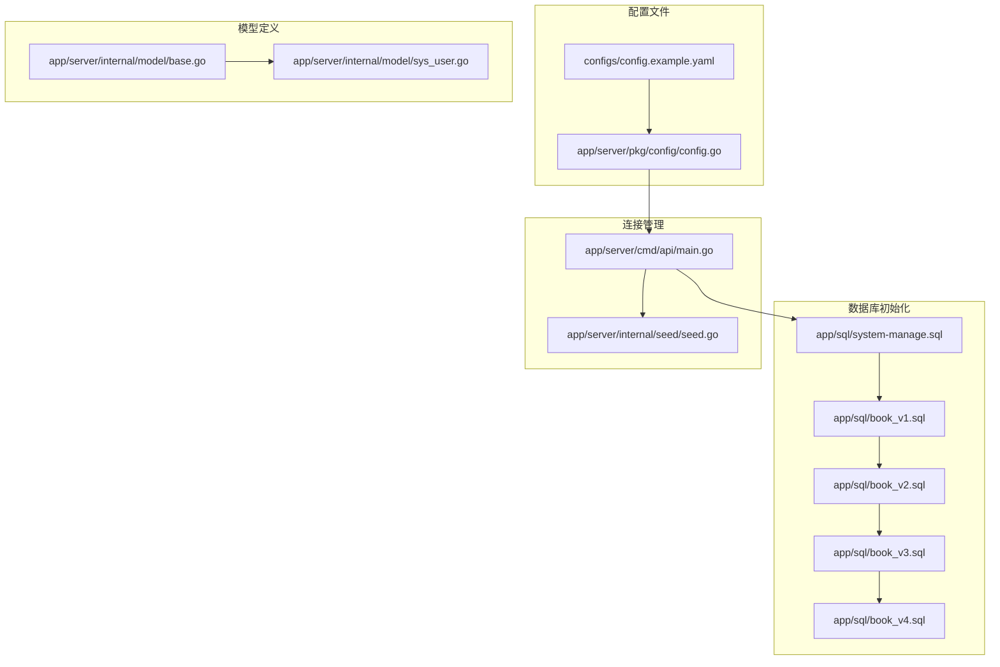
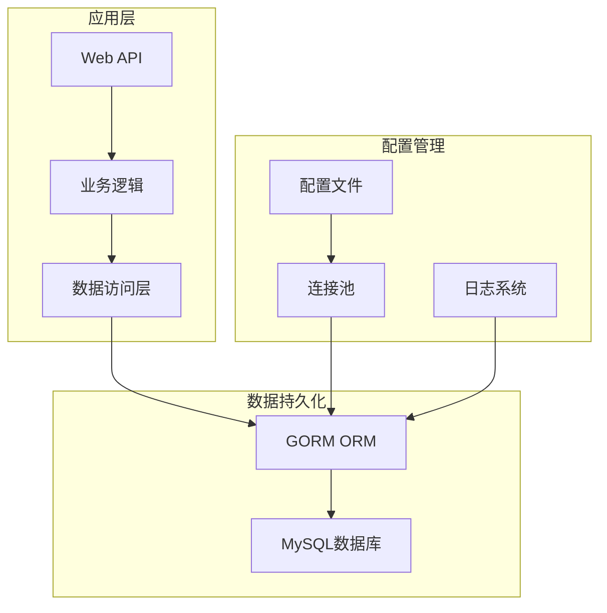
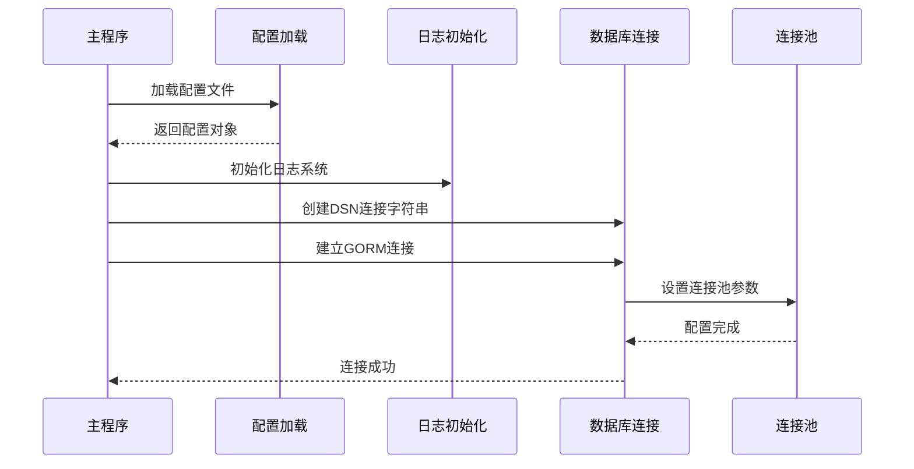
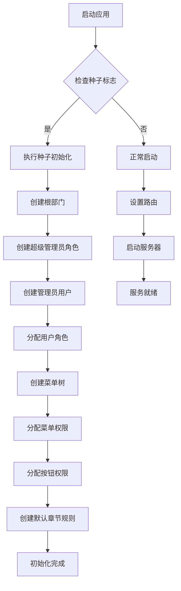
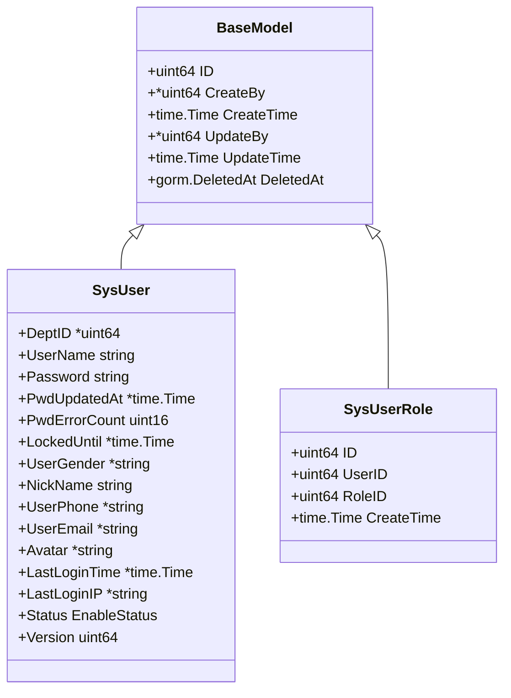
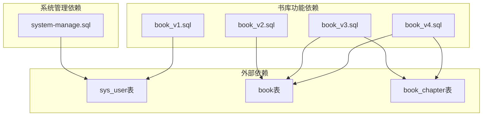

# 数据库配置

<cite>
**本文档引用的文件**
- [main.go](file://app/server/cmd/api/main.go)
- [config.go](file://app/server/pkg/config/config.go)
- [config.example.yaml](file://app/server/configs/config.example.yaml)
- [book_v1.sql](file://app/sql/book_v1.sql)
- [book_v2.sql](file://app/sql/book_v2.sql)
- [book_v3.sql](file://app/sql/book_v3.sql)
- [book_v4.sql](file://app/sql/book_v4.sql)
- [system-manage.sql](file://app/sql/system-manage.sql)
- [seed.go](file://app/server/internal/seed/seed.go)
- [base.go](file://app/server/internal/model/base.go)
- [sys_user.go](file://app/server/internal/model/sys_user.go)
</cite>

## 目录
1. [简介](#简介)
2. [项目结构](#项目结构)
3. [核心组件](#核心组件)
4. [架构概览](#架构概览)
5. [详细组件分析](#详细组件分析)
6. [依赖关系分析](#依赖关系分析)
7. [性能考虑](#性能考虑)
8. [故障排除指南](#故障排除指南)
9. [结论](#结论)

## 简介

Boread是一个基于GORM的Go语言小说阅读平台，采用MySQL作为主要数据库存储。本文档详细说明了数据库配置、连接管理、事务隔离级别以及完整的数据库初始化流程。系统支持完整的RBAC权限管理和读者交互功能，包含角色系统、阅读统计、章节管理等多个高级特性。

## 项目结构

Boread项目的数据库相关文件分布如下：



**图表来源**
- [config.example.yaml:1-21](file://app/server/configs/config.example.yaml#L1-L21)
- [config.go:1-66](file://app/server/pkg/config/config.go#L1-L66)
- [main.go:30-85](file://app/server/cmd/api/main.go#L30-L85)

**章节来源**
- [config.example.yaml:1-21](file://app/server/configs/config.example.yaml#L1-L21)
- [config.go:1-66](file://app/server/pkg/config/config.go#L1-L66)
- [main.go:30-85](file://app/server/cmd/api/main.go#L30-L85)

## 核心组件

### 数据库配置结构

系统采用YAML配置文件进行数据库配置，支持以下核心参数：

| 配置项 | 类型 | 默认值 | 描述 |
|--------|------|--------|------|
| server.port | int | 8080 | 服务器监听端口 |
| server.mode | string | debug | 运行模式 |
| database.driver | string | mysql | 数据库驱动 |
| database.host | string | 127.0.0.1 | 数据库主机地址 |
| database.port | int | 3306 | 数据库端口号 |
| database.username | string | your_db_user | 数据库用户名 |
| database.password | string | your_db_password | 数据库密码 |
| database.dbname | string | boread | 数据库名称 |
| database.max_idle_conns | int | 10 | 最大空闲连接数 |
| database.max_open_conns | int | 100 | 最大活跃连接数 |
| jwt.secret | string | change-me-to-a-random-secret | JWT密钥 |
| jwt.expire | int | 7200 | JWT过期时间(秒) |
| log.level | string | info | 日志级别 |
| log.file | string | logs/boread.log | 日志文件路径 |

**章节来源**
- [config.go:35-44](file://app/server/pkg/config/config.go#L35-L44)
- [config.example.yaml:5-13](file://app/server/configs/config.example.yaml#L5-L13)

### 连接字符串配置

系统使用标准的MySQL连接字符串格式：

```mermaid
flowchart TD
A[连接字符串生成] --> B[用户名:密码@tcp(主机:端口)/数据库名]
B --> C[charset=utf8mb4]
B --> D[parseTime=True]
B --> E[loc=Local]
F[DSN参数] --> G[charset: 字符集设置]
F --> H[parseTime: 时间解析]
F --> I[loc: 时区设置]
G --> J[utf8mb4_unicode_ci]
H --> K[支持时间类型]
I --> L[本地时区]
```

**图表来源**
- [main.go:44-50](file://app/server/cmd/api/main.go#L44-L50)

**章节来源**
- [main.go:44-50](file://app/server/cmd/api/main.go#L44-L50)

## 架构概览

Boread采用分层架构设计，数据库层通过GORM ORM框架进行抽象：



**图表来源**
- [main.go:30-85](file://app/server/cmd/api/main.go#L30-L85)
- [config.go:58-66](file://app/server/pkg/config/config.go#L58-L66)

## 详细组件分析

### 数据库连接管理

系统在启动时建立数据库连接，并配置连接池参数：



**图表来源**
- [main.go:34-65](file://app/server/cmd/api/main.go#L34-L65)

#### 连接池参数配置

系统支持以下连接池参数：

| 参数 | 默认值 | 作用 |
|------|--------|------|
| MaxIdleConns | 10 | 最大空闲连接数 |
| MaxOpenConns | 100 | 最大活跃连接数 |
| ConnMaxLifetime | 默认值 | 连接最大生命周期 |
| ConnMaxIdleTime | 默认值 | 连接最大空闲时间 |

**章节来源**
- [main.go:62-64](file://app/server/cmd/api/main.go#L62-L64)
- [config.go:42-43](file://app/server/pkg/config/config.go#L42-L43)

### 数据库初始化流程

系统提供完整的数据库初始化流程，包括基础表结构创建和种子数据插入：



**图表来源**
- [main.go:67-74](file://app/server/cmd/api/main.go#L67-L74)
- [seed.go:14-54](file://app/server/internal/seed/seed.go#L14-L54)

**章节来源**
- [main.go:67-74](file://app/server/cmd/api/main.go#L67-L74)
- [seed.go:14-54](file://app/server/internal/seed/seed.go#L14-L54)

### SQL脚本文件分析

#### system-manage.sql - 系统管理基础表

该脚本创建完整的RBAC权限管理系统，包含以下核心表：

```mermaid
erDiagram
SYS_DEPT {
bigint id PK
bigint parent_id
varchar ancestors
varchar dept_name
varchar dept_code UK
varchar leader
int sort_order
char status
bigint create_by
datetime create_time
bigint update_by
datetime update_time
datetime deleted_at
}
SYS_ROLE {
bigint id PK
varchar role_name
varchar role_code UK
varchar role_desc
char data_scope
tinyint is_system
int sort_order
char status
bigint create_by
datetime create_time
bigint update_by
datetime update_time
datetime deleted_at
}
SYS_USER {
bigint id PK
bigint dept_id FK
varchar user_name UK
varchar password
datetime pwd_updated_at
smallint pwd_error_count
datetime locked_until
char user_gender
varchar nick_name
varchar user_phone
varchar user_email
varchar avatar
datetime last_login_time
varchar last_login_ip
char status
bigint version
bigint create_by
datetime create_time
bigint update_by
datetime update_time
datetime deleted_at
}
SYS_MENU {
bigint id PK
bigint parent_id
char menu_type
varchar menu_name
varchar route_name UK
varchar route_path
varchar component
varchar icon
char icon_type
varchar i18n_key
tinyint keep_alive
tinyint constant
int sort_order
varchar href
tinyint hide_in_menu
varchar active_menu
tinyint multi_tab
int fixed_index_in_tab
json query
tinyint is_system
char status
bigint create_by
datetime create_time
bigint update_by
datetime update_time
datetime deleted_at
}
SYS_DICT {
bigint id PK
varchar dict_name
varchar dict_code UK
varchar dict_desc
tinyint is_system
char status
bigint create_by
datetime create_time
bigint update_by
datetime update_time
datetime deleted_at
}
SYS_DICT_ITEM {
bigint id PK
bigint dict_id FK
varchar item_label
varchar item_value
varchar item_desc
int sort_order
char status
bigint create_by
datetime create_time
bigint update_by
datetime update_time
datetime deleted_at
}
SYS_DEPT ||--o{ SYS_USER : "has"
SYS_USER ||--o{ SYS_USER_ROLE : "has"
SYS_ROLE ||--o{ SYS_USER_ROLE : "has"
SYS_MENU ||--o{ SYS_ROLE_MENU : "has"
SYS_ROLE ||--o{ SYS_ROLE_MENU : "has"
SYS_DICT ||--o{ SYS_DICT_ITEM : "has"
```



**图表来源**
- [system-manage.sql:30-331](file://app/sql/system-manage.sql#L30-L331)

**章节来源**
- [system-manage.sql:20-351](file://app/sql/system-manage.sql#L20-L351)

#### book_v1.sql - 书库核心表

创建书库的基础表结构，包括分类、标签和作品主表：

**章节来源**
- [book_v1.sql:14-137](file://app/sql/book_v1.sql#L14-L137)

#### book_v2.sql - 文件解析与章节管理

实现文件解析和章节管理功能，支持多文件聚合和章节识别：

**章节来源**
- [book_v2.sql:19-163](file://app/sql/book_v2.sql#L19-L163)

#### book_v3.sql - 读者交互功能

实现读者交互功能，包括书架、阅读进度、笔记和评论：

**章节来源**
- [book_v3.sql:19-157](file://app/sql/book_v3.sql#L19-L157)

#### book_v4.sql - 高级特性

添加角色系统和阅读统计功能：

**章节来源**
- [book_v4.sql:18-140](file://app/sql/book_v4.sql#L18-L140)

### 数据模型设计

系统采用统一的BaseModel设计，支持软删除和审计字段：



**图表来源**
- [base.go:14-21](file://app/server/internal/model/base.go#L14-L21)
- [sys_user.go:6-23](file://app/server/internal/model/sys_user.go#L6-L23)

**章节来源**
- [base.go:14-21](file://app/server/internal/model/base.go#L14-L21)
- [sys_user.go:6-23](file://app/server/internal/model/sys_user.go#L6-L23)

## 依赖关系分析

### 数据库依赖关系



**图表来源**
- [book_v1.sql:4-4](file://app/sql/book_v1.sql#L4-L4)
- [book_v2.sql:4-4](file://app/sql/book_v2.sql#L4-L4)
- [book_v3.sql:4-4](file://app/sql/book_v3.sql#L4-L4)
- [book_v4.sql:4-4](file://app/sql/book_v4.sql#L4-L4)

### 连接管理依赖

系统依赖以下关键组件：

| 组件 | 作用 | 版本要求 |
|------|------|----------|
| GORM | ORM框架 | v2.x |
| MySQL驱动 | 数据库驱动 | v1.x |
| YAML解析 | 配置文件解析 | v3.x |
| 日志系统 | 应用日志 | zap |

**章节来源**
- [main.go:9-18](file://app/server/cmd/api/main.go#L9-L18)

## 性能考虑

### 连接池优化

系统提供了灵活的连接池配置选项：

1. **最大连接数控制**: 通过`max_open_conns`参数限制最大活跃连接数
2. **空闲连接管理**: 通过`max_idle_conns`参数控制空闲连接数量
3. **连接生命周期**: 默认使用GORM的连接生命周期管理

### 索引策略

根据表结构分析，系统采用了以下索引策略：

1. **复合索引**: 在book表上建立了(title, author)复合索引用于快速查找
2. **函数索引**: 使用IFNULL函数处理软删除字段的唯一性约束
3. **前缀索引**: 对长文本字段使用前缀索引减少存储空间
4. **唯一索引**: 对业务唯一键建立唯一索引确保数据完整性

### 查询优化建议

1. **慢查询监控**: 建议开启MySQL慢查询日志监控
2. **索引维护**: 定期分析和优化表索引
3. **查询计划**: 使用EXPLAIN分析复杂查询的执行计划
4. **连接复用**: 合理配置连接池参数避免连接争用

## 故障排除指南

### 常见连接问题

1. **连接超时**: 检查网络连接和防火墙设置
2. **认证失败**: 验证用户名密码和权限设置
3. **连接池耗尽**: 调整max_open_conns和max_idle_conns参数
4. **时区问题**: 确认MySQL时区设置与应用一致

### 初始化失败排查

1. **权限不足**: 确保数据库用户具有CREATE权限
2. **字符集不匹配**: 检查数据库字符集设置
3. **表冲突**: 删除现有表结构后重新初始化
4. **版本兼容**: 确认MySQL版本满足脚本要求

### 性能问题诊断

1. **慢查询分析**: 使用SHOW FULL PROCESSLIST查看慢查询
2. **连接监控**: 检查连接池使用情况
3. **索引使用**: 分析查询执行计划确认索引使用
4. **资源监控**: 监控CPU、内存和磁盘I/O使用情况

**章节来源**
- [main.go:55-57](file://app/server/cmd/api/main.go#L55-L57)
- [seed.go:16-54](file://app/server/internal/seed/seed.go#L16-L54)

## 结论

Boread项目的数据库配置展现了现代Go应用的最佳实践：

1. **配置管理**: 采用YAML配置文件，支持环境变量覆盖
2. **连接管理**: 通过GORM ORM提供统一的数据库访问接口
3. **初始化流程**: 提供完整的数据库初始化和种子数据插入机制
4. **性能优化**: 合理的连接池配置和索引策略
5. **可维护性**: 清晰的SQL脚本分层设计和模块化结构

系统支持完整的RBAC权限管理和丰富的读者交互功能，为小说阅读平台提供了坚实的数据基础。通过合理的配置和优化，可以满足高并发场景下的性能需求。