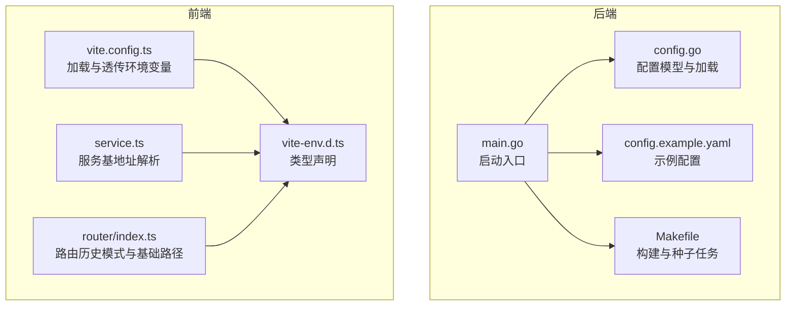
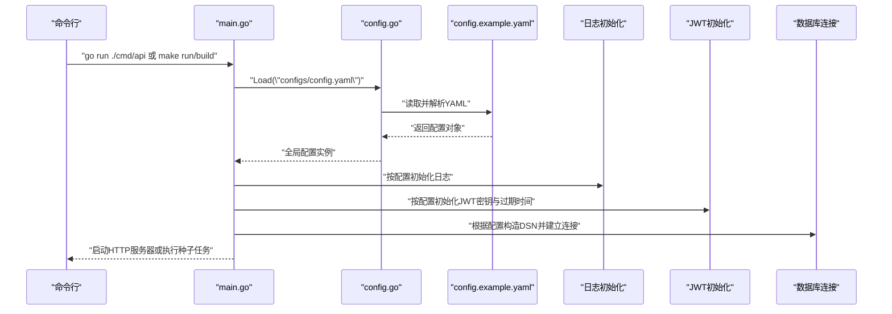
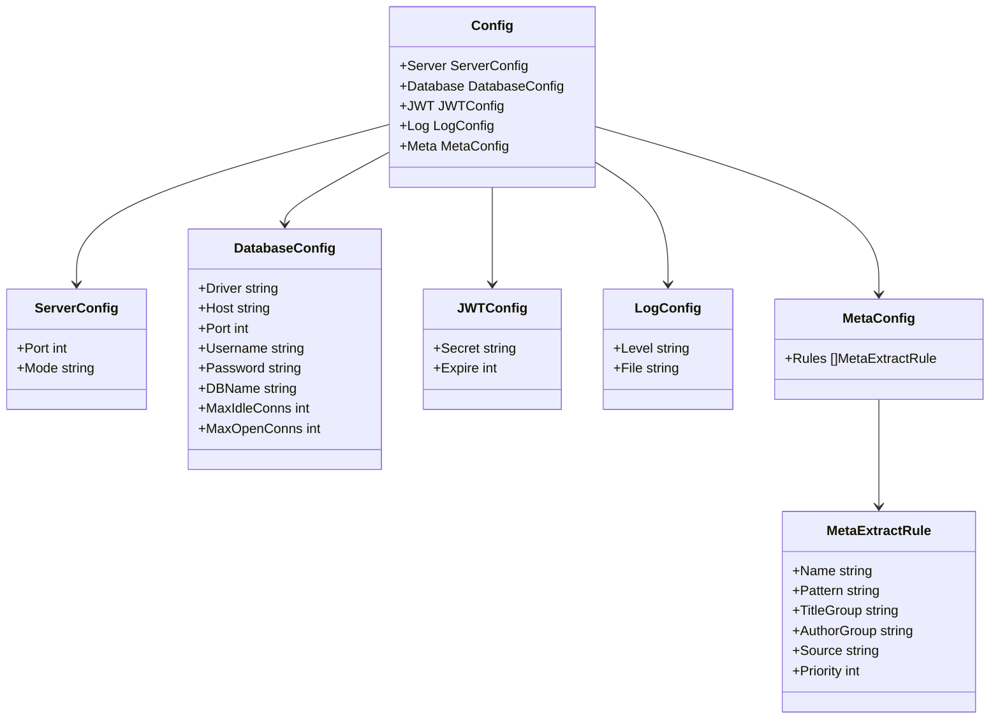
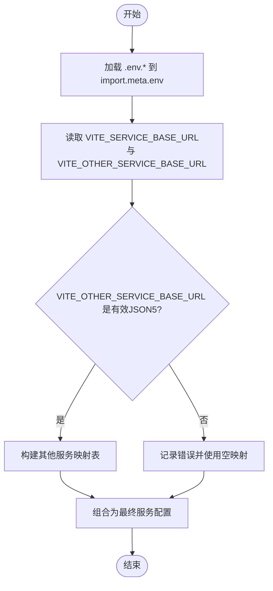
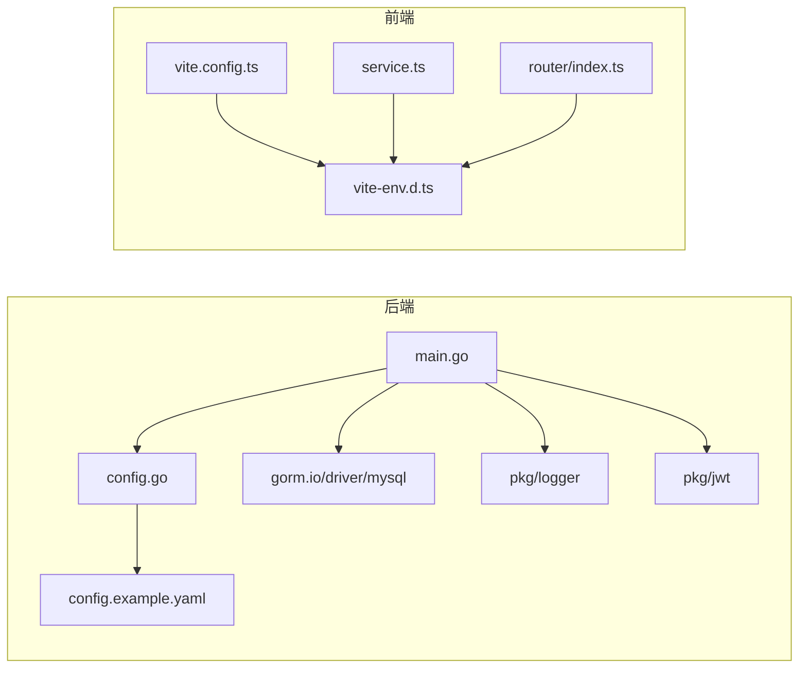

# 环境配置

<cite>
**本文引用的文件**
- [main.go](file://app/server/cmd/api/main.go)
- [config.go](file://app/server/pkg/config/config.go)
- [config.example.yaml](file://app/server/configs/config.example.yaml)
- [Makefile](file://app/server/Makefile)
- [vite.config.ts](file://app/web/vite.config.ts)
- [vite-env.d.ts](file://app/web/src/typings/vite-env.d.ts)
- [service.ts](file://app/web/src/utils/service.ts)
- [index.ts](file://app/web/src/router/index.ts)
</cite>

## 目录
1. [简介](#简介)
2. [项目结构](#项目结构)
3. [核心组件](#核心组件)
4. [架构总览](#架构总览)
5. [详细组件分析](#详细组件分析)
6. [依赖分析](#依赖分析)
7. [性能考虑](#性能考虑)
8. [故障排查指南](#故障排查指南)
9. [结论](#结论)
10. [附录](#附录)

## 简介
本文件系统性梳理 boread 项目的环境配置与管理，覆盖后端 Go 服务与前端 Vite 应用两部分。重点说明以下内容：
- 后端配置文件 config.yaml 的结构与字段含义
- 前端 Vite 环境变量命名规范与使用方式
- 不同运行环境（开发、测试、生产）的配置策略与切换方式
- 敏感信息保护、配置注入机制与最佳实践
- Docker 容器化部署时的环境变量注入
- CI/CD 流水线中的配置管理与密钥处理建议
- 配置加密与解密方案设计思路

## 项目结构
boread 采用前后端分离架构：
- 后端：Go 语言实现，通过 YAML 配置文件加载运行参数；支持命令行种子初始化模式
- 前端：Vite + Vue3，通过 import.meta.env 读取构建期注入的环境变量

图表来源
- [main.go:30-84](file://app/server/cmd/api/main.go#L30-L84)
- [config.go:58-66](file://app/server/pkg/config/config.go#L58-L66)
- [config.example.yaml:1-21](file://app/server/configs/config.example.yaml#L1-L21)
- [Makefile:13-43](file://app/server/Makefile#L13-L43)
- [vite.config.ts:7-51](file://app/web/vite.config.ts#L7-L51)
- [vite-env.d.ts:10-118](file://app/web/src/typings/vite-env.d.ts#L10-L118)
- [service.ts:8-52](file://app/web/src/utils/service.ts#L8-L52)
- [index.ts:12-30](file://app/web/src/router/index.ts#L12-L30)

章节来源
- [main.go:30-84](file://app/server/cmd/api/main.go#L30-L84)
- [config.go:58-66](file://app/server/pkg/config/config.go#L58-L66)
- [config.example.yaml:1-21](file://app/server/configs/config.example.yaml#L1-L21)
- [Makefile:13-43](file://app/server/Makefile#L13-L43)
- [vite.config.ts:7-51](file://app/web/vite.config.ts#L7-L51)
- [vite-env.d.ts:10-118](file://app/web/src/typings/vite-env.d.ts#L10-L118)
- [service.ts:8-52](file://app/web/src/utils/service.ts#L8-L52)
- [index.ts:12-30](file://app/web/src/router/index.ts#L12-L30)

## 核心组件
- 后端配置加载器：负责从 YAML 文件读取配置并初始化日志、JWT、数据库连接等
- 前端环境变量系统：通过 Vite 加载 .env* 文件，以 VITE_* 前缀注入到 import.meta.env
- 构建与种子任务：Makefile 提供 run/build/build-local/test/lint/tidy/clean/swag/seed 等目标

章节来源
- [config.go:58-66](file://app/server/pkg/config/config.go#L58-L66)
- [config.example.yaml:1-21](file://app/server/configs/config.example.yaml#L1-L21)
- [Makefile:13-43](file://app/server/Makefile#L13-L43)
- [vite.config.ts:7-51](file://app/web/vite.config.ts#L7-L51)

## 架构总览
后端启动流程与配置注入关系如下：

图表来源
- [main.go:34-84](file://app/server/cmd/api/main.go#L34-L84)
- [config.go:58-66](file://app/server/pkg/config/config.go#L58-L66)
- [config.example.yaml:1-21](file://app/server/configs/config.example.yaml#L1-L21)

## 详细组件分析

### 后端配置模型与加载
- 配置结构包含 server、database、jwt、log、meta 等模块
- 通过 Load(path) 读取 YAML 并反序列化为全局配置实例
- 启动时用于初始化日志级别与文件、JWT 密钥与过期秒数、数据库连接池参数等

图表来源
- [config.go:9-54](file://app/server/pkg/config/config.go#L9-L54)

章节来源
- [config.go:58-66](file://app/server/pkg/config/config.go#L58-L66)
- [config.example.yaml:1-21](file://app/server/configs/config.example.yaml#L1-L21)

### 前端环境变量与服务基地址解析
- Vite 通过 loadEnv(mode, cwd) 加载 .env.* 文件，将变量注入到 import.meta.env
- 关键变量包括 VITE_SERVICE_BASE_URL、VITE_OTHER_SERVICE_BASE_URL、VITE_BASE_URL、VITE_ROUTER_HISTORY_MODE 等
- 服务基地址解析逻辑会解析 VITE_OTHER_SERVICE_BASE_URL 的 JSON5 字符串，生成多后端服务映射

图表来源
- [vite.config.ts:7-8](file://app/web/vite.config.ts#L7-L8)
- [service.ts:8-52](file://app/web/src/utils/service.ts#L8-L52)
- [vite-env.d.ts:29-68](file://app/web/src/typings/vite-env.d.ts#L29-L68)

章节来源
- [vite.config.ts:7-51](file://app/web/vite.config.ts#L7-L51)
- [vite-env.d.ts:10-118](file://app/web/src/typings/vite-env.d.ts#L10-L118)
- [service.ts:8-52](file://app/web/src/utils/service.ts#L8-L52)

### 路由历史模式与基础路径
- VITE_BASE_URL 作为应用基础路径，影响路由 history/hash/memory 模式下的基准
- VITE_ROUTER_HISTORY_MODE 控制使用 history、hash 还是 memory 模式

章节来源
- [index.ts:12-30](file://app/web/src/router/index.ts#L12-L30)
- [vite-env.d.ts:14-20](file://app/web/src/typings/vite-env.d.ts#L14-L20)

### 构建与种子任务
- make run：本地开发运行
- make build/build-local：交叉/本地构建二进制
- make seed：执行种子初始化后退出
- 构建产物输出至 bin 目录，支持静态链接与精简符号

章节来源
- [Makefile:13-43](file://app/server/Makefile#L13-L43)

## 依赖分析
- 后端依赖
  - 配置加载依赖 YAML 解析库
  - 数据库连接依赖 GORM 与 MySQL 驱动
  - 日志初始化依赖内部日志包
  - JWT 初始化依赖内部 JWT 包
- 前端依赖
  - Vite 环境变量加载
  - JSON5 解析用于多后端服务映射
  - 路由历史模式选择

图表来源
- [main.go:3-19](file://app/server/cmd/api/main.go#L3-L19)
- [config.go:3-7](file://app/server/pkg/config/config.go#L3-L7)
- [config.example.yaml:1-21](file://app/server/configs/config.example.yaml#L1-L21)
- [vite.config.ts:1-52](file://app/web/vite.config.ts#L1-L52)
- [vite-env.d.ts:10-118](file://app/web/src/typings/vite-env.d.ts#L10-L118)
- [service.ts:1-52](file://app/web/src/utils/service.ts#L1-L52)
- [index.ts:1-30](file://app/web/src/router/index.ts#L1-L30)

章节来源
- [main.go:3-19](file://app/server/cmd/api/main.go#L3-L19)
- [config.go:3-7](file://app/server/pkg/config/config.go#L3-L7)
- [vite.config.ts:1-52](file://app/web/vite.config.ts#L1-L52)

## 性能考虑
- 数据库连接池：通过 max_idle_conns 与 max_open_conns 控制并发与资源占用
- 日志级别：在生产环境建议提升到 warn/info，避免过多调试日志影响性能
- 构建优化：启用静态链接与精简符号，减小二进制体积，提升冷启动速度
- 前端构建：按需开启 sourcemap，平衡调试与性能

## 故障排查指南
- 后端无法加载配置
  - 检查 config.yaml 路径是否正确，YAML 格式是否合法
  - 确认配置字段拼写与类型匹配
- 数据库连接失败
  - 核对主机、端口、用户名、密码、数据库名
  - 检查网络连通性与防火墙策略
- JWT 初始化异常
  - 确保 secret 非空且足够随机，过期时间单位为秒
- 前端服务基地址无效
  - 检查 VITE_SERVICE_BASE_URL 与 VITE_OTHER_SERVICE_BASE_URL 是否正确
  - 确认 VITE_OTHER_SERVICE_BASE_URL 为合法 JSON5 字符串
- 路由历史模式问题
  - 检查 VITE_BASE_URL 与部署路径一致，避免 history 模式下刷新 404

章节来源
- [config.go:58-66](file://app/server/pkg/config/config.go#L58-L66)
- [config.example.yaml:1-21](file://app/server/configs/config.example.yaml#L1-L21)
- [service.ts:8-52](file://app/web/src/utils/service.ts#L8-L52)
- [index.ts:12-30](file://app/web/src/router/index.ts#L12-L30)

## 结论
boread 的环境配置体系清晰：后端以 YAML 为中心，前端以 Vite 环境变量为中心。通过合理的配置分层与注入机制，能够满足开发、测试、生产的差异化需求。建议在生产环境中强化敏感信息保护与密钥管理，并结合 CI/CD 实现安全可靠的配置交付。

## 附录

### 环境变量与配置项对照表（后端）
- server.port：服务监听端口
- server.mode：运行模式（如 debug）
- database.host/port/username/password/dbname：数据库连接参数
- database.max_idle_conns/max_open_conns：连接池参数
- jwt.secret：JWT 签名密钥
- jwt.expire：JWT 过期间（秒）
- log.level/file：日志级别与输出文件

章节来源
- [config.example.yaml:1-21](file://app/server/configs/config.example.yaml#L1-L21)
- [config.go:30-54](file://app/server/pkg/config/config.go#L30-L54)

### 环境变量与配置项对照表（前端）
- VITE_SERVICE_BASE_URL：后端主服务基地址
- VITE_OTHER_SERVICE_BASE_URL：其他后端服务映射（JSON5 字符串）
- VITE_BASE_URL：应用基础路径
- VITE_ROUTER_HISTORY_MODE：路由历史模式（history/hash/memory）
- 其他：图标、代理、源码映射、存储前缀等

章节来源
- [vite-env.d.ts:14-113](file://app/web/src/typings/vite-env.d.ts#L14-L113)
- [service.ts:8-52](file://app/web/src/utils/service.ts#L8-L52)
- [index.ts:12-30](file://app/web/src/router/index.ts#L12-L30)

### 不同环境的配置策略与切换方式
- 开发环境（development）
  - 后端：使用 config.example.yaml 的默认值，必要时复制为 config.yaml 并补充本地数据库与 JWT 密钥
  - 前端：通过 .env.development 注入 VITE_* 变量，启用代理与调试功能
- 测试环境（testing）
  - 后端：使用独立的 config.testing.yaml（若存在），或通过环境变量覆盖关键参数
  - 前端：通过 .env.testing 注入测试域名与服务基地址
- 生产环境（production）
  - 后端：使用 config.production.yaml，严格限制日志级别，确保 JWT 密钥安全
  - 前端：通过构建时注入或容器环境变量注入 VITE_*，禁用调试与代理

[本节为通用策略说明，不直接分析具体文件，故无“章节来源”]

### 敏感信息保护与配置注入机制
- 敏感信息保护
  - JWT 密钥与数据库凭据应使用强随机值，定期轮换
  - 在仓库中忽略实际配置文件，仅保留示例模板
- 配置注入机制
  - 后端：通过 YAML 文件与命令行参数注入
  - 前端：通过 Vite loadEnv 注入 import.meta.env
  - 容器：通过环境变量注入（见下一节）

[本节为通用指导，不直接分析具体文件，故无“章节来源”]

### Docker 容器化部署时的环境配置
- 使用环境变量覆盖 YAML 中的关键字段（如数据库连接、JWT 密钥、日志路径）
- 在容器编排中注入 .env 文件或直接设置环境变量
- 将 config.yaml 放置于只读文件系统，敏感配置通过环境变量注入

[本节为通用指导，不直接分析具体文件，故无“章节来源”]

### CI/CD 流水线中的配置管理
- 使用受控的密钥管理服务（如 Vault、AWS Secrets Manager、GitLab CI/CD Variables）存储敏感配置
- 在流水线中动态注入环境变量，避免明文写入仓库
- 对非敏感配置（如服务基地址）使用模板渲染或占位符替换

[本节为通用指导，不直接分析具体文件，故无“章节来源”]

### 配置加密与解密方案
- 方案一：KMS/密钥管理服务
  - 在流水线中使用密钥管理服务解密配置，再注入到容器
- 方案二：对称加密
  - 使用对称密钥加密 config.yaml，部署时在启动脚本中解密
- 方案三：密钥环
  - 将密钥与配置分离，通过密钥环在运行时动态挂载

[本节为通用指导，不直接分析具体文件，故无“章节来源”]