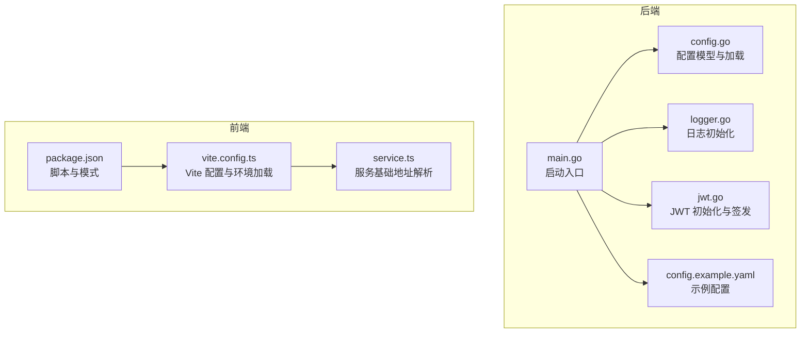
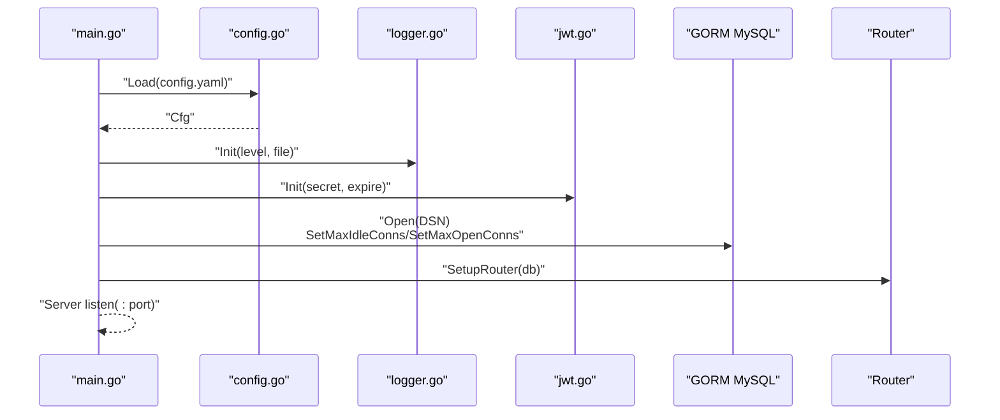
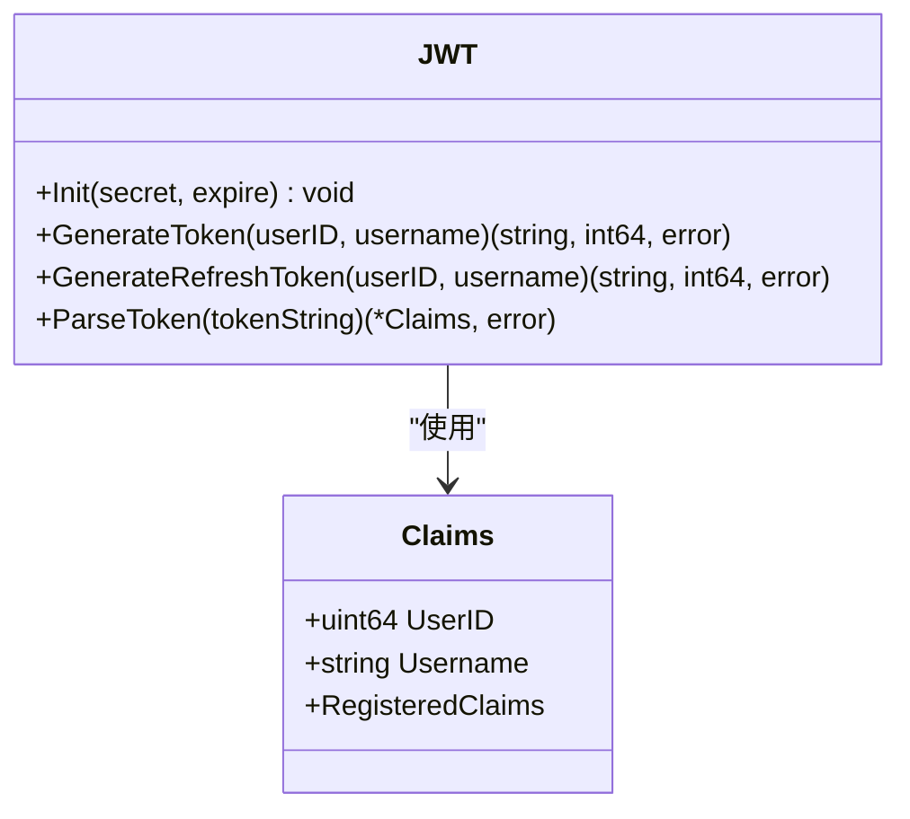
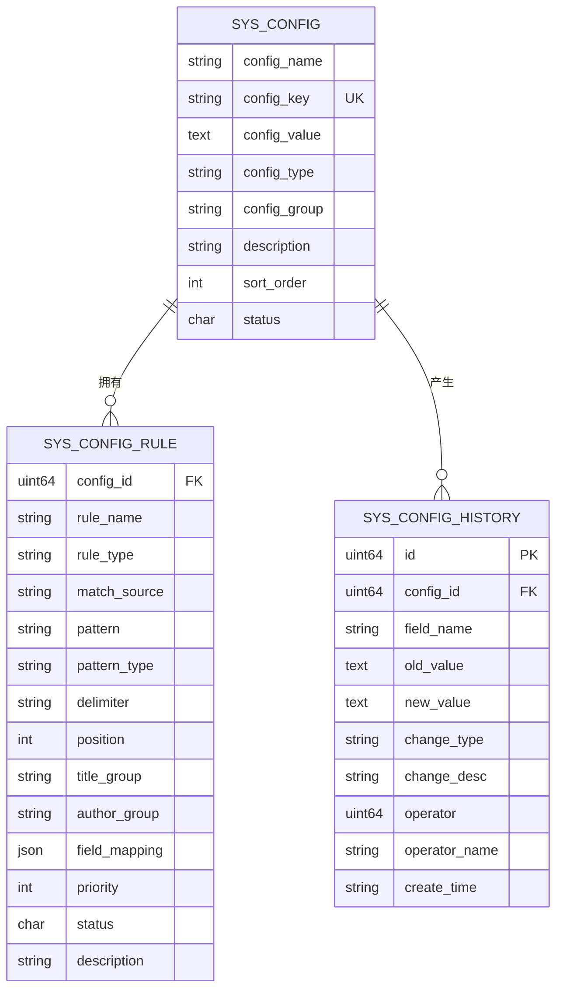
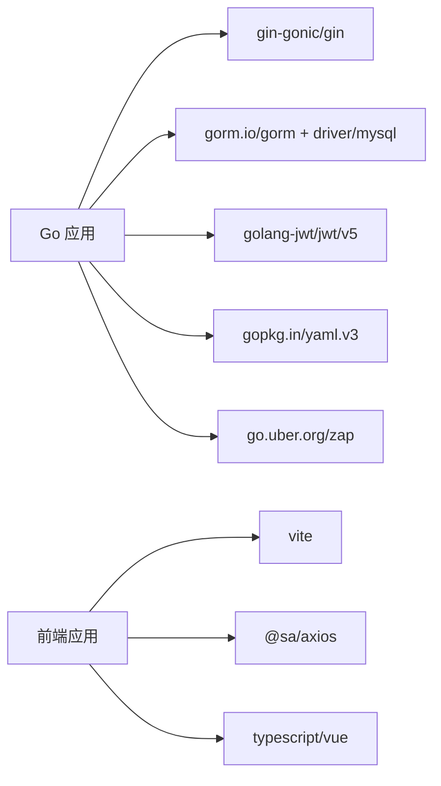

# 配置指南

<cite>
**本文引用的文件**   
- [main.go](file://app/server/cmd/api/main.go)
- [config.go](file://app/server/pkg/config/config.go)
- [config.example.yaml](file://app/server/configs/config.example.yaml)
- [jwt.go](file://app/server/pkg/jwt/jwt.go)
- [logger.go](file://app/server/pkg/logger/logger.go)
- [sys_config.go](file://app/server/internal/model/sys_config.go)
- [vite.config.ts](file://app/web/vite.config.ts)
- [service.ts](file://app/web/src/utils/service.ts)
- [package.json](file://app/web/package.json)
</cite>

## 目录
1. [简介](#简介)
2. [项目结构](#项目结构)
3. [核心组件](#核心组件)
4. [架构总览](#架构总览)
5. [详细组件分析](#详细组件分析)
6. [依赖分析](#依赖分析)
7. [性能考虑](#性能考虑)
8. [故障排查指南](#故障排查指南)
9. [结论](#结论)
10. [附录](#附录)

## 简介
本指南面向运维与开发人员，系统化梳理 boread 项目的配置管理，覆盖后端配置文件、JWT 密钥、日志与数据库连接、前端构建与运行时配置、环境变量使用、配置优先级与热更新机制、不同环境（开发/测试/生产）策略、安全最佳实践、性能调优与监控告警建议，并提供配置模板、检查清单与常见问题解决方案。

## 项目结构
后端采用 Go 语言，配置集中在 YAML 文件；前端采用 Vite 构建，通过环境变量控制运行时行为。整体配置涉及：
- 后端配置：server、database、jwt、log、meta（元数据提取规则）
- 前端配置：Vite 环境变量加载、服务基础地址、代理与构建模式

图表来源
- [main.go:30-84](file://app/server/cmd/api/main.go#L30-L84)
- [config.go:58-66](file://app/server/pkg/config/config.go#L58-L66)
- [config.example.yaml:1-21](file://app/server/configs/config.example.yaml#L1-L21)
- [jwt.go:19-22](file://app/server/pkg/jwt/jwt.go#L19-L22)
- [logger.go:13-38](file://app/server/pkg/logger/logger.go#L13-L38)
- [vite.config.ts:7-51](file://app/web/vite.config.ts#L7-L51)
- [service.ts:8-52](file://app/web/src/utils/service.ts#L8-L52)
- [package.json:29-44](file://app/web/package.json#L29-L44)

章节来源
- [main.go:30-84](file://app/server/cmd/api/main.go#L30-L84)
- [config.go:58-66](file://app/server/pkg/config/config.go#L58-L66)
- [config.example.yaml:1-21](file://app/server/configs/config.example.yaml#L1-L21)
- [vite.config.ts:7-51](file://app/web/vite.config.ts#L7-L51)
- [service.ts:8-52](file://app/web/src/utils/service.ts#L8-L52)
- [package.json:29-44](file://app/web/package.json#L29-L44)

## 核心组件
- 配置加载器：从 YAML 文件读取配置，映射到结构体，供全局使用
- 日志模块：支持控制台与文件输出，按级别过滤
- JWT 模块：初始化密钥与过期时间，提供签发与解析能力
- 数据库连接：根据配置构造 DSN，设置连接池参数
- 前端构建：Vite 加载环境变量，解析服务基础地址与代理

章节来源
- [config.go:9-56](file://app/server/pkg/config/config.go#L9-L56)
- [logger.go:13-38](file://app/server/pkg/logger/logger.go#L13-L38)
- [jwt.go:19-22](file://app/server/pkg/jwt/jwt.go#L19-L22)
- [main.go:44-65](file://app/server/cmd/api/main.go#L44-L65)
- [vite.config.ts:7-51](file://app/web/vite.config.ts#L7-L51)
- [service.ts:8-52](file://app/web/src/utils/service.ts#L8-L52)

## 架构总览
后端启动流程：加载配置 → 初始化日志 → 初始化 JWT → 连接数据库 → 设置连接池 → 构建路由 → 启动服务。

图表来源
- [main.go:34-83](file://app/server/cmd/api/main.go#L34-L83)
- [config.go:58-66](file://app/server/pkg/config/config.go#L58-L66)
- [logger.go:13-38](file://app/server/pkg/logger/logger.go#L13-L38)
- [jwt.go:19-22](file://app/server/pkg/jwt/jwt.go#L19-L22)

## 详细组件分析

### 后端配置文件与字段说明
- server
  - port：监听端口
  - mode：运行模式（如 debug）
- database
  - driver：数据库驱动（当前为 mysql）
  - host/port/username/password/dbname：连接信息
  - max_idle_conns/max_open_conns：连接池参数
- jwt
  - secret：签名密钥
  - expire：过期秒数
- log
  - level：日志级别
  - file：日志文件路径（可选）

章节来源
- [config.example.yaml:1-21](file://app/server/configs/config.example.yaml#L1-L21)
- [config.go:30-54](file://app/server/pkg/config/config.go#L30-L54)

### 配置加载与优先级
- 加载顺序：命令行指定配置文件路径 → 读取 YAML → 解析为结构体 → 全局生效
- 当前实现未集成环境变量覆盖，若需扩展可在加载函数中增加环境变量读取逻辑

章节来源
- [main.go:34](file://app/server/cmd/api/main.go#L34)
- [config.go:58-66](file://app/server/pkg/config/config.go#L58-L66)

### JWT 配置与使用
- 初始化：在启动阶段传入 secret 与 expire
- 签发：支持生成访问令牌与刷新令牌，设置过期时间
- 解析：验证签名与有效期

图表来源
- [jwt.go:10-71](file://app/server/pkg/jwt/jwt.go#L10-L71)

章节来源
- [jwt.go:19-55](file://app/server/pkg/jwt/jwt.go#L19-L55)
- [main.go:42](file://app/server/cmd/api/main.go#L42)

### 日志配置与输出
- 控制台与文件双通道输出，支持按级别过滤
- 默认使用 ISO 时间格式，文件输出为 JSON 编码

章节来源
- [logger.go:13-38](file://app/server/pkg/logger/logger.go#L13-L38)
- [main.go:39](file://app/server/cmd/api/main.go#L39)

### 数据库连接与连接池
- 使用 GORM MySQL 驱动，按配置拼接 DSN
- 设置最大空闲连接数与最大打开连接数

章节来源
- [main.go:44-65](file://app/server/cmd/api/main.go#L44-L65)

### 前端构建与运行时配置
- Vite 在不同模式下加载环境变量，支持代理与构建参数
- 服务基础地址与“其他服务”地址通过环境变量注入，前端解析为运行时配置

章节来源
- [vite.config.ts:7-51](file://app/web/vite.config.ts#L7-L51)
- [service.ts:8-52](file://app/web/src/utils/service.ts#L8-L52)
- [package.json:29-44](file://app/web/package.json#L29-L44)

### 元数据提取规则（meta）
- 支持定义规则列表，用于匹配与提取标题、作者等字段
- 字段包含名称、正则/分隔符模式、分组、来源、优先级等

章节来源
- [config.go:17-28](file://app/server/pkg/config/config.go#L17-L28)

### 系统配置表（运行时动态配置）
- sys_config：系统配置主表，支持键值对、分组、类型、状态与排序
- sys_config_rule：配置规则明细，支持多种规则类型与匹配来源
- sys_config_history：配置变更历史，记录字段名、旧值、新值、变更类型与操作人

图表来源
- [sys_config.go:4-16](file://app/server/internal/model/sys_config.go#L4-L16)
- [sys_config.go:44-62](file://app/server/internal/model/sys_config.go#L44-L62)
- [sys_config.go:75-89](file://app/server/internal/model/sys_config.go#L75-L89)

## 依赖分析
- 后端依赖
  - Gin：Web 路由与中间件
  - GORM + MySQL：数据持久化
  - JWT：鉴权
  - YAML：配置解析
  - Zap：日志
- 前端依赖
  - Vite：构建与开发服务器
  - Axios：HTTP 请求封装
  - TypeScript/Vue：应用框架

图表来源
- [go.mod:5-16](file://app/server/go.mod#L5-L16)
- [package.json:46-67](file://app/web/package.json#L46-L67)

章节来源
- [go.mod:5-16](file://app/server/go.mod#L5-L16)
- [package.json:46-67](file://app/web/package.json#L46-L67)

## 性能考虑
- 数据库连接池
  - 合理设置最大空闲与最大打开连接数，避免过高导致资源争用或过低导致频繁创建
  - 根据并发请求量与数据库承载能力调整
- 日志级别
  - 生产环境建议使用 info 或更高级别，减少磁盘 IO
  - 文件落盘建议开启异步写入，避免阻塞请求
- JWT 过期时间
  - 访问令牌不宜过长，结合刷新令牌策略平衡安全与体验
- 前端构建
  - 生产模式启用压缩与 Tree-shaking，合理拆分代码

[本节为通用指导，无需特定文件来源]

## 故障排查指南
- 无法加载配置
  - 检查配置文件路径与权限
  - 确认 YAML 语法正确
- 数据库连接失败
  - 核对主机、端口、用户名、密码与数据库名
  - 检查网络连通性与防火墙
  - 查看连接池参数是否合理
- JWT 无效或过期
  - 确认密钥一致且未被修改
  - 检查过期时间与系统时间偏差
- 日志不输出或乱码
  - 检查日志级别与输出路径
  - 确认文件权限与目录存在
- 前端跨域或接口不通
  - 检查 Vite 代理配置与服务基础地址
  - 确认后端 CORS 中间件与路由

章节来源
- [main.go:34-36](file://app/server/cmd/api/main.go#L34-L36)
- [main.go:55-57](file://app/server/cmd/api/main.go#L55-L57)
- [jwt.go:57-71](file://app/server/pkg/jwt/jwt.go#L57-L71)
- [logger.go:25-34](file://app/server/pkg/logger/logger.go#L25-L34)
- [vite.config.ts:34-38](file://app/web/vite.config.ts#L34-L38)
- [service.ts:8-52](file://app/web/src/utils/service.ts#L8-L52)

## 结论
本指南提供了 boread 项目配置管理的全景视图，涵盖后端 YAML 配置、JWT、日志、数据库连接、前端构建与运行时配置。建议在生产环境中严格区分配置项、强化密钥与证书管理、优化连接池与日志策略，并建立完善的监控与告警体系以保障稳定性与安全性。

[本节为总结，无需特定文件来源]

## 附录

### 配置模板
- 后端配置模板参考：[config.example.yaml:1-21](file://app/server/configs/config.example.yaml#L1-L21)
- 前端环境变量参考：Vite 在不同模式下加载环境变量，详见 [vite.config.ts:7-51](file://app/web/vite.config.ts#L7-L51)

章节来源
- [config.example.yaml:1-21](file://app/server/configs/config.example.yaml#L1-L21)
- [vite.config.ts:7-51](file://app/web/vite.config.ts#L7-L51)

### 配置检查清单
- 后端
  - server.port 与 server.mode 是否符合预期
  - database.* 连接参数是否正确
  - jwt.secret 是否足够随机且保密
  - log.level 与 log.file 是否合理
- 前端
  - VITE_SERVICE_BASE_URL 与 VITE_OTHER_SERVICE_BASE_URL 是否正确
  - 构建模式与代理是否按需启用
- 安全
  - 密钥与证书妥善保管，定期轮换
  - 生产环境关闭调试模式
- 性能
  - 连接池参数与日志级别已优化
  - 前端资源已压缩与缓存

[本节为通用清单，无需特定文件来源]

### 不同环境策略
- 开发环境
  - server.mode: debug
  - log.level: debug 或 info
  - jwt.expire: 较短（便于测试）
  - 前端使用本地代理，VITE_SERVICE_BASE_URL 指向后端本地地址
- 测试环境
  - server.mode: release
  - log.level: info
  - jwt.expire: 适中
  - 数据库连接池适度放大
- 生产环境
  - server.mode: release
  - log.level: info
  - 关闭调试输出，启用文件日志
  - 密钥与证书集中管理，最小权限原则

[本节为通用策略，无需特定文件来源]

### 配置热更新机制
- 当前实现未发现内置热更新逻辑
- 建议方案
  - 后端：监听配置文件变化，触发重新加载；或提供配置热加载接口，结合 sys_config 表进行运行时更新
  - 前端：通过版本化资源与缓存控制，配合构建时注入的构建时间戳进行强制刷新

[本节为通用建议，无需特定文件来源]