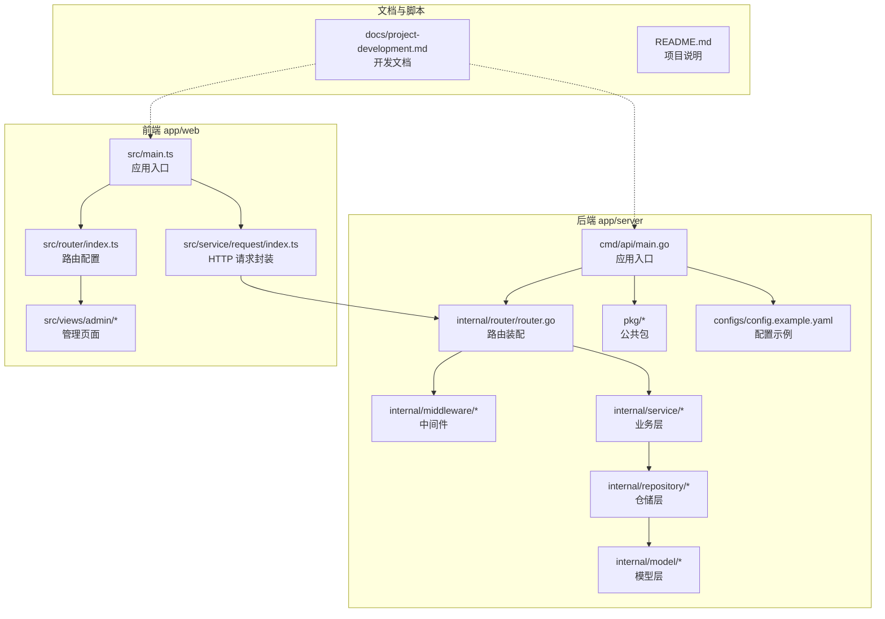
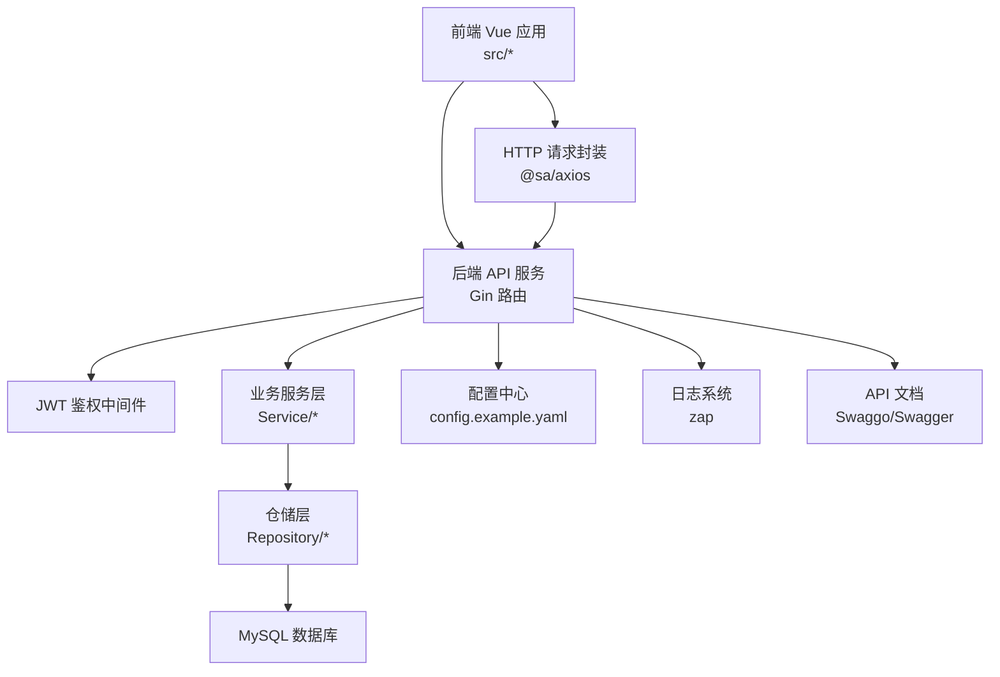
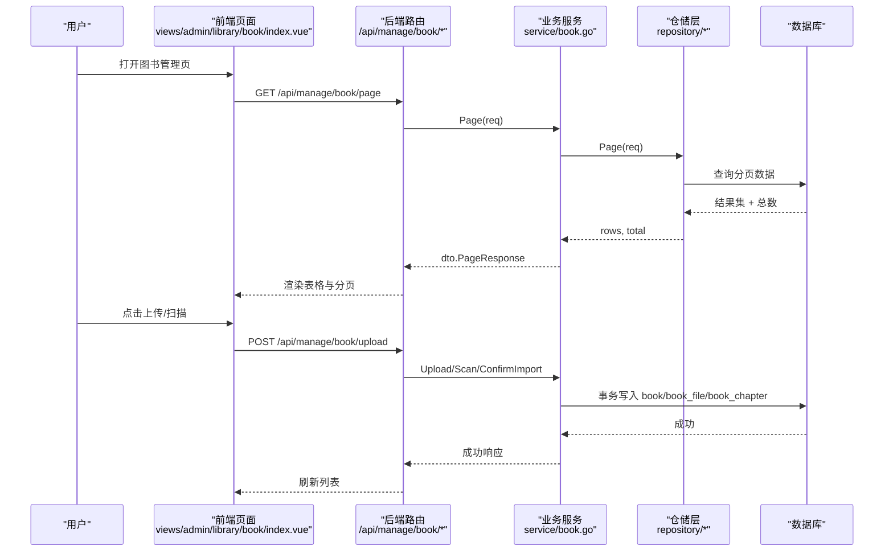
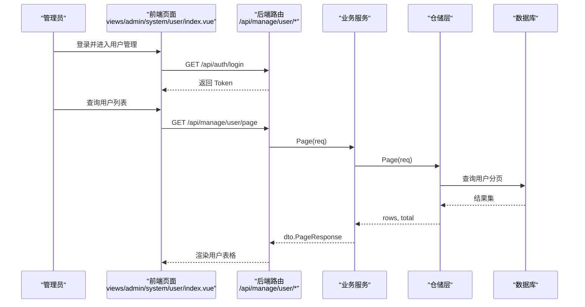
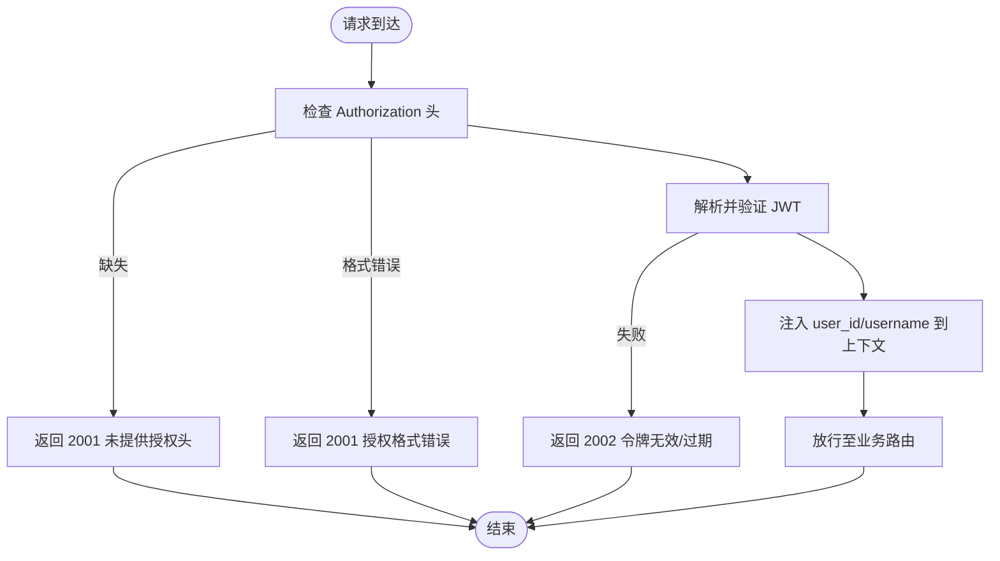
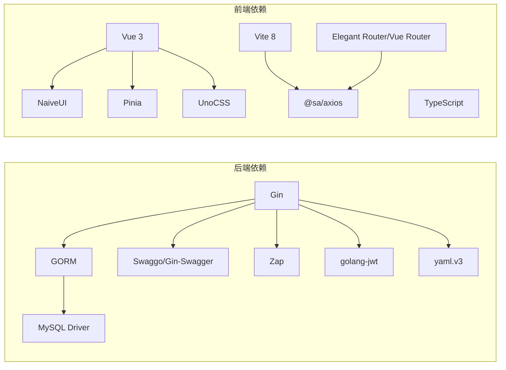

# 项目概述

<cite>
**本文引用的文件**
- [README.md](file://README.md)
- [main.go](file://app/server/cmd/api/main.go)
- [package.json](file://app/web/package.json)
- [go.mod](file://app/server/go.mod)
- [config.example.yaml](file://app/server/configs/config.example.yaml)
- [router.go](file://app/server/internal/router/router.go)
- [book.go](file://app/server/internal/service/book.go)
- [book.go](file://app/server/internal/model/book.go)
- [main.ts](file://app/web/src/main.ts)
- [index.ts](file://app/web/src/router/index.ts)
- [index.vue](file://app/web/src/views/admin/library/book/index.vue)
- [index.vue](file://app/web/src/views/admin/system/user/index.vue)
- [index.ts](file://app/web/src/service/request/index.ts)
- [auth.go](file://app/server/internal/middleware/auth.go)
- [project-development.md](file://docs/project-development.md)
</cite>

## 目录
1. [简介](#简介)
2. [项目结构](#项目结构)
3. [核心组件](#核心组件)
4. [架构总览](#架构总览)
5. [详细组件分析](#详细组件分析)
6. [依赖分析](#依赖分析)
7. [性能考虑](#性能考虑)
8. [故障排查指南](#故障排查指南)
9. [结论](#结论)
10. [附录](#附录)

## 简介
Boread 是一个面向 NAS 用户的小说阅读与管理平台，提供后台运营管理系统与前台读者服务。项目采用前后端分离架构：后端基于 Go 语言与 Gin 框架构建，使用 GORM 进行数据库访问；前端基于 Vue 3 + Vite + TypeScript，采用 Soybean-Admin 模板，结合 NaiveUI 与 Pinia 实现现代化交互体验。

项目围绕三大核心业务展开：
- 电子书管理：支持多文件上传、章节解析、聚合与检索
- 用户权限管理：部门、角色、菜单、字典、日志与按钮级权限控制
- 系统配置：JWT 鉴权、数据库连接、日志与 Swagger 文档

业务价值体现在对 txt 等文本小说的自动化处理与统一管理，帮助用户在 NAS 环境中便捷地组织、分类、打标签与阅读电子书。

**章节来源**
- [README.md:1-11](file://README.md#L1-L11)
- [project-development.md:8-30](file://docs/project-development.md#L8-L30)

## 项目结构
项目采用“app/server（后端）+ app/web（前端）”的双工程布局，配合 docs 文档与根目录说明文件，形成清晰的开发与部署边界。

**图表来源**
- [main.go:30-84](file://app/server/cmd/api/main.go#L30-L84)
- [router.go:15-205](file://app/server/internal/router/router.go#L15-L205)
- [main.ts:10-36](file://app/web/src/main.ts#L10-L36)
- [index.ts:20-30](file://app/web/src/router/index.ts#L20-L30)
- [index.ts:13-28](file://app/web/src/service/request/index.ts#L13-L28)

**章节来源**
- [project-development.md:31-69](file://docs/project-development.md#L31-L69)

## 核心组件
- 应用入口与配置
  - 后端入口负责加载配置、初始化日志与 JWT、建立数据库连接，并根据命令行参数决定是否执行种子初始化，随后装配路由并启动服务。
  - 前端入口负责插件初始化、状态管理、路由挂载与国际化设置。
- 路由与中间件
  - 后端路由分组清晰，公开接口、登录态接口与受保护管理接口分别处理；管理接口进一步按按钮级权限进行细粒度控制。
  - 中间件涵盖 CORS、请求日志、恢复机制与 JWT 鉴权。
- 业务服务
  - 电子书管理服务负责书籍的创建、更新、删除、分页查询与状态变更，支持分类与标签关联。
  - 前端页面通过统一的请求封装与 API 调用，实现图书列表、上传扫描、章节管理与用户管理等操作。
- 数据模型
  - 书籍模型包含标题、作者、封面、简介、分类、语言、连载状态、可见性、聚合状态、评分与状态等字段，支撑完整的电子书生命周期管理。

**章节来源**
- [main.go:34-84](file://app/server/cmd/api/main.go#L34-L84)
- [router.go:15-205](file://app/server/internal/router/router.go#L15-L205)
- [auth.go:12-40](file://app/server/internal/middleware/auth.go#L12-L40)
- [book.go:45-116](file://app/server/internal/service/book.go#L45-L116)
- [book.go:40-59](file://app/server/internal/model/book.go#L40-L59)
- [main.ts:10-36](file://app/web/src/main.ts#L10-L36)
- [index.ts:13-28](file://app/web/src/service/request/index.ts#L13-L28)

## 架构总览
系统采用典型的三层架构（表现层/业务层/数据层），并引入中间件与依赖注入，保证职责清晰与可扩展性。

**图表来源**
- [router.go:15-205](file://app/server/internal/router/router.go#L15-L205)
- [auth.go:12-40](file://app/server/internal/middleware/auth.go#L12-L40)
- [index.ts:13-28](file://app/web/src/service/request/index.ts#L13-L28)
- [config.example.yaml:1-21](file://app/server/configs/config.example.yaml#L1-L21)

**章节来源**
- [project-development.md:14-30](file://docs/project-development.md#L14-L30)
- [go.mod:5-16](file://app/server/go.mod#L5-L16)
- [package.json:46-68](file://app/web/package.json#L46-L68)

## 详细组件分析

### 电子书管理模块
- 功能范围
  - 图书 CRUD：创建、更新、删除、分页查询与状态变更
  - 分类与标签：树形分类与标签关联，支持批量与去重处理
  - 章节与文件：上传、扫描、章节解析与内容读取
- 关键流程
  - 创建图书时，若指定分类与标签，会进行有效性校验并在事务中完成主记录与关联关系的持久化。
  - 更新图书时，计算新旧标签集合差异，仅对变更部分进行增删，减少冗余操作。
  - 分页查询时，批量获取标签与分类映射，提升渲染效率。
- 前端集成
  - 图书列表页提供分类树筛选、多条件搜索、批量操作与章节查看能力；上传与扫描流程通过弹窗组件完成。

**图表来源**
- [index.vue:84-111](file://app/web/src/views/admin/library/book/index.vue#L84-L111)
- [router.go:167-186](file://app/server/internal/router/router.go#L167-L186)
- [book.go:258-306](file://app/server/internal/service/book.go#L258-L306)

**章节来源**
- [book.go:45-116](file://app/server/internal/service/book.go#L45-L116)
- [book.go:118-208](file://app/server/internal/service/book.go#L118-L208)
- [book.go:209-234](file://app/server/internal/service/book.go#L209-L234)
- [book.go:236-256](file://app/server/internal/service/book.go#L236-L256)
- [book.go:258-306](file://app/server/internal/service/book.go#L258-L306)
- [index.vue:1-326](file://app/web/src/views/admin/library/book/index.vue#L1-L326)

### 用户权限管理模块
- 功能范围
  - 部门管理：树形结构的 CRUD 与数据权限过滤
  - 角色管理：角色 CRUD、菜单与按钮授权
  - 用户管理：用户 CRUD、角色分配与密码重置
  - 菜单与字典：树形菜单与字典项管理
  - 日志管理：登录日志与操作日志分页查询
- 权限控制
  - 登录态中间件校验 JWT；管理接口按按钮级权限进行二次校验，确保最小权限原则。

**图表来源**
- [index.vue:14-32](file://app/web/src/views/admin/system/user/index.vue#L14-L32)
- [router.go:117-124](file://app/server/internal/router/router.go#L117-L124)

**章节来源**
- [router.go:97-147](file://app/server/internal/router/router.go#L97-L147)
- [index.vue:1-204](file://app/web/src/views/admin/system/user/index.vue#L1-L204)

### 系统配置与安全
- 配置管理
  - 后端通过 YAML 配置文件集中管理服务器端口、数据库连接、JWT 密钥与日志级别。
- 安全机制
  - JWT 鉴权中间件解析 Authorization 头，校验令牌有效性并将用户上下文注入请求。
  - 管理接口按按钮级权限进行二次校验，避免越权操作。

**图表来源**
- [auth.go:12-40](file://app/server/internal/middleware/auth.go#L12-L40)

**章节来源**
- [config.example.yaml:1-21](file://app/server/configs/config.example.yaml#L1-L21)
- [auth.go:12-40](file://app/server/internal/middleware/auth.go#L12-L40)

## 依赖分析
- 后端依赖
  - Web 框架：Gin
  - ORM：GORM + MySQL 驱动
  - 文档：Swaggo + Gin-Swagger
  - 日志：Zap
  - JWT：golang-jwt
  - YAML：yaml.v3
- 前端依赖
  - 框架：Vue 3、Vite 8、TypeScript
  - UI：NaiveUI
  - 状态管理：Pinia
  - 路由：Elegant Router + Vue Router
  - HTTP：@sa/axios
  - 工具：dayjs、echarts、UnoCSS 等

**图表来源**
- [go.mod:5-16](file://app/server/go.mod#L5-L16)
- [package.json:46-96](file://app/web/package.json#L46-L96)

**章节来源**
- [go.mod:5-16](file://app/server/go.mod#L5-L16)
- [package.json:46-96](file://app/web/package.json#L46-L96)

## 性能考虑
- 数据库连接池
  - 后端在启动时设置最大空闲连接与最大打开连接数，避免高并发下的连接争用。
- 事务与批量操作
  - 书籍创建/更新采用事务保证一致性；标签变更通过差集计算减少不必要的写入。
- 前端分页与懒加载
  - 使用分页钩子与远程分页，结合表格虚拟滚动与列显隐控制，降低首屏渲染压力。
- 请求缓存与重试
  - 前端请求封装支持过期令牌刷新与错误消息提示，避免重复错误弹窗。

**章节来源**
- [main.go:63-64](file://app/server/cmd/api/main.go#L63-L64)
- [book.go:87-111](file://app/server/internal/service/book.go#L87-L111)
- [book.go:149-203](file://app/server/internal/service/book.go#L149-L203)
- [index.ts:89-96](file://app/web/src/service/request/index.ts#L89-L96)

## 故障排查指南
- 启动失败
  - 检查配置文件路径与参数：如数据库连接失败、JWT 密钥未设置、端口被占用。
- 鉴权问题
  - 确认请求头 Authorization 格式为 Bearer Token；检查令牌是否过期或签名不匹配。
- 权限不足
  - 管理接口需具备相应按钮权限；确认用户角色已授予对应菜单按钮。
- 前端请求异常
  - 查看请求封装中的错误码映射与过期令牌处理逻辑；确认服务端返回码与前端配置一致。

**章节来源**
- [main.go:34-84](file://app/server/cmd/api/main.go#L34-L84)
- [auth.go:12-40](file://app/server/internal/middleware/auth.go#L12-L40)
- [index.ts:34-100](file://app/web/src/service/request/index.ts#L34-L100)

## 结论
Boread 以清晰的分层架构与完善的权限体系为基础，结合现代化的前后端技术栈，实现了从电子书上传、解析、聚合到阅读与管理的完整闭环。项目文档详尽、开发流程规范，适合在 NAS 环境中稳定运行与持续演进。

## 附录
- 快速启动
  - 后端：复制配置示例为实际配置，执行种子初始化，启动服务。
  - 前端：安装依赖，启动开发服务器，生成路由与类型检查。
- 数据库执行计划
  - 按阶段执行建表脚本，先完成系统管理表，再逐步执行业务表。

**章节来源**
- [project-development.md:469-492](file://docs/project-development.md#L469-L492)
- [project-development.md:414-429](file://docs/project-development.md#L414-L429)